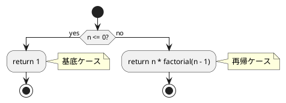
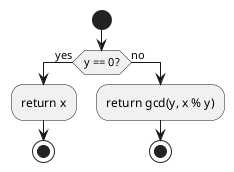
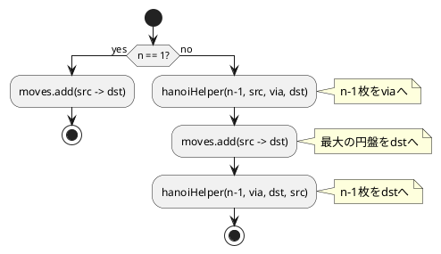
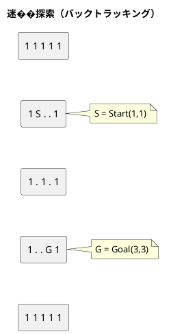

# 第 5 章 再帰アルゴリズム

## はじめに

再帰（Recursion）とは、関数が自分自身を呼び出すことで問題を解決する手法です。再帰は「大きな問題を同じ構造の小さな問題に分解する」という考え方に基づいています。

この章では、再帰の基本パターン（階乗、最大公約数）から応用（ハノイの塔、迷路探索、8 王妃問題）まで TDD で実装します。

---

## 1. 階乗

n の階乗（n!）を再帰的に計算します。n! = n * (n-1)! であり、0! = 1 が基底ケースです。

### Red -- 失敗するテストを書く

```java
// src/test/java/algorithm/RecursionTest.java
package algorithm;

import org.junit.jupiter.api.Nested;
import org.junit.jupiter.api.Test;

import java.util.List;

import static org.junit.jupiter.api.Assertions.*;

class RecursionTest {

    @Nested
    class FactorialTest {
        @Test void factorial_0() { assertEquals(1, Recursion.factorial(0)); }
        @Test void factorial_1() { assertEquals(1, Recursion.factorial(1)); }
        @Test void factorial_5() { assertEquals(120, Recursion.factorial(5)); }
        @Test void factorial_10() { assertEquals(3628800, Recursion.factorial(10)); }
    }
}
```

基底ケース（0, 1）と一般ケース（5, 10）をテストします。10! = 3,628,800 は int の範囲内です。

### Green -- テストを通す最小のコードを書く

```java
// src/main/java/algorithm/Recursion.java
package algorithm;

import java.util.ArrayList;
import java.util.List;

public class Recursion {

    /** 階乗を再帰的に計算 */
    public static int factorial(int n) {
        if (n <= 0) return 1;
        return n * factorial(n - 1);
    }
}
```

### フローチャート



---

## 2. 最大公約数（ユークリッドの互除法）

2 つの整数の最大公約数（GCD）をユークリッドの互除法で求めます。gcd(x, y) = gcd(y, x % y) であり、y == 0 のとき x が GCD です。

### Red -- 失敗するテストを書く

```java
@Nested
class GcdTest {
    @Test void 基本() { assertEquals(2, Recursion.gcd(22, 8)); }
    @Test void 倍数() { assertEquals(4, Recursion.gcd(12, 4)); }
    @Test void 互いに素() { assertEquals(1, Recursion.gcd(7, 11)); }
    @Test void 同じ値() { assertEquals(15, Recursion.gcd(15, 15)); }
}
```

4 パターンのテストケース:

- 基本: gcd(22, 8) = 2
- 倍数関係: gcd(12, 4) = 4
- 互いに素: gcd(7, 11) = 1
- 同じ値: gcd(15, 15) = 15

### Green -- テストを通す最小のコードを書く

```java
/** ユークリッドの互除法で最大公約数を求める */
public static int gcd(int x, int y) {
    if (y == 0) return x;
    return gcd(y, x % y);
}
```

### フローチャート



---

## 3. 再帰的な総和

1 から n までの和を再帰的に計算します。sum(n) = n + sum(n-1) であり、n <= 0 のと�� 0 です。

### Red -- 失敗するテストを書く

```java
@Nested
class RecursiveSumTest {
    @Test void sum_1() { assertEquals(1, Recursion.recursiveSum(1)); }
    @Test void sum_5() { assertEquals(15, Recursion.recursiveSum(5)); }
    @Test void sum_10() { assertEquals(55, Recursion.recursiveSum(10)); }
}
```

### Green -- テストを通す最小のコードを書く

```java
/** 1 から n までの和を再帰的に計算 */
public static int recursiveSum(int n) {
    if (n <= 0) return 0;
    return n + recursiveSum(n - 1);
}
```

第 1 章の for 文・while 文による総和と同じ結果を再帰で得られます。再帰版は宣言的な表現になりますが、スタックオーバーフローのリスクがあります。

---

## 4. ハノイの塔

n 枚の円盤を 3 本の柱を使って移動する古典的なパズルです。移動手順を再帰で生成します。

### Red -- 失敗するテストを書く

```java
@Nested
class HanoiTest {
    @Test
    void ハノイ1枚() {
        List<String> moves = Recursion.hanoi(1, "A", "C", "B");
        assertEquals(List.of("A->C"), moves);
    }

    @Test
    void ハノイ2枚() {
        List<String> moves = Recursion.hanoi(2, "A", "C", "B");
        assertEquals(List.of("A->B", "A->C", "B->C"), moves);
    }

    @Test
    void ハノイ3枚は7手() {
        List<String> moves = Recursion.hanoi(3, "A", "C", "B");
        assertEquals(7, moves.size());
    }

    @Test
    void ハノイn枚は2のn乗マイナス1手() {
        for (int n = 1; n <= 5; n++) {
            assertEquals((1 << n) - 1, Recursion.hanoi(n, "A", "C", "B").size());
        }
    }
}
```

- 1 枚: 1 手 (A->C)
- 2 枚: 3 手 (A->B, A->C, B->C)
- 3 枚: 7 手
- n 枚: 2^n - 1 手（数学的帰結のテスト）

### Green -- テストを通す最小のコードを書く

```java
/** ハノイの塔: 移動手順をリストで返す */
public static List<String> hanoi(int n, String src, String dst, String via) {
    List<String> moves = new ArrayList<>();
    hanoiHelper(n, src, dst, via, moves);
    return moves;
}

private static void hanoiHelper(int n, String src, String dst, String via, List<String> moves) {
    if (n == 1) {
        moves.add(src + "->" + dst);
        return;
    }
    hanoiHelper(n - 1, src, via, dst, moves);
    moves.add(src + "->" + dst);
    hanoiHelper(n - 1, via, dst, src, moves);
}
```

アルゴリズムのポイント:

1. n-1 枚を src から via へ移動
2. 最大の円盤を src から dst へ移動
3. n-1 枚を via から dst へ移動

### フローチャート



---

## 5. 迷路探索

二次元配列で表現された迷路をバックトラッキング（深さ優先探索）で解きます。0 が通路、1 が壁です。

### Red -- 失敗するテストを書く

```java
@Nested
class MazeSolveTest {
    @Test
    void 解ける迷路() {
        int[][] maze = {
            {1, 1, 1, 1, 1},
            {1, 0, 0, 0, 1},
            {1, 0, 1, 0, 1},
            {1, 0, 0, 0, 1},
            {1, 1, 1, 1, 1},
        };
        assertTrue(Recursion.mazeSolve(maze, 1, 1, 3, 3));
    }

    @Test
    void 解けない迷路() {
        int[][] maze = {
            {1, 1, 1, 1, 1},
            {1, 0, 1, 0, 1},
            {1, 1, 1, 1, 1},
            {1, 0, 0, 0, 1},
            {1, 1, 1, 1, 1},
        };
        assertFalse(Recursion.mazeSolve(maze, 1, 1, 3, 1));
    }
}
```

解ける迷路と解けない迷路の 2 パターンをテストします。解けない迷路は壁で完全に分断されています。

### Green -- テストを通す最小のコードを書く

```java
/** 迷路をバックトラッキングで解く */
public static boolean mazeSolve(int[][] maze, int row, int col, int goalRow, int goalCol) {
    boolean[][] visited = new boolean[maze.length][maze[0].length];
    return mazeSolveHelper(maze, row, col, goalRow, goalCol, visited);
}

private static boolean mazeSolveHelper(int[][] maze, int row, int col,
                                       int goalRow, int goalCol, boolean[][] visited) {
    if (row == goalRow && col == goalCol) return true;
    visited[row][col] = true;
    int[][] dirs = {{-1, 0}, {1, 0}, {0, -1}, {0, 1}};
    for (int[] d : dirs) {
        int nr = row + d[0], nc = col + d[1];
        if (nr >= 0 && nr < maze.length && nc >= 0 && nc < maze[0].length
                && maze[nr][nc] == 0 && !visited[nr][nc]) {
            if (mazeSolveHelper(maze, nr, nc, goalRow, goalCol, visited)) return true;
        }
    }
    return false;
}
```

`visited` 配列で訪問済みのセルを記録し、無限ループを防ぎます。4 方向（上下左右）を再帰的に探索し、ゴールに到達できたら `true` を返します。

### 概念図



---

## 6. 8 王妃問題

8x8 のチェス盤に 8 個のクイーンを互いに攻撃���合わないように配置する問題です。3 つのバージョンで段階的に制約を追加します。

### Red -- 失敗するテストを書く

```java
@Nested
class EightQueenTest {
    @Test
    void 全組み合わせは8の8乗() {
        var eq = new Recursion.EightQueen();
        eq.set(0);
        assertEquals((int) Math.pow(8, 8), eq.getCount());
    }

    @Test
    void 行制約ありは40320通り() {
        var eq2 = new Recursion.EightQueen2();
        eq2.set(0);
        assertEquals(40320, eq2.getResult().size());
    }

    @Test
    void 完全解は92通り() {
        var eq3 = new Recursion.EightQueen3();
        eq3.set(0);
        assertEquals(92, eq3.getResult().size());
    }
}
```

- 第 1 版: 制約なし → 8^8 = 16,777,216 通り
- 第 2 版: 行制約あり → 8! = 40,320 通り
- 第 3 版: 行・対角線制約あり → 92 通り（完全解）

### Green -- テストを通す最小のコードを書く

#### 第 1 版: 全���み合わせ（制約なし）

```java
public static class EightQueen {
    private int count;
    private final int[] pos = new int[8];

    public void set(int i) {
        for (int j = 0; j < 8; j++) {
            pos[i] = j;
            if (i == 7) count++;
            else set(i + 1);
        }
    }

    public int getCount() { return count; }
}
```

各列に 0-7 の行を割り当てるすべての組み合わせを列挙します。結果は保持せずカウントのみ（メモリ節約）。

#### 第 2 版: 行制約あり

```java
public static class EightQueen2 {
    private final List<int[]> result = new ArrayList<>();
    private final int[] pos = new int[8];
    private final boolean[] flag = new boolean[8];

    public void set(int i) {
        for (int j = 0; j < 8; j++) {
            if (!flag[j]) {
                pos[i] = j;
                if (i == 7) {
                    result.add(pos.clone());
                } else {
                    flag[j] = true;
                    set(i + 1);
                    flag[j] = false;
                }
            }
        }
    }

    public List<int[]> getResult() { return result; }
}
```

`flag[j]` で行 j が既に使われているかを管理します。同じ行に 2 つのクイーンが配置されることを防ぎます。

#### 第 3 版: 完全解（行・対角線制約）

```java
public static class EightQueen3 {
    private final List<int[]> result = new ArrayList<>();
    private final int[] pos = new int[8];
    private final boolean[] flagA = new boolean[8];
    private final boolean[] flagB = new boolean[15];
    private final boolean[] flagC = new boolean[15];

    public void set(int i) {
        for (int j = 0; j < 8; j++) {
            if (!flagA[j] && !flagB[i + j] && !flagC[i - j + 7]) {
                pos[i] = j;
                if (i == 7) {
                    result.add(pos.clone());
                } else {
                    flagA[j] = true;
                    flagB[i + j] = true;
                    flagC[i - j + 7] = true;
                    set(i + 1);
                    flagA[j] = false;
                    flagB[i + j] = false;
                    flagC[i - j + 7] = false;
                }
            }
        }
    }

    public List<int[]> getResult() { return result; }
}
```

3 つのフラグ配列で制約を管理します:

- `flagA[j]`: 行 j が使用済みか
- `flagB[i + j]`: 右下がり対角線（i + j が一定）が使用済みか
- `flagC[i - j + 7]`: 左下がり対角線（i - j + 7 が一定）が使用済みか

バックトラッキング時にフラグを復元（`= false`）することが重要です。

---

## Python との比較表

| 項目 | Java | Python |
|:---|:---|:---|
| 再帰の深さ制限 | JVM スタックサイズ（デフォルト 512KB-1MB） | `sys.setrecursionlimit()` |
| リスト生成 | `new ArrayList<>()` | `[]` |
| 不変リスト | `List.of("A->C")` | `["A->C"]` |
| 配列クローン | `pos.clone()` | `pos[:]` / `pos.copy()` |
| boolean 配列 | `new boolean[8]`（false で初期化） | `[False] * 8` |
| 2次元配列 | `int[][] maze = {{...}, {...}}` | `maze = [[...], [...]]` |
| var 宣言 | `var eq = new ...` (Java 10+) | 型宣言不要 |
| 末尾再帰最適化 | なし（JVM は非対応） | なし（CPython は非対応） |

---

## テスト実行結果

```
RecursionTest > FactorialTest > factorial_0 PASSED
RecursionTest > FactorialTest > factorial_1 PASSED
RecursionTest > FactorialTest > factorial_5 PASSED
RecursionTest > FactorialTest > factorial_10 PASSED
RecursionTest > GcdTest > 基本 PASSED
RecursionTest > GcdTest > 倍数 PASSED
RecursionTest > GcdTest > 互いに素 PASSED
RecursionTest > GcdTest > 同じ値 PASSED
RecursionTest > RecursiveSumTest > sum_1 PASSED
RecursionTest > RecursiveSumTest > sum_5 PASSED
RecursionTest > RecursiveSumTest > sum_10 PASSED
RecursionTest > HanoiTest > ハノイ1枚 PASSED
RecursionTest > HanoiTest > ハノイ2枚 PASSED
RecursionTest > HanoiTest > ハノイ3枚は7手 PASSED
RecursionTest > HanoiTest > ハノイn枚は2のn乗マイナス1手 PASSED
RecursionTest > MazeSolveTest > 解ける迷路 PASSED
RecursionTest > MazeSolveTest > 解けない迷路 PASSED
RecursionTest > EightQueenTest > 全組み合わせは8の8乗 PASSED
RecursionTest > EightQueenTest > 行制約ありは40320通り PASSED
RecursionTest > EightQueenTest > 完全解は92通り PASSED

BUILD SUCCESSFUL
20 tests completed, 0 failed
```
