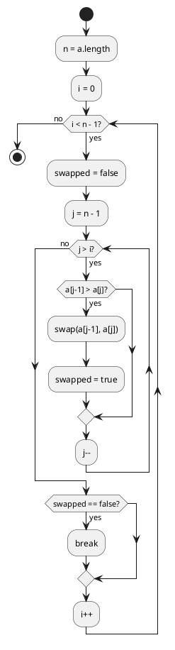
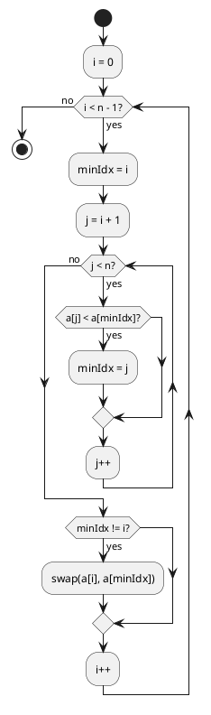
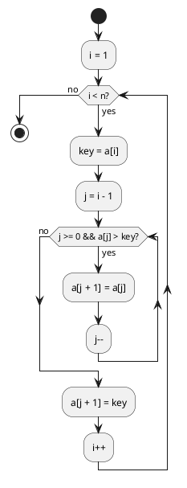
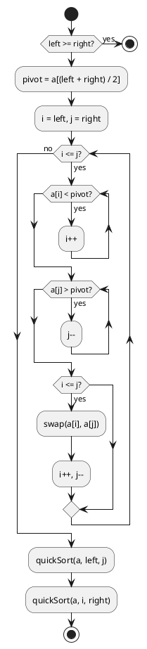
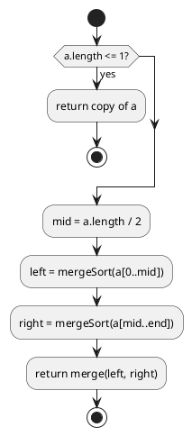

# 第 6 章 ソートアルゴリズム

## はじめに

ソート（整列）は、データを一定の順序に並べ替えるアルゴリズムです。探索の前処理として、またデータの可視化や分析の基礎として、あらゆる場面で使われます。この章では 8 種類のソートアルゴリズムを TDD で実装し、それぞれの特性を理解します。

## ソートとは

ソートアルゴリズムは計算量と安定性で分類されます。

| アルゴリズム | 平均計算量 | 最悪計算量 | 空間計算量 | 安定性 |
|:---|:---|:---|:---|:---|
| バブルソート | O(n^2) | O(n^2) | O(1) | 安定 |
| 選択ソート | O(n^2) | O(n^2) | O(1) | 不安定 |
| 挿入ソート | O(n^2) | O(n^2) | O(1) | 安定 |
| シェルソート | O(n^1.25) | O(n^1.5) | O(1) | 不安定 |
| クイックソート | O(n log n) | O(n^2) | O(log n) | 不安定 |
| マージソート | O(n log n) | O(n log n) | O(n) | 安定 |
| ヒープソート | O(n log n) | O(n log n) | O(1) | 不安定 |
| 度数ソート | O(n + k) | O(n + k) | O(n + k) | 安定 |

---

## 1. バブルソート

隣接する要素を比較・交換し、最大値を末尾に「浮かび上がらせる」アルゴリズムです。

### Red -- 失敗するテストを書く

```java
// src/test/java/algorithm/SortTest.java
package algorithm;

import org.junit.jupiter.api.Nested;
import org.junit.jupiter.api.Test;

import java.util.Random;

import static org.junit.jupiter.api.Assertions.*;

class SortTest {

    private static final int[] UNSORTED = {6, 4, 3, 7, 1, 9, 8};
    private static final int[] SORTED = {1, 3, 4, 6, 7, 8, 9};

    @Nested
    class BubbleSortTest {
        @Test void 基本() { int[] a = UNSORTED.clone(); Sort.bubbleSort(a); assertArrayEquals(SORTED, a); }
        @Test void 整列済み() { int[] a = SORTED.clone(); Sort.bubbleSort(a); assertArrayEquals(SORTED, a); }
        @Test void 単一要素() { int[] a = {42}; Sort.bubbleSort(a); assertArrayEquals(new int[]{42}, a); }
        @Test void 空配列() { int[] a = {}; Sort.bubbleSort(a); assertArrayEquals(new int[]{}, a); }
        @Test void 重複() { int[] a = {3,1,2,1,3}; Sort.bubbleSort(a); assertArrayEquals(new int[]{1,1,2,3,3}, a); }
    }
}
```

5 パターンのテストで、基本動作・整列済み入力・境界条件（単一要素・空配列）・重複値を網羅しています。

### Green -- テストを通す最小のコードを書く

```java
// src/main/java/algorithm/Sort.java
package algorithm;

import java.util.Arrays;

public class Sort {

    /** バブルソート（in-place） */
    public static void bubbleSort(int[] a) {
        int n = a.length;
        for (int i = 0; i < n - 1; i++) {
            boolean swapped = false;
            for (int j = n - 1; j > i; j--) {
                if (a[j - 1] > a[j]) {
                    int tmp = a[j - 1]; a[j - 1] = a[j]; a[j] = tmp;
                    swapped = true;
                }
            }
            if (!swapped) break;
        }
    }
}
```

`swapped` フラグにより、交換が発生しなかったら（既にソート済みなら）早期に終了します。

### フローチャート



---

## 2. 選択ソート

未整列部分から最小値を見つけ、先頭と交換するアルゴリズムです。

### Red -- 失敗するテストを書く

```java
@Nested
class SelectionSortTest {
    @Test void 基本() { int[] a = UNSORTED.clone(); Sort.selectionSort(a); assertArrayEquals(SORTED, a); }
    @Test void 整列済み() { int[] a = SORTED.clone(); Sort.selectionSort(a); assertArrayEquals(SORTED, a); }
    @Test void 単一要素() { int[] a = {5}; Sort.selectionSort(a); assertArrayEquals(new int[]{5}, a); }
    @Test void 重複() { int[] a = {3,1,2,1,3}; Sort.selectionSort(a); assertArrayEquals(new int[]{1,1,2,3,3}, a); }
}
```

### Green -- テストを通す最小のコードを書く

```java
/** 選択ソート（in-place） */
public static void selectionSort(int[] a) {
    int n = a.length;
    for (int i = 0; i < n - 1; i++) {
        int minIdx = i;
        for (int j = i + 1; j < n; j++) {
            if (a[j] < a[minIdx]) minIdx = j;
        }
        if (minIdx != i) {
            int tmp = a[i]; a[i] = a[minIdx]; a[minIdx] = tmp;
        }
    }
}
```

### フローチャート



---

## 3. 挿入ソート

未整列の要素を、整列済み部分の適切な位置に挿入するアルゴリズムです。

### Red -- 失敗するテストを書く

```java
@Nested
class InsertionSortTest {
    @Test void 基本() { int[] a = UNSORTED.clone(); Sort.insertionSort(a); assertArrayEquals(SORTED, a); }
    @Test void 整列済み() { int[] a = SORTED.clone(); Sort.insertionSort(a); assertArrayEquals(SORTED, a); }
    @Test void 単一要素() { int[] a = {7}; Sort.insertionSort(a); assertArrayEquals(new int[]{7}, a); }
    @Test void 重複() { int[] a = {3,1,2,1,3}; Sort.insertionSort(a); assertArrayEquals(new int[]{1,1,2,3,3}, a); }
}
```

### Green -- テストを通す最小のコードを書く

```java
/** 挿入ソート（in-place） */
public static void insertionSort(int[] a) {
    int n = a.length;
    for (int i = 1; i < n; i++) {
        int key = a[i];
        int j = i - 1;
        while (j >= 0 && a[j] > key) {
            a[j + 1] = a[j];
            j--;
        }
        a[j + 1] = key;
    }
}
```

整列済み入力に対しては O(n) で完了するため、ほぼ整列済みのデータには非常に効率的です。

### フローチャート



---

## 4. シェルソート

挿入ソートの改良版で、離れた要素同士を比較・交換してから徐々に間隔を狭めます。

### Red -- 失敗するテストを書く

```java
@Nested
class ShellSortTest {
    @Test void 基本() { int[] a = UNSORTED.clone(); Sort.shellSort(a); assertArrayEquals(SORTED, a); }
    @Test void 整列済み() { int[] a = SORTED.clone(); Sort.shellSort(a); assertArrayEquals(SORTED, a); }
    @Test void 大きな配列() {
        int[] a = new int[100];
        for (int i = 0; i < 100; i++) a[i] = i;
        shuffle(a);
        Sort.shellSort(a);
        int[] expected = new int[100];
        for (int i = 0; i < 100; i++) expected[i] = i;
        assertArrayEquals(expected, a);
    }
    @Test void 重複() { int[] a = {3,1,2,1,3}; Sort.shellSort(a); assertArrayEquals(new int[]{1,1,2,3,3}, a); }
}
```

「大きな配列」テストでは 100 要素のシャッフル済み配列をソートし、正しく整列されることを確認します。

### Green -- テストを通す最小のコードを書く

```java
/** シェルソート（in-place、Knuth 数列） */
public static void shellSort(int[] a) {
    int n = a.length;
    int gap = 1;
    while (gap * 3 + 1 < n) gap = gap * 3 + 1;
    while (gap > 0) {
        for (int i = gap; i < n; i++) {
            int key = a[i];
            int j = i - gap;
            while (j >= 0 && a[j] > key) {
                a[j + gap] = a[j];
                j -= gap;
            }
            a[j + gap] = key;
        }
        gap /= 3;
    }
}
```

Knuth 数列（1, 4, 13, 40, 121, ...）を gap の系列として使用します。gap を大きい値から始めて 3 で割りながら縮小していきます。

---

## 5. クイックソート

分割統治法に基づく高速ソートアルゴリズムです。ピボットを選び、配列を 2 つに分割して再帰的にソートします。

### Red -- 失敗するテストを書く

```java
@Nested
class QuickSortTest {
    @Test void 基本() { int[] a = UNSORTED.clone(); Sort.quickSort(a); assertArrayEquals(SORTED, a); }
    @Test void 整列済み() { int[] a = SORTED.clone(); Sort.quickSort(a); assertArrayEquals(SORTED, a); }
    @Test void 単一要素() { int[] a = {1}; Sort.quickSort(a); assertArrayEquals(new int[]{1}, a); }
    @Test void 重複() { int[] a = {3,1,2,1,3}; Sort.quickSort(a); assertArrayEquals(new int[]{1,1,2,3,3}, a); }
    @Test void 大きな配列() {
        int[] a = new int[200];
        for (int i = 0; i < 200; i++) a[i] = i;
        shuffle(a);
        Sort.quickSort(a);
        int[] expected = new int[200];
        for (int i = 0; i < 200; i++) expected[i] = i;
        assertArrayEquals(expected, a);
    }
}
```

200 要素のシャッフル済み配列で大規模テストも実施します。

### Green -- テストを通す最小のコードを書く

```java
/** クイックソート（in-place） */
public static void quickSort(int[] a, int left, int right) {
    if (left >= right) return;
    int pivot = a[(left + right) / 2];
    int i = left, j = right;
    while (i <= j) {
        while (a[i] < pivot) i++;
        while (a[j] > pivot) j--;
        if (i <= j) {
            int tmp = a[i]; a[i] = a[j]; a[j] = tmp;
            i++; j--;
        }
    }
    quickSort(a, left, j);
    quickSort(a, i, right);
}

/** クイックソート（引数省略版） */
public static void quickSort(int[] a) {
    if (a.length > 1) quickSort(a, 0, a.length - 1);
}
```

ピボットとして中央の要素を選ぶことで、整列済み配列での最悪ケースを回避しています。

### フローチャート



---

## 6. マージソート

配列を半分に分割し、再帰���にソートしてからマージする安定なソートアルゴリズムです。

### Red -- 失敗するテストを書く

```java
@Nested
class MergeSortTest {
    @Test void 基本() { assertArrayEquals(SORTED, Sort.mergeSort(UNSORTED.clone())); }
    @Test void 整列済み() { assertArrayEquals(SORTED, Sort.mergeSort(SORTED.clone())); }
    @Test void 単一要素() { assertArrayEquals(new int[]{5}, Sort.mergeSort(new int[]{5})); }
    @Test void 空配列() { assertArrayEquals(new int[]{}, Sort.mergeSort(new int[]{})); }
    @Test void 重複() { assertArrayEquals(new int[]{1,1,2,3,3}, Sort.mergeSort(new int[]{3,1,2,1,3})); }
}
```

マージソートは新しい配列を返すため、`assertArrayEquals` で戻り値を直接検証します。

### Green -- テストを通す最小のコードを書く

```java
/** マージソート（新しい配列を返す） */
public static int[] mergeSort(int[] a) {
    if (a.length <= 1) return Arrays.copyOf(a, a.length);
    int mid = a.length / 2;
    int[] left = mergeSort(Arrays.copyOfRange(a, 0, mid));
    int[] right = mergeSort(Arrays.copyOfRange(a, mid, a.length));
    return merge(left, right);
}

private static int[] merge(int[] left, int[] right) {
    int[] result = new int[left.length + right.length];
    int i = 0, j = 0, k = 0;
    while (i < left.length && j < right.length) {
        if (left[i] <= right[j]) result[k++] = left[i++];
        else result[k++] = right[j++];
    }
    while (i < left.length) result[k++] = left[i++];
    while (j < right.length) result[k++] = right[j++];
    return result;
}
```

`merge` メソッドでは 2 つのソート済み配列を先頭から比較しながら統合します。`<=` 比較により安定ソートを実現しています。

### フローチャート



---

## 7. ヒープソート

最大ヒープ（親 >= 子）を利用したソートアルゴリズムです。追加メモリ不要で O(n log n) を保証します。

### Red -- 失敗するテストを書く

```java
@Nested
class HeapSortTest {
    @Test void 基本() { int[] a = UNSORTED.clone(); Sort.heapSort(a); assertArrayEquals(SORTED, a); }
    @Test void 整列済み() { int[] a = SORTED.clone(); Sort.heapSort(a); assertArrayEquals(SORTED, a); }
    @Test void 単一要素() { int[] a = {42}; Sort.heapSort(a); assertArrayEquals(new int[]{42}, a); }
    @Test void 空配列() { int[] a = {}; Sort.heapSort(a); assertArrayEquals(new int[]{}, a); }
    @Test void 重複() { int[] a = {3,1,2,1,3}; Sort.heapSort(a); assertArrayEquals(new int[]{1,1,2,3,3}, a); }
}
```

### Green -- テストを通す最小のコードを書く

```java
/** ヒープソート（in-place） */
public static void heapSort(int[] a) {
    int n = a.length;
    if (n <= 1) return;
    // 最大ヒープ構築
    for (int i = (n - 1) / 2; i >= 0; i--) {
        downHeap(a, i, n - 1);
    }
    // ヒープの最大要素と末尾を交換
    for (int i = n - 1; i > 0; i--) {
        int tmp = a[0]; a[0] = a[i]; a[i] = tmp;
        downHeap(a, 0, i - 1);
    }
}

private static void downHeap(int[] a, int left, int right) {
    int temp = a[left];
    int parent = left;
    while (parent < (right + 1) / 2) {
        int cl = parent * 2 + 1;
        int cr = cl + 1;
        int child = (cr <= right && a[cr] > a[cl]) ? cr : cl;
        if (temp >= a[child]) break;
        a[parent] = a[child];
        parent = child;
    }
    a[parent] = temp;
}
```

ヒープの 2 つのフェーズ:

1. **構築フェーズ**: 配列を最大ヒープに変換（ボトムアップ）
2. **ソートフェーズ**: 最大要素を末尾に移動し、ヒープサイズを縮小

`downHeap` は親ノードを適切な位置まで沈下させる操作です。

---

## 8. 度数ソート（計数ソート）

��較を行わず、各値の出現回数を数えてソートするアルゴリズムです。

### Red -- 失敗するテストを書く

```java
@Nested
class CountingSortTest {
    @Test void 基本() { assertArrayEquals(SORTED, Sort.countingSort(UNSORTED.clone())); }
    @Test void 整列済み() { assertArrayEquals(SORTED, Sort.countingSort(SORTED.clone())); }
    @Test void 単一要素() { assertArrayEquals(new int[]{5}, Sort.countingSort(new int[]{5})); }
    @Test void 空配列() { assertArrayEquals(new int[]{}, Sort.countingSort(new int[]{})); }
    @Test void 重複() { assertArrayEquals(new int[]{1,1,2,3,3}, Sort.countingSort(new int[]{3,1,2,1,3})); }
}
```

### Green -- テストを通す最小のコードを書く

```java
/** 度数ソート（計数ソート）-- 新しい配列を返す */
public static int[] countingSort(int[] a) {
    if (a.length == 0) return new int[0];
    int maxVal = a[0];
    for (int x : a) if (x > maxVal) maxVal = x;
    int[] freq = new int[maxVal + 1];
    for (int x : a) freq[x]++;
    for (int i = 1; i < freq.length; i++) freq[i] += freq[i - 1];
    int[] result = new int[a.length];
    for (int i = a.length - 1; i >= 0; i--) {
        freq[a[i]]--;
        result[freq[a[i]]] = a[i];
    }
    return result;
}
```

4 つのステップ:

1. 最大値を求める
2. 各値の出現回数を数える（度数分布）
3. 累積度数に変換
4. 累積度数を使って出力位置を決定

値の範囲が小さい場合に O(n) で動作しますが、値の範囲が大きいとメモリを大量に消費します。

---

## Python との比較表

| 項目 | Java | Python |
|:---|:---|:---|
| in-place ソート | `Sort.bubbleSort(a)` (void) | `a.sort()` (in-place) |
| 新配列ソート | `Sort.mergeSort(a)` (int[] を返す) | `sorted(a)` (新リスト) |
| 配列クローン | `a.clone()` | `a[:]` / `a.copy()` |
| 配列コピー | `Arrays.copyOf(a, n)` | `a[:n]` |
| 部分配列 | `Arrays.copyOfRange(a, from, to)` | `a[from:to]` |
| シャッフル | 手動実装 / `Collections.shuffle` | `random.shuffle(a)` |
| 組み込みソート | `Arrays.sort(a)` (TimSort) | `list.sort()` (TimSort) |
| swap | 一時変数 `tmp` が必要 | `a, b = b, a` |

---

## テスト実行結果

```
SortTest > BubbleSortTest > 基本 PASSED
SortTest > BubbleSortTest > 整列済み PASSED
SortTest > BubbleSortTest > 単一要素 PASSED
SortTest > BubbleSortTest > 空配列 PASSED
SortTest > BubbleSortTest > 重複 PASSED
SortTest > SelectionSortTest > 基本 PASSED
SortTest > SelectionSortTest > 整列済み PASSED
SortTest > SelectionSortTest > 単一要素 PASSED
SortTest > SelectionSortTest > 重複 PASSED
SortTest > InsertionSortTest > 基本 PASSED
SortTest > InsertionSortTest > 整列済み PASSED
SortTest > InsertionSortTest > 単一要素 PASSED
SortTest > InsertionSortTest > 重複 PASSED
SortTest > ShellSortTest > 基本 PASSED
SortTest > ShellSortTest > 整列済み PASSED
SortTest > ShellSortTest > 大きな配列 PASSED
SortTest > ShellSortTest > 重複 PASSED
SortTest > QuickSortTest > 基本 PASSED
SortTest > QuickSortTest > 整列済み PASSED
SortTest > QuickSortTest > 単一要素 PASSED
SortTest > QuickSortTest > 重複 PASSED
SortTest > QuickSortTest > 大きな配列 PASSED
SortTest > MergeSortTest > 基本 PASSED
SortTest > MergeSortTest > 整列済み PASSED
SortTest > MergeSortTest > 単一要素 PASSED
SortTest > MergeSortTest > 空配列 PASSED
SortTest > MergeSortTest > 重複 PASSED
SortTest > HeapSortTest > 基本 PASSED
SortTest > HeapSortTest > 整列済み PASSED
SortTest > HeapSortTest > 単一要素 PASSED
SortTest > HeapSortTest > 空配列 PASSED
SortTest > HeapSortTest > 重複 PASSED
SortTest > CountingSortTest > 基本 PASSED
SortTest > CountingSortTest > 整列済み PASSED
SortTest > CountingSortTest > 単一要素 PASSED
SortTest > CountingSortTest > 空配列 PASSED
SortTest > CountingSortTest > 重複 PASSED

BUILD SUCCESSFUL
37 tests completed, 0 failed
```
