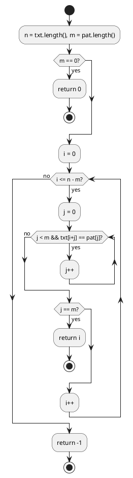
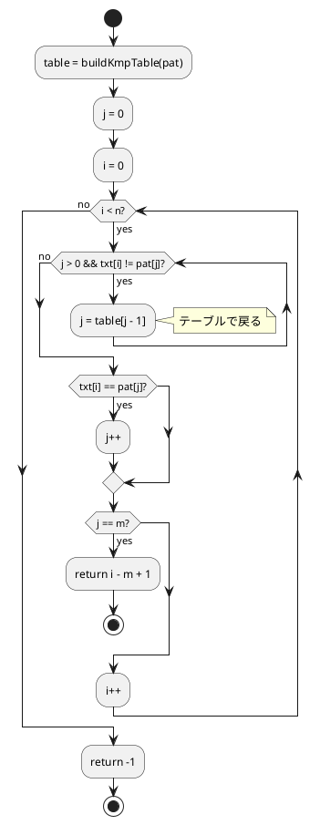
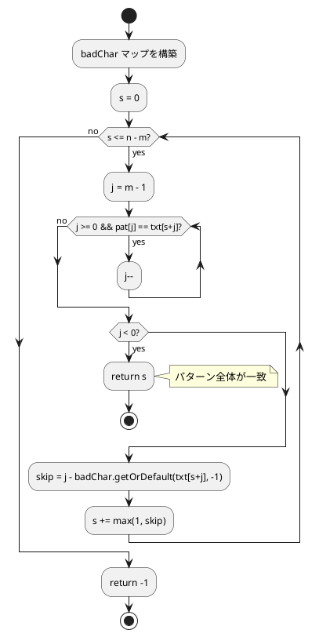

# 第 7 章 文字列処理

## はじめに

文字列処理はプログラミングにおいて最も頻繁に登場する操作の一つです。この章では文字列探索アルゴリズム（ブルートフォース、KMP、Boyer-Moore）と文字列ユーティリティ（文字カウント、逆順、回文判定）を TDD で実装します。

## Java の文字列基本操作

Java の `String` は不変（immutable）オブジェクトです。文字列操作のたびに新しいオブジェクトが生成されます。

| 操作 | Java | Python |
|:---|:---|:---|
| 長さ | `s.length()` | `len(s)` |
| 文字取得 | `s.charAt(i)` | `s[i]` |
| 部分文字列 | `s.substring(i, j)` | `s[i:j]` |
| 文字列比較 | `s.equals(t)` | `s == t` |
| 文字配列変換 | `s.toCharArray()` | `list(s)` |
| 逆順 | `new StringBuilder(s).reverse().toString()` | `s[::-1]` |

---

## 1. ブルートフォース文字列探索

テキストの各位置からパターンを 1 文字ずつ比較する、もっとも単純な文字列探索アルゴリズムです。

### Red -- 失敗するテストを書く

```java
// src/test/java/algorithm/StringAlgorithmsTest.java
package algorithm;

import org.junit.jupiter.api.Nested;
import org.junit.jupiter.api.Test;

import java.util.Map;

import static org.junit.jupiter.api.Assertions.*;

class StringAlgorithmsTest {

    @Nested
    class BfMatchTest {
        @Test void 見つかる() { assertEquals(12, StringAlgorithms.bfMatch("ABCXDEZCABACABAB", "ABAB")); }
        @Test void 先頭で見つかる() { assertEquals(0, StringAlgorithms.bfMatch("ABCDE", "ABC")); }
        @Test void 末尾で見つかる() { assertEquals(2, StringAlgorithms.bfMatch("ABCDE", "CDE")); }
        @Test void 見つからない() { assertEquals(-1, StringAlgorithms.bfMatch("ABCDE", "XYZ")); }
        @Test void 空パターン() { assertEquals(0, StringAlgorithms.bfMatch("ABCDE", "")); }
        @Test void パターンがテキストより長い() { assertEquals(-1, StringAlgorithms.bfMatch("AB", "ABCDE")); }
        @Test void 単一文字() { assertEquals(2, StringAlgorithms.bfMatch("ABCDE", "C")); }
    }
}
```

7 つのテストケースで、発見位置・不一致・境界条件を網羅しています:

- 通常の発見（先頭・中央・末尾）
- 不一致
- 空パターン（0 を返す）
- パターンがテキストより長い場合
- 単一文字パターン

### Green -- テストを通す最小のコードを書く

```java
// src/main/java/algorithm/StringAlgorithms.java
package algorithm;

import java.util.HashMap;
import java.util.Map;

public class StringAlgorithms {

    /** ブルートフォース文字列探索 */
    public static int bfMatch(String txt, String pat) {
        int n = txt.length();
        int m = pat.length();
        if (m == 0) return 0;
        for (int i = 0; i <= n - m; i++) {
            int j = 0;
            while (j < m && txt.charAt(i + j) == pat.charAt(j)) j++;
            if (j == m) return i;
        }
        return -1;
    }
}
```

計算量は最悪 O(n * m) です。外側のループでテキストの各位置を試し、内側のループでパターンとの一致を確認します。

### フローチャート



---

## 2. KMP 法

パターンの接頭辞と接尾辞の一致情報（部分一致テーブル）を事前計算し、不一致時にパターンを効率的にスライドさせるアルゴリズムです。計算量は O(n + m) です。

### KMP 法の考え方

ブルートフォースでは不一致が発生するとパターンを 1 文字だけずらして最初から比較し直しますが、KMP 法では「既に一致した部分の情報」を活用して無駄な比較をスキップします。

部分一致テーブル（failure function）の例:

| パターン | A | B | A | B |
|:---|:---|:---|:---|:---|
| テーブル値 | 0 | 0 | 1 | 2 |

- `table[2] = 1`: `"ABA"` の接頭辞 `"A"` と接尾辞 `"A"` が一致（長さ 1）
- `table[3] = 2`: `"ABAB"` の接頭辞 `"AB"` と接尾辞 `"AB"` が一致（長さ 2）

### Red -- 失敗するテストを書く

```java
@Nested
class KmpMatchTest {
    @Test void 見つかる() { assertEquals(12, StringAlgorithms.kmpMatch("ABCXDEZCABACABAB", "ABAB")); }
    @Test void 先頭で見つかる() { assertEquals(0, StringAlgorithms.kmpMatch("ABCDE", "ABC")); }
    @Test void 見つからない() { assertEquals(-1, StringAlgorithms.kmpMatch("ABCDE", "XYZ")); }
    @Test void 空パターン() { assertEquals(0, StringAlgorithms.kmpMatch("ABCDE", "")); }
    @Test void 繰り返しパターン() { assertEquals(0, StringAlgorithms.kmpMatch("AAABAAAB", "AAAB")); }
}
```

「繰り返しパターン」テストは KMP 法の真価が発揮されるケースです。`"AAAB"` のような繰り返しの多いパターンで、ブルートフォースでは余分な比較が発生しますが、KMP 法では部分一致テーブルにより効率的にスキップできます。

### Green -- テストを通す最小のコードを書く

```java
/** KMP 文字列探索 */
public static int kmpMatch(String txt, String pat) {
    int n = txt.length();
    int m = pat.length();
    if (m == 0) return 0;
    int[] table = buildKmpTable(pat);
    int j = 0;
    for (int i = 0; i < n; i++) {
        while (j > 0 && txt.charAt(i) != pat.charAt(j)) j = table[j - 1];
        if (txt.charAt(i) == pat.charAt(j)) j++;
        if (j == m) return i - m + 1;
    }
    return -1;
}

private static int[] buildKmpTable(String pat) {
    int m = pat.length();
    int[] table = new int[m];
    int k = 0;
    for (int i = 1; i < m; i++) {
        while (k > 0 && pat.charAt(k) != pat.charAt(i)) k = table[k - 1];
        if (pat.charAt(k) == pat.charAt(i)) k++;
        table[i] = k;
    }
    return table;
}
```

`buildKmpTable` は「パターン自身の中で、接頭辞と接尾辞がどこまで一致するか」を計算します。不一致発生時に `j = table[j - 1]` でジャンプすることで、既に一致した部分の再比較を回避します。

### フローチャート



---

## 3. Boyer-Moore 法

パターンの末尾から比較し、不一致文字の情報を使ってパターンを大きくスライドさせるアルゴリズムです。実用的には最も高速な文字列探索の一つです。

### Boyer-Moore 法の考え方

KMP 法がパターンの先頭から比較するのに対し、Boyer-Moore 法はパターンの末尾から比較します。不一致が発生したとき、テキスト側の不一致文字がパターン内のどこに出現するかを調べ、大きくスライドさせます。

Bad Character ルールの例:

```
テキスト:  A B C X D E Z C A B A C A B A B
パターン:  A B A B
                 ^ 不一致（X はパターンに含まれない → 4文字スキップ）
```

パターンに含まれない文字で不一致が起きると、パターン長分スライドできるため非常に効率的です。

### Red -- 失敗するテストを書く

```java
@Nested
class BmMatchTest {
    @Test void 見つかる() { assertEquals(12, StringAlgorithms.bmMatch("ABCXDEZCABACABAB", "ABAB")); }
    @Test void 先頭で見つかる() { assertEquals(0, StringAlgorithms.bmMatch("ABCDE", "ABC")); }
    @Test void 見つからない() { assertEquals(-1, StringAlgorithms.bmMatch("ABCDE", "XYZ")); }
    @Test void 空パターン() { assertEquals(0, StringAlgorithms.bmMatch("ABCDE", "")); }
}
```

### Green -- テストを通す最小のコードを書く

```java
/** Boyer-Moore 文字列探索（Bad Character ルールのみ） */
public static int bmMatch(String txt, String pat) {
    int n = txt.length();
    int m = pat.length();
    if (m == 0) return 0;
    Map<Character, Integer> badChar = new HashMap<>();
    for (int i = 0; i < m; i++) badChar.put(pat.charAt(i), i);
    int s = 0;
    while (s <= n - m) {
        int j = m - 1;
        while (j >= 0 && pat.charAt(j) == txt.charAt(s + j)) j--;
        if (j < 0) return s;
        int skip = j - badChar.getOrDefault(txt.charAt(s + j), -1);
        s += Math.max(1, skip);
    }
    return -1;
}
```

Bad Character ルール: 不一致文字がパターン内で最後に出現する位置までスライドします。`badChar` マップに各文字の最終出現位置を記録しています。`getOrDefault(..., -1)` により、パターンに含まれない文字の場合はパターン全体をスキップできます。

### フローチャート



### 3 つの文字列探索アルゴリズムの比較

| アルゴリズム | 前処理 | 最悪計算量 | 平均計算量 | 比較方向 | 特徴 |
|:---|:---|:---|:---|:---|:---|
| ブルートフォース | なし | O(n * m) | O(n * m) | 先頭→末尾 | 実装が最も単純 |
| KMP 法 | O(m) | O(n + m) | O(n + m) | 先頭→末尾 | 繰り返しパターンに強い |
| Boyer-Moore 法 | O(m + |alphabet|) | O(n * m) | O(n / m) | 末尾→先頭 | 実用的に最速 |

---

## 4. 文字カウント

文字列中の各文字の出現回数をカウントするアルゴリズムです。

### Red -- 失敗するテストを書く

```java
@Nested
class CountCharsTest {
    @Test
    void カウント() {
        Map<Character, Integer> result = StringAlgorithms.countChars("hello world");
        assertEquals(3, result.get('l'));
        assertEquals(2, result.get('o'));
        assertEquals(1, result.get(' '));
    }

    @Test
    void 空文字列() {
        assertTrue(StringAlgorithms.countChars("").isEmpty());
    }
}
```

`"hello world"` では `l` が 3 回、`o` が 2 回、スペースが 1 回出現します。空文字列の場合は空のマップを返すことを確認しています。

### Green -- テストを通す最小のコードを書く

```java
/** 文字列中の各文字の出現回数を返す */
public static Map<Character, Integer> countChars(String s) {
    Map<Character, Integer> result = new HashMap<>();
    for (char c : s.toCharArray()) {
        result.merge(c, 1, Integer::sum);
    }
    return result;
}
```

`Map.merge(key, 1, Integer::sum)` は、キーが存在しなければ 1 を設定し、存在すれば既存の値に 1 を加算します。Python の `collections.Counter` に相当する操作です。

Java 8 以前では以下のように書く必要がありました:

```java
// Java 8 以前
if (result.containsKey(c)) {
    result.put(c, result.get(c) + 1);
} else {
    result.put(c, 1);
}
```

`merge` メソッドの導入によりコードが大幅に簡潔になっています。

---

## 5. 文字列の逆順

文字列を逆順にして新しい文字列を返すアルゴリズムです。

### Red -- 失敗するテストを書く

```java
@Nested
class ReverseStringTest {
    @Test void 逆順() { assertEquals("olleh", StringAlgorithms.reverseString("hello")); }
    @Test void 空文字列() { assertEquals("", StringAlgorithms.reverseString("")); }
    @Test void 単一文字() { assertEquals("a", StringAlgorithms.reverseString("a")); }
    @Test void 回文はそのまま() { assertEquals("racecar", StringAlgorithms.reverseString("racecar")); }
}
```

4 つのテストケース:

- 通常の文字列の逆順
- 空文字列（空を返す）
- 単一文字（そのまま）
- 回文（逆順にしても同じ）

### Green -- テストを通す最小のコードを書く

```java
/** 文字列を逆順にして返す */
public static String reverseString(String s) {
    return new StringBuilder(s).reverse().toString();
}
```

`StringBuilder.reverse()` を活用して 1 行で実装しています。Python の `s[::-1]` に相当します。手動で実装する場合は配列の反転と同様のスワップ操作になります。

---

## 6. 回文判定

文字列が回文（前から読んでも後ろから読んでも同じ文字列）かどうかを判定します。

### Red -- 失敗するテストを書く

```java
@Nested
class IsPalindromeTest {
    @Test void 回文() { assertTrue(StringAlgorithms.isPalindrome("racecar")); }
    @Test void 回文でない() { assertFalse(StringAlgorithms.isPalindrome("hello")); }
    @Test void 単一文字() { assertTrue(StringAlgorithms.isPalindrome("a")); }
    @Test void 空文字列() { assertTrue(StringAlgorithms.isPalindrome("")); }
    @Test void 偶数長の回文() { assertTrue(StringAlgorithms.isPalindrome("abba")); }
}
```

5 つのテストケース:

- 奇数長の回文 `"racecar"`
- 回文でない文字列 `"hello"`
- 単一文字（常に回文）
- 空文字列（定義上回文）
- 偶数長の回文 `"abba"`

### Green -- テストを通す最小のコードを書く

```java
/** 文字列が回文かどうかを判定 */
public static boolean isPalindrome(String s) {
    return s.equals(new StringBuilder(s).reverse().toString());
}
```

逆順にした文字列と元の文字列を比較するだけです。Java では `==` ではなく `equals()` で文字列比較する点に注意してください（`==` は参照の比較になります）。

### Refactor -- 効率的な回文判定

上記の実装は O(n) の追加メモリを使いますが、先頭と末尾から中央に向かって比較すれば O(1) のメモリで判定できます:

```java
// O(1) メモリ版（参考）
public static boolean isPalindromeEfficient(String s) {
    int left = 0, right = s.length() - 1;
    while (left < right) {
        if (s.charAt(left) != s.charAt(right)) return false;
        left++;
        right--;
    }
    return true;
}
```

現在の実装は `StringBuilder.reverse()` を使った簡潔な方法を採用しています。パフォーマンスが問題になるケースでは O(1) メモリ版への切り替えを検討します。

---

## Python との比較表

| 項目 | Java | Python |
|:---|:---|:---|
| 文字列の不変性 | `String` は不変 | `str` は不変 |
| 文字アクセス | `s.charAt(i)` | `s[i]` |
| 文字型 | `char`（プリミティブ） | `str`（1 文字の文字列） |
| HashMap | `new HashMap<Character, Integer>()` | `dict` / `Counter` |
| merge 操作 | `map.merge(key, 1, Integer::sum)` | `counter[key] += 1` |
| getOrDefault | `map.getOrDefault(key, -1)` | `dict.get(key, -1)` |
| 文字列逆順 | `new StringBuilder(s).reverse().toString()` | `s[::-1]` |
| 文字列比較 | `s.equals(t)` | `s == t` |
| 正規表現 | `java.util.regex.Pattern` | `re` モジュール |

---

## テスト実行結果

```
StringAlgorithmsTest > BfMatchTest > 見つかる PASSED
StringAlgorithmsTest > BfMatchTest > 先頭で見つかる PASSED
StringAlgorithmsTest > BfMatchTest > 末尾で見つかる PASSED
StringAlgorithmsTest > BfMatchTest > 見つからない PASSED
StringAlgorithmsTest > BfMatchTest > 空パターン PASSED
StringAlgorithmsTest > BfMatchTest > パターンがテキストより長い PASSED
StringAlgorithmsTest > BfMatchTest > 単一文字 PASSED
StringAlgorithmsTest > KmpMatchTest > 見つかる PASSED
StringAlgorithmsTest > KmpMatchTest > 先頭で見つかる PASSED
StringAlgorithmsTest > KmpMatchTest > 見つからない PASSED
StringAlgorithmsTest > KmpMatchTest > 空パターン PASSED
StringAlgorithmsTest > KmpMatchTest > 繰り返しパターン PASSED
StringAlgorithmsTest > BmMatchTest > 見つかる PASSED
StringAlgorithmsTest > BmMatchTest > 先頭で見つかる PASSED
StringAlgorithmsTest > BmMatchTest > 見つからない PASSED
StringAlgorithmsTest > BmMatchTest > 空パターン PASSED
StringAlgorithmsTest > CountCharsTest > カウント PASSED
StringAlgorithmsTest > CountCharsTest > 空文字列 PASSED
StringAlgorithmsTest > ReverseStringTest > 逆順 PASSED
StringAlgorithmsTest > ReverseStringTest > 空文字列 PASSED
StringAlgorithmsTest > ReverseStringTest > 単一文字 PASSED
StringAlgorithmsTest > ReverseStringTest > 回文はそのまま PASSED
StringAlgorithmsTest > IsPalindromeTest > 回文 PASSED
StringAlgorithmsTest > IsPalindromeTest > 回文でない PASSED
StringAlgorithmsTest > IsPalindromeTest > 単一文字 PASSED
StringAlgorithmsTest > IsPalindromeTest > 空文字列 PASSED
StringAlgorithmsTest > IsPalindromeTest > 偶数長の回文 PASSED

BUILD SUCCESSFUL
27 tests completed, 0 failed
```
