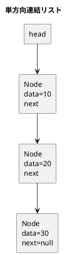
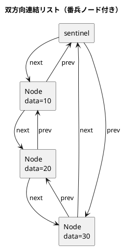
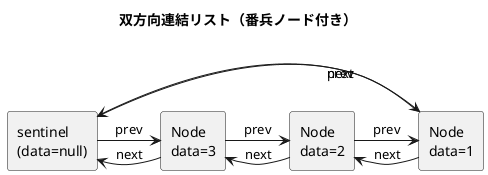

# 第 8 章 リスト

## はじめに

リスト（連結リスト）は、各要素がデータと次の要素への参照（ポインタ）を持つデータ構造です。配列とは異なり、要素の挿入・削除が O(1) で行えます。

この章では 3 種類の連結リスト -- 単方向連結リスト、双方向連結リスト、配列カーソル版連結リスト -- を TDD で実装します。

## リストとは

### 概念図





---

## 1. 単方向連結リスト -- SinglyLinkedList\<T\>

### Red -- 失敗するテストを書く

```java
// src/test/java/algorithm/LinkedListTest.java
package algorithm;

import org.junit.jupiter.api.BeforeEach;
import org.junit.jupiter.api.Nested;
import org.junit.jupiter.api.Test;

import java.util.List;

import static org.junit.jupiter.api.Assertions.*;

class LinkedListTest {

    @Nested
    class SinglyLinkedListTest {
        private SinglyLinkedList<Integer> lst;

        @BeforeEach
        void setUp() { lst = new SinglyLinkedList<>(); }

        @Test void 初期状態は空() { assertEquals(0, lst.size()); assertTrue(lst.isEmpty()); }
        @Test void addFirst() { lst.addFirst(1); assertEquals(1, lst.size()); }
        @Test void addLast() { lst.addLast(1); lst.addLast(2); assertEquals(2, lst.size()); }

        @Test void 探索_見つかる() {
            lst.addLast(10); lst.addLast(20); lst.addLast(30);
            assertTrue(lst.contains(20));
        }

        @Test void 探索_見つからない() {
            lst.addLast(10);
            assertFalse(lst.contains(99));
        }

        @Test void removeFirst() {
            lst.addLast(1); lst.addLast(2);
            lst.removeFirst();
            assertEquals(1, lst.size());
            assertFalse(lst.contains(1));
        }

        @Test void removeLast() {
            lst.addLast(1); lst.addLast(2);
            lst.removeLast();
            assertEquals(1, lst.size());
            assertFalse(lst.contains(2));
        }

        @Test void removeByValue() {
            lst.addLast(1); lst.addLast(2); lst.addLast(3);
            assertTrue(lst.remove(2));
            assertFalse(lst.contains(2));
            assertEquals(2, lst.size());
        }

        @Test void contains() {
            lst.addLast(42);
            assertTrue(lst.contains(42));
            assertFalse(lst.contains(0));
        }

        @Test void removeFirst_空で例外() {
            assertThrows(SinglyLinkedList.EmptyException.class, () -> lst.removeFirst());
        }

        @Test void removeLast_空で例外() {
            assertThrows(SinglyLinkedList.EmptyException.class, () -> lst.removeLast());
        }

        @Test void イテレーション() {
            lst.addLast(1); lst.addLast(2); lst.addLast(3);
            assertEquals(List.of(1, 2, 3), lst.toList());
        }

        @Test void clear() {
            lst.addLast(1); lst.addLast(2);
            lst.clear();
            assertTrue(lst.isEmpty());
        }

        @Test void removeLast_単一要素() {
            lst.addLast(1);
            lst.removeLast();
            assertTrue(lst.isEmpty());
        }

        @Test void remove_空リスト() {
            assertFalse(lst.remove(1));
        }

        @Test void remove_存在しない値() {
            lst.addLast(1); lst.addLast(2);
            assertFalse(lst.remove(99));
            assertEquals(2, lst.size());
        }
    }
}
```

16 個のテストで単方向連結リストの全操作を検証します。特に注意すべきテストケース:

- `removeFirst_空で例外`: 空リストでの removeFirst は EmptyException
- `removeLast_単一要素`: 要素が 1 つだけの場合の removeLast
- `remove_空リスト`: 空リストでの値指定削除は false を返す
- `イテレーション`: `Iterable<T>` 実装による for-each 対応を検証

### Green -- テストを通す最小のコードを書く

```java
// src/main/java/algorithm/SinglyLinkedList.java
package algorithm;

import java.util.ArrayList;
import java.util.Iterator;
import java.util.List;

public class SinglyLinkedList<T> implements Iterable<T> {

    public static class EmptyException extends RuntimeException {
        public EmptyException() { super("リストは空です"); }
    }

    static class Node<T> {
        T data;
        Node<T> next;
        Node(T data, Node<T> next) { this.data = data; this.next = next; }
        Node(T data) { this(data, null); }
    }

    private Node<T> head;
    private int size;

    public SinglyLinkedList() { head = null; size = 0; }

    public int size() { return size; }
    public boolean isEmpty() { return head == null; }

    public boolean contains(T data) { return search(data) != null; }

    Node<T> search(T data) {
        Node<T> ptr = head;
        while (ptr != null) {
            if (ptr.data.equals(data)) return ptr;
            ptr = ptr.next;
        }
        return null;
    }

    public void addFirst(T data) {
        head = new Node<>(data, head);
        size++;
    }

    public void addLast(T data) {
        if (head == null) {
            head = new Node<>(data);
        } else {
            Node<T> ptr = head;
            while (ptr.next != null) ptr = ptr.next;
            ptr.next = new Node<>(data);
        }
        size++;
    }

    public void removeFirst() {
        if (head == null) throw new EmptyException();
        head = head.next;
        size--;
    }

    public void removeLast() {
        if (head == null) throw new EmptyException();
        if (head.next == null) {
            head = null;
        } else {
            Node<T> ptr = head;
            while (ptr.next != null && ptr.next.next != null) ptr = ptr.next;
            ptr.next = null;
        }
        size--;
    }

    public boolean remove(T data) {
        if (head == null) return false;
        if (head.data.equals(data)) {
            head = head.next;
            size--;
            return true;
        }
        Node<T> ptr = head;
        while (ptr.next != null) {
            if (ptr.next.data.equals(data)) {
                ptr.next = ptr.next.next;
                size--;
                return true;
            }
            ptr = ptr.next;
        }
        return false;
    }

    public void clear() {
        head = null;
        size = 0;
    }

    public List<T> toList() {
        List<T> result = new ArrayList<>();
        for (T data : this) result.add(data);
        return result;
    }

    @Override
    public Iterator<T> iterator() {
        return new Iterator<>() {
            private Node<T> ptr = head;
            @Override public boolean hasNext() { return ptr != null; }
            @Override public T next() { T d = ptr.data; ptr = ptr.next; return d; }
        };
    }
}
```

`Iterable<T>` を実装することで、for-each ループや `toList()` で自然にイテレーションできます。

---

## 2. 双方向連結リスト -- DoublyLinkedList\<T\>

番兵ノード（sentinel）を使った双方向連結リストです。番兵ノードにより、先頭・末尾の特殊処理が不要になります。

### 概念図



### Red -- 失敗するテストを書く

```java
@Nested
class DoublyLinkedListTest {
    private DoublyLinkedList<Integer> lst;

    @BeforeEach
    void setUp() { lst = new DoublyLinkedList<>(); }

    @Test void 初期状態は空() { assertEquals(0, lst.size()); assertTrue(lst.isEmpty()); }
    @Test void addFirst() { lst.addFirst(1); assertEquals(1, lst.size()); }
    @Test void addLast() { lst.addLast(1); lst.addLast(2); assertEquals(2, lst.size()); }

    @Test void contains() {
        lst.addLast(10); lst.addLast(20);
        assertTrue(lst.contains(20));
        assertFalse(lst.contains(99));
    }

    @Test void remove() {
        lst.addLast(1); lst.addLast(2); lst.addLast(3);
        assertTrue(lst.remove(2));
        assertFalse(lst.contains(2));
        assertEquals(2, lst.size());
    }

    @Test void イテレーション() {
        lst.addLast(1); lst.addLast(2); lst.addLast(3);
        assertEquals(List.of(1, 2, 3), lst.toList());
    }

    @Test void clear() {
        lst.addLast(1);
        lst.clear();
        assertTrue(lst.isEmpty());
    }

    @Test void remove_空リスト() {
        assertFalse(lst.remove(99));
    }
}
```

### Green -- テストを通す最小のコードを書く

```java
// src/main/java/algorithm/DoublyLinkedList.java
package algorithm;

import java.util.ArrayList;
import java.util.Iterator;
import java.util.List;

public class DoublyLinkedList<T> implements Iterable<T> {

    private static class DNode<T> {
        T data;
        DNode<T> prev;
        DNode<T> next;

        DNode(T data, DNode<T> prev, DNode<T> next) {
            this.data = data;
            this.prev = prev;
            this.next = next;
        }
    }

    private final DNode<T> sentinel;
    private int size;

    public DoublyLinkedList() {
        sentinel = new DNode<>(null, null, null);
        sentinel.prev = sentinel;
        sentinel.next = sentinel;
        size = 0;
    }

    public int size() { return size; }
    public boolean isEmpty() { return size == 0; }

    public boolean contains(T data) {
        DNode<T> ptr = sentinel.next;
        while (ptr != sentinel) {
            if (ptr.data.equals(data)) return true;
            ptr = ptr.next;
        }
        return false;
    }

    public void addFirst(T data) {
        DNode<T> node = new DNode<>(data, sentinel, sentinel.next);
        sentinel.next.prev = node;
        sentinel.next = node;
        size++;
    }

    public void addLast(T data) {
        DNode<T> node = new DNode<>(data, sentinel.prev, sentinel);
        sentinel.prev.next = node;
        sentinel.prev = node;
        size++;
    }

    public boolean remove(T data) {
        if (isEmpty()) return false;
        DNode<T> ptr = sentinel.next;
        while (ptr != sentinel) {
            if (ptr.data.equals(data)) {
                ptr.prev.next = ptr.next;
                ptr.next.prev = ptr.prev;
                size--;
                return true;
            }
            ptr = ptr.next;
        }
        return false;
    }

    public void clear() {
        sentinel.prev = sentinel;
        sentinel.next = sentinel;
        size = 0;
    }

    public List<T> toList() {
        List<T> result = new ArrayList<>();
        for (T data : this) result.add(data);
        return result;
    }

    @Override
    public Iterator<T> iterator() {
        return new Iterator<>() {
            private DNode<T> ptr = sentinel.next;
            @Override public boolean hasNext() { return ptr != sentinel; }
            @Override public T next() { T d = ptr.data; ptr = ptr.next; return d; }
        };
    }
}
```

番兵ノードの利点:

- `addFirst`/`addLast` で null チェックが不要
- `remove` で先頭・末尾の特殊処理が不要
- ループの終了条件が `ptr != sentinel` で統一

---

## 3. 配列カーソル版連結リスト -- ArrayLinkedList

配列のインデックスをポインタ（カーソル）として使う連結リストです。ポインタが使えない環境や、メモリ確保のオーバーヘッドを避けたい場合に有用です。

### Red -- 失敗するテストを書く

```java
@Nested
class ArrayLinkedListTest {
    @Test void 初期化() {
        ArrayLinkedList al = new ArrayLinkedList(100);
        assertEquals(0, al.size());
    }

    @Test void addFirst() {
        ArrayLinkedList al = new ArrayLinkedList(100);
        al.addFirst(1); al.addFirst(2);
        assertEquals(2, al.size());
    }

    @Test void addFirst_順序() {
        ArrayLinkedList al = new ArrayLinkedList(100);
        al.addFirst(1); al.addFirst(2); al.addFirst(3);
        assertEquals(3, al.getHeadData());
    }

    @Test void addLast() {
        ArrayLinkedList al = new ArrayLinkedList(100);
        al.addLast(1); al.addLast(2);
        assertEquals(2, al.size());
    }

    @Test void addLast_順序() {
        ArrayLinkedList al = new ArrayLinkedList(100);
        al.addLast(1); al.addLast(2); al.addLast(3);
        assertEquals(1, al.getHeadData());
    }

    @Test void search_見つかる() {
        ArrayLinkedList al = new ArrayLinkedList(100);
        al.addLast(10); al.addLast(20); al.addLast(30);
        assertTrue(al.search(20) >= 0);
    }

    @Test void search_見つからない() {
        ArrayLinkedList al = new ArrayLinkedList(100);
        al.addLast(10);
        assertEquals(-1, al.search(99));
    }

    @Test void removeFirst() {
        ArrayLinkedList al = new ArrayLinkedList(100);
        al.addLast(1); al.addLast(2); al.addLast(3);
        al.removeFirst();
        assertEquals(2, al.size());
        assertEquals(-1, al.search(1));
    }

    @Test void removeFirst_空() {
        ArrayLinkedList al = new ArrayLinkedList(100);
        al.removeFirst(); // 何もしない
        assertEquals(0, al.size());
    }

    @Test void 削除スロットの再利用() {
        ArrayLinkedList al = new ArrayLinkedList(100);
        al.addFirst(1); al.addFirst(2);
        al.removeFirst();
        al.addFirst(3);
        assertEquals(2, al.size());
    }

    @Test void 容量超過() {
        ArrayLinkedList al = new ArrayLinkedList(2);
        al.addFirst(1); al.addFirst(2);
        al.addFirst(3); // 容量超過で無視
        assertEquals(2, al.size());
    }
}
```

11 個のテストで配列カーソル版の特殊な動作を検証しています:

- `削除スロットの再利用`: 削除されたスロットが新しい要素で再利用されること
- `容量超過`: 配列の容量を超えた追加が無視されること

### Green -- テストを通す最小のコードを書く

```java
// src/main/java/algorithm/ArrayLinkedList.java
package algorithm;

public class ArrayLinkedList {

    private static final int NULL = -1;

    private static class ArrayNode {
        int data;
        int next;
        int dnext; // 削除済みリストの次ポインタ

        ArrayNode() { data = 0; next = NULL; dnext = NULL; }
        ArrayNode(int data, int next) { this.data = data; this.next = next; this.dnext = NULL; }
    }

    private int head;
    private int max;
    private int deleted;
    private final int capacity;
    private final ArrayNode[] n;
    private int size;

    public ArrayLinkedList(int capacity) {
        this.capacity = capacity;
        this.head = NULL;
        this.max = NULL;
        this.deleted = NULL;
        this.n = new ArrayNode[capacity];
        for (int i = 0; i < capacity; i++) n[i] = new ArrayNode();
        this.size = 0;
    }

    public int size() { return size; }

    private int getInsertIndex() {
        if (deleted == NULL) {
            if (max + 1 < capacity) {
                max++;
                return max;
            }
            return NULL;
        }
        int rec = deleted;
        deleted = n[rec].dnext;
        return rec;
    }

    public void addFirst(int data) {
        int ptr = head;
        int rec = getInsertIndex();
        if (rec != NULL) {
            head = rec;
            n[head] = new ArrayNode(data, ptr);
            size++;
        }
    }

    public void addLast(int data) {
        if (head == NULL) {
            addFirst(data);
        } else {
            int ptr = head;
            while (n[ptr].next != NULL) ptr = n[ptr].next;
            int rec = getInsertIndex();
            if (rec != NULL) {
                n[ptr].next = rec;
                n[rec] = new ArrayNode(data, NULL);
                size++;
            }
        }
    }

    public int search(int data) {
        int ptr = head;
        while (ptr != NULL) {
            if (n[ptr].data == data) return ptr;
            ptr = n[ptr].next;
        }
        return NULL;
    }

    public void removeFirst() {
        if (head != NULL) {
            int ptr = head;
            head = n[ptr].next;
            n[ptr].dnext = deleted;
            deleted = ptr;
            size--;
        }
    }

    public int getHeadData() {
        if (head == NULL) throw new IndexOutOfBoundsException("empty");
        return n[head].data;
    }
}
```

`getInsertIndex()` メソッドは、まず削除済みリスト（`deleted`）からスロットを再利用し、なければ未使用領域（`max` の次）を割り当てます。これはメモリアロケータのフリーリスト方式に相当します。

---

## Python との比較表

| 項目 | Java | Python |
|:---|:---|:---|
| ジェネリクス | `SinglyLinkedList<T>` | 型ヒント `SinglyLinkedList[T]` |
| 内部クラス | `static class Node<T>` | クラス内クラス |
| Iterable 実装 | `implements Iterable<T>` + `iterator()` | `__iter__` + `__next__` |
| null | `null` | `None` |
| 例外クラス | `extends RuntimeException` | `class EmptyError(Exception)` |
| 組み込みリスト | `java.util.LinkedList<T>` | `list`（配列ベース） |
| 参照型 | オブジェクト参照 | オブジェクト参照 |
| GC | 参照が切れれば GC 対象 | 参照カウント + 循環GC |

---

## テスト実行結果

```
LinkedListTest > SinglyLinkedListTest > 初期状態は空 PASSED
LinkedListTest > SinglyLinkedListTest > addFirst PASSED
LinkedListTest > SinglyLinkedListTest > addLast PASSED
LinkedListTest > SinglyLinkedListTest > 探索_見つかる PASSED
LinkedListTest > SinglyLinkedListTest > 探索_見つからない PASSED
LinkedListTest > SinglyLinkedListTest > removeFirst PASSED
LinkedListTest > SinglyLinkedListTest > removeLast PASSED
LinkedListTest > SinglyLinkedListTest > removeByValue PASSED
LinkedListTest > SinglyLinkedListTest > contains PASSED
LinkedListTest > SinglyLinkedListTest > removeFirst_空で例外 PASSED
LinkedListTest > SinglyLinkedListTest > removeLast_空で例外 PASSED
LinkedListTest > SinglyLinkedListTest > イテレーション PASSED
LinkedListTest > SinglyLinkedListTest > clear PASSED
LinkedListTest > SinglyLinkedListTest > removeLast_単一要素 PASSED
LinkedListTest > SinglyLinkedListTest > remove_空リスト PASSED
LinkedListTest > SinglyLinkedListTest > remove_存在しない値 PASSED
LinkedListTest > DoublyLinkedListTest > 初期状態は空 PASSED
LinkedListTest > DoublyLinkedListTest > addFirst PASSED
LinkedListTest > DoublyLinkedListTest > addLast PASSED
LinkedListTest > DoublyLinkedListTest > contains PASSED
LinkedListTest > DoublyLinkedListTest > remove PASSED
LinkedListTest > DoublyLinkedListTest > イテレーション PASSED
LinkedListTest > DoublyLinkedListTest > clear PASSED
LinkedListTest > DoublyLinkedListTest > remove_空リスト PASSED
LinkedListTest > ArrayLinkedListTest > 初期化 PASSED
LinkedListTest > ArrayLinkedListTest > addFirst PASSED
LinkedListTest > ArrayLinkedListTest > addFirst_順序 PASSED
LinkedListTest > ArrayLinkedListTest > addLast PASSED
LinkedListTest > ArrayLinkedListTest > addLast_順序 PASSED
LinkedListTest > ArrayLinkedListTest > search_見つかる PASSED
LinkedListTest > ArrayLinkedListTest > search_見つからない PASSED
LinkedListTest > ArrayLinkedListTest > removeFirst PASSED
LinkedListTest > ArrayLinkedListTest > removeFirst_空 PASSED
LinkedListTest > ArrayLinkedListTest > 削除スロットの再利用 PASSED
LinkedListTest > ArrayLinkedListTest > 容量超過 PASSED

BUILD SUCCESSFUL
35 tests completed, 0 failed
```
