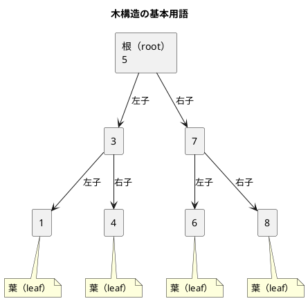
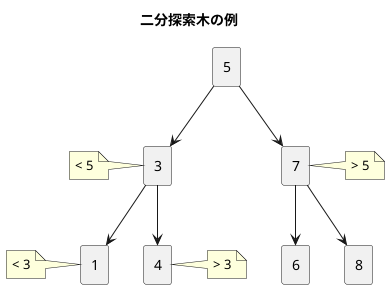
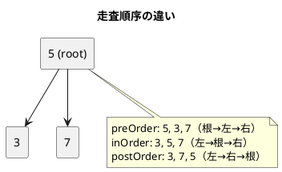

# 第 9 章 木構造

## はじめに

木構造（Tree）は、親子関係を持つ階層的なデータ構造です。データベースのインデックス、ファイルシステム、構文解析など、幅広い分野で使われています。

この章では二分探索木（Binary Search Tree, BST）を `Comparable<T>` を使ったジェネリクスで TDD 実装します。挿入、削除、探索、走査の全操作を網羅的にテストします。

## 木構造とは

### 概念図



## 二分探索木の性質

二分探索木���以下の性質を満たす二分木です:

- 左部分木のすべてのキーは親ノードのキーより小さい
- 右部分木のすべてのキーは親ノードのキーより大きい
- 左右の部分木もそれぞれ二分探索木である



中順走査（inOrder）すると昇順に並ぶのが二分探索木の重要な性質です。

---

## 1. 二分探索木 -- BinarySearchTree\<T\>

### Red -- 失敗するテストを書く

```java
// src/test/java/algorithm/TreeTest.java
package algorithm;

import org.junit.jupiter.api.BeforeEach;
import org.junit.jupiter.api.Nested;
import org.junit.jupiter.api.Test;

import java.util.List;

import static org.junit.jupiter.api.Assertions.*;

class TreeTest {

    @Nested
    class BinarySearchTreeTest {
        private BinarySearchTree<Integer> bst;

        @BeforeEach
        void setUp() { bst = new BinarySearchTree<>(); }

        @Test void 初期状態は空() { assertTrue(bst.isEmpty()); }

        @Test void insertしてcontains() {
            bst.insert(5);
            assertTrue(bst.contains(5));
        }

        @Test void 存在しないキー() { assertFalse(bst.contains(99)); }

        @Test void 複数insert() {
            for (int v : new int[]{5, 3, 7, 1, 4, 6, 8}) bst.insert(v);
            for (int v : new int[]{5, 3, 7, 1, 4, 6, 8}) assertTrue(bst.contains(v));
        }

        @Test void 中順探索は昇順() {
            for (int v : new int[]{5, 3, 7, 1, 4, 6, 8}) bst.insert(v);
            assertEquals(List.of(1, 3, 4, 5, 6, 7, 8), bst.inOrder());
        }

        @Test void 前順探索() {
            for (int v : new int[]{5, 3, 7}) bst.insert(v);
            assertEquals(List.of(5, 3, 7), bst.preOrder());
        }

        @Test void 後順探索() {
            for (int v : new int[]{5, 3, 7}) bst.insert(v);
            assertEquals(List.of(3, 7, 5), bst.postOrder());
        }

        @Test void min() {
            for (int v : new int[]{5, 3, 7, 1, 4}) bst.insert(v);
            assertEquals(1, bst.min());
        }

        @Test void max() {
            for (int v : new int[]{5, 3, 7, 1, 4}) bst.insert(v);
            assertEquals(7, bst.max());
        }

        @Test void min_空で例外() {
            assertThrows(BinarySearchTree.EmptyException.class, () -> bst.min());
        }

        @Test void max_空で例外() {
            assertThrows(BinarySearchTree.EmptyException.class, () -> bst.max());
        }

        @Test void size() {
            for (int v : new int[]{5, 3, 7}) bst.insert(v);
            assertEquals(3, bst.size());
        }

        @Test void contains() {
            bst.insert(42);
            assertTrue(bst.contains(42));
            assertFalse(bst.contains(0));
        }

        @Test void 重複キー挿入は無視() {
            bst.insert(5); bst.insert(5);
            assertEquals(1, bst.size());
        }
    }
}
```

14 個のテストで基本操作（insert, contains, size, min, max）と走査（inOrder, preOrder, postOrder）を検証しています。

### Green -- テストを通す最小のコードを書く

```java
// src/main/java/algorithm/BinarySearchTree.java
package algorithm;

import java.util.ArrayList;
import java.util.List;

public class BinarySearchTree<T extends Comparable<T>> {

    public static class EmptyException extends RuntimeException {
        public EmptyException() { super("木は空です"); }
    }

    private static class BSTNode<T> {
        T key;
        BSTNode<T> left, right;
        BSTNode(T key) { this.key = key; }
    }

    private BSTNode<T> root;
    private int size;

    public BinarySearchTree() { root = null; size = 0; }

    public int size() { return size; }
    public boolean isEmpty() { return root == null; }
    public boolean contains(T key) { return search(key) != null; }

    private BSTNode<T> search(T key) {
        BSTNode<T> ptr = root;
        while (ptr != null) {
            int cmp = key.compareTo(ptr.key);
            if (cmp == 0) return ptr;
            ptr = cmp < 0 ? ptr.left : ptr.right;
        }
        return null;
    }

    public void insert(T key) {
        if (root == null) { root = new BSTNode<>(key); size++; return; }
        BSTNode<T> ptr = root;
        while (true) {
            int cmp = key.compareTo(ptr.key);
            if (cmp == 0) return; // 重複は無視
            if (cmp < 0) {
                if (ptr.left == null) { ptr.left = new BSTNode<>(key); size++; return; }
                ptr = ptr.left;
            } else {
                if (ptr.right == null) { ptr.right = new BSTNode<>(key); size++; return; }
                ptr = ptr.right;
            }
        }
    }
```

`Comparable<T>` を使ったジェネリクスにより、比較可能な任意の型で二分探索木を構築できます。`compareTo` の戻り値で左右の分岐を決定します。

---

## 2. ノードの削除

削除は二分探索木で最も複雑な操作です。削除対象のノードの子の数によって 3 パターンに分かれます。

### Red -- 失敗するテストを書く

```java
@Test void 葉ノードの削除() {
    for (int v : new int[]{5, 3, 7}) bst.insert(v);
    bst.delete(3);
    assertFalse(bst.contains(3));
    assertTrue(bst.contains(5));
    assertTrue(bst.contains(7));
}

@Test void 子が1つのノードの削除() {
    for (int v : new int[]{5, 3, 7, 1}) bst.insert(v);
    bst.delete(3);
    assertFalse(bst.contains(3));
    assertTrue(bst.contains(1));
}

@Test void 子が2つのノードの削除() {
    for (int v : new int[]{5, 3, 7, 1, 4}) bst.insert(v);
    bst.delete(3);
    assertFalse(bst.contains(3));
    for (int v : new int[]{1, 4, 5, 7}) assertTrue(bst.contains(v));
}

@Test void 根ノードの削除() {
    for (int v : new int[]{5, 3, 7}) bst.insert(v);
    bst.delete(5);
    assertFalse(bst.contains(5));
    assertTrue(bst.contains(3));
    assertTrue(bst.contains(7));
    assertEquals(List.of(3, 7), bst.inOrder());
}

@Test void 存在しないキーの削除() {
    bst.insert(5);
    bst.delete(99);
    assertTrue(bst.contains(5));
}

@Test void 根のみ削除で空() {
    bst.insert(5);
    bst.delete(5);
    assertTrue(bst.isEmpty());
}

@Test void 右子のみのノード削除() {
    for (int v : new int[]{5, 3, 7, 8}) bst.insert(v);
    bst.delete(7);
    assertFalse(bst.contains(7));
    assertTrue(bst.contains(8));
}

@Test void 深い後継ノードの削除() {
    for (int v : new int[]{10, 5, 20, 15, 25, 12, 18}) bst.insert(v);
    bst.delete(10);
    assertFalse(bst.contains(10));
    assertEquals(List.of(5, 12, 15, 18, 20, 25), bst.inOrder());
}

@Test void 右子として親に繋がるノード削除() {
    for (int v : new int[]{5, 3, 7}) bst.insert(v);
    bst.delete(7);
    assertFalse(bst.contains(7));
    assertTrue(bst.contains(5));
}
```

9 つの削除テストで全パターンを網羅しています:

| パターン | テスト | 説明 |
|:---|:---|:---|
| 葉ノード | `葉ノードの削除` | 子なし → 単純に除去 |
| 左子のみ | `子が1つのノードの削除` | 左子を親に接続 |
| 右子のみ | `右子のみのノード削除` | 右子を親に接続 |
| 子が2つ | `子が2つのノードの削除` | 中順後継ノードで置換 |
| 根ノード | `根ノードの削除` | 根の特殊処理 |
| 深い後継 | `深い後継ノードの削除` | 後継ノードが深い位置にある場合 |

### Green -- テストを通す最小のコードを書く

```java
public void delete(T key) {
    BSTNode<T> parent = null;
    BSTNode<T> ptr = root;
    boolean isLeftChild = false;

    while (ptr != null) {
        int cmp = key.compareTo(ptr.key);
        if (cmp == 0) break;
        parent = ptr;
        if (cmp < 0) { isLeftChild = true; ptr = ptr.left; }
        else { isLeftChild = false; ptr = ptr.right; }
    }
    if (ptr == null) return;

    size--;

    if (ptr.left == null && ptr.right == null) {
        replaceNode(parent, isLeftChild, null);
    } else if (ptr.right == null) {
        replaceNode(parent, isLeftChild, ptr.left);
    } else if (ptr.left == null) {
        replaceNode(parent, isLeftChild, ptr.right);
    } else {
        // 右部分木の最小ノード（中順後継）で置き換え
        BSTNode<T> succParent = ptr;
        BSTNode<T> succ = ptr.right;
        while (succ.left != null) { succParent = succ; succ = succ.left; }
        ptr.key = succ.key;
        if (succParent == ptr) succParent.right = succ.right;
        else succParent.left = succ.right;
        size++; // delete で既に -1 したので +1 で調整
    }
}

private void replaceNode(BSTNode<T> parent, boolean isLeftChild, BSTNode<T> newNode) {
    if (parent == null) root = newNode;
    else if (isLeftChild) parent.left = newNode;
    else parent.right = newNode;
}
```

子が 2 つの場合の削除は最も複雑です。右部分木の最小ノード（中順後継）を見つけ、削除対象のキーを後継のキーで上書きし、後継ノードを除去します。

---

## 3. 木の走査（inOrder / preOrder / postOrder）

3 種類の走査順序で木を巡回します。



### Green -- 実装コード

```java
public List<T> inOrder() {
    List<T> result = new ArrayList<>();
    inOrderHelper(root, result);
    return result;
}

private void inOrderHelper(BSTNode<T> node, List<T> result) {
    if (node == null) return;
    inOrderHelper(node.left, result);
    result.add(node.key);
    inOrderHelper(node.right, result);
}

public List<T> preOrder() {
    List<T> result = new ArrayList<>();
    preOrderHelper(root, result);
    return result;
}

private void preOrderHelper(BSTNode<T> node, List<T> result) {
    if (node == null) return;
    result.add(node.key);
    preOrderHelper(node.left, result);
    preOrderHelper(node.right, result);
}

public List<T> postOrder() {
    List<T> result = new ArrayList<>();
    postOrderHelper(root, result);
    return result;
}

private void postOrderHelper(BSTNode<T> node, List<T> result) {
    if (node == null) return;
    postOrderHelper(node.left, result);
    postOrderHelper(node.right, result);
    result.add(node.key);
}
```

3 つの走査は `result.add(node.key)` の位置だけが異なります:

- **前順（preOrder）**: 根 → 左 → 右
- **中順（inOrder）**: 左 → 根 → 右（昇順になる）
- **後順（postOrder）**: 左 → 右 → 根

### min / max

```java
public T min() {
    if (root == null) throw new EmptyException();
    BSTNode<T> ptr = root;
    while (ptr.left != null) ptr = ptr.left;
    return ptr.key;
}

public T max() {
    if (root == null) throw new EmptyException();
    BSTNode<T> ptr = root;
    while (ptr.right != null) ptr = ptr.right;
    return ptr.key;
}
```

最小値は左端のノード、最大値は右端のノードです。二分探索木の性質から O(h)（h は木の高さ）で求められます。

---

## Python との比較表

| 項目 | Java | Python |
|:---|:---|:---|
| ジェネリクス制約 | `<T extends Comparable<T>>` | Protocol / ABC |
| 比較 | `key.compareTo(ptr.key)` | `key < ptr.key` / `key > ptr.key` |
| null チェ��ク | `if (root == null)` | `if root is None` |
| 内部クラス | `private static class BSTNode<T>` | クラス内クラス |
| 例外 | `EmptyException extends RuntimeException` | `class EmptyError(Exception)` |
| リスト生成 | `new ArrayList<>()` | `[]` |
| 不変リスト | `List.of(1, 3, 4, 5)` | `[1, 3, 4, 5]` |
| 型安全性 | コンパイル時チェック | 実行時のみ |

---

## テスト実行結果

```
TreeTest > BinarySearchTreeTest > 初期状態は空 PASSED
TreeTest > BinarySearchTreeTest > insertしてcontains PASSED
TreeTest > BinarySearchTreeTest > 存在しないキー PASSED
TreeTest > BinarySearchTreeTest > 複数insert PASSED
TreeTest > BinarySearchTreeTest > 中順探索は昇順 PASSED
TreeTest > BinarySearchTreeTest > 前順探索 PASSED
TreeTest > BinarySearchTreeTest > 後順探索 PASSED
TreeTest > BinarySearchTreeTest > min PASSED
TreeTest > BinarySearchTreeTest > max PASSED
TreeTest > BinarySearchTreeTest > min_空で例外 PASSED
TreeTest > BinarySearchTreeTest > max_空で例外 PASSED
TreeTest > BinarySearchTreeTest > 葉ノードの削除 PASSED
TreeTest > BinarySearchTreeTest > 子が1つのノードの削除 PASSED
TreeTest > BinarySearchTreeTest > 子が2つのノードの削除 PASSED
TreeTest > BinarySearchTreeTest > 根ノードの削除 PASSED
TreeTest > BinarySearchTreeTest > 存在しないキーの削除 PASSED
TreeTest > BinarySearchTreeTest > size PASSED
TreeTest > BinarySearchTreeTest > contains PASSED
TreeTest > BinarySearchTreeTest > 根のみ削除で空 PASSED
TreeTest > BinarySearchTreeTest > 重複キー挿入は無視 PASSED
TreeTest > BinarySearchTreeTest > 右子のみのノード削除 PASSED
TreeTest > BinarySearchTreeTest > 深い後継ノードの削除 PASSED
TreeTest > BinarySearchTreeTest > 右子として親に繋がるノード削除 PASSED

BUILD SUCCESSFUL
23 tests completed, 0 failed
```
