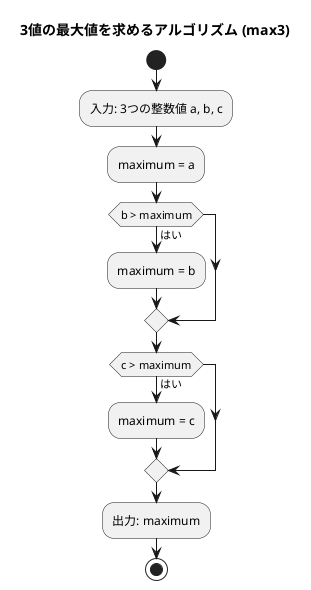
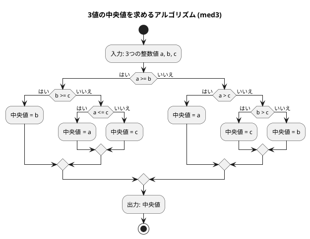

# 第 1 章 基本的なアルゴリズム

## はじめに

プログラミングを学ぶ上で、アルゴリズムの理解は非常に重要です。アルゴリズムとは、問題を解決するための手順や方法のことです。この章では、TypeScript を使って基本的なアルゴリズムを学びながら、テスト駆動開発（TDD）の手法を用いて実装していきます。

テスト駆動開発とは、コードを書く前にまずテストを書き、そのテストが通るようにコードを実装していく開発手法です。Red-Green-Refactor というサイクルを繰り返しながら、確実に動作するコードを段階的に作り上げます。

## 準備

### 環境構築

```bash
# Nix 環境に入る（Node.js + TypeScript が利用可能になる）
nix develop .#node

# プロジェクトディレクトリへ移動
cd apps/node

# 依存パッケージのインストール
npm install
```

### プロジェクト構成

```
apps/node/
├── package.json            # プロジェクト設定
├── tsconfig.json           # TypeScript 設定
├── jest.config.js          # Jest 設定
├── src/
│   └── algorithm/
│       └── basic_algorithms.ts   # 実装ファイル
└── tests/
    └── basic_algorithms.test.ts  # テストファイル
```

### テスト実行コマンド

```bash
# テスト実行
npm test

# カバレッジ付きテスト
npm run test:coverage

# 型チェック
npm run build

# 全チェック
npm run check
```

---

## 1. アルゴリズムとは

アルゴリズムとは、問題を解決するための明確な手順のことです。コンピュータプログラムは、アルゴリズムを実行可能な形で表現したものと言えます。

良いアルゴリズムは以下の特徴を持ちます：

- 入力と出力が明確である
- 各ステップが明確である
- 有限のステップで終了する
- 効率的である

---

## 2. 3 値の最大値

3 つの整数値の中から最大値を求めるアルゴリズムを TDD で実装します。

### Red — 失敗するテストを書く

```typescript
// tests/basic_algorithms.test.ts
describe('3値の最大値', () => {
  test.each([
    [3, 2, 1, 3], // a > b > c
    [3, 2, 2, 3], // a > b = c
    [3, 1, 2, 3], // a > c > b
    [3, 2, 3, 3], // a = c > b
    [2, 1, 3, 3], // c > a > b
    [3, 3, 2, 3], // a = b > c
    [3, 3, 3, 3], // a = b = c
    [2, 2, 3, 3], // c > a = b
    [2, 3, 1, 3], // b > a > c
    [2, 3, 2, 3], // b > a = c
    [1, 3, 2, 3], // b > c > a
    [2, 3, 3, 3], // b = c > a
    [1, 2, 3, 3], // c > b > a
  ])('max3(%i, %i, %i) === %i', (a, b, c, expected) => {
    expect(max3(a, b, c)).toBe(expected);
  });
});
```

3 つの値の大小関係の全パターン（13 通り）を網羅したテストです。`test.each` を使うことで同じテストロジックを複数のデータで実行できます。

### Green — テストを通す最小限の実装

```typescript
// src/algorithm/basic_algorithms.ts
/** 3つの整数値の最大値を返す */
export function max3(a: number, b: number, c: number): number {
  let maximum = a;
  if (b > maximum) maximum = b;
  if (c > maximum) maximum = c;
  return maximum;
}
```

### アルゴリズムの考え方



1. 最初の値を最大値と仮定する
2. 残りの値と比較し、より大きい値があれば最大値を更新する
3. すべての値との比較が終わったら、最大値を返す

---

## 3. 3 値の中央値

3 つの整数値の中央値（3 つの値を大きさの順に並べたときに真ん中に来る値）を求めます。

### Red — 失敗するテストを書く

```typescript
describe('3値の中央値', () => {
  test.each([
    [3, 2, 1, 2], // a > b > c
    [3, 2, 2, 2], // a > b = c
    [3, 1, 2, 2], // a > c > b
    [3, 2, 3, 3], // a = c > b
    [2, 1, 3, 2], // c > a > b
    [3, 3, 2, 3], // a = b > c
    [3, 3, 3, 3], // a = b = c
    [2, 2, 3, 2], // c > a = b
    [2, 3, 1, 2], // b > a > c
    [2, 3, 2, 2], // b > a = c
    [1, 3, 2, 2], // b > c > a
    [2, 3, 3, 3], // b = c > a
    [1, 2, 3, 2], // c > b > a
  ])('med3(%i, %i, %i) === %i', (a, b, c, expected) => {
    expect(med3(a, b, c)).toBe(expected);
  });
});
```

### Green — テストを通す最小限の実装

```typescript
/** 3つの整数値の中央値を返す */
export function med3(a: number, b: number, c: number): number {
  if (a >= b) {
    if (b >= c) return b;
    else if (a <= c) return a;
    else return c;
  } else if (a > c) {
    return a;
  } else if (b > c) {
    return c;
  } else {
    return b;
  }
}
```

### アルゴリズムの考え方



中央値を求めるアルゴリズムは、最大値よりも複雑です。すべての場合分けを考える必要があります：

| 条件 | 中央値 |
|------|--------|
| a >= b かつ b >= c | b |
| a >= b かつ a <= c | a |
| a >= b（それ以外、a > c > b） | c |
| a < b かつ a > c | a |
| a < b かつ b > c | c |
| a < b（それ以外、c >= b > a） | b |

---

## 4. 条件判定と分岐

プログラミングでは、条件に応じて処理を分岐させることが頻繁にあります。

### Red — 失敗するテストを書く

```typescript
describe('条件判定と分岐', () => {
  test('正の数', () => {
    expect(judgeSign(17)).toBe('その値は正です。');
  });

  test('負の数', () => {
    expect(judgeSign(-5)).toBe('その値は負です。');
  });

  test('ゼロ', () => {
    expect(judgeSign(0)).toBe('その値は0です。');
  });
});
```

### Green — テストを通す最小限の実装

```typescript
/** 整数値の符号を判定する */
export function judgeSign(n: number): string {
  if (n > 0) return 'その値は正です。';
  else if (n < 0) return 'その値は負です。';
  else return 'その値は0です。';
}
```

`if`, `else if`, `else` を使うことで、複数の条件に応じて処理を分岐させることができます。TypeScript では Python の `elif` の代わりに `else if` を使います。

---

## 5. 繰り返し処理

プログラミングでは、同じ処理を繰り返し実行することがよくあります。TypeScript では `while` 文と `for` 文を使って繰り返し処理を実現できます。

### 5-1. 1 から n までの総和

#### Red — 失敗するテストを書く

```typescript
describe('繰り返し処理 — 1からnまでの総和', () => {
  test('while 文で 1 から 5 までの総和', () => {
    expect(sum1ToNWhile(5)).toBe(15);
  });

  test('for 文で 1 から 5 までの総和', () => {
    expect(sum1ToNFor(5)).toBe(15);
  });
});
```

#### Green — テストを通す実装

```typescript
/** while 文で 1 から n までの総和を求める */
export function sum1ToNWhile(n: number): number {
  let total = 0;
  let i = 1;
  while (i <= n) {
    total += i;
    i++;
  }
  return total;
}

/** for 文で 1 から n までの総和を求める */
export function sum1ToNFor(n: number): number {
  let total = 0;
  for (let i = 1; i <= n; i++) {
    total += i;
  }
  return total;
}
```

`while` 文は条件が真の間繰り返します。`for` 文は初期化・条件・更新をひとまとめにした繰り返しで、TypeScript では Python の `range()` の代わりに `for (let i = 1; i <= n; i++)` のように書きます。

### 5-2. 記号文字の交互表示

`+` と `-` を交互に表示する 2 通りの実装を比較します。

#### Red — 失敗するテストを書く

```typescript
describe('繰り返し処理 — 記号文字の交互表示', () => {
  test('剰余判定方式で 12 文字', () => {
    expect(alternative1(12)).toBe('+-+-+-+-+-+-');
  });

  test('パターン繰り返し方式で 12 文字', () => {
    expect(alternative2(12)).toBe('+-+-+-+-+-+-');
  });

  test('奇数の場合', () => {
    expect(alternative1(5)).toBe('+-+-+');
    expect(alternative2(5)).toBe('+-+-+');
  });
});
```

#### Green — テストを通す実装

```typescript
/** 記号文字 '+' と '-' を交互に表示する（剰余判定方式） */
export function alternative1(n: number): string {
  let result = '';
  for (let i = 0; i < n; i++) {
    result += i % 2 ? '-' : '+';
  }
  return result;
}

/** 記号文字 '+' と '-' を交互に表示する（パターン繰り返し方式） */
export function alternative2(n: number): string {
  let result = '+-'.repeat(Math.floor(n / 2));
  if (n % 2) result += '+';
  return result;
}
```

TypeScript では Python の `"+-" * (n // 2)` の代わりに `'+-'.repeat(Math.floor(n / 2))` を使います。`String.repeat()` は文字列を指定回数繰り返すメソッドです。

### 5-3. 長方形の辺の長さを列挙

面積が指定された長方形の辺の長さをすべて列挙します。

#### Red — 失敗するテストを書く

```typescript
describe('繰り返し処理 — 長方形の辺の長さを列挙', () => {
  test('面積 32 の長方形', () => {
    expect(rectangle(32)).toBe('1x32 2x16 4x8 ');
  });
});
```

#### Green — テストを通す実装

```typescript
/** 縦横が整数で面積が area の長方形の辺の長さを列挙する */
export function rectangle(area: number): string {
  let result = '';
  for (let i = 1; i <= area; i++) {
    if (i * i > area) break;
    if (area % i) continue;
    result += `${i}x${area / i} `;
  }
  return result;
}
```

`break` は繰り返しを中断し、`continue` は次の繰り返しへスキップします。テンプレートリテラル（バッククォート）を使うと、`${変数}` で値を埋め込めます。

---

## 6. 多重ループ

ループの中にループを重ねることで、2 次元的な処理を実現できます。

### 6-1. 九九の表

#### Red — 失敗するテストを書く

```typescript
describe('多重ループ — 九九の表', () => {
  test('九九の表', () => {
    const expected =
      '---------------------------\n' +
      '  1  2  3  4  5  6  7  8  9\n' +
      '  2  4  6  8 10 12 14 16 18\n' +
      '  3  6  9 12 15 18 21 24 27\n' +
      '  4  8 12 16 20 24 28 32 36\n' +
      '  5 10 15 20 25 30 35 40 45\n' +
      '  6 12 18 24 30 36 42 48 54\n' +
      '  7 14 21 28 35 42 49 56 63\n' +
      '  8 16 24 32 40 48 56 64 72\n' +
      '  9 18 27 36 45 54 63 72 81\n' +
      '---------------------------';
    expect(multiplicationTable()).toBe(expected);
  });
});
```

#### Green — テストを通す実装

```typescript
/** 九九の表を返す */
export function multiplicationTable(): string {
  let result = '-'.repeat(27) + '\n';
  for (let i = 1; i <= 9; i++) {
    for (let j = 1; j <= 9; j++) {
      result += String(i * j).padStart(3);
    }
    result += '\n';
  }
  result += '-'.repeat(27);
  return result;
}
```

TypeScript では Python の `f"{i * j:3}"` の代わりに `String(i * j).padStart(3)` を使います。`padStart(3)` は文字列を指定幅に右揃えでパディングします。

### 6-2. 直角三角形の表示

#### Red — 失敗するテストを書く

```typescript
describe('多重ループ — 直角三角形の表示', () => {
  test('5行の左下三角形', () => {
    expect(triangleLb(5)).toBe('*\n**\n***\n****\n*****\n');
  });
});
```

#### Green — テストを通す実装

```typescript
/** 左下側が直角の二等辺三角形を返す */
export function triangleLb(n: number): string {
  let result = '';
  for (let i = 1; i <= n; i++) {
    result += '*'.repeat(i) + '\n';
  }
  return result;
}
```

---

## Python との比較

| 概念 | Python | TypeScript |
|------|--------|-----------|
| 繰り返し範囲 | `range(1, n + 1)` | `for (let i = 1; i <= n; i++)` |
| 文字列繰り返し | `"*" * n` | `'*'.repeat(n)` |
| 書式付き文字列 | `f"{x:3}"` | `String(x).padStart(3)` |
| 整数除算 | `n // 2` | `Math.floor(n / 2)` |
| 文字列補間 | `f"{i}x{j}"` | `` `${i}x${j}` `` |
| 条件分岐 | `elif` | `else if` |

## テスト実行結果

```bash
$ npm test

PASS tests/basic_algorithms.test.ts
  3値の最大値
    ✓ max3(3, 2, 1) === 3
    ... (13 ケース)
  3値の中央値
    ✓ med3(3, 2, 1) === 2
    ... (13 ケース)
  条件判定と分岐
    ✓ 正の数
    ✓ 負の数
    ✓ ゼロ
  繰り返し処理 — 1からnまでの総和
    ✓ while 文で 1 から 5 までの総和
    ✓ for 文で 1 から 5 までの総和
  繰り返し処理 — 記号文字の交互表示
    ✓ 剰余判定方式で 12 文字
    ✓ パターン繰り返し方式で 12 文字
    ✓ 奇数の場合
  繰り返し処理 — 長方形の辺の長さを列挙
    ✓ 面積 32 の長方形
  多重ループ — 九九の表
    ✓ 九九の表
  多重ループ — 直角三角形の表示
    ✓ 5行の左下三角形

Tests: 37 passed, 37 total
```

---

## まとめ

この章では、以下の基本的なアルゴリズムを TDD で実装しました：

| アルゴリズム | 関数 | キーポイント |
|-------------|------|------------|
| 3 値の最大値 | `max3` | 順次比較と更新 |
| 3 値の中央値 | `med3` | 全パターンの条件分岐 |
| 符号判定 | `judgeSign` | `if/else if/else` の基本 |
| 総和（while） | `sum1ToNWhile` | `while` 文の繰り返し |
| 総和（for） | `sum1ToNFor` | `for` 文の繰り返し |
| 交互表示 | `alternative1/2` | 剰余判定 vs `repeat()` |
| 長方形列挙 | `rectangle` | `break`/`continue` の活用 |
| 九九の表 | `multiplicationTable` | 二重ループ + `padStart()` |
| 直角三角形 | `triangleLb` | ループと `repeat()` |

TDD の Red-Green-Refactor サイクルを通じて、テストが仕様の役割を果たし、確実に動作するコードを構築できることを確認しました。

## 参考文献

- 『新・明解 Python で学ぶアルゴリズムとデータ構造』 — 柴田望洋
- 『テスト駆動開発』 — Kent Beck
