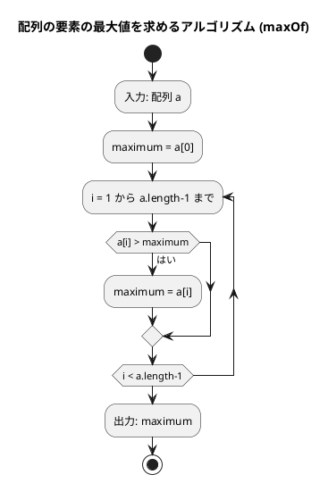

# 第 2 章 配列

## はじめに

前章では基本的なアルゴリズムについて学びました。この章では、プログラミングにおいて非常に重要なデータ構造である「配列」について学んでいきます。配列は、同じ型のデータを連続して格納するためのデータ構造で、多くのアルゴリズムの基礎となります。

TypeScript では、配列に相当するデータ構造として `Array<T>` または `T[]` を使います。

---

## 1. データ構造と配列

### TypeScript における配列

TypeScript の配列は型安全です。要素の型を指定することで、型チェックが行われます。

```typescript
const scores: number[] = [172, 153, 192, 140, 165];
const names: string[] = ['John', 'Paul', 'George', 'Ringo'];
const mixed: (number | string)[] = [1, 'hello', 2];
```

### インデックスによるアクセス

配列の要素には 0 始まりのインデックスでアクセスします。TypeScript には Python のような負のインデックスはありません。

```typescript
const x = [11, 22, 33, 44, 55, 66, 77];
console.log(x[2]);             // 33
console.log(x[x.length - 3]); // 55（後ろから3番目）
x[3] = 99;                    // 要素の変更
```

### 配列の走査

```typescript
const x = ['John', 'George', 'Paul', 'Ringo'];

// インデックスを使った走査
for (let i = 0; i < x.length; i++) {
  console.log(`x[${i}] = ${x[i]}`);
}

// entries() を使った走査（Python の enumerate に相当）
for (const [i, name] of x.entries()) {
  console.log(`x[${i}] = ${name}`);
}

// 直接走査
for (const name of x) {
  console.log(name);
}
```

---

## 2. 配列の要素の最大値

### Red — 失敗するテストを書く

```typescript
// tests/arrays.test.ts
describe('配列の要素の最大値', () => {
  test('5要素の配列', () => {
    expect(maxOf([172, 153, 192, 140, 165])).toBe(192);
  });

  test('1要素の配列', () => {
    expect(maxOf([42])).toBe(42);
  });

  test('すべて同じ値', () => {
    expect(maxOf([5, 5, 5])).toBe(5);
  });
});
```

### Green — テストを通す最小限の実装

```typescript
// src/algorithm/arrays.ts
/** シーケンスの要素の最大値を返す */
export function maxOf(a: number[]): number {
  let maximum = a[0];
  for (let i = 1; i < a.length; i++) {
    if (a[i] > maximum) maximum = a[i];
  }
  return maximum;
}
```

### アルゴリズムの考え方



1. 配列の最初の要素を最大値と仮定する
2. 残りの要素を順に比較し、より大きい値があれば最大値を更新する
3. 全要素の比較が終わったら最大値を返す

計算量は O(n) です（n は配列の要素数）。

---

## 3. 配列の要素の並びを反転

### Red — 失敗するテストを書く

```typescript
describe('配列の要素の並びを反転', () => {
  test('7要素の配列', () => {
    const a = [2, 5, 1, 3, 9, 6, 7];
    reverseArray(a);
    expect(a).toEqual([7, 6, 9, 3, 1, 5, 2]);
  });

  test('偶数要素の配列', () => {
    const a = [1, 2, 3, 4];
    reverseArray(a);
    expect(a).toEqual([4, 3, 2, 1]);
  });

  test('1要素の配列', () => {
    const a = [42];
    reverseArray(a);
    expect(a).toEqual([42]);
  });
});
```

### Green — テストを通す最小限の実装

```typescript
/** 配列の要素の並びを反転する（破壊的） */
export function reverseArray(a: number[]): void {
  const n = a.length;
  for (let i = 0; i < Math.floor(n / 2); i++) {
    const tmp = a[i];
    a[i] = a[n - i - 1];
    a[n - i - 1] = tmp;
  }
}
```

### アルゴリズムの考え方

配列の前半と後半の要素を対称的に交換することで反転します。

```
[2, 5, 1, 3, 9, 6, 7]
 ↕              ↕
[7, 5, 1, 3, 9, 6, 2]  → i=0: 2と7を交換
      ↕        ↕
[7, 6, 1, 3, 9, 5, 2]  → i=1: 5と6を交換
         ↕  ↕
[7, 6, 9, 3, 1, 5, 2]  → i=2: 1と9を交換
```

TypeScript では Python のタプルアンパッキング `a[i], a[j] = a[j], a[i]` が使えないため、一時変数 `tmp` を使って交換します。

## Python との比較

| Python | TypeScript |
|--------|-----------|
| `a[i], a[j] = a[j], a[i]` | `const tmp = a[i]; a[i] = a[j]; a[j] = tmp;` |
| `n // 2` | `Math.floor(n / 2)` |
| `range(n // 2)` | `for (let i = 0; i < Math.floor(n / 2); i++)` |

---

## 4. 基数変換

### Red — 失敗するテストを書く

```typescript
describe('基数変換', () => {
  test('2進数', () => {
    expect(cardConv(29, 2)).toBe('11101');
  });

  test('8進数', () => {
    expect(cardConv(29, 8)).toBe('35');
  });

  test('16進数', () => {
    expect(cardConv(255, 16)).toBe('FF');
  });
});
```

### Green — テストを通す最小限の実装

```typescript
/** 整数値xをr進数に変換した文字列を返す */
export function cardConv(x: number, r: number): string {
  const dchar = '0123456789ABCDEFGHIJKLMNOPQRSTUVWXYZ';
  let d = '';
  while (x > 0) {
    d += dchar[x % r];
    x = Math.floor(x / r);
  }
  return d.split('').reverse().join('');
}
```

### アルゴリズムの考え方

29 を 2 進数に変換する例：

| x | x % 2 | 文字 | d（途中） |
|---|-------|------|---------|
| 29 | 1 | '1' | '1' |
| 14 | 0 | '0' | '10' |
| 7  | 1 | '1' | '101' |
| 3  | 1 | '1' | '1101' |
| 1  | 1 | '1' | '11101' |

反転して `'11101'`。TypeScript では Python の `d[::-1]` の代わりに `d.split('').reverse().join('')` を使います。

---

## 5. 素数の列挙

素数を列挙する 3 つのアルゴリズムを実装し、効率を比較します。

### Red — 失敗するテストを書く

```typescript
describe('素数の列挙', () => {
  test('第1版（1000以下）', () => {
    expect(prime1(1000)).toBe(78022);
  });

  test('第2版（1000以下）', () => {
    expect(prime2(1000)).toBe(14622);
  });

  test('第3版（1000以下）', () => {
    expect(prime3(1000)).toBe(3774);
  });
});
```

### Green — テストを通す実装（3 バージョン）

#### 第 1 版：素直な実装

```typescript
/** x以下の素数を列挙する（第1版）— 除算回数を返す */
export function prime1(x: number): number {
  let counter = 0;
  for (let n = 2; n <= x; n++) {
    for (let i = 2; i < n; i++) {
      counter++;
      if (n % i === 0) break;
    }
  }
  return counter;
}
```

#### 第 2 版：奇数のみ + 素数リスト活用

Python の `for...else` を TypeScript の **ラベル付き continue** で実現します。

```typescript
/** x以下の素数を列挙する（第2版）— 除算回数を返す */
export function prime2(x: number): number {
  let counter = 0;
  let ptr = 0;
  const prime: number[] = new Array(500);

  prime[ptr++] = 2;

  outer: for (let n = 3; n <= x; n += 2) {
    for (let i = 1; i < ptr; i++) {
      counter++;
      if (n % prime[i] === 0) continue outer;  // 素数でなければ外側ループへ
    }
    prime[ptr++] = n;  // 素数リストに追加
  }

  return counter;
}
```

#### 第 3 版：平方根以下のみ確認

```typescript
/** x以下の素数を列挙する（第3版）— 除算回数を返す */
export function prime3(x: number): number {
  let counter = 0;
  let ptr = 0;
  const prime: number[] = new Array(500);

  prime[ptr++] = 2;
  prime[ptr++] = 3;

  outer: for (let n = 5; n <= 1000; n += 2) {
    let i = 1;
    while (prime[i] * prime[i] <= n) {
      counter += 2;
      if (n % prime[i] === 0) continue outer;
      i++;
    }
    prime[ptr++] = n;
    counter++;
  }

  return counter;
}
```

### Python との比較：`for...else` vs ラベル付き continue

Python には `for...else` という独特な構文があります。TypeScript（JavaScript）にはこの構文がないため、**ラベル付き continue** で代替します。

```python
# Python: for...else
for i in range(1, ptr):
    counter += 1
    if n % prime[i] == 0:
        break
else:
    # break されなかった場合（素数）
    prime[ptr] = n
    ptr += 1
```

```typescript
// TypeScript: ラベル付き continue
outer: for (let n = 3; n <= x; n += 2) {
  for (let i = 1; i < ptr; i++) {
    counter++;
    if (n % prime[i] === 0) continue outer; // 外側ループの次の反復へ
  }
  // ここに到達 = 内側ループが continue outer されなかった = 素数
  prime[ptr++] = n;
}
```

### 効率の比較

| バージョン | 除算回数 | 改善率 |
|-----------|---------|--------|
| 第 1 版（素直な実装） | 78,022 | — |
| 第 2 版（奇数 + 素数リスト） | 14,622 | 約 81% 削減 |
| 第 3 版（平方根以下） | 3,774 | 約 95% 削減 |

---

## テスト実行結果

```bash
$ npm test tests/arrays.test.ts

PASS tests/arrays.test.ts
  配列の要素の最大値
    ✓ 5要素の配列
    ✓ 1要素の配列
    ✓ すべて同じ値
  配列の要素の並びを反転
    ✓ 7要素の配列
    ✓ 偶数要素の配列
    ✓ 1要素の配列
  基数変換
    ✓ 2進数
    ✓ 8進数
    ✓ 16進数
  素数の列挙
    ✓ 第1版（1000以下）
    ✓ 第2版（1000以下）
    ✓ 第3版（1000以下）

Tests: 12 passed, 12 total
```

---

## まとめ

| アルゴリズム | 関数 | 計算量 |
|-------------|------|-------|
| 配列の最大値 | `maxOf` | O(n) |
| 配列の反転 | `reverseArray` | O(n) |
| 基数変換 | `cardConv` | O(log x) |
| 素数の列挙 v1 | `prime1` | O(n²) |
| 素数の列挙 v2 | `prime2` | O(n√n) |
| 素数の列挙 v3 | `prime3` | O(n√n / log n) |

## Python と TypeScript の主な違い

| 概念 | Python | TypeScript |
|------|--------|-----------|
| 配列宣言 | `a = [1, 2, 3]` | `const a: number[] = [1, 2, 3]` |
| 要素交換 | `a[i], a[j] = a[j], a[i]` | `const tmp = a[i]; a[i] = a[j]; a[j] = tmp;` |
| 整数除算 | `x //= r` | `x = Math.floor(x / r)` |
| 文字列反転 | `s[::-1]` | `s.split('').reverse().join('')` |
| `for...else` | ネイティブサポート | ラベル付き `continue` で代替 |
| enumerate | `enumerate(a)` | `a.entries()` |

## 参考文献

- 『新・明解 Python で学ぶアルゴリズムとデータ構造』 — 柴田望洋
- 『テスト駆動開発』 — Kent Beck
