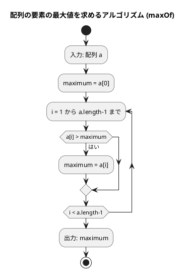
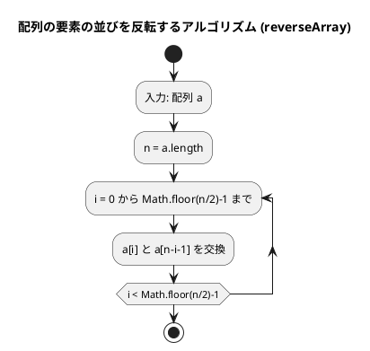
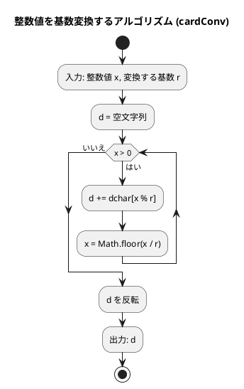
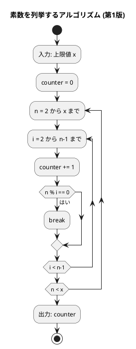
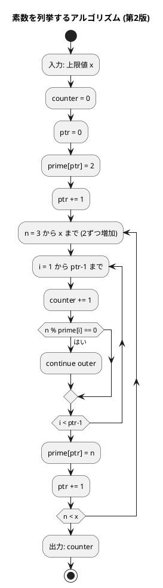
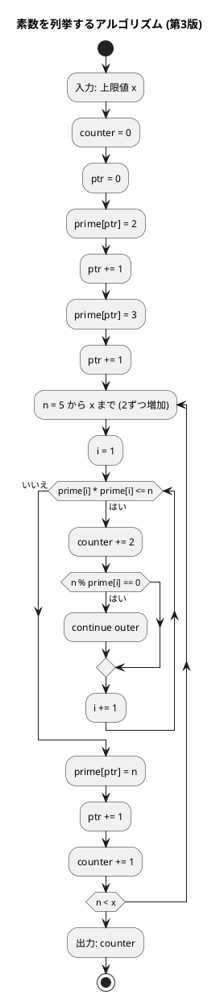

# 第 2 章 配列

## はじめに

前章では基本的なアルゴリズムについて学びました。この章では、プログラミングにおいて非常に重要なデータ構造である「配列」について学んでいきます。配列は、同じ型のデータを連続して格納するためのデータ構造で、多くのアルゴリズムの基礎となります。

TypeScript では、配列に相当するデータ構造として `Array<T>` または `T[]` を使います。Python のリストやタプルに相当しますが、TypeScript の配列は型安全であり、要素の型を指定することでコンパイル時に型チェックが行われます。

---

## 1. データ構造と配列

### データ構造とは

データ構造とは、データ単位とデータ自身との間の物理的または論理的な関係を表したものです。適切なデータ構造を選ぶことで、効率的なアルゴリズムを実装することができます。

### 配列の必要性

例えば、5 人の学生の点数を管理する場合、配列を使わないと個別の変数が必要になります：

```typescript
const tensu1 = 72;
const tensu2 = 53;
const tensu3 = 92;
const tensu4 = 40;
const tensu5 = 65;
```

100 人や 1000 人の点数を扱う場合、このアプローチは現実的ではありません。配列を使えば、任意の数の要素を 1 つの変数で管理できます。

### TypeScript における配列

TypeScript の配列は型安全です。要素の型を指定することで、コンパイル時に型チェックが行われます。

```typescript
const scores: number[] = [172, 153, 192, 140, 165];
const names: string[] = ['John', 'Paul', 'George', 'Ringo'];
const mixed: (number | string)[] = [1, 'hello', 2];  // ユニオン型
```

Python と異なり、TypeScript では型アノテーションが言語の中核機能です。`number[]` は「number 型の配列」を意味し、異なる型の要素を混在させるにはユニオン型 `(number | string)[]` を使います。

### インデックスによるアクセス

配列の要素には 0 始まりのインデックスでアクセスします。TypeScript には Python のような負のインデックスはありません。

```typescript
const x = [11, 22, 33, 44, 55, 66, 77];
console.log(x[2]);              // 33
console.log(x[x.length - 3]);  // 55（後ろから 3 番目）
x[3] = 99;                     // 要素の変更
```

Python では `x[-3]` で後ろから 3 番目にアクセスできますが、TypeScript では `x[x.length - 3]` と書く必要があります。

### 配列の走査

配列の全要素を処理するには、いくつかの方法があります。

```typescript
const x = ['John', 'George', 'Paul', 'Ringo'];

// インデックスを使った走査
for (let i = 0; i < x.length; i++) {
  console.log(`x[${i}] = ${x[i]}`);
}

// entries() を使った走査（Python の enumerate に相当）
for (const [i, name] of x.entries()) {
  console.log(`x[${i}] = ${name}`);
}

// for...of による直接走査（Python の for name in x に相当）
for (const name of x) {
  console.log(name);
}
```

### 分割代入

Python のアンパックに相当する機能として、TypeScript には「分割代入」があります。

```typescript
const [a, b, c] = [1, 2, 3];  // a=1, b=2, c=3
const [first, ...rest] = [1, 2, 3, 4];  // first=1, rest=[2, 3, 4]
```

Python の `a, b, *rest = [1, 2, 3, 4]` と同様に、スプレッド構文 `...` で残りの要素を受け取れます。

---

## 2. 配列の要素の最大値

### Red — 失敗するテストを書く

```typescript
// tests/arrays.test.ts
import { maxOf } from '../src/algorithm/arrays';

describe('配列の要素の最大値', () => {
  test('5要素の配列', () => {
    expect(maxOf([172, 153, 192, 140, 165])).toBe(192);
  });

  test('1要素の配列', () => {
    expect(maxOf([42])).toBe(42);
  });

  test('すべて同じ値', () => {
    expect(maxOf([5, 5, 5])).toBe(5);
  });
});
```

3 つのテストケースで、通常の配列、1 要素の配列（境界条件）、すべて同じ値のケースを網羅しています。

### Green — テストを通す最小限の実装

```typescript
// src/algorithm/arrays.ts
/** シーケンスの要素の最大値を返す */
export function maxOf(a: number[]): number {
  let maximum = a[0];
  for (let i = 1; i < a.length; i++) {
    if (a[i] > maximum) maximum = a[i];
  }
  return maximum;
}
```

### アルゴリズムの考え方



この図は、配列の要素の最大値を求めるアルゴリズム（maxOf 関数）のフローチャートです。

アルゴリズムの流れ：
1. 配列 a を入力として受け取ります
2. 変数 maximum に a の最初の要素（a[0]）を代入します
3. 1 から a.length-1 までの各インデックス i について、以下の処理を繰り返します：
   - a[i] が maximum より大きければ、maximum の値を a[i] に更新します
4. 最終的な maximum の値（配列の最大値）を出力します

計算量は O(n) です（n は配列の要素数）。

---

## 3. 配列の要素の並びを反転

### Red — 失敗するテストを書く

```typescript
import { reverseArray } from '../src/algorithm/arrays';

describe('配列の要素の並びを反転', () => {
  test('7要素の配列', () => {
    const a = [2, 5, 1, 3, 9, 6, 7];
    reverseArray(a);
    expect(a).toEqual([7, 6, 9, 3, 1, 5, 2]);
  });

  test('偶数要素の配列', () => {
    const a = [1, 2, 3, 4];
    reverseArray(a);
    expect(a).toEqual([4, 3, 2, 1]);
  });

  test('1要素の配列', () => {
    const a = [42];
    reverseArray(a);
    expect(a).toEqual([42]);
  });
});
```

`reverseArray` は配列を破壊的に変更する関数です。テストでは元の配列が変更されることを `toEqual` で検証しています。

### Green — テストを通す最小限の実装

```typescript
/** 配列の要素の並びを反転する（破壊的） */
export function reverseArray(a: number[]): void {
  const n = a.length;
  for (let i = 0; i < Math.floor(n / 2); i++) {
    const tmp = a[i];
    a[i] = a[n - i - 1];
    a[n - i - 1] = tmp;
  }
}
```

### アルゴリズムの考え方

配列の前半と後半の要素を対称的に交換することで反転します。



この図は、配列の要素の並びを反転するアルゴリズム（reverseArray 関数）のフローチャートです。

アルゴリズムの流れ：
1. 配列 a を入力として受け取ります
2. 変数 n に a の長さを代入します
3. 0 から Math.floor(n/2)-1 までの各インデックス i について、以下の処理を繰り返します：
   - a[i] と a[n-i-1] を交換します（前半と後半の対応する要素を交換）

配列 [2, 5, 1, 3, 9, 6, 7] を反転する場合：

```
[2, 5, 1, 3, 9, 6, 7]
 ↕              ↕
[7, 5, 1, 3, 9, 6, 2]  → i=0: 2 と 7 を交換
      ↕        ↕
[7, 6, 1, 3, 9, 5, 2]  → i=1: 5 と 6 を交換
         ↕  ↕
[7, 6, 9, 3, 1, 5, 2]  → i=2: 1 と 9 を交換（3 は中央なので交換不要）
```

TypeScript では Python のタプルアンパッキング `a[i], a[j] = a[j], a[i]` が使えないため、一時変数 `tmp` を使って交換します。計算量は O(n/2) = O(n) です。

---

## 4. 基数変換

10 進数を任意の基数（2 進数、8 進数、16 進数など）に変換するアルゴリズムです。

### Red — 失敗するテストを書く

```typescript
import { cardConv } from '../src/algorithm/arrays';

describe('基数変換', () => {
  test('2進数', () => {
    expect(cardConv(29, 2)).toBe('11101');
  });

  test('8進数', () => {
    expect(cardConv(29, 8)).toBe('35');
  });

  test('16進数', () => {
    expect(cardConv(255, 16)).toBe('FF');
  });
});
```

### Green — テストを通す最小限の実装

```typescript
/** 整数値 x を r 進数に変換した文字列を返す */
export function cardConv(x: number, r: number): string {
  const dchar = '0123456789ABCDEFGHIJKLMNOPQRSTUVWXYZ';
  let d = '';
  while (x > 0) {
    d += dchar[x % r];
    x = Math.floor(x / r);
  }
  return d.split('').reverse().join('');
}
```

### アルゴリズムの考え方



29 を 2 進数に変換する例：

| ステップ | x | x % 2 | 文字 | d（途中） |
|---------|---|-------|------|---------|
| 1 | 29 | 1 | '1' | '1' |
| 2 | 14 | 0 | '0' | '10' |
| 3 | 7  | 1 | '1' | '101' |
| 4 | 3  | 1 | '1' | '1101' |
| 5 | 1  | 1 | '1' | '11101' |

反転して `'11101'`。

TypeScript では Python の `x //= r` の代わりに `x = Math.floor(x / r)` を使います。また、文字列の反転は Python の `d[::-1]` の代わりに `d.split('').reverse().join('')` を使います。

計算量は O(log x) です（x を r で割り続けるため）。

---

## 5. 素数の列挙

素数を列挙する 3 つのアルゴリズムを実装し、効率を比較します。テストでは「1000 以下の素数を列挙する際の除算回数」を検証します。

### Red — 失敗するテストを書く

```typescript
import { prime1, prime2, prime3 } from '../src/algorithm/arrays';

describe('素数の列挙', () => {
  test('第1版（1000以下）', () => {
    expect(prime1(1000)).toBe(78022);
  });

  test('第2版（1000以下）', () => {
    expect(prime2(1000)).toBe(14622);
  });

  test('第3版（1000以下）', () => {
    expect(prime3(1000)).toBe(3774);
  });
});
```

### Green — テストを通す実装（3 バージョン）

#### 第 1 版：素直な実装

2 から x までのすべての数について、それより小さいすべての数で割り切れるか確認します。

```typescript
/** x 以下の素数を列挙する（第 1 版）— 除算回数を返す */
export function prime1(x: number): number {
  let counter = 0;
  for (let n = 2; n <= x; n++) {
    for (let i = 2; i < n; i++) {
      counter++;
      if (n % i === 0) break;
    }
  }
  return counter;
}
```

#### フローチャート（第 1 版）



第 1 版は単純ですが、効率が悪いです。n が合成数の場合、小さい約数で割り切れた時点で break しますが、素数の場合は n-2 回の除算が必要です。

#### 第 2 版：奇数のみ + 素数リスト活用

偶数は 2 以外素数ではないため、奇数のみをチェックします。さらに、既に見つけた素数でのみ割り切れるか確認します。

Python には `for...else` という独特な構文がありますが、TypeScript（JavaScript）にはこの構文がありません。代わりに**ラベル付き continue** を使います。

```typescript
/** x 以下の素数を列挙する（第 2 版）— 除算回数を返す */
export function prime2(x: number): number {
  let counter = 0;
  let ptr = 0;
  const prime: number[] = new Array(500);

  prime[ptr++] = 2;

  outer: for (let n = 3; n <= x; n += 2) {
    for (let i = 1; i < ptr; i++) {
      counter++;
      if (n % prime[i] === 0) continue outer;  // 素数でなければ外側ループへ
    }
    prime[ptr++] = n;  // 素数リストに追加
  }

  return counter;
}
```

#### フローチャート（第 2 版）



第 2 版の最適化：偶数はチェックしない（2 以外の偶数は素数ではないため）、すでに見つけた素数だけで割り切れるかをチェックする。

#### 第 3 版：平方根以下のみ確認

n が素数かどうかを判定するには、√n 以下の素数で割り切れるか確認すれば十分です。

```typescript
/** x 以下の素数を列挙する（第 3 版）— 除算回数を返す */
export function prime3(x: number): number {
  let counter = 0;
  let ptr = 0;
  const prime: number[] = new Array(500);

  prime[ptr++] = 2;
  prime[ptr++] = 3;

  outer: for (let n = 5; n <= 1000; n += 2) {
    let i = 1;
    while (prime[i] * prime[i] <= n) {
      counter += 2;
      if (n % prime[i] === 0) continue outer;
      i++;
    }
    prime[ptr++] = n;
    counter++;
  }

  return counter;
}
```

#### フローチャート（第 3 版）



第 3 版の最適化：各数 n について、その平方根以下の素数でのみ割り切れるかをチェックする（それ以上の数でチェックする必要はない）。

### Python との比較：`for...else` vs ラベル付き continue

Python には `for...else` という独特な構文があります。TypeScript（JavaScript）にはこの構文がないため、**ラベル付き continue** で代替します。

```python
# Python: for...else
for i in range(1, ptr):
    counter += 1
    if n % prime[i] == 0:
        break
else:
    # break されなかった場合（素数）
    prime[ptr] = n
    ptr += 1
```

```typescript
// TypeScript: ラベル付き continue
outer: for (let n = 3; n <= x; n += 2) {
  for (let i = 1; i < ptr; i++) {
    counter++;
    if (n % prime[i] === 0) continue outer; // 外側ループの次の反復へ
  }
  // ここに到達 = 内側ループが continue outer されなかった = 素数
  prime[ptr++] = n;
}
```

ラベル付き continue は、`continue outer` で外側のループの次の反復にジャンプします。内側ループが正常に完了した場合（continue outer が実行されなかった場合）、その次のコードが実行され、素数リストに追加されます。

### 効率の比較

| バージョン | 除算回数 | 改善率 |
|-----------|---------|--------|
| 第 1 版（素直な実装） | 78,022 | — |
| 第 2 版（奇数 + 素数リスト） | 14,622 | 約 81% 削減 |
| 第 3 版（平方根以下） | 3,774 | 約 95% 削減 |

アルゴリズムの改善で計算量が大幅に削減されることがわかります。

---

## 配列のコピー

TypeScript でも Python と同様に、配列のコピーには浅いコピー（shallow copy）と深いコピー（deep copy）の区別があります。

```typescript
// 浅いコピー（スプレッド構文）
const x = [[1, 2, 3], [4, 5, 6]];
const y = [...x];
x[0][1] = 9;  // y も変更される（ネストした配列は参照を共有）

// 深いコピー（structuredClone）
const a = [[1, 2, 3], [4, 5, 6]];
const b = structuredClone(a);
a[0][1] = 9;  // b は変更されない
```

Python の `copy.deepcopy()` に相当するものとして、TypeScript（ES2022+）では `structuredClone()` が使えます。

---

## テスト実行結果

```bash
$ npm test tests/arrays.test.ts

PASS tests/arrays.test.ts
  配列の要素の最大値
    ✓ 5要素の配列
    ✓ 1要素の配列
    ✓ すべて同じ値
  配列の要素の並びを反転
    ✓ 7要素の配列
    ✓ 偶数要素の配列
    ✓ 1要素の配列
  基数変換
    ✓ 2進数
    ✓ 8進数
    ✓ 16進数
  素数の列挙
    ✓ 第1版（1000以下）
    ✓ 第2版（1000以下）
    ✓ 第3版（1000以下）

Tests: 12 passed, 12 total
```

---

## Python と TypeScript の主な違い

| 概念 | Python | TypeScript |
|------|--------|-----------|
| 配列宣言 | `a = [1, 2, 3]` | `const a: number[] = [1, 2, 3]` |
| 型アノテーション | `Sequence[Any]` | `number[]` または `Array<number>` |
| 負のインデックス | `a[-1]` | `a[a.length - 1]` |
| スライス | `a[1:3]` | `a.slice(1, 3)` |
| 要素交換 | `a[i], a[j] = a[j], a[i]` | `const tmp = a[i]; a[i] = a[j]; a[j] = tmp;` |
| 整数除算 | `x //= r` | `x = Math.floor(x / r)` |
| 文字列反転 | `s[::-1]` | `s.split('').reverse().join('')` |
| `for...else` | ネイティブサポート | ラベル付き `continue` で代替 |
| enumerate | `enumerate(a)` | `a.entries()` |
| 深いコピー | `copy.deepcopy(x)` | `structuredClone(x)` |

---

## まとめ

| アルゴリズム | 関数 | 計算量 |
|-------------|------|-------|
| 配列の最大値 | `maxOf` | O(n) |
| 配列の反転 | `reverseArray` | O(n) |
| 基数変換 | `cardConv` | O(log x) |
| 素数の列挙 v1 | `prime1` | O(n^2) |
| 素数の列挙 v2 | `prime2` | O(n√n) |
| 素数の列挙 v3 | `prime3` | O(n√n / log n) |

この章で学んだ内容：

1. データ構造と配列の基本概念
2. TypeScript の配列の型安全性と Python との違い
3. インデックスによるアクセスと配列の走査方法
4. 配列の要素の最大値を求めるアルゴリズム
5. 配列の要素の並びを反転するアルゴリズム
6. 基数変換アルゴリズム
7. 素数を列挙するアルゴリズムとその改良（3 バージョン）
8. 配列のコピー（浅いコピーと深いコピー）

アルゴリズムを改良するほど、処理効率が向上することを確認しました。これらの知識は、より複雑なアルゴリズムやデータ構造を理解する上での基礎となります。

## 参考文献

- 『新・明解 Python で学ぶアルゴリズムとデータ構造』 — 柴田望洋
- 『テスト駆動開発』 — Kent Beck
