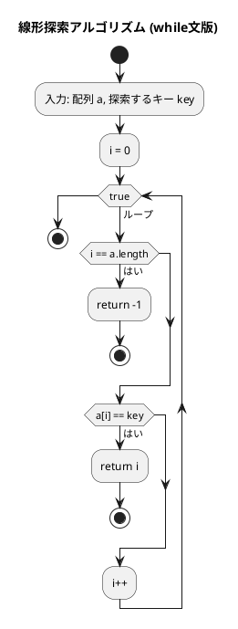
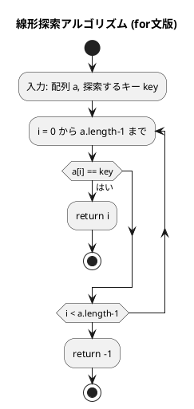
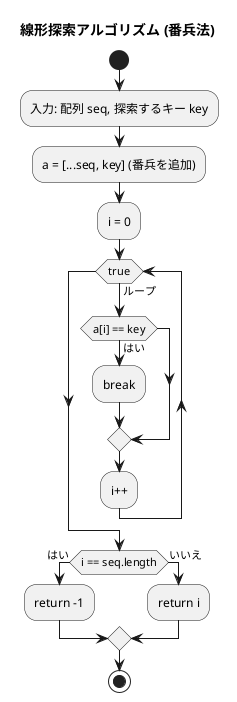
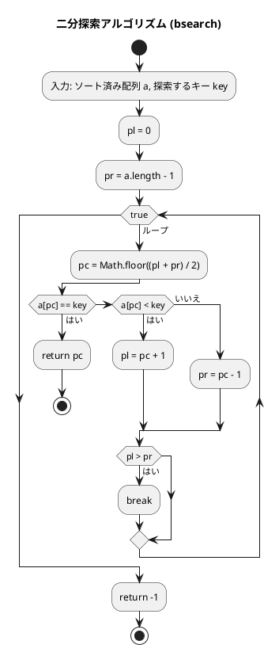
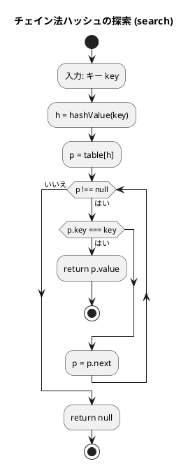
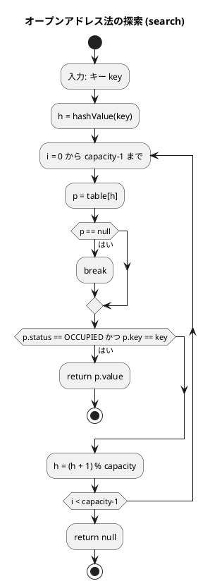

# 第 3 章 探索アルゴリズム

## はじめに

前章では配列とデータ構造について学びました。この章では、データの中から特定の値を見つけ出す「探索アルゴリズム」について学んでいきます。

主に以下の 3 つの方法を TDD で実装します：

1. 線形探索（シーケンシャルサーチ）
2. 二分探索（バイナリサーチ）
3. ハッシュ法

---

## 探索アルゴリズムとは

探索アルゴリズムとは、データの集合から特定の条件を満たす要素を見つけ出すための手順です。探索の対象となるデータは「キー」と呼ばれ、探索の結果は通常、キーが見つかった位置（インデックス）または見つからなかったことを示す特別な値（多くの場合は -1）となります。

探索アルゴリズムの性能は、主に以下の要素によって評価されます：

- 時間効率（計算量）：探索にかかる時間
- 空間効率：使用するメモリ量
- 前提条件：データが整列されている必要があるかなど

---

## 1. 線形探索

配列の先頭から順に各要素を調べ、目的のキーと一致する要素を探す最も基本的な探索です。

### Red — 失敗するテストを書く

```typescript
// tests/search.test.ts
import { ssearchWhile, ssearchFor } from '../src/algorithm/search';

describe('線形探索', () => {
  test('整数配列から要素を検索', () => {
    expect(ssearchWhile([6, 4, 3, 2, 1, 2, 8], 2)).toBe(3);
  });

  test('浮動小数点配列から要素を検索', () => {
    expect(ssearchWhile([12.7, 3.14, 6.4, 7.2], 6.4)).toBe(2);
  });

  test('文字列配列から要素を検索', () => {
    expect(ssearchWhile(['DTS', 'AAC', 'FLAC'], 'DTS')).toBe(0);
  });

  test('見つからない場合は -1 を返す', () => {
    expect(ssearchWhile([1, 2, 3], 99)).toBe(-1);
  });

  test('for 文版: 整数配列', () => {
    expect(ssearchFor([6, 4, 3, 2, 1, 2, 8], 2)).toBe(3);
  });
});
```

TypeScript ではジェネリクス `<T>` を使うことで、`number`, `string` など任意の型の配列に対応できます。Python の型アノテーション `Sequence[Any]` に相当しますが、型安全性が高い点が異なります。

### Green — テストを通す最小限の実装

```typescript
// src/algorithm/search.ts
/** シーケンスから key と等価な要素を線形探索（while 文） */
export function ssearchWhile<T>(a: T[], key: T): number {
  let i = 0;
  while (true) {
    if (i === a.length) return -1;
    if (a[i] === key) return i;
    i++;
  }
}

/** シーケンスから key と等価な要素を線形探索（for 文） */
export function ssearchFor<T>(a: T[], key: T): number {
  for (let i = 0; i < a.length; i++) {
    if (a[i] === key) return i;
  }
  return -1;
}
```

### アルゴリズムの考え方

#### while 文による線形探索のフローチャート



この図は、while 文を使った線形探索アルゴリズム（ssearchWhile 関数）のフローチャートです。

アルゴリズムの流れ：
1. 配列 a と探索するキー key を入力として受け取ります
2. 変数 i を 0 で初期化します（現在の検索位置）
3. 無限ループ内で以下の処理を繰り返します：
   - i が a の長さに達した場合（配列の末尾を超えた場合）、-1 を返して終了します（探索失敗）
   - a[i] が key と一致する場合、i を返して終了します（探索成功）
   - i を 1 増やします（次の要素へ）

#### for 文による線形探索のフローチャート



計算量：
- 最良の場合：O(1)（最初の要素がキーと一致する場合）
- 最悪の場合：O(n)（キーが見つからないか、最後の要素である場合）
- 平均の場合：O(n/2) = O(n)

---

### 番兵法

末尾にキーを追加（番兵）することで、ループ内の終了判定を 1 つ省略できます。

#### Red — 失敗するテストを書く

```typescript
import { ssearchSentinel } from '../src/algorithm/search';

describe('線形探索 — 番兵法', () => {
  test('見つかる場合', () => {
    expect(ssearchSentinel([6, 4, 3, 2, 1, 2, 8], 2)).toBe(3);
  });

  test('見つからない場合', () => {
    expect(ssearchSentinel([1, 2, 3], 99)).toBe(-1);
  });
});
```

#### Green — テストを通す最小限の実装

```typescript
/** シーケンスから key と一致する要素を線形探索（番兵法） */
export function ssearchSentinel<T>(seq: T[], key: T): number {
  const a = [...seq, key];  // 番兵を追加
  let i = 0;
  while (true) {
    if (a[i] === key) break;
    i++;
  }
  return i === seq.length ? -1 : i;
}
```

スプレッド構文 `[...seq, key]` で元の配列をコピーして末尾に番兵を追加します。Python では `copy.deepcopy(list(seq))` + `a.append(key)` と書きますが、TypeScript ではスプレッド構文で簡潔に実現できます。

#### フローチャート



番兵法の利点：ループ内での終了判定（i === a.length）を省略できるため、わずかながら効率が向上します。番兵に到達した場合でも `a[i] === key` の条件は真になるため、ループから抜けることができます。その後、番兵に到達したかどうかを判定することで、探索の成功/失敗を決定します。

---

## 2. 二分探索

**前提**: 配列が整列されていること。

中央の要素とキーを比較し、探索範囲を半分に絞り込むことを繰り返します。

### Red — 失敗するテストを書く

```typescript
import { bsearch } from '../src/algorithm/search';

describe('二分探索', () => {
  test('中間要素を検索', () => {
    expect(bsearch([1, 2, 3, 5, 7, 8, 9], 5)).toBe(3);
  });

  test('先頭要素を検索', () => {
    expect(bsearch([1, 2, 3, 5, 7, 8, 9], 1)).toBe(0);
  });

  test('末尾要素を検索', () => {
    expect(bsearch([1, 2, 3, 5, 7, 8, 9], 9)).toBe(6);
  });

  test('見つからない場合は -1 を返す', () => {
    expect(bsearch([1, 2, 3, 5, 7, 8, 9], 4)).toBe(-1);
  });
});
```

テストでは、中間・先頭・末尾・存在しない要素の 4 パターンを網羅しています。

### Green — テストを通す最小限の実装

```typescript
/** ソート済み配列から key と一致する要素を二分探索 */
export function bsearch<T>(a: T[], key: T): number {
  let pl = 0;
  let pr = a.length - 1;

  while (true) {
    const pc = Math.floor((pl + pr) / 2);
    if (a[pc] === key) return pc;
    else if (a[pc] < key) pl = pc + 1;
    else pr = pc - 1;
    if (pl > pr) break;
  }
  return -1;
}
```

### アルゴリズムの考え方



アルゴリズムの流れ：
1. 配列 a と探索するキー key を入力として受け取ります
2. 変数 pl を 0 で初期化します（探索範囲の先頭要素のインデックス）
3. 変数 pr を a.length - 1 で初期化します（探索範囲の末尾要素のインデックス）
4. 無限ループ内で以下の処理を繰り返します：
   - 変数 pc に Math.floor((pl + pr) / 2) を代入します（中央要素のインデックス）
   - a[pc] が key と一致する場合、pc を返して終了します（探索成功）
   - a[pc] が key より小さい場合、pl を pc + 1 に更新します（探索範囲を後半に絞り込む）
   - a[pc] が key より大きい場合、pr を pc - 1 に更新します（探索範囲を前半に絞り込む）
   - pl が pr より大きくなった場合、ループを抜けます（探索範囲がなくなった）
5. ループを抜けた場合、-1 を返します（探索失敗）

### 計算量の比較

| 要素数 | 線形探索（最悪） | 二分探索（最悪） |
|--------|--------------|--------------|
| 100 | 100 回 | 7 回 |
| 1,000 | 1,000 回 | 10 回 |
| 1,000,000 | 1,000,000 回 | 20 回 |

**計算量**: O(log n)

1,000,000 要素の配列では、線形探索は最悪の場合 1,000,000 回の比較が必要ですが、二分探索では約 20 回（log2 1,000,000 ≒ 20）の比較で済みます。

---

## 3. ハッシュ法

キーからハッシュ関数でアドレスを求め、直接要素にアクセスします。理想的な場合 O(1) で探索できます。

衝突（異なるキーが同じハッシュ値を生成する）の解決方法として、「チェイン法」と「オープンアドレス法」を実装します。

### チェイン法

同じハッシュ値を持つ要素を連結リストで管理します。

#### Red — 失敗するテストを書く

```typescript
import { ChainedHash } from '../src/algorithm/search';

describe('チェイン法ハッシュ', () => {
  let h: ChainedHash<number, string>;

  beforeEach(() => {
    h = new ChainedHash(13);
    h.add(1, '赤尾');
    h.add(5, '武田');
    h.add(10, '小野');
  });

  test('検索: キーが見つかる', () => {
    expect(h.search(1)).toBe('赤尾');
  });

  test('検索: キーが見つからない', () => {
    expect(h.search(100)).toBeNull();
  });

  test('追加', () => {
    h.add(100, '山田');
    expect(h.search(100)).toBe('山田');
  });

  test('重複キーは追加できない', () => {
    expect(h.add(1, '重複')).toBe(false);
  });

  test('削除', () => {
    h.add(100, '山田');
    h.remove(100);
    expect(h.search(100)).toBeNull();
  });
});
```

#### Green — テストを通す最小限の実装

```typescript
class Node<K, V> {
  constructor(
    public key: K,
    public value: V,
    public next: Node<K, V> | null,
  ) {}
}

export class ChainedHash<K, V> {
  private table: Array<Node<K, V> | null>;

  constructor(private capacity: number) {
    this.table = new Array(capacity).fill(null);
  }

  private hashValue(key: K): number {
    if (typeof key === 'number') return (key as number) % this.capacity;
    let hash = 0;
    const str = String(key);
    for (let i = 0; i < str.length; i++) {
      hash = (hash * 31 + str.charCodeAt(i)) % this.capacity;
    }
    return hash;
  }

  search(key: K): V | null {
    const h = this.hashValue(key);
    let p = this.table[h];
    while (p !== null) {
      if (p.key === key) return p.value;
      p = p.next;
    }
    return null;
  }

  add(key: K, value: V): boolean {
    const h = this.hashValue(key);
    let p = this.table[h];
    while (p !== null) {
      if (p.key === key) return false;  // 重複は追加しない
      p = p.next;
    }
    this.table[h] = new Node(key, value, this.table[h]);
    return true;
  }

  remove(key: K): boolean {
    const h = this.hashValue(key);
    let p = this.table[h];
    let pp: Node<K, V> | null = null;
    while (p !== null) {
      if (p.key === key) {
        if (pp === null) this.table[h] = p.next;  // 先頭ノードを削除
        else pp.next = p.next;                      // 後続ノードを削除
        return true;
      }
      pp = p;
      p = p.next;
    }
    return false;
  }
}
```

#### フローチャート



チェイン法では、同じハッシュ値を持つ要素を連結リストで管理します。衝突が発生しても、リストを辿ることで正しい要素を見つけることができます。

---

### オープンアドレス法

衝突時に次の空きスロットを線形に探索します。バケットは `OCCUPIED / EMPTY / DELETED` の 3 状態を持ちます。

#### Red — 失敗するテストを書く

```typescript
import { OpenHash } from '../src/algorithm/search';

describe('オープンアドレス法ハッシュ', () => {
  let h: OpenHash<number, string>;

  beforeEach(() => {
    h = new OpenHash(13);
    h.add(1, '赤尾');
    h.add(5, '武田');
  });

  test('検索: キーが見つかる', () => {
    expect(h.search(1)).toBe('赤尾');
  });

  test('検索: キーが見つからない', () => {
    expect(h.search(999)).toBeNull();
  });

  test('削除', () => {
    h.add(100, '山田');
    h.remove(100);
    expect(h.search(100)).toBeNull();
  });

  test('テーブルが満杯の場合は追加できない', () => {
    const small = new OpenHash<number, string>(3);
    small.add(0, 'a');
    small.add(1, 'b');
    small.add(2, 'c');
    expect(small.add(99, 'd')).toBe(false);
  });
});
```

#### Green — テストを通す最小限の実装

```typescript
const enum BucketStatus { OCCUPIED, EMPTY, DELETED }

export class OpenHash<K, V> {
  private table: Array<{ key: K; value: V; status: BucketStatus } | null>;

  constructor(private capacity: number) {
    this.table = new Array(capacity).fill(null);
  }

  private hashValue(key: K): number {
    if (typeof key === 'number') return (key as number) % this.capacity;
    let hash = 0;
    const str = String(key);
    for (let i = 0; i < str.length; i++) {
      hash = (hash * 31 + str.charCodeAt(i)) % this.capacity;
    }
    return hash;
  }

  search(key: K): V | null {
    let h = this.hashValue(key);
    for (let i = 0; i < this.capacity; i++) {
      const p = this.table[h];
      if (p === null) break;
      if (p.status === BucketStatus.OCCUPIED && p.key === key) return p.value;
      h = (h + 1) % this.capacity;
    }
    return null;
  }

  add(key: K, value: V): boolean {
    if (this.search(key) !== null) return false;
    let h = this.hashValue(key);
    for (let i = 0; i < this.capacity; i++) {
      const p = this.table[h];
      if (p === null || p.status !== BucketStatus.OCCUPIED) {
        this.table[h] = { key, value, status: BucketStatus.OCCUPIED };
        return true;
      }
      h = (h + 1) % this.capacity;
    }
    return false;
  }

  remove(key: K): boolean {
    let h = this.hashValue(key);
    for (let i = 0; i < this.capacity; i++) {
      const p = this.table[h];
      if (p === null) return false;
      if (p.status === BucketStatus.OCCUPIED && p.key === key) {
        p.status = BucketStatus.DELETED;
        return true;
      }
      h = (h + 1) % this.capacity;
    }
    return false;
  }
}
```

TypeScript の `const enum` は整数定数に展開されるため、Python の `Enum` クラスより軽量です。バケットの状態は `OCCUPIED`/`EMPTY`/`DELETED` の 3 種類で管理します。`DELETED` は削除済みを示し、探索をここで止めないためのマーカーです。

#### フローチャート



---

## Python との比較

| 概念 | Python | TypeScript |
|------|--------|-----------|
| ジェネリクス | `def search(self, key: Any)` | `search(key: K): V \| null` |
| 型安全性 | 実行時のみ | コンパイル時 + 実行時 |
| ハッシュ値 | `hashlib.sha256(...)` | 乗算ハッシュ `hash * 31 + charCode` |
| 列挙型 | `class _Status(Enum)` | `const enum BucketStatus` |
| 連結リスト | `_Node` クラス | `Node<K, V>` ジェネリクスクラス |
| None チェック | `if p is None` | `if (p === null)` |
| スプレッド構文 | `copy.deepcopy(list(seq)) + append` | `[...seq, key]` |
| 中央値計算 | `(pl + pr) // 2` | `Math.floor((pl + pr) / 2)` |

---

## テスト実行結果

```bash
$ npm test tests/search.test.ts

PASS tests/search.test.ts
  線形探索
    ✓ 整数配列から要素を検索
    ✓ 浮動小数点配列から要素を検索
    ✓ 文字列配列から要素を検索
    ✓ 見つからない場合は -1 を返す
    ✓ for 文版: 整数配列
  線形探索 — 番兵法
    ✓ 見つかる場合
    ✓ 見つからない場合
  二分探索
    ✓ 中間要素を検索
    ✓ 先頭要素を検索
    ✓ 末尾要素を検索
    ✓ 見つからない場合は -1 を返す
  チェイン法ハッシュ
    ✓ 検索: キーが見つかる
    ✓ 検索: キーが見つからない
    ✓ 追加
    ✓ 重複キーは追加できない
    ✓ 削除
  オープンアドレス法ハッシュ
    ✓ 検索: キーが見つかる
    ✓ 検索: キーが見つからない
    ✓ 削除
    ✓ テーブルが満杯の場合は追加できない

Tests: 20 passed, 20 total
```

---

## 探索アルゴリズムの比較

| アルゴリズム | 事前条件 | 計算量 | 適用場面 |
|-------------|---------|--------|---------|
| 線形探索 | なし | O(n) | 小規模・未整列データ |
| 番兵法 | なし | O(n)（条件比較 1 回削減） | 小規模・未整列データ |
| 二分探索 | 整列済み | O(log n) | 大規模・整列データ |
| ハッシュ法（チェイン法） | なし | O(1) 平均 | 高速な挿入・削除・探索 |
| ハッシュ法（オープンアドレス法） | なし | O(1) 平均 | メモリ効率を重視する場合 |

## まとめ

この章では、3 つの主要な探索アルゴリズムについて学びました：

1. **線形探索**：最も単純な探索方法で、配列の先頭から順に探索します。整列されていない配列でも使用できますが、効率は良くありません。番兵法を使うことでわずかに効率化できます。

2. **二分探索**：整列された配列に対して使用できる効率的な探索方法で、探索範囲を半分ずつ絞り込みます。O(log n) の計算量で高速な探索が可能です。

3. **ハッシュ法**：キーから直接アドレスを求める方法で、理想的な状況では定数時間 O(1) で探索できます。衝突解決方法として、チェイン法とオープンアドレス法があります。

探索アルゴリズムの選択は、データの性質（整列されているか）、データ量、探索の頻度などによって異なります。テスト駆動開発の手法を用いることで、各アルゴリズムの正確な実装と理解を深めることができました。

## 参考文献

- 『新・明解 Python で学ぶアルゴリズムとデータ構造』 — 柴田望洋
- 『テスト駆動開発』 — Kent Beck
