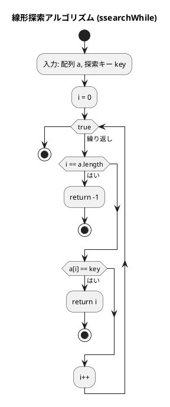
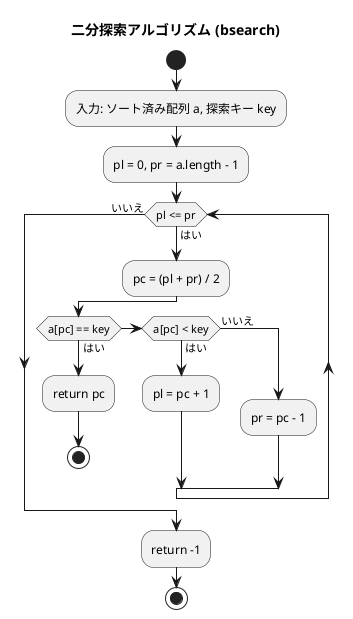

# 第 3 章 探索アルゴリズム

## はじめに

この章では、データの中から目的の要素を見つける「探索」アルゴリズムを学びます。線形探索から始まり、効率的な二分探索、そしてハッシュ法による高速な検索まで、TDD で実装していきます。

---

## 1. 線形探索

配列の先頭から順に比較して目的の要素を探す最も基本的な探索です。

### Red — 失敗するテストを書く

```typescript
describe('線形探索', () => {
  test('整数配列から要素を検索', () => {
    expect(ssearchWhile([6, 4, 3, 2, 1, 2, 8], 2)).toBe(3);
  });

  test('見つからない場合は -1 を返す', () => {
    expect(ssearchWhile([1, 2, 3], 99)).toBe(-1);
  });
});
```

### Green — テストを通す最小限の実装

```typescript
/** シーケンスからkeyと等価な要素を線形探索（while文）*/
export function ssearchWhile<T>(a: T[], key: T): number {
  let i = 0;
  while (true) {
    if (i === a.length) return -1;
    if (a[i] === key) return i;
    i++;
  }
}

/** シーケンスからkeyと等価な要素を線形探索（for文）*/
export function ssearchFor<T>(a: T[], key: T): number {
  for (let i = 0; i < a.length; i++) {
    if (a[i] === key) return i;
  }
  return -1;
}
```

TypeScript ではジェネリクス `<T>` を使うことで、`number`, `string`, `number` など任意の型の配列に対応できます。Python の型アノテーション `Sequence[Any]` に相当します。

### 番兵法

番兵（sentinel）を配列末尾に追加することで、境界チェックを 1 つ省略できます。

```typescript
/** シーケンスからkeyと一致する要素を線形探索（番兵法）*/
export function ssearchSentinel<T>(seq: T[], key: T): number {
  const a = [...seq, key]; // 番兵を追加
  let i = 0;
  while (true) {
    if (a[i] === key) break;
    i++;
  }
  return i === seq.length ? -1 : i;
}
```

スプレッド構文 `[...seq, key]` で元の配列をコピーして末尾に番兵を追加します。

### アルゴリズムの考え方



計算量は O(n) です。最悪の場合、全要素を比較する必要があります。

---

## 2. 二分探索

ソート済み配列に対して、中央の要素と比較して探索範囲を半分に絞り込む効率的な探索です。

### Red — 失敗するテストを書く

```typescript
describe('二分探索', () => {
  test('中間要素を検索', () => {
    expect(bsearch([1, 2, 3, 5, 7, 8, 9], 5)).toBe(3);
  });

  test('見つからない場合は -1 を返す', () => {
    expect(bsearch([1, 2, 3, 5, 7, 8, 9], 4)).toBe(-1);
  });
});
```

### Green — テストを通す最小限の実装

```typescript
/** ソート済み配列からkeyと一致する要素を二分探索 */
export function bsearch<T>(a: T[], key: T): number {
  let pl = 0;
  let pr = a.length - 1;

  while (true) {
    const pc = Math.floor((pl + pr) / 2);
    if (a[pc] === key) return pc;
    else if (a[pc] < key) pl = pc + 1;
    else pr = pc - 1;
    if (pl > pr) break;
  }
  return -1;
}
```

### アルゴリズムの考え方



| 探索 | 計算量 |
|------|--------|
| 線形探索 | O(n) |
| 二分探索 | O(log n) |

1000 要素の配列なら線形探索は最大 1000 回、二分探索は最大 10 回の比較で済みます。

---

## 3. ハッシュ法

キーからハッシュ値を計算して直接アクセスする O(1) の探索です。

### チェイン法

衝突時に連結リストで同じバケットに複数の要素を保持します。

#### Red — 失敗するテストを書く

```typescript
describe('チェイン法ハッシュ', () => {
  let h: ChainedHash<number, string>;

  beforeEach(() => {
    h = new ChainedHash(13);
    h.add(1, '赤尾');
    h.add(14, '神崎'); // 1%13=1 と 14%13=1 が衝突
  });

  test('検索: キーが見つかる', () => {
    expect(h.search(1)).toBe('赤尾');
    expect(h.search(14)).toBe('神崎');
  });

  test('重複キーは追加できない', () => {
    expect(h.add(1, '重複')).toBe(false);
  });
});
```

#### Green — テストを通す最小限の実装

```typescript
class Node<K, V> {
  constructor(
    public key: K,
    public value: V,
    public next: Node<K, V> | null,
  ) {}
}

export class ChainedHash<K, V> {
  private table: Array<Node<K, V> | null>;

  constructor(private capacity: number) {
    this.table = new Array(capacity).fill(null);
  }

  private hashValue(key: K): number {
    if (typeof key === 'number') return (key as number) % this.capacity;
    let hash = 0;
    const str = String(key);
    for (let i = 0; i < str.length; i++) {
      hash = (hash * 31 + str.charCodeAt(i)) % this.capacity;
    }
    return hash;
  }

  search(key: K): V | null {
    const h = this.hashValue(key);
    let p = this.table[h];
    while (p !== null) {
      if (p.key === key) return p.value;
      p = p.next;
    }
    return null;
  }

  add(key: K, value: V): boolean {
    const h = this.hashValue(key);
    let p = this.table[h];
    while (p !== null) {
      if (p.key === key) return false;
      p = p.next;
    }
    this.table[h] = new Node(key, value, this.table[h]);
    return true;
  }

  remove(key: K): boolean {
    const h = this.hashValue(key);
    let p = this.table[h];
    let pp: Node<K, V> | null = null;
    while (p !== null) {
      if (p.key === key) {
        if (pp === null) this.table[h] = p.next;
        else pp.next = p.next;
        return true;
      }
      pp = p;
      p = p.next;
    }
    return false;
  }
}
```

### オープンアドレス法

衝突時に次の空きスロットを線形に探索します。バケットは `OCCUPIED / EMPTY / DELETED` の 3 状態を持ちます。

```typescript
const enum BucketStatus { OCCUPIED, EMPTY, DELETED }

export class OpenHash<K, V> {
  // ... （search/add/remove の実装）
}
```

TypeScript の `const enum` は整数定数に展開されるため、Python の `Enum` クラスより軽量です。

### Python との比較

| 概念 | Python | TypeScript |
|------|--------|-----------|
| ジェネリクス | `def search(self, key: Any)` | `search(key: K): V \| null` |
| ハッシュ値 | `hashlib.sha256(...)` | 乗算ハッシュ `hash * 31 + charCode` |
| 列挙型 | `class _Status(Enum)` | `const enum BucketStatus` |
| 連結リスト | `_Node` クラス | `Node<K, V>` ジェネリクスクラス |

---

## テスト実行結果

```bash
$ npm test tests/search.test.ts

PASS tests/search.test.ts
  線形探索
    ✓ 整数配列から要素を検索
    ✓ 浮動小数点配列から要素を検索
    ✓ 文字列配列から要素を検索
    ✓ 見つからない場合は -1 を返す
    ✓ for 文版: 整数配列
    ✓ for 文版: 見つからない場合
  線形探索 — 番兵法
    ✓ 見つかる場合
    ✓ 見つからない場合
  二分探索
    ✓ 中間要素を検索
    ✓ 先頭要素を検索
    ✓ 末尾要素を検索
    ✓ 見つからない場合は -1 を返す
  チェイン法ハッシュ
    ✓ 検索: キーが見つかる
    ✓ 検索: キーが見つからない
    ... (9 ケース)
  オープンアドレス法ハッシュ
    ✓ 検索: キーが見つかる
    ... (8 ケース)

Tests: 27 passed, 27 total
```

---

## まとめ

| 探索法 | 計算量 | 前提条件 |
|--------|--------|---------|
| 線形探索 | O(n) | なし |
| 番兵法 | O(n) | なし（条件比較を 1 回削減） |
| 二分探索 | O(log n) | ソート済み配列 |
| ハッシュ法 | O(1) | ハッシュ関数が良好 |

## 参考文献

- 『新・明解 Python で学ぶアルゴリズムとデータ構造』 — 柴田望洋
- 『テスト駆動開発』 — Kent Beck
