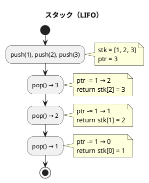
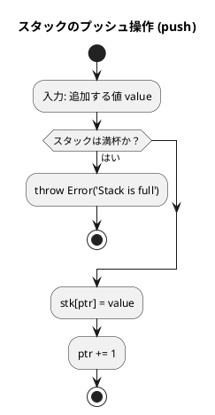
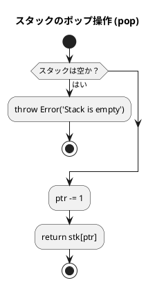
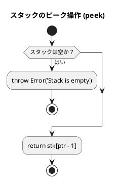
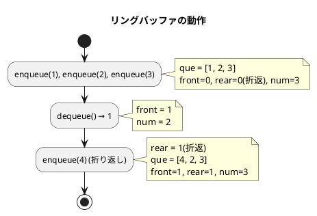
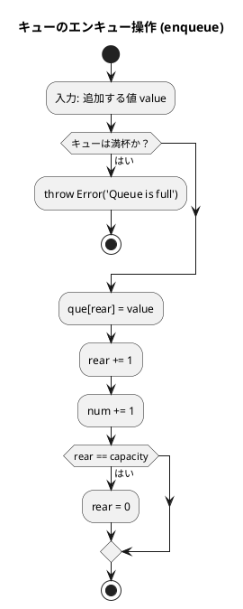
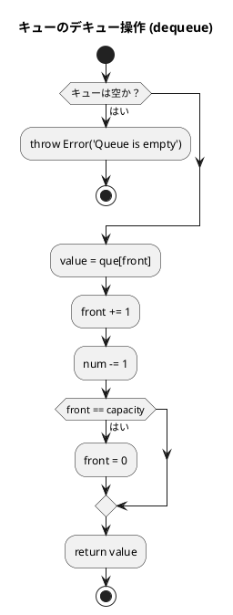
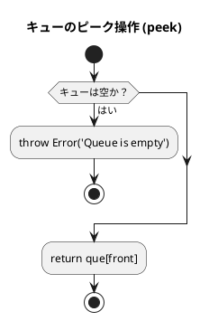

# 第 4 章 スタックとキュー

## はじめに

前章では探索アルゴリズムを学びました。この章では、データを特定の順序で格納・取り出すための基本的なデータ構造である「スタック」と「キュー」について TDD で実装します。

スタックとキューは、多くのアルゴリズムやプログラムの基礎となる重要なデータ構造です。これらの構造は、データの追加と削除の方法が異なり、それぞれ特定の問題に対して効率的な解決策を提供します。

### 目次

1. [スタック](#1-スタック固定長)
2. [キュー](#2-キュー固定長リングバッファ)
3. [スタックとキューの比較](#スタックとキューの比較)

---

## 1. スタック（固定長）

スタックは **LIFO（Last In First Out）** — 後から入れたものを最初に取り出す — データ構造です。

皿を積み重ねるのに似ています。新しい皿は常に一番上に置かれ（プッシュ）、皿を取るときも一番上から取ります（ポップ）。

スタックの主な操作は以下の通りです：

- **プッシュ（Push）**: スタックの一番上にデータを追加する
- **ポップ（Pop）**: スタックの一番上からデータを取り出す
- **ピーク（Peek）**: スタックの一番上のデータを参照する（取り出さない）

スタックは、関数呼び出し、式の評価、構文解析、バックトラッキングなど、多くのアルゴリズムで使用されます。

### Red — 失敗するテストを書く

```typescript
// tests/stack_queue.test.ts
import { FixedStack } from '../src/algorithm/stack_queue';

describe('固定長スタック', () => {
  let stack: FixedStack<number>;

  beforeEach(() => {
    stack = new FixedStack(64);
  });

  test('初期状態: 空で満杯でない', () => {
    expect(stack.isEmpty()).toBe(true);
    expect(stack.isFull()).toBe(false);
  });

  test('push して peek', () => {
    stack.push(1);
    expect(stack.peek()).toBe(1);
  });

  test('LIFO 順序', () => {
    stack.push(1);
    stack.push(2);
    stack.push(3);
    expect(stack.pop()).toBe(3);
    expect(stack.pop()).toBe(2);
    expect(stack.pop()).toBe(1);
  });

  test('空のスタックから pop すると例外', () => {
    expect(() => stack.pop()).toThrow('Stack is empty');
  });

  test('満杯のスタックに push すると例外', () => {
    const s = new FixedStack<number>(2);
    s.push(1);
    s.push(2);
    expect(() => s.push(3)).toThrow('Stack is full');
  });

  test('find: 底から検索', () => {
    stack.push(10);
    stack.push(20);
    stack.push(30);
    expect(stack.find(20)).toBe(1);
  });

  test('dump: スタック内容を配列で返す', () => {
    stack.push(1);
    stack.push(2);
    stack.push(3);
    expect(stack.dump()).toEqual([1, 2, 3]);
  });
});
```

テストでは、初期状態、LIFO 順序、境界条件（空/満杯での例外）、ユーティリティメソッド（find, dump）を網羅しています。

### Green — テストを通す最小限の実装

```typescript
// src/algorithm/stack_queue.ts
export class FixedStack<T> {
  private stk: (T | null)[];
  private ptr: number = 0;

  constructor(public readonly capacity: number) {
    this.stk = new Array(capacity).fill(null);
  }

  isEmpty(): boolean {
    return this.ptr <= 0;
  }

  isFull(): boolean {
    return this.ptr >= this.capacity;
  }

  push(value: T): void {
    if (this.isFull()) throw new Error('Stack is full');
    this.stk[this.ptr++] = value;
  }

  pop(): T {
    if (this.isEmpty()) throw new Error('Stack is empty');
    return this.stk[--this.ptr] as T;
  }

  peek(): T {
    if (this.isEmpty()) throw new Error('Stack is empty');
    return this.stk[this.ptr - 1] as T;
  }

  find(value: T): number {
    for (let i = this.ptr - 1; i >= 0; i--) {
      if (this.stk[i] === value) return i;
    }
    return -1;
  }

  count(value: T): number {
    return this.stk.slice(0, this.ptr).filter(v => v === value).length;
  }

  contains(value: T): boolean {
    return this.find(value) !== -1;
  }

  clear(): void {
    this.ptr = 0;
  }

  size(): number {
    return this.ptr;
  }

  dump(): T[] {
    return this.stk.slice(0, this.ptr) as T[];
  }
}
```

### アルゴリズムの考え方



**主な操作**:

| 操作 | メソッド | 計算量 | 説明 |
|------|---------|--------|------|
| プッシュ | `push(value)` | O(1) | 頂上に追加 |
| ポップ | `pop()` | O(1) | 頂上から取り出す |
| ピーク | `peek()` | O(1) | 頂上を参照（取り出さない） |
| 探索 | `find(value)` | O(n) | 値のインデックスを返す |
| カウント | `count(value)` | O(n) | 値の出現回数 |

### フローチャート

#### スタックのプッシュ操作



アルゴリズムの流れ：
1. 追加する値 value を入力として受け取ります
2. スタックが満杯かどうかをチェックします
   - 満杯の場合、Error を throw して終了します
3. スタック配列の現在のポインタ位置に value を格納します
4. ポインタを 1 増やします（次の格納位置を指すように）

#### スタックのポップ操作



アルゴリズムの流れ：
1. スタックが空かどうかをチェックします
   - 空の場合、Error を throw して終了します
2. ポインタを 1 減らします（最後に追加された要素の位置を指すように）
3. スタック配列のポインタ位置の値を返します

#### スタックのピーク操作



アルゴリズムの流れ：
1. スタックが空かどうかをチェックします
   - 空の場合、Error を throw して終了します
2. スタック配列の ptr - 1 位置（最後に追加された要素の位置）の値を返します
   - ポインタは変更せず、値の参照のみを行います

### Python との比較

| 概念 | Python | TypeScript |
|------|--------|-----------|
| 例外クラス | 内部クラス `FixedStack.Empty` | `Error('Stack is empty')` |
| 例外クラス | 内部クラス `FixedStack.Full` | `Error('Stack is full')` |
| `__len__` | `def __len__(self)` | `size()` メソッド |
| `__contains__` | `def __contains__(self, v)` | `contains(v)` メソッド |
| 型アノテーション | `list[Any]` | `(T \| null)[]` ジェネリクス |
| dump | `list(self.__stk)` | `this.stk.slice(0, this.ptr) as T[]` |

Python では内部クラス `FixedStack.Empty` / `FixedStack.Full` で例外を定義しますが、TypeScript では `new Error('Stack is empty')` を throw します。TypeScript には Python の `__len__` や `__contains__` のような特殊メソッドがないため、明示的なメソッド名（`size()`, `contains()`）を使います。

---

## 2. キュー（固定長・リングバッファ）

キューは **FIFO（First In First Out）** — 最初に入れたものを最初に取り出す — データ構造です。

銀行の行列をイメージすると分かりやすいです。新しい人は列の最後尾に並び（エンキュー）、サービスを受けるのは列の先頭の人からです（デキュー）。

キューの主な操作は以下の通りです：

- **エンキュー（Enqueue）**: キューの末尾にデータを追加する
- **デキュー（Dequeue）**: キューの先頭からデータを取り出す
- **ピーク（Peek）**: キューの先頭のデータを参照する（取り出さない）

キューは、幅優先探索、プリンタのスプーリング、プロセススケジューリングなど、多くのアルゴリズムやシステムで使用されます。

### リングバッファ

固定長配列でキューを実現する際、素朴な実装では先頭要素を取り出すたびにすべての要素をシフトする必要があり O(n) のコストがかかります。

**リングバッファ**を使うと、`front`（先頭インデックス）と `rear`（末尾インデックス）を管理することで、エンキュー・デキューを O(1) で実現できます。

### Red — 失敗するテストを書く

```typescript
import { FixedQueue } from '../src/algorithm/stack_queue';

describe('固定長キュー（リングバッファ）', () => {
  let queue: FixedQueue<number>;

  beforeEach(() => {
    queue = new FixedQueue(64);
  });

  test('FIFO 順序', () => {
    queue.enqueue(1);
    queue.enqueue(2);
    queue.enqueue(3);
    expect(queue.dequeue()).toBe(1);
    expect(queue.dequeue()).toBe(2);
    expect(queue.dequeue()).toBe(3);
  });

  test('リングバッファの折り返し動作', () => {
    const small = new FixedQueue<number>(3);
    small.enqueue(1);
    small.enqueue(2);
    small.enqueue(3);
    small.dequeue();   // 1 を取り出す
    small.enqueue(4);  // 空き位置（先頭）に追加
    expect(small.dequeue()).toBe(2);
    expect(small.dequeue()).toBe(3);
    expect(small.dequeue()).toBe(4);
  });

  test('dump: リングバッファ折り返し後も正しい順序', () => {
    const small = new FixedQueue<number>(3);
    small.enqueue(1);
    small.enqueue(2);
    small.enqueue(3);
    small.dequeue();
    small.enqueue(4);
    expect(small.dump()).toEqual([2, 3, 4]);
  });
});
```

リングバッファの折り返し動作を検証するテストが特に重要です。容量 3 のキューで折り返しが正しく動作することを確認します。

### Green — テストを通す最小限の実装

```typescript
export class FixedQueue<T> {
  private que: (T | null)[];
  private front: number = 0;
  private rear: number = 0;
  private num: number = 0;

  constructor(public readonly capacity: number) {
    this.que = new Array(capacity).fill(null);
  }

  isEmpty(): boolean {
    return this.num <= 0;
  }

  isFull(): boolean {
    return this.num >= this.capacity;
  }

  enqueue(value: T): void {
    if (this.isFull()) throw new Error('Queue is full');
    this.que[this.rear] = value;
    this.rear++;
    this.num++;
    if (this.rear === this.capacity) this.rear = 0;  // 折り返し
  }

  dequeue(): T {
    if (this.isEmpty()) throw new Error('Queue is empty');
    const value = this.que[this.front] as T;
    this.front++;
    this.num--;
    if (this.front === this.capacity) this.front = 0;  // 折り返し
    return value;
  }

  peek(): T {
    if (this.isEmpty()) throw new Error('Queue is empty');
    return this.que[this.front] as T;
  }

  dump(): T[] {
    return Array.from({ length: this.num }, (_, i) =>
      this.que[(i + this.front) % this.capacity] as T,
    );
  }
}
```

### リングバッファの動作イメージ



```
容量 3 のリングバッファ

初期状態:   [_, _, _]  front=0, rear=0, num=0
enqueue(1): [1, _, _]  front=0, rear=1, num=1
enqueue(2): [1, 2, _]  front=0, rear=2, num=2
enqueue(3): [1, 2, 3]  front=0, rear=0(折返), num=3
dequeue():  [_, 2, 3]  front=1, rear=0, num=2  → 1 を返す
enqueue(4): [4, 2, 3]  front=1, rear=1(折返), num=3
dequeue():  [4, _, 3]  front=2, rear=1, num=2  → 2 を返す
```

### フローチャート

#### キューのエンキュー操作



アルゴリズムの流れ：
1. 追加する値 value を入力として受け取ります
2. キューが満杯かどうかをチェックします
   - 満杯の場合、Error を throw して終了します
3. キュー配列の rear 位置（末尾）に value を格納します
4. rear を 1 増やします（次の格納位置を指すように）
5. num（格納されているデータ数）を 1 増やします
6. rear が capacity（キューの容量）に達した場合、rear を 0 にリセットします（リングバッファの先頭に戻る）

#### キューのデキュー操作



アルゴリズムの流れ：
1. キューが空かどうかをチェックします
   - 空の場合、Error を throw して終了します
2. キュー配列の front 位置（先頭）の値を変数 value に格納します
3. front を 1 増やします（次の要素を指すように）
4. num（格納されているデータ数）を 1 減らします
5. front が capacity（キューの容量）に達した場合、front を 0 にリセットします（リングバッファの先頭に戻る）
6. 取り出した値 value を返します

#### キューのピーク操作



### dump — スタック・キューの内容を配列で返す

`dump()` はデバッグや検証に使うユーティリティメソッドです。

```typescript
// FixedStack
dump(): T[] {
  return this.stk.slice(0, this.ptr) as T[];
}

// FixedQueue（リングバッファ折り返しを考慮）
dump(): T[] {
  return Array.from({ length: this.num }, (_, i) =>
    this.que[(i + this.front) % this.capacity] as T,
  );
}
```

キューの `dump()` では、`Array.from` とモジュロ演算を使ってリングバッファの折り返しを考慮した正しい順序で要素を返します。

### Python との比較

| 概念 | Python | TypeScript |
|------|--------|-----------|
| 例外定義 | 内部クラス `Empty` / `Full` | `Error('Queue is empty')` |
| メソッド名 | `enque()` / `deque()` | `enqueue()` / `dequeue()` |
| 型アノテーション | `list[Any]` | `(T \| null)[]` ジェネリクス |
| dump | `list(self.__que)` | `Array.from(...)` + モジュロ演算 |
| deque 標準ライブラリ | `collections.deque` | なし（自作実装） |
| `__len__` | `def __len__(self)` | `size()` メソッド |

Python には `collections.deque` という標準ライブラリがあり、両端キュー（デック）として機能しますが、TypeScript には同等の標準ライブラリがないため、自作実装が必要です。

---

## テスト実行結果

```bash
$ npm test tests/stack_queue.test.ts

PASS tests/stack_queue.test.ts
  固定長スタック
    ✓ 初期状態: 空で満杯でない
    ✓ push して peek
    ✓ LIFO 順序
    ✓ 空のスタックから pop すると例外
    ✓ 満杯のスタックに push すると例外
    ✓ find: 底から検索
    ✓ dump: スタック内容を配列で返す
  固定長キュー（リングバッファ）
    ✓ FIFO 順序
    ✓ リングバッファの折り返し動作
    ✓ dump: リングバッファ折り返し後も正しい順序

Tests: 10 passed, 10 total
```

---

## スタックとキューの比較

| 項目 | スタック | キュー |
|------|---------|--------|
| 取り出し順序 | LIFO（後入れ先出し） | FIFO（先入れ先出し） |
| 追加操作 | `push()` | `enqueue()` |
| 取り出し操作 | `pop()` | `dequeue()` |
| 参照操作 | `peek()` | `peek()` |
| 主な用途 | 関数呼び出し、DFS、構文解析 | タスクキュー、BFS、スケジューリング |
| 計算量（追加/取り出し） | O(1) | O(1) |
| 内部実装 | 配列 + ポインタ | リングバッファ |

---

## まとめ

この章では、2 つの基本的なデータ構造、スタックとキューについて学びました：

| データ構造 | クラス | 特性 | 計算量 |
|-----------|--------|------|--------|
| スタック | `FixedStack<T>` | LIFO | push/pop O(1) |
| キュー | `FixedQueue<T>` | FIFO | enqueue/dequeue O(1) |

この章で学んだ内容：

1. **スタック**：後入れ先出し（LIFO）の原則に従うデータ構造。主な操作はプッシュ、ポップ、ピーク。
2. **キュー**：先入れ先出し（FIFO）の原則に従うデータ構造。主な操作はエンキュー、デキュー、ピーク。
3. **リングバッファ**：固定長配列でキューを効率的に実装するための手法。
4. **TypeScript のジェネリクス**：`FixedStack<T>` のように型パラメータを使うことで、任意の型に対応できるデータ構造を実装できる。
5. **例外処理**：空のスタックからの pop やキューの overflow をエラーとして適切に処理する。

これらのデータ構造は、それぞれ異なる問題に対して効率的な解決策を提供します。スタックは関数呼び出しや式の評価に適しており、キューは幅優先探索やプロセススケジューリングに適しています。

テスト駆動開発の手法を用いることで、これらのデータ構造の正確な実装と理解を深めることができました。

## 参考文献

- 『新・明解 Python で学ぶアルゴリズムとデータ構造』 — 柴田望洋
- 『テスト駆動開発』 — Kent Beck
