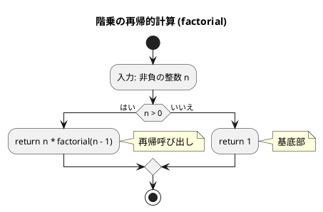
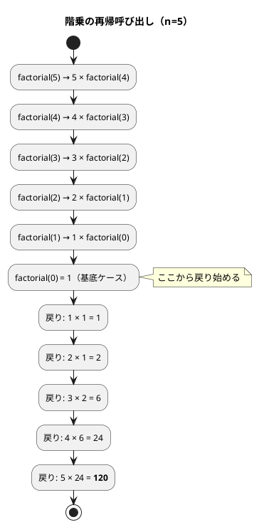
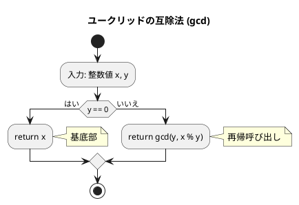
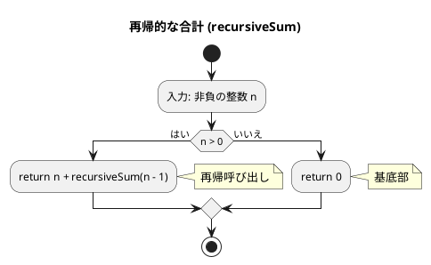
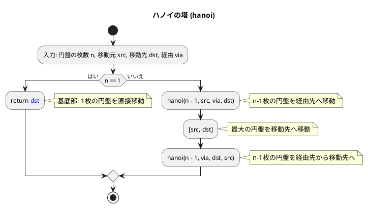
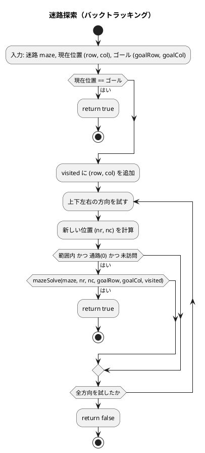
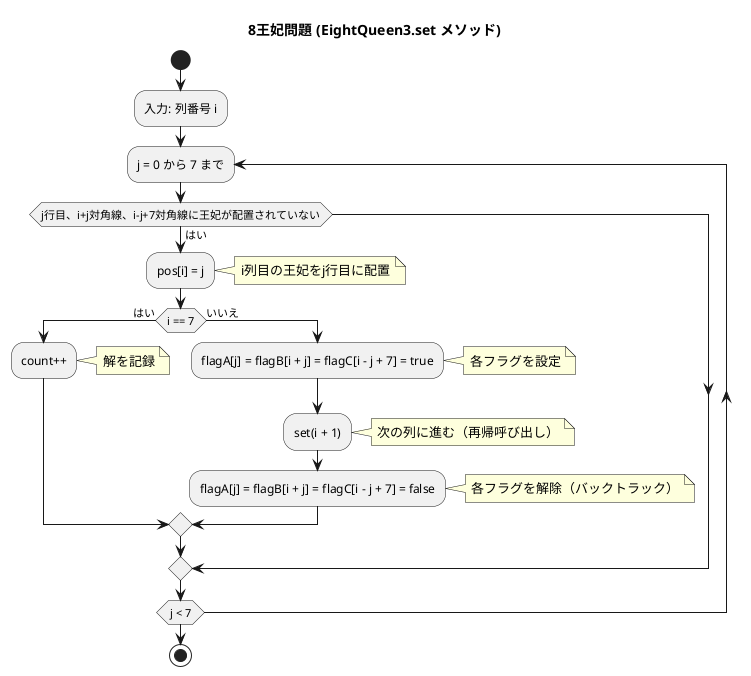

# 第 5 章 再帰アルゴリズム

## はじめに

前章ではスタックとキューというデータ構造を学びました。この章では「**再帰（Recursion）**」というアルゴリズム設計手法を TDD で実装します。

再帰とは、**ある関数が自分自身を呼び出す**ことで問題を解く手法です。大きな問題を同じ構造の小さな問題に分解し、最終的に自明な基底ケースに到達したら戻り始めます。

再帰は、多くの複雑な問題を簡潔かつエレガントに解決できる強力なツールですが、理解するのが難しい概念でもあります。この章では、テスト駆動開発の手法を用いて、再帰の基本から応用までを段階的に学んでいきます。

再帰アルゴリズムは、一般的に以下の 2 つの部分から構成されます：

1. **基底部（base case）**: 再帰呼び出しを終了する条件
2. **再帰部（recursive case）**: 問題を小さくして自分自身を呼び出す部分

### 目次

1. [階乗](#1-階乗)
2. [最大公約数（ユークリッドの互除法）](#2-最大公約数ユークリッドの互除法)
3. [再帰的な合計](#3-再帰的な合計)
4. [ハノイの塔](#4-ハノイの塔)
5. [迷路探索（バックトラッキング）](#5-迷路探索バックトラッキング)
6. [8 王妃問題](#6-8-王妃問題)

---

## 1. 階乗

`n! = n x (n-1) x ... x 1` を再帰で実装します。

### Red — 失敗するテストを書く

```typescript
// tests/recursion.test.ts
import { factorial } from '../src/algorithm/recursion';

describe('階乗', () => {
  test('factorial(0) === 1', () => {
    expect(factorial(0)).toBe(1);
  });

  test('factorial(5) === 120', () => {
    expect(factorial(5)).toBe(120);
  });

  test('factorial(10) === 3628800', () => {
    expect(factorial(10)).toBe(3628800);
  });
});
```

### Green — テストを通す最小限の実装

```typescript
// src/algorithm/recursion.ts
export function factorial(n: number): number {
  if (n <= 0) return 1;           // 基底ケース
  return n * factorial(n - 1);   // 再帰ケース
}
```

再帰の 2 要素: **基底ケース**（終了条件 `n <= 0` のとき 1 を返す）と **再帰ケース**（`n * factorial(n - 1)` で自己呼び出し）。

### アルゴリズムの考え方

#### フローチャート



アルゴリズムの流れ：
1. 非負の整数 n を入力として受け取ります
2. n が 0 より大きいかどうかを判定します
   - n > 0 の場合：n と factorial(n - 1) の積を返します（再帰呼び出し）
   - n = 0 の場合：1 を返します（基底部）

再帰アルゴリズムでは、問題を「より小さな同じ問題」に分割して解きます。階乗の場合、n! = n x (n-1)! という関係を利用しています。再帰の終了条件（基底部）は n = 0 の場合で、0! = 1 と定義されています。

#### 再帰呼び出しの展開



**計算量**: O(n)（n 回の再帰呼び出し）

---

## 2. 最大公約数（ユークリッドの互除法）

`gcd(a, b) = gcd(b, a % b)` という関係を再帰で実装します。

### Red — 失敗するテストを書く

```typescript
import { gcd } from '../src/algorithm/recursion';

describe('最大公約数', () => {
  test('gcd(22, 8) === 2', () => {
    expect(gcd(22, 8)).toBe(2);
  });

  test('gcd(12, 4) === 4', () => {
    expect(gcd(12, 4)).toBe(4);
  });

  test('互いに素: gcd(7, 11) === 1', () => {
    expect(gcd(7, 11)).toBe(1);
  });
});
```

### Green — テストを通す最小限の実装

```typescript
export function gcd(x: number, y: number): number {
  if (y === 0) return x;       // 基底ケース
  return gcd(y, x % y);       // 再帰ケース
}
```

### アルゴリズムの考え方

#### フローチャート



アルゴリズムの流れ：
1. 整数値 x と y を入力として受け取ります
2. y が 0 かどうかを判定します
   - y = 0 の場合：x を返します（基底部）
   - y が 0 でない場合：gcd(y, x % y) を返します（再帰呼び出し）

ユークリッドの互除法は、「2 つの整数の最大公約数は、一方の整数と、もう一方の整数を一方で割った余りの最大公約数に等しい」という性質を利用しています。

例えば、gcd(22, 8) を計算する場合：
1. y = 8 が 0 でないので、gcd(8, 22 % 8) = gcd(8, 6) を計算
2. y = 6 が 0 でないので、gcd(6, 8 % 6) = gcd(6, 2) を計算
3. y = 2 が 0 でないので、gcd(2, 6 % 2) = gcd(2, 0) を計算
4. y = 0 なので、x = 2 を返す

よって、gcd(22, 8) = 2 となります。

**計算量**: O(log min(x, y))

---

## 3. 再帰的な合計

1 から n までの合計を再帰で求めます。

### Red — 失敗するテストを書く

```typescript
import { recursiveSum } from '../src/algorithm/recursion';

describe('再帰的な合計', () => {
  test('recursiveSum(5) === 15', () => {
    expect(recursiveSum(5)).toBe(15);
  });

  test('recursiveSum(10) === 55', () => {
    expect(recursiveSum(10)).toBe(55);
  });
});
```

### Green — テストを通す最小限の実装

```typescript
export function recursiveSum(n: number): number {
  if (n <= 0) return 0;           // 基底ケース
  return n + recursiveSum(n - 1); // 再帰ケース
}
```

#### フローチャート



`recursiveSum(5)` の計算過程：
- recursiveSum(5) = 5 + recursiveSum(4)
- recursiveSum(4) = 4 + recursiveSum(3)
- recursiveSum(3) = 3 + recursiveSum(2)
- recursiveSum(2) = 2 + recursiveSum(1)
- recursiveSum(1) = 1 + recursiveSum(0)
- recursiveSum(0) = 0（基底ケース）
- 戻り: 0 + 1 + 2 + 3 + 4 + 5 = **15**

**計算量**: O(n)

---

## 4. ハノイの塔

n 枚の円盤を A から C へ B を経由して移動する問題です。

```
ルール:
1. 一度に 1 枚しか移動できない
2. 大きい円盤を小さい円盤の上に置けない
```

### Red — 失敗するテストを書く

```typescript
import { hanoi } from '../src/algorithm/recursion';

describe('ハノイの塔', () => {
  test('1 枚: A → C', () => {
    expect(hanoi(1, 'A', 'C', 'B')).toEqual([['A', 'C']]);
  });

  test('2 枚: 3 回の移動', () => {
    expect(hanoi(2, 'A', 'C', 'B')).toEqual([
      ['A', 'B'],
      ['A', 'C'],
      ['B', 'C'],
    ]);
  });

  test('n 枚は 2^n - 1 回の移動', () => {
    for (let n = 1; n <= 6; n++) {
      expect(hanoi(n, 'A', 'C', 'B')).toHaveLength(2 ** n - 1);
    }
  });
});
```

### Green — テストを通す最小限の実装

```typescript
export function hanoi(
  n: number,
  src: string,
  dst: string,
  via: string,
): [string, string][] {
  if (n === 1) return [[src, dst]];
  return [
    ...hanoi(n - 1, src, via, dst),
    [src, dst],
    ...hanoi(n - 1, via, dst, src),
  ];
}
```

スプレッド構文 `[...a, b, ...c]` で Python の `moves.extend()` + `moves.append()` を 1 行で表現します。

### アルゴリズムの考え方

#### フローチャート



アルゴリズムの流れ：
1. 円盤の枚数 n、移動元 src、移動先 dst、経由 via を入力として受け取ります
2. n が 1 の場合（基底部）：移動元から移動先へ直接移動します
3. n が 1 より大きい場合：
   - n-1 枚の円盤を移動元から経由先へ移動します（再帰呼び出し）
   - 最大の円盤を移動元から移動先へ移動します
   - n-1 枚の円盤を経由先から移動先へ移動します（再帰呼び出し）

例えば、3 枚の円盤を A から C へ移動する場合（hanoi(3, 'A', 'C', 'B')）：
1. まず、上の 2 枚の円盤を A から B に移動します（hanoi(2, 'A', 'B', 'C')）
   - 上の 1 枚の円盤を A から C に移動し
   - 2 枚目の円盤を A から B に移動し
   - 上の 1 枚の円盤を C から B に移動する
2. 次に、3 枚目（最大）の円盤を A から C に移動します
3. 最後に、上の 2 枚の円盤を B から C に移動します（hanoi(2, 'B', 'C', 'A')）
   - 上の 1 枚の円盤を B から A に移動し
   - 2 枚目の円盤を B から C に移動し
   - 上の 1 枚の円盤を A から C に移動する

**計算量**: O(2^n)（移動回数 2^n - 1 回）

---

## 5. 迷路探索（バックトラッキング）

再帰的バックトラッキングで迷路を解きます。行き止まりに達したら戻り、別の経路を試みます。

### Red — 失敗するテストを書く

```typescript
import { mazeSolve } from '../src/algorithm/recursion';

describe('迷路探索', () => {
  test('到達可能な迷路', () => {
    const maze = [
      [1, 1, 1, 1, 1],
      [1, 0, 0, 0, 1],
      [1, 0, 1, 0, 1],
      [1, 0, 0, 0, 1],
      [1, 1, 1, 1, 1],
    ];
    expect(mazeSolve(maze, 1, 1, 3, 3)).toBe(true);
  });
});
```

迷路は 2 次元配列で表現し、0 が通路、1 が壁です。(1,1) から (3,3) まで到達可能かを判定します。

### Green — テストを通す最小限の実装

```typescript
export function mazeSolve(
  maze: number[][],
  row: number,
  col: number,
  goalRow: number,
  goalCol: number,
  visited: Set<string> = new Set(),
): boolean {
  if (row === goalRow && col === goalCol) return true;
  visited.add(`${row},${col}`);
  for (const [dr, dc] of [[-1, 0], [1, 0], [0, -1], [0, 1]]) {
    const nr = row + dr;
    const nc = col + dc;
    if (
      nr >= 0 && nr < maze.length &&
      nc >= 0 && nc < maze[0].length &&
      maze[nr][nc] === 0 &&
      !visited.has(`${nr},${nc}`)
    ) {
      if (mazeSolve(maze, nr, nc, goalRow, goalCol, visited)) return true;
    }
  }
  return false;
}
```

### アルゴリズムの考え方



TypeScript では Python のタプル `(row, col)` の代わりに文字列 `` `${row},${col}` `` を `Set<string>` で管理します。Python では `set[tuple[int, int]]` を使えますが、TypeScript の `Set` はオブジェクトの等値比較ができないため、文字列に変換する必要があります。

**計算量**: O(行数 x 列数)

---

## 6. 8 王妃問題

8 王妃問題は、8x8 のチェス盤上に 8 個の王妃を互いに攻撃できないように配置する問題です。王妃は、同じ行、同じ列、または同じ対角線上にある他の王妃を攻撃できます。

### 3 バージョンの比較

段階的に制約を追加して、効率を改善していきます。

| クラス | 制約 | 探索範囲 | 解の数 |
|--------|------|---------|--------|
| `EightQueen` | なし | 8^8 = 16,777,216 | 全組み合わせ |
| `EightQueen2` | 行の重複なし | 8! = 40,320 | 行制約 |
| `EightQueen3` | 行・対角線の重複なし | 大幅に削減 | **92** |

### Red — 失敗するテストを書く

```typescript
import { EightQueen, EightQueen2, EightQueen3 } from '../src/algorithm/recursion';

describe('8 王妃問題', () => {
  test('EightQueen: 解の個数 92', () => {
    const eq = new EightQueen(8);
    expect(eq.solve()).toBe(92);
  });

  test('EightQueen2: 解の個数 92（行重複排除）', () => {
    const eq = new EightQueen2(8);
    expect(eq.solve()).toBe(92);
  });

  test('EightQueen3: 解の個数 92（完全なバックトラッキング）', () => {
    const eq = new EightQueen3(8);
    expect(eq.solve()).toBe(92);
  });
});
```

### Green — テストを通す最小限の実装

#### EightQueen: 全組み合わせの列挙

各列に 1 個の王妃を配置する全組み合わせを列挙し、有効な解のみをカウントします。

```typescript
export class EightQueen {
  private pos: number[];
  private count: number = 0;

  constructor(private n: number) {
    this.pos = new Array(n).fill(0);
  }

  solve(): number {
    this.count = 0;
    this.set(0);
    return this.count;
  }

  private set(i: number): void {
    for (let j = 0; j < this.n; j++) {
      this.pos[i] = j;
      if (i === this.n - 1) {
        if (this.isValid()) this.count++;
      } else {
        this.set(i + 1);
      }
    }
  }

  private isValid(): boolean {
    // 行・対角線の重複チェック
    for (let i = 0; i < this.n; i++) {
      for (let j = i + 1; j < this.n; j++) {
        if (this.pos[i] === this.pos[j]) return false;
        if (Math.abs(this.pos[i] - this.pos[j]) === j - i) return false;
      }
    }
    return true;
  }
}
```

#### EightQueen2: 行の重複を排除

行のフラグを使って、同じ行に複数の王妃を配置しないようにします。

```typescript
export class EightQueen2 {
  private pos: number[];
  private flag: boolean[];
  private count: number = 0;

  constructor(private n: number) {
    this.pos = new Array(n).fill(0);
    this.flag = new Array(n).fill(false);
  }

  solve(): number {
    this.count = 0;
    this.set(0);
    return this.count;
  }

  private set(i: number): void {
    for (let j = 0; j < this.n; j++) {
      if (!this.flag[j]) {
        this.pos[i] = j;
        if (i === this.n - 1) {
          if (this.isValidDiagonal()) this.count++;
        } else {
          this.flag[j] = true;
          this.set(i + 1);
          this.flag[j] = false;  // バックトラック
        }
      }
    }
  }

  private isValidDiagonal(): boolean {
    for (let i = 0; i < this.n; i++) {
      for (let j = i + 1; j < this.n; j++) {
        if (Math.abs(this.pos[i] - this.pos[j]) === j - i) return false;
      }
    }
    return true;
  }
}
```

#### EightQueen3: 完全なバックトラッキング

行・列・両方向の対角線の制約をすべてチェックし、矛盾が生じた時点で枝刈りします。

```typescript
export class EightQueen3 {
  private pos: number[];
  private flagA: boolean[];  // 各行のフラグ
  private flagB: boolean[];  // 右上がり対角線のフラグ
  private flagC: boolean[];  // 右下がり対角線のフラグ
  private count: number = 0;

  constructor(private n: number) {
    this.pos = new Array(n).fill(0);
    this.flagA = new Array(n).fill(false);
    this.flagB = new Array(2 * n - 1).fill(false);
    this.flagC = new Array(2 * n - 1).fill(false);
  }

  solve(): number {
    this.count = 0;
    this.set(0);
    return this.count;
  }

  private set(i: number): void {
    for (let j = 0; j < this.n; j++) {
      if (!this.flagA[j] && !this.flagB[i + j] && !this.flagC[i - j + this.n - 1]) {
        this.pos[i] = j;
        if (i === this.n - 1) {
          this.count++;
        } else {
          this.flagA[j] = this.flagB[i + j] = this.flagC[i - j + this.n - 1] = true;
          this.set(i + 1);
          this.flagA[j] = this.flagB[i + j] = this.flagC[i - j + this.n - 1] = false;
        }
      }
    }
  }
}
```

### アルゴリズムの考え方

#### フローチャート



このアルゴリズムは、バックトラッキング（試行錯誤）と再帰を使って 8 王妃問題を解きます。各列に 1 個の王妃を配置し、行、列、および両方向の対角線上に他の王妃がないことを確認しながら進めます。

矛盾が生じた場合（すべての行に配置できない場合）は、前の列に戻って別の配置を試します。これにより、8 王妃問題の 92 個の解をすべて見つけることができます。

バックトラッキングは、解の候補を少しずつ構築し、候補が解になる見込みがなくなった時点で打ち切る（バックトラックする）効率的な探索手法です。

---

## Python との比較

| 概念 | Python | TypeScript |
|------|--------|-----------|
| タプル返り値 | `list[tuple[str, str]]` | `[string, string][]` |
| リスト連結 | `moves.extend(...); moves.append(...)` | `[...a, b, ...c]` スプレッド構文 |
| set | `visited: set[tuple[int, int]]` | `Set<string>` + `` `${r},${c}` `` |
| 剰余演算 | `x % y` | `x % y`（同じ） |
| 内部クラス | `class EightQueen:` + `self.__pos` | `class EightQueen { private pos }` |
| フラグ配列 | `[False] * 8` | `new Array(8).fill(false)` |
| バックトラック | `self.__flag[j] = False` | `this.flagA[j] = false` |
| `for...else` | ネイティブサポート | ラベル付き continue で代替 |

TypeScript では Python の `set[tuple[int, int]]` の代わりに `Set<string>` を使い、タプルを文字列 `` `${row},${col}` `` に変換して管理します。これは TypeScript の `Set` がオブジェクトの値比較ではなく参照比較を行うためです。

---

## テスト実行結果

```bash
$ npm test tests/recursion.test.ts

PASS tests/recursion.test.ts
  階乗
    ✓ factorial(0) === 1
    ✓ factorial(5) === 120
    ✓ factorial(10) === 3628800
  最大公約数
    ✓ gcd(22, 8) === 2
    ✓ gcd(12, 4) === 4
    ✓ 互いに素: gcd(7, 11) === 1
  再帰的な合計
    ✓ recursiveSum(5) === 15
    ✓ recursiveSum(10) === 55
  ハノイの塔
    ✓ 1 枚: A → C
    ✓ 2 枚: 3 回の移動
    ✓ n 枚は 2^n - 1 回の移動
  迷路探索
    ✓ 到達可能な迷路
  8 王妃問題
    ✓ EightQueen: 解の個数 92
    ✓ EightQueen2: 解の個数 92（行重複排除）
    ✓ EightQueen3: 解の個数 92（完全なバックトラッキング）

Tests: 15 passed, 15 total
```

---

## 再帰アルゴリズムの比較

| アルゴリズム | 関数/クラス | 計算量 | 特徴 |
|-------------|------------|--------|------|
| 階乗 | `factorial` | O(n) | 単純な線形再帰 |
| 最大公約数 | `gcd` | O(log min(x,y)) | 対数的収束 |
| 再帰的合計 | `recursiveSum` | O(n) | 単純な線形再帰 |
| ハノイの塔 | `hanoi` | O(2^n) | 指数的成長 |
| 迷路探索 | `mazeSolve` | O(行数 x 列数) | バックトラッキング |
| 8 王妃（全探索）| `EightQueen` | O(n^n) | 制約なし |
| 8 王妃（行制約）| `EightQueen2` | O(n!) | 行の重複排除 |
| 8 王妃（完全解）| `EightQueen3` | O(n!) | 完全なバックトラッキング |

## まとめ

この章では、再帰アルゴリズムについて学びました：

1. **再帰の基本**：階乗やユークリッドの互除法などの基本的な再帰アルゴリズム。すべての再帰には基底ケースと再帰ケースがあることを確認しました。
2. **再帰的な合計**：1 から n までの合計を再帰で求める方法。
3. **ハノイの塔**：再帰の古典的な応用例。TypeScript のスプレッド構文で Python の `extend` + `append` を 1 行で表現できることを確認しました。
4. **迷路探索**：バックトラッキングによる経路探索。TypeScript では `Set<string>` でタプルの代替を行います。
5. **8 王妃問題**：バックトラッキングと再帰を組み合わせた複雑な問題。制約を段階的に追加することで、探索範囲を大幅に削減できることを確認しました。

再帰は、問題を小さな部分問題に分割して解くための強力なツールです。しかし、深い再帰呼び出しはスタックオーバーフローを引き起こす可能性があるため、必要に応じて非再帰的な実装に変換することも重要です。

テスト駆動開発の手法を用いることで、これらの複雑な再帰アルゴリズムの正確な実装と理解を深めることができました。

## 参考文献

- 『新・明解 Python で学ぶアルゴリズムとデータ構造』 — 柴田望洋
- 『テスト駆動開発』 — Kent Beck
