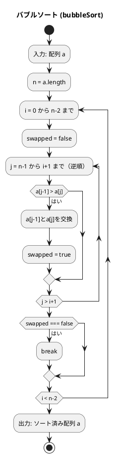
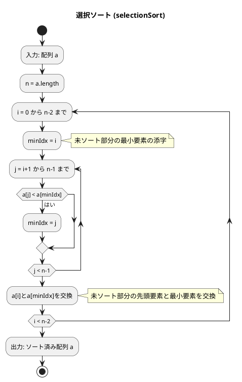
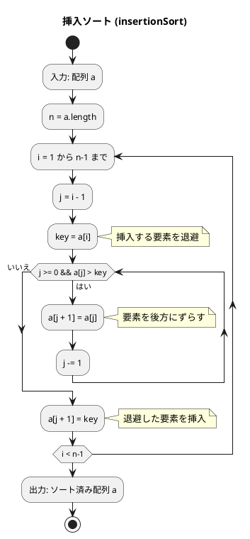
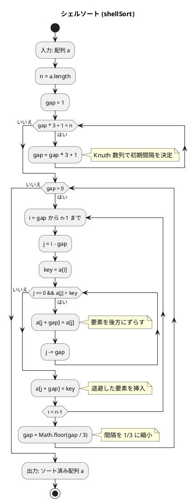
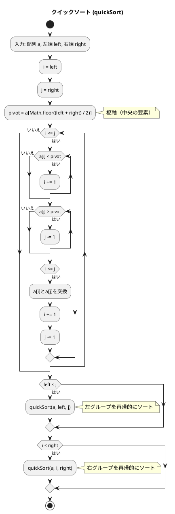
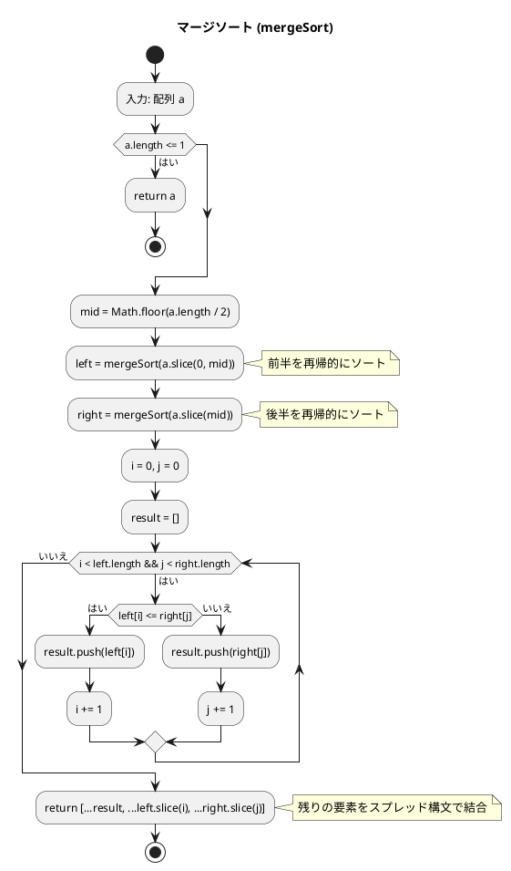
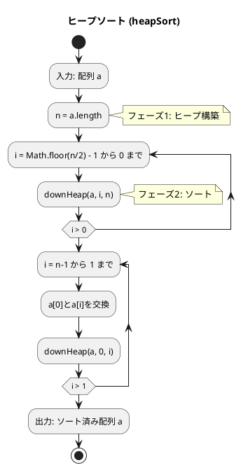

# 第 6 章 ソートアルゴリズム

## はじめに

前章では再帰アルゴリズムを学びました。この章では、データを特定の順序に並べ替える「ソートアルゴリズム」を TDD で実装します。

ソートは、コンピュータサイエンスにおける最も基本的かつ重要な操作の一つです。データが整列されていると、検索や他の操作が効率的に行えるようになります。様々なソートアルゴリズムが存在し、それぞれに長所と短所があります。

この章では、テスト駆動開発の手法を用いて、基本的なソートアルゴリズムから高度なものまで、様々なソート手法を TypeScript で実装していきます。

### 目次

1. [ソートとは](#ソートとは)
2. [バブルソート](#1-バブルソート)
3. [選択ソート](#2-選択ソート)
4. [挿入ソート](#3-挿入ソート)
5. [シェルソート](#4-シェルソート)
6. [クイックソート](#5-クイックソート)
7. [マージソート](#6-マージソート)
8. [ヒープソート](#7-ヒープソート)
9. [度数ソート](#8-度数ソート)

---

## ソートとは

ソートとは、データを特定の順序（通常は昇順または降順）に並べ替える操作です。ソートアルゴリズムは、以下のような特性によって評価されます：

- **時間計算量**: アルゴリズムの実行に必要な時間
- **空間計算量**: アルゴリズムが使用するメモリ量
- **安定性**: 同じ値を持つ要素の相対的な順序が保存されるか
- **適応性**: 既にある程度ソートされているデータに対する効率性

TypeScript では、配列の要素を **分割代入** `[a[i], a[j]] = [a[j], a[i]]` でスワップできます。Python の `a[i], a[j] = a[j], a[i]` と同じ発想ですが、構文が少し異なります。

それでは、具体的なソートアルゴリズムを見ていきましょう。

---

## 1. バブルソート

隣接する要素を比較・交換し、最大値を末尾へ「浮き上がらせる」アルゴリズムです。

### Red — 失敗するテストを書く

```typescript
// tests/sort.test.ts
import { bubbleSort } from '../src/algorithm/sort';

const UNSORTED = [6, 4, 3, 7, 1, 9, 8];
const SORTED = [1, 3, 4, 6, 7, 8, 9];

describe('バブルソート', () => {
  test('ソート', () => {
    const a = [...UNSORTED];
    bubbleSort(a);
    expect(a).toEqual(SORTED);
  });

  test('整列済み', () => {
    const a = [...SORTED];
    bubbleSort(a);
    expect(a).toEqual(SORTED);
  });

  test('重複あり', () => {
    const a = [3, 1, 2, 1, 3];
    bubbleSort(a);
    expect(a).toEqual([1, 1, 2, 3, 3]);
  });
});
```

テストでは、未ソート配列、整列済み配列、重複要素を含む配列の 3 パターンを検証します。`[...UNSORTED]` でスプレッド構文を使い、元の配列を壊さないようにしています。

### Green — テストを通す実装

```typescript
// src/algorithm/sort.ts
export function bubbleSort(a: number[]): void {
  const n = a.length;
  for (let i = 0; i < n - 1; i++) {
    let swapped = false;
    for (let j = n - 1; j > i; j--) {
      if (a[j - 1] > a[j]) {
        [a[j - 1], a[j]] = [a[j], a[j - 1]];
        swapped = true;
      }
    }
    if (!swapped) break; // 交換なし → 整列済み
  }
}
```

TypeScript の **分割代入** `[a, b] = [b, a]` で一時変数不要なスワップを実現します。`swapped` フラグにより、整列済みの場合は早期に打ち切ります。

### フローチャート



アルゴリズムの流れ：
1. 配列 a を入力として受け取ります
2. 変数 n に配列の長さを代入します
3. 0 から n-2 までの各インデックス i について、以下の処理を繰り返します：
   - n-1 から i+1 までの各インデックス j について（逆順に）、以下の処理を繰り返します：
     - a[j-1] が a[j] より大きい場合、a[j-1] と a[j] を交換します
   - 一度も交換が行われなかった場合、ループを中断します（整列済み）
4. ソート済みの配列 a を出力します

各パスが終わるごとに、最大の要素が配列の末尾に移動します。そのため、i 回目のパスでは、配列の末尾の i 個の要素は既にソート済みとなり、次のパスでは考慮する必要がありません。

### シェーカーソート（双方向バブルソート）

シェーカーソート（双方向バブルソート）は、バブルソートの変種で、走査を交互に上向き・下向きに行います。これにより、小さな値が先頭に、大きな値が末尾に同時に移動します。

#### Red — 失敗するテストを書く

```typescript
describe('シェーカーソート', () => {
  test('ソート', () => {
    const a = [...UNSORTED];
    shakerSort(a);
    expect(a).toEqual(SORTED);
  });
});
```

#### Green — テストを通す実装

```typescript
export function shakerSort(a: number[]): void {
  let left = 0;
  let right = a.length - 1;
  let last = right;
  while (left < right) {
    // 下向きの走査（右から左へ）
    for (let j = right; j > left; j--) {
      if (a[j - 1] > a[j]) {
        [a[j - 1], a[j]] = [a[j], a[j - 1]];
        last = j;
      }
    }
    left = last;

    // 上向きの走査（左から右へ）
    for (let j = left; j < right; j++) {
      if (a[j] > a[j + 1]) {
        [a[j], a[j + 1]] = [a[j + 1], a[j]];
        last = j;
      }
    }
    right = last;
  }
}
```

バブルソートが一方向にしか走査しないのに対し、シェーカーソートは双方向に走査することで「亀の要素（小さいが末尾寄りにある要素）」の移動を高速化します。

### 解説

**計算量**: 最悪 O(n^2)、最良 O(n)（整列済みの場合、最適化版）

バブルソートは単純で理解しやすいですが、大きなデータセットに対しては非効率です。しかし、データがほぼソート済みの場合は、`swapped` フラグによる打ち切り最適化が効率的に動作します。

---

## 2. 選択ソート

未整列部分の最小値を探し、先頭と交換するアルゴリズムです。

### Red — 失敗するテストを書く

```typescript
describe('選択ソート', () => {
  test('ソート', () => {
    const a = [...UNSORTED];
    selectionSort(a);
    expect(a).toEqual(SORTED);
  });
});
```

### Green — テストを通す実装

```typescript
export function selectionSort(a: number[]): void {
  const n = a.length;
  for (let i = 0; i < n - 1; i++) {
    let minIdx = i;
    for (let j = i + 1; j < n; j++) {
      if (a[j] < a[minIdx]) minIdx = j;
    }
    if (minIdx !== i) [a[i], a[minIdx]] = [a[minIdx], a[i]];
  }
}
```

### フローチャート



アルゴリズムの流れ：
1. 配列 a を入力として受け取ります
2. 変数 n に配列の長さを代入します
3. 0 から n-2 までの各インデックス i について、以下の処理を繰り返します：
   - minIdx を i に初期化します（未ソート部分の最小要素の添字）
   - i+1 から n-1 までの各インデックス j について、以下の処理を繰り返します：
     - a[j] が a[minIdx] より小さい場合、minIdx を j に更新します
   - a[i] と a[minIdx] を交換します（未ソート部分の先頭要素と最小要素を交換）
4. ソート済みの配列 a を出力します

### 解説

**計算量**: 常に O(n^2)（整列済みでも改善されない）

選択ソートは、バブルソートと同様に単純ですが、交換回数が少ないという利点があります。具体的には、各パスで最大でも 1 回の交換しか行われません。しかし、大きなデータセットに対しては依然として非効率です。また、不安定なソートアルゴリズムです。

---

## 3. 挿入ソート

未整列部分の先頭要素を、整列済み部分の適切な位置に挿入するアルゴリズムです。トランプのカードを手に持って並べ替える操作に似ています。

### Red — 失敗するテストを書く

```typescript
describe('挿入ソート', () => {
  test('ソート', () => {
    const a = [...UNSORTED];
    insertionSort(a);
    expect(a).toEqual(SORTED);
  });
});
```

### Green — テストを通す実装

```typescript
export function insertionSort(a: number[]): void {
  const n = a.length;
  for (let i = 1; i < n; i++) {
    const key = a[i];
    let j = i - 1;
    while (j >= 0 && a[j] > key) {
      a[j + 1] = a[j];
      j--;
    }
    a[j + 1] = key;
  }
}
```

### フローチャート



アルゴリズムの流れ：
1. 配列 a を入力として受け取ります
2. 変数 n に配列の長さを代入します
3. 1 から n-1 までの各インデックス i について、以下の処理を繰り返します：
   - j を i-1 に初期化します
   - key に a[i] を代入します（挿入する要素を退避）
   - j が 0 以上かつ a[j] が key より大きい間、以下の処理を繰り返します：
     - a[j+1] に a[j] を代入します（要素を後方にずらす）
     - j を 1 減らします
   - a[j+1] に key を代入します（退避した要素を挿入）
4. ソート済みの配列 a を出力します

### 解説

**計算量**: 最悪 O(n^2)、最良 O(n)（整列済みの場合）

挿入ソートは、小さなデータセットや、ほぼソート済みのデータに対して効率的です。また、安定なソートアルゴリズムであり、オンラインアルゴリズム（データが逐次的に到着する場合に適用可能）としても使用できます。

---

## 4. シェルソート

挿入ソートの改良版。間隔（gap）を縮小しながら複数回の挿入ソートを行います。離れた要素同士を先に比較・交換することで、大きな値を素早く後方に、小さな値を素早く前方に移動させることができます。Knuth 数列 `(1, 4, 13, 40, ...)` で gap を生成します。

### Red — 失敗するテストを書く

```typescript
describe('シェルソート', () => {
  test('100要素のランダム配列', () => {
    const a = Array.from({ length: 100 }, (_, i) => i).sort(() => Math.random() - 0.5);
    shellSort(a);
    expect(a).toEqual([...Array(100).keys()]);
  });
});
```

100 要素のランダム配列でテストすることで、小さな配列では見つかりにくいバグも検出できます。

### Green — テストを通す実装

```typescript
export function shellSort(a: number[]): void {
  const n = a.length;
  let gap = 1;
  while (gap * 3 + 1 < n) gap = gap * 3 + 1; // Knuth 数列: 1, 4, 13, 40, ...

  while (gap > 0) {
    for (let i = gap; i < n; i++) {
      const key = a[i];
      let j = i - gap;
      while (j >= 0 && a[j] > key) {
        a[j + gap] = a[j];
        j -= gap;
      }
      a[j + gap] = key;
    }
    gap = Math.floor(gap / 3);
  }
}
```

Python では `gap //= 3` と書ける整数除算を、TypeScript では `Math.floor(gap / 3)` と記述します。TypeScript の `/` 演算子は常に浮動小数点除算を行うため、`Math.floor` で明示的に切り捨てる必要があります。

### フローチャート



アルゴリズムの流れ：
1. 配列 a を入力として受け取ります
2. 変数 n に配列の長さを代入します
3. Knuth 数列で初期間隔 gap を決定します
4. gap が 0 より大きい間、以下の処理を繰り返します：
   - gap から n-1 までの各インデックス i について、gap 間隔の挿入ソートを実行します
   - gap を 1/3 に縮小します
5. ソート済みの配列 a を出力します

最初は大きな間隔で要素を比較し、徐々に間隔を小さくしていきます。最終的に間隔が 1 になると、通常の挿入ソートと同じ処理になりますが、その時点で配列はほぼソートされているため、効率的に動作します。

### 解説

**計算量**: O(n^(3/2)) ~ O(n log^2 n)（gap 数列に依存）

シェルソートの時間計算量は、間隔列の選び方によって異なります：
- 最良の場合：O(n log n)
- 最悪の場合：O(n^2)（単純な間隔列の場合）
- 平均の場合：O(n^1.25)（Knuth の間隔列の場合）

シェルソートは、挿入ソートの欠点（小さな値が配列の後方にある場合の非効率性）を克服するために設計されました。

---

## 5. クイックソート

ピボットを基準に配列を 2 分割し、再帰的にソートします。「分割統治法」に基づく効率的なソートアルゴリズムで、実用的に最も高速なアルゴリズムの一つです。

### Red — 失敗するテストを書く

```typescript
describe('クイックソート', () => {
  test('ソート', () => {
    const a = [...UNSORTED];
    quickSort(a);
    expect(a).toEqual(SORTED);
  });

  test('200要素のランダム配列', () => {
    const a = Array.from({ length: 200 }, (_, i) => i).sort(() => Math.random() - 0.5);
    quickSort(a);
    expect(a).toEqual([...Array(200).keys()]);
  });
});
```

200 要素のランダム配列テストで、再帰の深さやエッジケースも検証します。

### Green — テストを通す実装

```typescript
export function quickSort(
  a: number[],
  left: number = 0,
  right: number = a.length - 1,
): void {
  if (left >= right) return;

  const pivot = a[Math.floor((left + right) / 2)];
  let i = left;
  let j = right;

  while (i <= j) {
    while (a[i] < pivot) i++;
    while (a[j] > pivot) j--;
    if (i <= j) {
      [a[i], a[j]] = [a[j], a[i]];
      i++;
      j--;
    }
  }
  quickSort(a, left, j);
  quickSort(a, i, right);
}
```

Python では `(left + right) // 2` と書ける整数除算を、TypeScript では `Math.floor((left + right) / 2)` と記述します。デフォルト引数 `left = 0, right = a.length - 1` により、呼び出し側は `quickSort(a)` と簡潔に書けます。

### フローチャート



アルゴリズムの流れ：
1. 配列 a、左端 left、右端 right を入力として受け取ります
2. 左カーソル i を left に、右カーソル j を right に初期化します
3. 枢軸 pivot を a[Math.floor((left + right) / 2)]（中央の要素）に設定します
4. i が j 以下である間、以下の処理を繰り返します：
   - a[i] が pivot より小さい間、i を 1 増やします
   - a[j] が pivot より大きい間、j を 1 減らします
   - i が j 以下の場合、a[i] と a[j] を交換し、i と j を更新します
5. 左グループ（left から j まで）と右グループ（i から right まで）を再帰的にソートします

### 解説

**計算量**: 平均 O(n log n)、最悪 O(n^2)

クイックソートは、平均的には非常に効率的なアルゴリズムですが、最悪の場合（既にソート済みの配列や、すべての要素が同じ値の配列）では効率が悪くなることがあります。また、不安定なソートアルゴリズムです。しかし、適切な枢軸選択や小さな配列に対する挿入ソートへの切り替えなどの最適化により、実用的には非常に高速に動作します。

---

## 6. マージソート

配列を半分に分割し、再帰的にソートして結合します。「分割統治法」に基づくもう一つの効率的なソートアルゴリズムです。

### Red — 失敗するテストを書く

```typescript
describe('マージソート', () => {
  test('ソート', () => {
    expect(mergeSort([...UNSORTED])).toEqual(SORTED);
  });

  test('空配列', () => {
    expect(mergeSort([])).toEqual([]);
  });
});
```

マージソートは新しい配列を返す関数なので、戻り値を `expect` で検証します。空配列のテストも含めて境界条件を確認します。

### Green — テストを通す実装

```typescript
export function mergeSort(a: number[]): number[] {
  if (a.length <= 1) return a;
  const mid = Math.floor(a.length / 2);
  return merge(mergeSort(a.slice(0, mid)), mergeSort(a.slice(mid)));
}

function merge(left: number[], right: number[]): number[] {
  const result: number[] = [];
  let i = 0;
  let j = 0;
  while (i < left.length && j < right.length) {
    if (left[i] <= right[j]) result.push(left[i++]);
    else result.push(right[j++]);
  }
  return [...result, ...left.slice(i), ...right.slice(j)];
}
```

TypeScript のスプレッド構文 `[...result, ...left.slice(i), ...right.slice(j)]` は、Python の `result + left[i:] + right[j:]` に相当します。`a.slice(mid)` は Python の `a[mid:]` に対応するスライス操作です。

### フローチャート



アルゴリズムの流れ：
1. 配列 a を入力として受け取ります
2. a の長さが 1 以下なら、そのまま返します（基底条件）
3. mid を配列の中央位置に設定します
4. 前半部分（0 から mid まで）を再帰的にソートします
5. 後半部分（mid から末尾まで）を再帰的にソートします
6. 前半部分と後半部分をマージします：
   - left[i] と right[j] を比較し、小さい方を result に追加します
   - 残った要素をスプレッド構文で結合して返します

### 解説

**計算量**: 常に O(n log n)

マージソートは、どのような入力に対しても安定した性能を発揮する安定なソートアルゴリズムです。しかし、追加のメモリ空間（作業用配列）が必要であるという欠点があります。TypeScript では `slice` でサブ配列を作成するため、in-place ではありません。

---

## 7. ヒープソート

最大ヒープを構築し、根（最大値）を末尾と交換しながらソートします。ヒープは、親ノードが子ノードよりも大きいという性質を持つ完全二分木です。

### Red — 失敗するテストを書く

```typescript
describe('ヒープソート', () => {
  test('ソート', () => {
    const a = [...UNSORTED];
    heapSort(a);
    expect(a).toEqual(SORTED);
  });
});
```

### Green — テストを通す実装

```typescript
export function heapSort(a: number[]): void {
  const n = a.length;

  // ヒープ構築
  for (let i = Math.floor(n / 2) - 1; i >= 0; i--) {
    downHeap(a, i, n);
  }

  // ヒープの最大要素と未ソート部末尾要素を交換
  for (let i = n - 1; i > 0; i--) {
    [a[0], a[i]] = [a[i], a[0]];
    downHeap(a, 0, i);
  }
}

function downHeap(a: number[], k: number, n: number): void {
  let parent = k;
  while (true) {
    let child = 2 * parent + 1;
    if (child >= n) break;
    if (child + 1 < n && a[child] < a[child + 1]) child++;
    if (a[parent] >= a[child]) break;
    [a[parent], a[child]] = [a[child], a[parent]];
    parent = child;
  }
}
```

`downHeap` 関数は、指定した位置のノードを下方に移動させてヒープ条件を回復します。配列のインデックスを使って親子関係を表現します：
- 左の子: `2 * parent + 1`
- 右の子: `2 * parent + 2`

### フローチャート



### 解説

**計算量**: 常に O(n log n)

ヒープソートは、どのような入力に対しても安定した性能を発揮し、追加のメモリ空間を必要としないという利点があります。しかし、不安定なソートアルゴリズムであり、キャッシュ効率が悪いという欠点もあります。

---

## 8. 度数ソート（計数ソート）

度数ソート（カウンティングソート）は、要素の値の範囲が限られている場合に効率的なソートアルゴリズムです。各値の出現回数をカウントし、それに基づいてソートを行います。

### Red — 失敗するテストを書く

```typescript
describe('度数ソート', () => {
  test('ソート', () => {
    expect(countingSort([4, 3, 0, 2, 1, 4, 2])).toEqual([0, 1, 2, 2, 3, 4, 4]);
  });
});
```

### Green — テストを通す実装

```typescript
export function countingSort(a: number[]): number[] {
  if (a.length === 0) return [];
  const max = Math.max(...a);
  const count = new Array(max + 1).fill(0);
  for (const v of a) count[v]++;
  const result: number[] = [];
  for (let i = 0; i <= max; i++) {
    for (let j = 0; j < count[i]; j++) {
      result.push(i);
    }
  }
  return result;
}
```

`Math.max(...a)` でスプレッド構文を使って配列の最大値を取得します。Python の `max(a)` に相当します。`new Array(max + 1).fill(0)` で、すべての要素が 0 の配列を生成します。

### 解説

**計算量**: O(n + k)（n は要素数、k は値の範囲）

度数ソートは、値の範囲が小さい場合に非常に効率的ですが、値の範囲が大きい場合はメモリ使用量が増大するという欠点があります。比較に基づかないソートアルゴリズムであり、安定性を持ちます。

---

## テスト実行結果

```bash
$ npm test tests/sort.test.ts

 PASS  tests/sort.test.ts
  バブルソート
    ✓ ソート
    ✓ 整列済み
    ✓ 重複あり
  シェーカーソート
    ✓ ソート
  選択ソート
    ✓ ソート
  挿入ソート
    ✓ ソート
  シェルソート
    ✓ 100要素のランダム配列
  クイックソート
    ✓ ソート
    ✓ 200要素のランダム配列
  マージソート
    ✓ ソート
    ✓ 空配列
  ヒープソート
    ✓ ソート
  度数ソート
    ✓ ソート

Tests:  13 passed, 13 total
```

---

## ソートアルゴリズムの比較

| アルゴリズム | 平均計算量 | 最悪計算量 | 安定 | in-place |
|------------|-----------|-----------|------|---------|
| バブルソート | O(n^2) | O(n^2) | ✓ | ✓ |
| シェーカーソート | O(n^2) | O(n^2) | ✓ | ✓ |
| 選択ソート | O(n^2) | O(n^2) | ✗ | ✓ |
| 挿入ソート | O(n^2) | O(n^2) | ✓ | ✓ |
| シェルソート | O(n^1.5) | O(n^2) | ✗ | ✓ |
| クイックソート | O(n log n) | O(n^2) | ✗ | ✓ |
| マージソート | O(n log n) | O(n log n) | ✓ | ✗ |
| ヒープソート | O(n log n) | O(n log n) | ✗ | ✓ |
| 度数ソート | O(n + k) | O(n + k) | ✓ | ✗ |

---

## Python との比較

| 概念 | Python | TypeScript |
|------|--------|-----------|
| 分割代入 | `a[i], a[j] = a[j], a[i]` | `[a[i], a[j]] = [a[j], a[i]]` |
| 整数除算 | `(l + r) // 2` | `Math.floor((l + r) / 2)` |
| 配列結合 | `left + right` | `[...left, ...right]` |
| スライス | `a[mid:]` | `a.slice(mid)` |
| 配列の最大値 | `max(a)` | `Math.max(...a)` |
| 配列の初期化 | `[0] * n` | `new Array(n).fill(0)` |
| 範囲ループ | `for i in range(n):` | `for (let i = 0; i < n; i++)` |
| 逆順ループ | `for j in range(n-1, i, -1):` | `for (let j = n-1; j > i; j--)` |
| デフォルト引数 | `def f(a, left=0):` | `function f(a, left = 0):` |

---

## まとめ

この章では、様々なソートアルゴリズムについて学びました：

1. **バブルソート** — 隣接する要素を比較・交換する単純なアルゴリズム
2. **シェーカーソート** — バブルソートの双方向走査版
3. **選択ソート** — 未ソート部分から最小要素を選択するアルゴリズム
4. **挿入ソート** — ソート済み部分に要素を挿入するアルゴリズム
5. **シェルソート** — 挿入ソートを改良したアルゴリズム
6. **クイックソート** — 分割統治法に基づく高速なアルゴリズム
7. **マージソート** — 分割統治法に基づく安定なアルゴリズム
8. **ヒープソート** — ヒープデータ構造を利用するアルゴリズム
9. **度数ソート** — 要素の値の範囲が限られている場合に効率的なアルゴリズム

各アルゴリズムには長所と短所があり、データの特性や要件に応じて適切なアルゴリズムを選択することが重要です。

テスト駆動開発の手法を用いることで、これらの複雑なソートアルゴリズムの正確な実装と理解を深めることができました。

次の章では、文字列処理について学んでいきましょう。

## 参考文献

- 『新・明解 Python で学ぶアルゴリズムとデータ構造』 — 柴田望洋
- 『テスト駆動開発』 — Kent Beck
