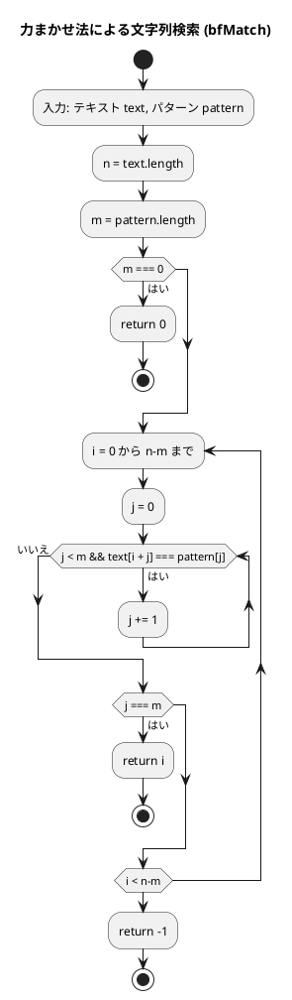
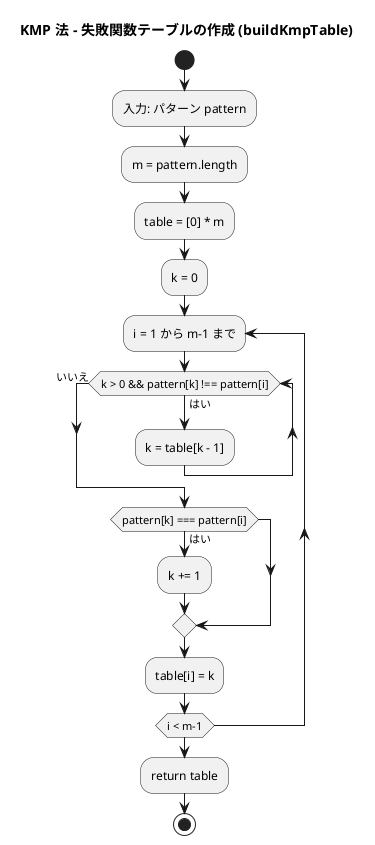
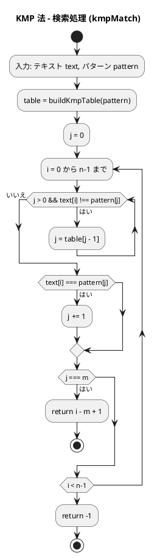
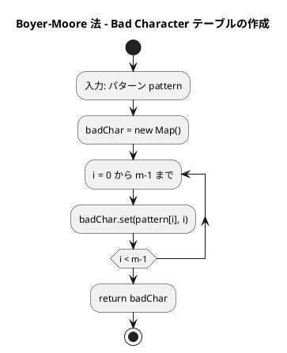
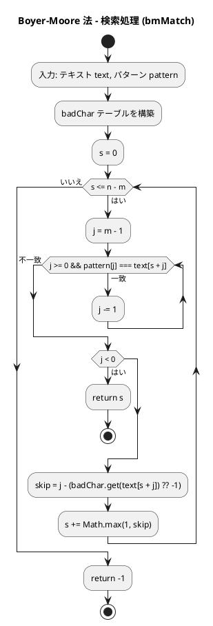

# 第 7 章 文字列処理

## はじめに

前章ではソートアルゴリズムを学びました。この章では、プログラミングにおいて非常に重要な「文字列処理」について TDD で実装します。

文字列処理は、テキストデータの操作や解析に欠かせない技術です。特に、テキスト検索、パターンマッチング、データ抽出などの処理は、多くのアプリケーションで必要とされます。

この章では、まず TypeScript における基本的な文字列操作について学び、その後、テスト駆動開発の手法を用いて、効率的な文字列検索アルゴリズムを実装していきます。

### 目次

1. [TypeScript の文字列基本操作](#typescript-の文字列基本操作)
2. [ブルートフォース文字列探索（力まかせ法）](#1-ブルートフォース文字列探索)
3. [KMP 法](#2-kmpknuth-morris-pratt法)
4. [Boyer-Moore 法](#3-boyer-moore-法)
5. [文字カウント・逆順・回文判定](#4-文字カウント逆順回文判定)

---

## TypeScript の文字列基本操作

TypeScript では、文字列は不変（immutable）なプリミティブ型です。Python と同様に、一度作成した文字列を変更することはできません。文字列を操作するための豊富なメソッドが用意されています。

### 文字列の生成と基本操作

```typescript
// 文字列の生成
const s1 = "Hello";
const s2 = 'World';
const s3 = `This is a
multiline string`; // テンプレートリテラル

// 文字列の連結
const s = s1 + " " + s2; // "Hello World"

// テンプレートリテラルによる埋め込み
const name = "Alice";
const age = 30;
const greeting = `Name: ${name}, Age: ${age}`; // "Name: Alice, Age: 30"

// 文字列の長さ
const length = s1.length; // 5

// 文字へのアクセス
const firstChar = s1[0];       // "H"
const lastChar = s1[s1.length - 1]; // "o" （Python の s1[-1] に相当）

// 部分文字列
const substring = s1.slice(1, 4); // "ell" （Python の s1[1:4] に相当）
```

### 文字列のメソッド

TypeScript の文字列には、多くの便利なメソッドが用意されています：

```typescript
const s = "Hello, World!";

// 検索
const pos1 = s.indexOf("World");  // 7
const pos2 = s.indexOf("Python"); // -1（見つからない場合）

// 置換
const newS = s.replace("World", "TypeScript"); // "Hello, TypeScript!"

// 分割
const parts = s.split(", "); // ["Hello", "World!"]

// 結合
const joined = ["Hello", "World"].join(", "); // "Hello, World"

// 大文字・小文字変換
const upper = s.toUpperCase(); // "HELLO, WORLD!"
const lower = s.toLowerCase(); // "hello, world!"

// 先頭・末尾の処理
const stripped = "  Hello  ".trim();     // "Hello"
const starts = s.startsWith("Hello");    // true
const ends = s.endsWith("World!");       // true

// 文字コード
const code = "A".charCodeAt(0); // 65 （Python の ord('A') に相当）
const char = String.fromCharCode(65); // "A" （Python の chr(65) に相当）
```

### Python との文字列操作の対応

| 操作 | Python | TypeScript |
|------|--------|-----------|
| 文字列逆順 | `s[::-1]` | `s.split('').reverse().join('')` |
| 文字コード取得 | `ord(c)` | `c.charCodeAt(0)` |
| コードから文字 | `chr(n)` | `String.fromCharCode(n)` |
| 検索 | `s.find(sub)` | `s.indexOf(sub)` |
| テンプレート | `f"Name: {name}"` | `` `Name: ${name}` `` |
| 不変性 | immutable | immutable |

これらの基本的な文字列操作を理解した上で、より高度な文字列検索アルゴリズムを見ていきましょう。

---

## 1. ブルートフォース文字列探索

テキストを左から順にパターンと比較する最もシンプルな方法です。

### Red — 失敗するテストを書く

```typescript
// tests/strings.test.ts
import { bfMatch } from '../src/algorithm/strings';

describe('ブルートフォース文字列探索', () => {
  test('見つかる', () => {
    expect(bfMatch('ABCXDEZCABACABAB', 'ABAB')).toBe(12);
  });

  test('先頭で見つかる', () => {
    expect(bfMatch('ABCDE', 'ABC')).toBe(0);
  });

  test('見つからない', () => {
    expect(bfMatch('ABCDE', 'XYZ')).toBe(-1);
  });

  test('空パターン', () => {
    expect(bfMatch('ABCDE', '')).toBe(0);
  });
});
```

テストでは、パターンが見つかるケース、先頭で見つかるケース、見つからないケース、空パターンの 4 つの境界条件を検証します。

### Green — テストを通す実装

```typescript
// src/algorithm/strings.ts
export function bfMatch(text: string, pattern: string): number {
  const n = text.length;
  const m = pattern.length;
  if (m === 0) return 0;
  for (let i = 0; i <= n - m; i++) {
    let j = 0;
    while (j < m && text[i + j] === pattern[j]) j++;
    if (j === m) return i;
  }
  return -1;
}
```

### 解説

力まかせ法（ブルートフォース法）のアルゴリズムは以下の通りです：

1. テキスト内の各位置から順にパターンとの一致を調べる
2. 一致しない文字が見つかったら、テキストのカーソルを 1 つ進めて再度パターンの先頭から比較を始める
3. パターン全体が一致したら、その位置を返す

**計算量**:
- 最良の場合：O(m)（m はパターンの長さ）
- 最悪の場合：O(n * m)（n はテキストの長さ）
- 平均の場合：O(n * m)

力まかせ法は単純で理解しやすいですが、テキストとパターンが長い場合には効率が悪くなります。

### フローチャート



アルゴリズムの流れ：
1. テキスト text とパターン pattern を入力として受け取ります
2. パターンが空文字列の場合は 0 を返します
3. テキスト内の各位置 i について、パターンとの一致を調べます
4. パターン全体が一致したら（j === m）、その位置を返します
5. 全位置を調べても見つからなければ -1 を返します

---

## 2. KMP（Knuth-Morris-Pratt）法

KMP 法は、力まかせ法を改良した効率的な文字列検索アルゴリズムです。失敗関数テーブル（スキップテーブル）を使い、不一致が発生した際にスキップ量を最適化します。パターン内の情報を利用して、不要な比較を省略します。

### Red — 失敗するテストを書く

```typescript
describe('KMP 文字列探索', () => {
  test('見つかる', () => {
    expect(kmpMatch('ABCXDEZCABACABAB', 'ABAB')).toBe(12);
  });

  test('繰り返しパターン', () => {
    expect(kmpMatch('AAABAAAB', 'AAAB')).toBe(0);
  });

  test('見つからない', () => {
    expect(kmpMatch('ABCDE', 'XYZ')).toBe(-1);
  });
});
```

繰り返しパターンのテストは、KMP テーブルが正しく構築されているかを検証するために重要です。

### Green — テストを通す実装

```typescript
function buildKmpTable(pattern: string): number[] {
  const m = pattern.length;
  const table = new Array<number>(m).fill(0);
  let k = 0;
  for (let i = 1; i < m; i++) {
    while (k > 0 && pattern[k] !== pattern[i]) k = table[k - 1];
    if (pattern[k] === pattern[i]) k++;
    table[i] = k;
  }
  return table;
}

export function kmpMatch(text: string, pattern: string): number {
  const n = text.length;
  const m = pattern.length;
  if (m === 0) return 0;

  const table = buildKmpTable(pattern);
  let j = 0;
  for (let i = 0; i < n; i++) {
    while (j > 0 && text[i] !== pattern[j]) j = table[j - 1];
    if (text[i] === pattern[j]) j++;
    if (j === m) return i - m + 1;
  }
  return -1;
}
```

### 解説

KMP 法の核心は、パターン内の情報を利用して「失敗関数テーブル」を作成し、不一致が発生した場合に効率的にカーソルを移動させることです。

失敗関数テーブルは、パターン内の部分文字列が一致する場合に、どこまで戻ればよいかを示します。これにより、すでに比較した文字を再度比較する必要がなくなります。

**計算量**:
- 最良の場合：O(m)（m はパターンの長さ）
- 最悪の場合：O(n + m)（n はテキストの長さ）
- 平均の場合：O(n + m)

### フローチャート

#### 失敗関数テーブルの作成



#### 検索処理



アルゴリズムの流れ：

1. **失敗関数テーブルの作成**:
   - パターン内の部分文字列が一致する場合に、どこまで戻ればよいかを示すテーブルを作成します
   - パターン自身を使って、パターン内の接頭辞と接尾辞の一致を調べます
   - 一致する最長の接頭辞の長さをテーブルに格納します

2. **検索処理**:
   - テキストとパターンを先頭から比較していきます
   - 文字が一致する場合は、j を進めます
   - 不一致が発生した場合は、テーブルを使って j を効率的に移動させます
   - パターン全体が一致したら、その位置を返します

KMP 法の大きな利点は、不一致が発生した場合でも、すでに比較した情報を活用してパターンのカーソルを効率的に移動させることです。時間計算量は O(n + m) となり、テキストとパターンが長い場合に特に効果的です。

---

## 3. Boyer-Moore 法

Boyer-Moore 法は、さらに効率的な文字列検索アルゴリズムです。パターンを右から左へ比較し、不一致が発生した場合に大きくスキップすることで、多くの比較を省略します。

### Red — 失敗するテストを書く

```typescript
describe('Boyer-Moore 文字列探索', () => {
  test('見つかる', () => {
    expect(bmMatch('ABCXDEZCABACABAB', 'ABAB')).toBe(12);
  });

  test('見つからない', () => {
    expect(bmMatch('ABCDE', 'XYZ')).toBe(-1);
  });
});
```

### Green — テストを通す実装

```typescript
export function bmMatch(text: string, pattern: string): number {
  const n = text.length;
  const m = pattern.length;
  if (m === 0) return 0;

  // Bad Character テーブルの構築
  const badChar = new Map<string, number>();
  for (let i = 0; i < m; i++) badChar.set(pattern[i], i);

  let s = 0;
  while (s <= n - m) {
    let j = m - 1;
    while (j >= 0 && pattern[j] === text[s + j]) j--;
    if (j < 0) return s;
    const skip = j - (badChar.get(text[s + j]) ?? -1);
    s += Math.max(1, skip);
  }
  return -1;
}
```

TypeScript の `??` 演算子（Nullish Coalescing）で `Map.get()` のデフォルト値を -1 に設定しています。Python の `dict.get(key, -1)` と同等の機能です。`Map` は Python の `dict` に相当するデータ構造です。

### 解説

Boyer-Moore 法の特徴は以下の通りです：

1. パターンを右から左へ比較する
2. 不一致が発生した場合、Bad Character ルールに基づいてスキップする
   - テキスト内の不一致文字がパターン内に存在する場合、その位置に基づいてスキップ
   - パターン内に存在しない場合、パターン全体をスキップ

**計算量**:
- 最良の場合：O(n / m)（n はテキストの長さ、m はパターンの長さ）
- 最悪の場合：O(n * m)
- 平均の場合：O(n)

### フローチャート

#### Bad Character テーブルの作成



#### 検索処理



アルゴリズムの流れ：

1. **Bad Character テーブルの作成**:
   - 各文字について、パターン内での最後の出現位置を記録します
   - TypeScript では `Map<string, number>` を使用します

2. **検索処理**:
   - パターンを右から左へ比較します（パターンの末尾から開始）
   - 文字が一致する限り、j を左に移動します
   - パターン全体が一致したら（j < 0）、その位置を返します
   - 不一致が発生した場合、Bad Character ルールに基づいてスキップします

Boyer-Moore 法の大きな特徴は、パターンを右から左へ比較することと、不一致が発生した場合に大きくスキップできることです。理想的な状況では、テキストの文字の多くを比較せずに済むため、非常に効率的です。最良の場合、O(n/m) という驚異的な時間計算量を達成できます。

---

## 4. 文字カウント・逆順・回文判定

基本的な文字列操作として、文字のカウント、文字列の逆順、回文判定を実装します。

### Red — 失敗するテストを書く

```typescript
describe('文字のカウント', () => {
  test('文字カウント', () => {
    const r = countChars('hello world');
    expect(r['l']).toBe(3);
    expect(r['o']).toBe(2);
  });
});

describe('文字列の逆順', () => {
  test('逆順', () => {
    expect(reverseString('hello')).toBe('olleh');
  });

  test('回文はそのまま', () => {
    expect(reverseString('racecar')).toBe('racecar');
  });
});

describe('回文判定', () => {
  test('回文', () => {
    expect(isPalindrome('racecar')).toBe(true);
  });

  test('回文でない', () => {
    expect(isPalindrome('hello')).toBe(false);
  });

  test('偶数長の回文', () => {
    expect(isPalindrome('abba')).toBe(true);
  });
});
```

### Green — テストを通す実装

```typescript
export function countChars(s: string): Record<string, number> {
  const result: Record<string, number> = {};
  for (const c of s) result[c] = (result[c] ?? 0) + 1;
  return result;
}

export function reverseString(s: string): string {
  return s.split('').reverse().join('');
}

export function isPalindrome(s: string): boolean {
  return s === reverseString(s);
}
```

### 解説

**文字カウント**: Python の `dict` に対応する TypeScript は `Record<string, number>` です。`??` 演算子（Nullish Coalescing）で、キーが存在しない場合のデフォルト値を 0 に設定しています。Python の `result.get(c, 0)` と同等です。

**文字列の逆順**: Python の `s[::-1]` は TypeScript に存在しないため、`split('').reverse().join('')` で代替します。文字列を文字配列に分割し、反転して再結合するという 3 ステップの処理です。

**回文判定**: 文字列を反転して元の文字列と比較するだけのシンプルな実装です。

---

## テスト実行結果

```bash
$ npm test tests/strings.test.ts

 PASS  tests/strings.test.ts
  ブルートフォース文字列探索
    ✓ 見つかる
    ✓ 先頭で見つかる
    ✓ 見つからない
    ✓ 空パターン
  KMP 文字列探索
    ✓ 見つかる
    ✓ 繰り返しパターン
    ✓ 見つからない
  Boyer-Moore 文字列探索
    ✓ 見つかる
    ✓ 見つからない
  文字のカウント
    ✓ 文字カウント
  文字列の逆順
    ✓ 逆順
    ✓ 回文はそのまま
  回文判定
    ✓ 回文
    ✓ 回文でない
    ✓ 偶数長の回文

Tests:  15 passed, 15 total
```

---

## 文字列探索アルゴリズムの比較

| アルゴリズム | 計算量（平均） | 計算量（最悪） | 特徴 |
|-------------|--------------|--------------|------|
| ブルートフォース | O(n * m) | O(n * m) | シンプル、小規模に有効 |
| KMP 法 | O(n + m) | O(n + m) | 最悪でも線形、前処理が必要 |
| Boyer-Moore 法 | O(n / m) | O(n * m) | 大規模テキストで最速 |

---

## Python との比較

| 概念 | Python | TypeScript |
|------|--------|-----------|
| 文字アクセス | `s[i]` | `s[i]` または `s.charAt(i)` |
| 文字コード | `ord(c)` | `c.charCodeAt(0)` |
| 文字結合 | `"".join(chars)` | `chars.join('')` |
| 辞書 | `dict[str, int]` | `Record<string, number>` |
| 辞書デフォルト値 | `dict.get(key, -1)` | `map.get(key) ?? -1` |
| 文字列逆順 | `s[::-1]` | `s.split('').reverse().join('')` |
| for ループ | `for c in s:` | `for (const c of s)` |
| Map 型 | `dict` | `Map<string, number>` |

---

## まとめ

この章では、TypeScript における文字列処理について学びました：

1. **基本的な文字列操作** — 文字列の生成、連結、テンプレートリテラル、メソッドなど
2. **文字列検索アルゴリズム**：
   - 力まかせ法（ブルートフォース法） — 最も単純な方法
   - KMP 法 — パターン内の情報を利用して効率化
   - Boyer-Moore 法 — 右から左への比較と大きなスキップで効率化
3. **文字列ユーティリティ** — 文字カウント、逆順、回文判定

文字列処理は、テキストデータを扱う多くのアプリケーションで重要な役割を果たします。効率的な文字列検索アルゴリズムを理解することで、大量のテキストデータを効率的に処理することができます。

テスト駆動開発の手法を用いることで、これらの複雑な文字列検索アルゴリズムの正確な実装と理解を深めることができました。

次の章では、リストについて学んでいきましょう。

## 参考文献

- 『新・明解 Python で学ぶアルゴリズムとデータ構造』 — 柴田望洋
- 『テスト駆動開発』 — Kent Beck
