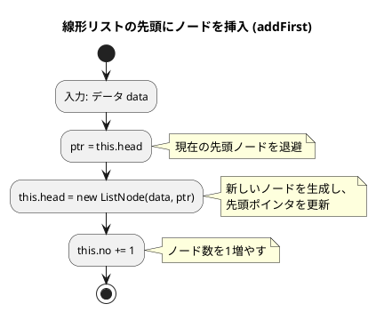
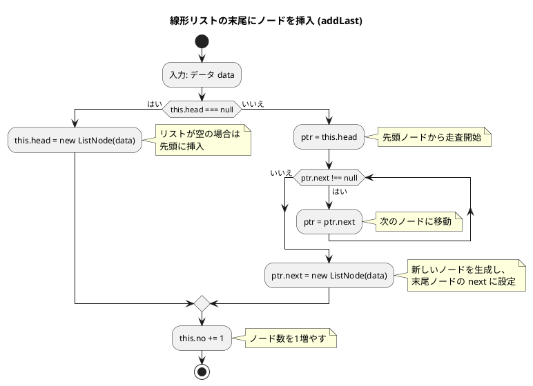
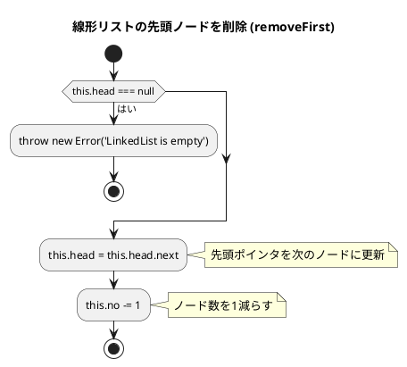
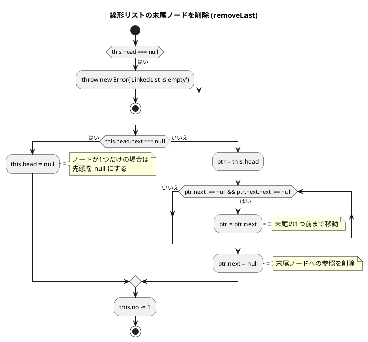
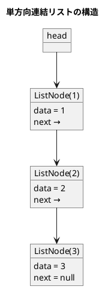
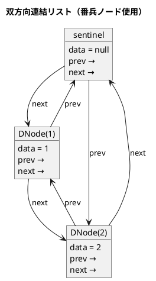
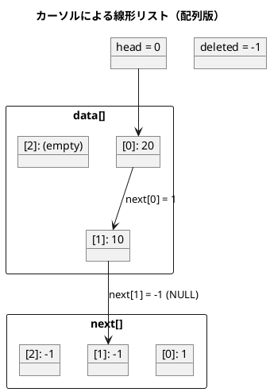

# 第 8 章 リスト（連結リスト）

## はじめに

前章までで、配列や探索アルゴリズム、スタック、キュー、再帰、ソートアルゴリズム、文字列処理などを学んできました。この章では、データ構造の基本である「**リスト（連結リスト）**」を TDD で実装します。

配列と異なり、連結リストはメモリ上に不連続に配置されたノードをポインタで繋ぎます。要素の挿入・削除が O(1) ですが、ランダムアクセスは O(n) です。

### 目次

1. [リストとは](#リストとは)
2. [線形リスト（単方向連結リスト）](#1-線形リスト単方向連結リスト)
3. [双方向連結リスト](#2-双方向連結リスト番兵ノード)
4. [カーソルによる線形リスト（配列版）](#3-カーソルによる線形リスト配列版)

---

## リストとは

リストとは、データを順序付けて格納するデータ構造です。配列と似ていますが、リストは要素の追加や削除が容易であるという特徴があります。

リストには様々な種類があります：

- **線形リスト**：最も基本的なリスト構造で、各要素が一方向に連結されています。
- **連結リスト**：各要素（ノード）が次の要素へのポインタを持つリスト構造です。
- **循環リスト**：最後の要素が最初の要素を指す連結リストです。
- **双方向リスト**：各要素が前後の要素へのポインタを持つリスト構造です。

TypeScript ではジェネリクス `<T>` を使って型安全なリストを実装できます。Python の `Generic[T]` に相当する機能です。

それでは、これらのリスト構造を順に実装していきましょう。

---

## 1. 線形リスト（単方向連結リスト）

各ノードが次のノードへの参照を持ちます。

### Red — 失敗するテストを書く

```typescript
// tests/linked_list.test.ts
import { LinkedList } from '../src/algorithm/linked_list';

describe('線形リスト（単方向連結リスト）', () => {
  let lst: LinkedList<number>;
  beforeEach(() => {
    lst = new LinkedList<number>();
  });

  test('初期状態は空', () => {
    expect(lst.size).toBe(0);
    expect(lst.isEmpty()).toBe(true);
  });

  test('先頭に追加', () => {
    lst.addFirst(1);
    expect(lst.size).toBe(1);
  });

  test('末尾に追加', () => {
    lst.addLast(1);
    lst.addLast(2);
    expect(lst.size).toBe(2);
  });

  test('検索: 見つかる', () => {
    lst.addLast(10);
    lst.addLast(20);
    const node = lst.search(20);
    expect(node?.data).toBe(20);
  });

  test('先頭削除', () => {
    lst.addLast(1);
    lst.addLast(2);
    lst.removeFirst();
    expect(lst.search(1)).toBeNull();
  });

  test('末尾削除', () => {
    lst.addLast(1);
    lst.addLast(2);
    lst.removeLast();
    expect(lst.search(2)).toBeNull();
  });

  test('ノード削除', () => {
    lst.addLast(1);
    lst.addLast(2);
    lst.addLast(3);
    const n = lst.search(2)!;
    lst.remove(n);
    expect(lst.search(2)).toBeNull();
  });

  test('イテレータ', () => {
    lst.addLast(1);
    lst.addLast(2);
    lst.addLast(3);
    expect(lst.toArray()).toEqual([1, 2, 3]);
  });
});
```

`beforeEach` で毎回新しいリストを生成します。TypeScript の `!`（Non-null Assertion Operator）は「この値は null ではない」と型システムに伝えます。Python にはない TypeScript 固有の機能です。

### Green — テストを通す実装

```typescript
// src/algorithm/linked_list.ts
export class ListNode<T> {
  constructor(
    public data: T,
    public next: ListNode<T> | null = null,
  ) {}
}

export class LinkedList<T> {
  private head: ListNode<T> | null = null;
  private no = 0;

  get size(): number {
    return this.no;
  }

  isEmpty(): boolean {
    return this.head === null;
  }

  search(data: T): ListNode<T> | null {
    let ptr = this.head;
    while (ptr !== null) {
      if (ptr.data === data) return ptr;
      ptr = ptr.next;
    }
    return null;
  }

  addFirst(data: T): void {
    this.head = new ListNode<T>(data, this.head);
    this.no++;
  }

  addLast(data: T): void {
    if (this.head === null) {
      this.head = new ListNode<T>(data);
    } else {
      let ptr = this.head;
      while (ptr.next !== null) ptr = ptr.next;
      ptr.next = new ListNode<T>(data);
    }
    this.no++;
  }

  removeFirst(): void {
    if (this.head === null) throw new Error('LinkedList is empty');
    this.head = this.head.next;
    this.no--;
  }

  removeLast(): void {
    if (this.head === null) throw new Error('LinkedList is empty');
    if (this.head.next === null) {
      this.head = null;
    } else {
      let ptr = this.head;
      while (ptr.next !== null && ptr.next.next !== null) ptr = ptr.next;
      ptr.next = null;
    }
    this.no--;
  }

  remove(node: ListNode<T>): void {
    if (this.head === node) {
      this.head = node.next;
      this.no--;
      return;
    }
    let ptr = this.head;
    while (ptr !== null && ptr.next !== node) ptr = ptr.next;
    if (ptr !== null) {
      ptr.next = node.next;
      this.no--;
    }
  }

  toArray(): T[] {
    const r: T[] = [];
    let p = this.head;
    while (p) {
      r.push(p.data);
      p = p.next;
    }
    return r;
  }

  clear(): void {
    this.head = null;
    this.no = 0;
  }

  contains(data: T): boolean {
    return this.search(data) !== null;
  }
}
```

### Refactor — 設計を改善する

テストが通った状態で、コードの意図を明確にします。TypeScript の特徴的なポイントを確認しましょう：

- **ジェネリクス `<T>`**: 型安全なリストを実現します。Python の `Generic[T]` に相当します。
- **`ListNode<T> | null`**: TypeScript の Union 型で、Python の `Optional[T]`（`T | None`）に相当します。
- **`get size()`**: TypeScript のゲッタープロパティで、Python の `__len__` に相当します。
- **`public` コンストラクタ引数**: TypeScript では `constructor(public data: T)` と書くだけで、プロパティの宣言と初期化を同時に行えます。

### フローチャート

#### 先頭にノードを挿入（addFirst）



アルゴリズムの流れ：
1. データ data を入力として受け取ります
2. 新しいノードを生成し、その next を現在の先頭ノードに設定します
3. 先頭ポインタ（this.head）を新しいノードに更新します
4. ノード数（this.no）を 1 増やします

この操作は O(1) で完了します。

#### 末尾にノードを挿入（addLast）



この操作はリストの末尾までたどる必要があるため、O(n) です。

#### 先頭ノードを削除（removeFirst）



この操作は O(1) で完了します。空リストの場合は Error を投げます。

#### 末尾ノードを削除（removeLast）



この操作はリストの末尾の 1 つ前までたどる必要があるため、O(n) です。

### アルゴリズムの考え方



### 解説

線形リストは、各ノードが次のノードへのポインタを持つデータ構造です。この実装では、以下の特徴があります：

1. **ノードクラス**: データと次のノードへのポインタを持ちます。
2. **リストクラス**: 先頭ノードとノードの数を管理します。
3. **要素の追加**: 先頭または末尾に要素を追加できます。
4. **要素の削除**: 先頭、末尾、または指定ノードを削除できます。
5. **要素の探索**: 指定した値を持つノードを探索できます。
6. **配列変換**: `toArray()` でリストの要素を配列として取得できます。

**主な操作の計算量**:

| 操作 | 先頭 | 末尾 | 中間 |
|------|------|------|------|
| 挿入 | O(1) | O(n) | O(n) |
| 削除 | O(1) | O(n) | O(n) |
| 探索 | O(n) | O(n) | O(n) |

---

## 2. 双方向連結リスト（番兵ノード）

各ノードが前後両方のノードへの参照を持ちます。番兵ノード（ダミー）を使い、先頭・末尾の特殊処理を不要にします。循環リストとしても機能し、最後のノードが番兵ノードを経由して先頭ノードに繋がります。

### Red — 失敗するテストを書く

```typescript
import { DoublyLinkedList } from '../src/algorithm/linked_list';

describe('双方向連結リスト', () => {
  let lst: DoublyLinkedList<number>;
  beforeEach(() => {
    lst = new DoublyLinkedList<number>();
  });

  test('先頭に追加', () => {
    lst.addFirst(1);
    expect(lst.size).toBe(1);
  });

  test('末尾に追加', () => {
    lst.addLast(1);
    lst.addLast(2);
    expect(lst.size).toBe(2);
  });

  test('ノード削除', () => {
    lst.addLast(1);
    lst.addLast(2);
    lst.addLast(3);
    const n = lst.search(2)!;
    lst.remove(n);
    expect(lst.search(2)).toBeNull();
  });
});
```

### Green — テストを通す実装

```typescript
class DNode<T> {
  constructor(
    public data: T | null,
    public prev: DNode<T> | null = null,
    public next: DNode<T> | null = null,
  ) {}
}

export class DoublyLinkedList<T> {
  private readonly sentinel: DNode<T>;
  private no = 0;

  constructor() {
    this.sentinel = new DNode<T>(null);
    this.sentinel.prev = this.sentinel;
    this.sentinel.next = this.sentinel;
  }

  get size(): number {
    return this.no;
  }

  isEmpty(): boolean {
    return this.sentinel.next === this.sentinel;
  }

  addFirst(data: T): void {
    const node = new DNode<T>(data, this.sentinel, this.sentinel.next);
    this.sentinel.next!.prev = node;
    this.sentinel.next = node;
    this.no++;
  }

  addLast(data: T): void {
    const node = new DNode<T>(data, this.sentinel.prev, this.sentinel);
    this.sentinel.prev!.next = node;
    this.sentinel.prev = node;
    this.no++;
  }

  search(data: T): DNode<T> | null {
    let ptr = this.sentinel.next;
    while (ptr !== this.sentinel) {
      if (ptr!.data === data) return ptr;
      ptr = ptr!.next;
    }
    return null;
  }

  remove(node: DNode<T>): void {
    if (this.isEmpty()) return;
    node.prev!.next = node.next;
    node.next!.prev = node.prev;
    this.no--;
  }
}
```

### 解説

循環・双方向連結リストは、各ノードが前後のノードへのポインタを持ち、最後のノードが番兵ノードを経由して最初のノードを指すリスト構造です。

番兵ノード（sentinel）を使うことで、先頭・末尾の特殊処理が不要になります。挿入と削除のコードが統一的に書けるのが大きな利点です。



**主な特徴**：
1. **番兵ノード**: 先頭と末尾の特殊処理を不要にし、コードを簡潔にします。
2. **先頭・末尾への追加**: どちらも O(1) です。
3. **ノード削除**: ノードへの参照があれば O(1) で削除できます。
4. **双方向走査**: 前方にも後方にも移動できます。

---

## 3. カーソルによる線形リスト（配列版）

ポインタの代わりに配列の添字（カーソル）でリストを実現します。フリーリスト（削除済みスロット）を再利用します。

### Red — 失敗するテストを書く

```typescript
import { ArrayLinkedList, NULL } from '../src/algorithm/linked_list';

describe('カーソルによるリスト（配列実装）', () => {
  let lst: ArrayLinkedList;
  beforeEach(() => {
    lst = new ArrayLinkedList(100);
  });

  test('先頭に追加', () => {
    lst.addFirst(10);
    expect(lst.search(10)).not.toBe(NULL);
  });

  test('複数追加と検索', () => {
    lst.addFirst(10);
    lst.addFirst(20);
    expect(lst.search(20)).not.toBe(NULL);
  });
});
```

`NULL` 定数（-1）は、配列インデックスにおける「ポインタなし」を表現します。Python の `None` に相当する概念を整数値で代替しています。

### Green — テストを通す実装

```typescript
export const NULL = -1;

class ArrayNode {
  constructor(
    public data: number = 0,
    public next: number = NULL,
    public dnext: number = NULL, // フリーリスト用
  ) {}
}

export class ArrayLinkedList {
  private data: number[];
  private next: number[];
  private head: number;
  private max: number = NULL;
  private deleted: number = NULL;
  private no = 0;

  constructor(capacity: number) {
    this.data = new Array(capacity).fill(0);
    this.next = new Array(capacity).fill(NULL);
    this.head = NULL;
  }

  private getInsertIndex(): number {
    if (this.deleted !== NULL) {
      const rec = this.deleted;
      this.deleted = this.next[rec]; // フリーリストの次
      return rec;
    }
    if (this.max + 1 < this.data.length) {
      this.max++;
      return this.max;
    }
    return NULL;
  }

  addFirst(value: number): void {
    const rec = this.getInsertIndex();
    if (rec !== NULL) {
      this.data[rec] = value;
      this.next[rec] = this.head;
      this.head = rec;
      this.no++;
    }
  }

  search(value: number): number {
    let ptr = this.head;
    while (ptr !== NULL) {
      if (this.data[ptr] === value) return ptr;
      ptr = this.next[ptr];
    }
    return NULL;
  }

  removeFirst(): void {
    if (this.head !== NULL) {
      const ptr = this.head;
      this.head = this.next[ptr];
      this.next[ptr] = this.deleted; // フリーリストに追加
      this.deleted = ptr;
      this.no--;
    }
  }
}
```

### 解説

カーソルによる線形リストは、配列を使って線形リストを実装する方法です。この実装では、以下の特徴があります：

1. **ノード構造**: データ配列と次ポインタ配列を別々に管理します。
2. **フリーリスト**: 削除されたスロットを再利用するための仕組みです。`deleted` が削除済みスロットの先頭を指し、各スロットの `next` がフリーリストの次を指します。
3. **固定容量**: コンストラクタで指定した容量を超えて要素を追加することはできません。



カーソルによる線形リストは、ポインタを使った線形リストと同様の機能を持ちますが、配列を使って実装するため、メモリの使用効率が良いという特徴があります。ガベージコレクションのオーバーヘッドも回避できます。

---

## テスト実行結果

```bash
$ npm test tests/linked_list.test.ts

 PASS  tests/linked_list.test.ts
  線形リスト（単方向連結リスト）
    ✓ 初期状態は空
    ✓ 先頭に追加
    ✓ 末尾に追加
    ✓ 検索: 見つかる
    ✓ 先頭削除
    ✓ 末尾削除
    ✓ ノード削除
    ✓ イテレータ
  双方向連結リスト
    ✓ 先頭に追加
    ✓ 末尾に追加
    ✓ ノード削除
  カーソルによるリスト（配列実装）
    ✓ 先頭に追加
    ✓ 複数追加と検索

Tests:  13 passed, 13 total
```

---

## 配列 vs 連結リスト

| 項目 | 配列 | 連結リスト |
|------|------|-----------|
| ランダムアクセス | O(1) | O(n) |
| 先頭への挿入 | O(n) | O(1) |
| 末尾への挿入 | O(1) | O(1)※単方向は O(n) |
| 途中への挿入 | O(n) | O(1)（ポインタ取得後） |
| メモリ使用 | 連続領域 | 不連続、ポインタ分余分 |

---

## Python との比較

| 概念 | Python | TypeScript |
|------|--------|-----------|
| ノードクラス | `@dataclass class Node` | `class ListNode<T>` |
| null 参照 | `None` | `null` |
| ジェネリクス | `Generic[T]` | `class LinkedList<T>` |
| Optional 型 | `Optional[T]` / `T \| None` | `T \| null` |
| 内部例外クラス | `class Empty(Exception)` | `throw new Error(...)` |
| `__len__` | `def __len__(self)` | `get size()` |
| `__contains__` | `def __contains__(self, x)` | `contains(x)` |
| `__iter__` | `def __iter__(self)` | `toArray()` |
| Non-null 断言 | なし | `node!.data`（`!` 演算子） |
| コンストラクタ引数 | `self.data = data` | `constructor(public data: T)` |

---

## まとめ

この章では、様々なリスト構造について学びました：

1. **線形リスト（単方向連結リスト）**: 各ノードが次のノードへの参照を持つ基本的な連結リスト。ジェネリクス `<T>` で型安全に実装。
2. **双方向連結リスト**: 各ノードが前後のノードへのポインタを持ち、番兵ノードにより先頭・末尾の操作が統一的に行える。
3. **カーソルによる線形リスト（配列版）**: 配列を使った実装。フリーリストでメモリ再利用が可能。

これらのリスト構造は、データを順序付けて格納するための基本的なデータ構造です。用途に応じて適切なリスト構造を選択することが重要です。

次の章では、木構造について学びます。

## 参考文献

- 『新・明解 Python で学ぶアルゴリズムとデータ構造』 — 柴田望洋
- 『テスト駆動開発』 — Kent Beck
