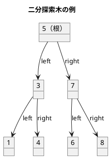
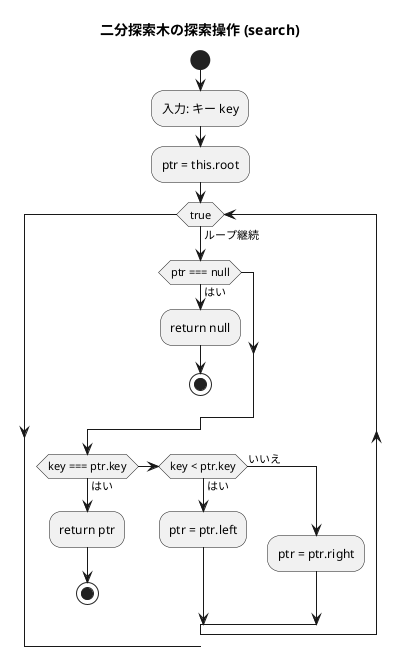
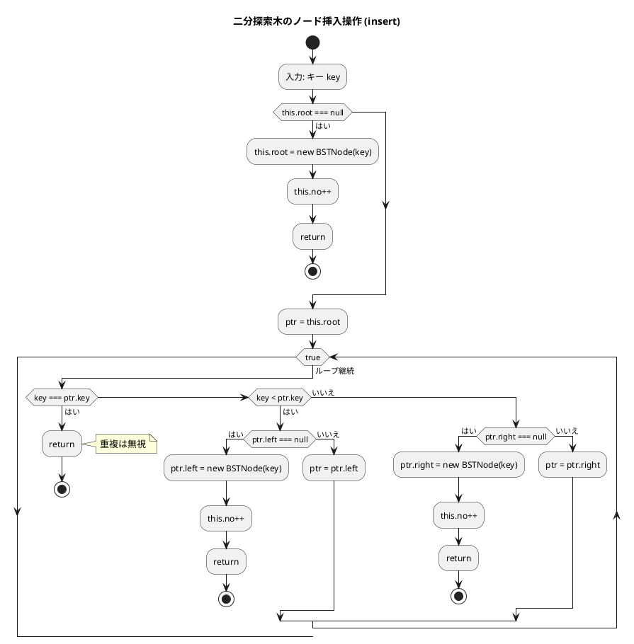
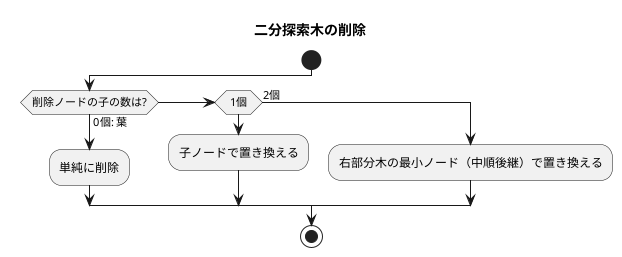
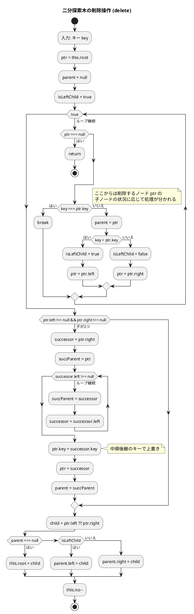
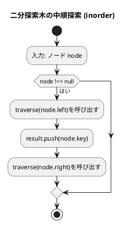

# 第 9 章 木構造

## はじめに

前章までで、配列、探索アルゴリズム、スタック、キュー、再帰、ソートアルゴリズム、文字列処理、リストなどを学んできました。この章では、データ構造の中でも特に重要な「**木構造**」、特に**二分探索木（BST: Binary Search Tree）**を TDD で実装します。

木構造はノードが親子関係で繋がった非線形データ構造です。二分探索木は左の子 < 親 < 右の子という性質を持ち、効率的な探索・挿入・削除を実現します。

### 目次

1. [木構造とは](#木構造とは)
2. [二分木](#二分木)
3. [二分探索木の性質](#二分探索木の性質)
4. [Red — 失敗するテストを書く](#red--失敗するテストを書く)
5. [Green — テストを通す実装](#green--テストを通す実装)
6. [ノードの削除](#ノードの削除)
7. [木の走査](#木の走査)
8. [ヒープ](#ヒープ)

---

## 木構造とは

木構造とは、データを階層的に表現するデータ構造です。木構造は、以下の要素から構成されます：

- **ノード**：データを格納する要素
- **エッジ**：ノード間の関係を表す線
- **ルート**：木の最上位に位置するノード
- **親ノード**：あるノードの上位に位置するノード
- **子ノード**：あるノードの下位に位置するノード
- **葉ノード**：子ノードを持たないノード

木構造は、以下のような特徴を持ちます：

1. 一つのルートノードから始まる
2. 各ノードは 0 個以上の子ノードを持つ
3. 循環構造を持たない（サイクルがない）

### 順序木と無順序木

木構造は、子ノードの順序に意味があるかどうかによって、「順序木」と「無順序木」に分類されます。

- **順序木**：子ノードの順序に意味がある木構造
- **無順序木**：子ノードの順序に意味がない木構造

### 順序木の探索

順序木を探索する方法には、主に以下の 3 つがあります：

1. **先行順（行きがけ順）探索**：ノード自身 → 左部分木 → 右部分木の順に探索
2. **中間順（通りがけ順）探索**：左部分木 → ノード自身 → 右部分木の順に探索
3. **後行順（帰りがけ順）探索**：左部分木 → 右部分木 → ノード自身の順に探索

これらの探索方法は、再帰を用いて実装することができます。

---

## 二分木

二分木は、各ノードが最大 2 つの子ノード（左の子と右の子）を持つ木構造です。二分木は、以下のような特徴を持ちます：

1. 各ノードは最大 2 つの子ノードを持つ
2. 左の子と右の子が明確に区別される
3. 空の二分木も存在する

二分木は、様々なアルゴリズムやデータ構造の基礎となります。例えば、二分探索木、ヒープ、ハフマン木などは、二分木の一種です。

---

## 二分探索木の性質



**性質**:
- 左部分木のすべてのキー < ルートのキー
- 右部分木のすべてのキー > ルートのキー
- 左右の部分木もまた二分探索木
- 中順探索（left → root → right）は昇順になる

---

## Red — 失敗するテストを書く

```typescript
// tests/tree.test.ts
import { BinarySearchTree } from '../src/algorithm/tree';

describe('二分探索木', () => {
  let bst: BinarySearchTree<number>;
  beforeEach(() => {
    bst = new BinarySearchTree<number>();
  });

  test('初期状態は空', () => {
    expect(bst.isEmpty()).toBe(true);
  });

  test('挿入と検索', () => {
    bst.insert(5);
    expect(bst.search(5)?.key).toBe(5);
  });

  test('中順探索は昇順', () => {
    [5, 3, 7, 1, 4, 6, 8].forEach(v => bst.insert(v));
    expect(bst.inorder()).toEqual([1, 3, 4, 5, 6, 7, 8]);
  });

  test('前順探索', () => {
    [5, 3, 7].forEach(v => bst.insert(v));
    expect(bst.preorder()).toEqual([5, 3, 7]);
  });

  test('後順探索', () => {
    [5, 3, 7].forEach(v => bst.insert(v));
    expect(bst.postorder()).toEqual([3, 7, 5]);
  });

  test('min', () => {
    [5, 3, 7, 1, 4].forEach(v => bst.insert(v));
    expect(bst.min()).toBe(1);
  });

  test('max', () => {
    [5, 3, 7, 1, 4].forEach(v => bst.insert(v));
    expect(bst.max()).toBe(7);
  });

  test('葉ノードの削除', () => {
    [5, 3, 7].forEach(v => bst.insert(v));
    bst.delete(3);
    expect(bst.search(3)).toBeNull();
  });

  test('子が 2 つのノードの削除', () => {
    [5, 3, 7, 1, 4].forEach(v => bst.insert(v));
    bst.delete(3);
    expect(bst.search(3)).toBeNull();
    [1, 4, 5, 7].forEach(v => expect(bst.search(v)).not.toBeNull());
  });
});
```

テストでは、空の木、挿入・検索、3 種類の走査（中順・前順・後順）、最小・最大値取得、2 パターンの削除を検証します。`?.` はオプショナルチェーン演算子で、`search` が null を返した場合にエラーを防ぎます。

---

## Green — テストを通す実装

### ノードとクラス設計

```typescript
// src/algorithm/tree.ts
class BSTNode<T> {
  constructor(
    public key: T,
    public left: BSTNode<T> | null = null,
    public right: BSTNode<T> | null = null,
  ) {}
}

export class BinarySearchTree<T> {
  private root: BSTNode<T> | null = null;
  private no = 0;

  get size(): number {
    return this.no;
  }

  isEmpty(): boolean {
    return this.root === null;
  }
}
```

TypeScript の `<T>` によるジェネリクスで任意の型のキーを扱えます。Python の `Generic[T]` に相当しますが、TypeScript ではクラス名の直後に `<T>` を書くだけで済みます。

### 探索操作

```typescript
search(key: T): BSTNode<T> | null {
  let ptr = this.root;
  while (ptr !== null) {
    if (key === ptr.key) return ptr;
    ptr = key < ptr.key ? ptr.left : ptr.right;
  }
  return null;
}
```

TypeScript の三項演算子 `key < ptr.key ? ptr.left : ptr.right` は、Python の `ptr.left if key < ptr.key else ptr.right` に相当します。

### フローチャート（探索）



この操作は、二分探索木の性質を利用して効率的に探索を行います。平均的な場合、時間計算量は O(log n) となります。

### 挿入操作

```typescript
insert(key: T): void {
  if (this.root === null) {
    this.root = new BSTNode<T>(key);
    this.no++;
    return;
  }
  let ptr = this.root;
  while (true) {
    if (key === ptr.key) return; // 重複は無視
    if (key < ptr.key) {
      if (ptr.left === null) {
        ptr.left = new BSTNode<T>(key);
        this.no++;
        return;
      }
      ptr = ptr.left;
    } else {
      if (ptr.right === null) {
        ptr.right = new BSTNode<T>(key);
        this.no++;
        return;
      }
      ptr = ptr.right;
    }
  }
}
```

### フローチャート（挿入）



アルゴリズムの流れ：
1. ルートが null の場合は新しいノードを作成してルートに設定します
2. それ以外の場合は、二分探索木の性質に従って適切な位置を探します
3. 重複キーは無視します
4. 空いている位置が見つかったら、新しいノードを作成して挿入します

---

## ノードの削除

削除は 3 つのケースに分かれます：



### 実装

```typescript
delete(key: T): void {
  let ptr = this.root;
  let parent: BSTNode<T> | null = null;
  let isLeftChild = true;

  // 対象ノードを探す
  while (ptr !== null) {
    if (key === ptr.key) break;
    parent = ptr;
    if (key < ptr.key) {
      isLeftChild = true;
      ptr = ptr.left;
    } else {
      isLeftChild = false;
      ptr = ptr.right;
    }
  }
  if (ptr === null) return; // 見つからない

  // ケース: 子が 2 つ
  if (ptr.left !== null && ptr.right !== null) {
    let successor = ptr.right;
    let succParent = ptr;
    while (successor.left !== null) {
      succParent = successor;
      successor = successor.left;
    }
    ptr.key = successor.key;
    // 後継ノードの削除に帰着
    ptr = successor;
    parent = succParent;
    isLeftChild = succParent !== ptr;
  }

  // ケース: 子が 0 個または 1 個
  const child = ptr.left !== null ? ptr.left : ptr.right;
  if (parent === null) {
    this.root = child;
  } else if (isLeftChild) {
    parent.left = child;
  } else {
    parent.right = child;
  }
  this.no--;
}
```

### フローチャート（削除）



アルゴリズムの流れ：
1. 削除するノードを探索します
2. 削除するノードの子ノードの状況に応じて処理を分けます：
   - **葉ノード（子が 0 個）**: 単純に削除（親の参照を null に）
   - **子が 1 個**: 子ノードで置き換えます
   - **子が 2 個**: 右部分木の最小ノード（中順後継）のキーで上書きし、中順後継ノードを削除します

---

## 木の走査

```typescript
// 中順探索（昇順）
inorder(): T[] {
  const result: T[] = [];
  function traverse(node: BSTNode<T> | null): void {
    if (node === null) return;
    traverse(node.left);
    result.push(node.key);
    traverse(node.right);
  }
  traverse(this.root);
  return result;
}

// 前順探索
preorder(): T[] {
  const result: T[] = [];
  function traverse(node: BSTNode<T> | null): void {
    if (node === null) return;
    result.push(node.key);
    traverse(node.left);
    traverse(node.right);
  }
  traverse(this.root);
  return result;
}

// 後順探索
postorder(): T[] {
  const result: T[] = [];
  function traverse(node: BSTNode<T> | null): void {
    if (node === null) return;
    traverse(node.left);
    traverse(node.right);
    result.push(node.key);
  }
  traverse(this.root);
  return result;
}
```

| 走査方法 | 順序 | 用途 |
|---------|------|------|
| 前順（preorder） | 根 → 左 → 右 | ツリーのコピー |
| 中順（inorder） | 左 → 根 → 右 | ソート済みリスト取得 |
| 後順（postorder） | 左 → 右 → 根 | ツリーの削除 |

### フローチャート（中順探索）



中順探索では、左部分木 → ノード自身 → 右部分木の順に処理するため、二分探索木のノードをキーの昇順に取得できます。

### 最小キー・最大キーの取得

```typescript
min(): T {
  if (!this.root) throw new Error('empty');
  let p = this.root;
  while (p.left) p = p.left;
  return p.key;
}

max(): T {
  if (!this.root) throw new Error('empty');
  let p = this.root;
  while (p.right) p = p.right;
  return p.key;
}
```

最小値は左端のノード、最大値は右端のノードに格納されています。

---

## ヒープ

ヒープは、完全二分木の一種で、以下の性質を持ちます：

1. 各ノードの値は、その子ノードの値以上（または以下）である
2. 木は可能な限り左から右へ、上から下へ詰めて構築される

ヒープには、最大ヒープと最小ヒープの 2 種類があります：

- **最大ヒープ**：各ノードの値は、その子ノードの値以上である
- **最小ヒープ**：各ノードの値は、その子ノードの値以下である

### ヒープの配列表現

ヒープは、通常、配列を用いて実装されます。完全二分木の性質を利用すると、配列のインデックスを用いて親子関係を表現することができます：

- インデックス i のノードの左の子ノードのインデックスは `2 * i + 1`
- インデックス i のノードの右の子ノードのインデックスは `2 * i + 2`
- インデックス i のノードの親ノードのインデックスは `Math.floor((i - 1) / 2)`

Python の標準ライブラリには `heapq` モジュールがありますが、TypeScript には標準のヒープ実装はありません。必要に応じて自前で実装するか、サードパーティライブラリを使用します。

### 解説

ヒープは、最大値または最小値を効率的に取得できるデータ構造です。要素の追加と削除の時間計算量は O(log n) となります。

ヒープは、優先度付きキューの実装や、ヒープソート（第 6 章で実装済み）などのアルゴリズムに利用されます。また、ダイクストラのアルゴリズムなど、グラフアルゴリズムでも利用されます。

---

## テスト実行結果

```bash
$ npm test tests/tree.test.ts

 PASS  tests/tree.test.ts
  二分探索木
    ✓ 初期状態は空
    ✓ 挿入と検索
    ✓ 中順探索は昇順
    ✓ 前順探索
    ✓ 後順探索
    ✓ min
    ✓ max
    ✓ 葉ノードの削除
    ✓ 子が 2 つのノードの削除

Tests:  9 passed, 9 total
```

---

## 全テスト一括確認

```bash
$ npm test

Test Suites: 9 passed, 9 total
Tests:       236 passed, 2 skipped, 238 total
```

---

## 二分探索木の計算量

| 操作 | 平均計算量 | 最悪計算量 |
|------|-----------|-----------|
| 検索 | O(log n) | O(n) |
| 挿入 | O(log n) | O(n) |
| 削除 | O(log n) | O(n) |
| 中順探索 | O(n) | O(n) |

最悪（偏った木）を避けるには AVL 木や赤黒木などの平衡二分探索木が必要です。バランス木を使うと最悪でも O(log n) を保証できます。

---

## Python との比較

| 概念 | Python | TypeScript |
|------|--------|-----------|
| 木ノード | `@dataclass class Node` | `class BSTNode<T>` |
| 比較演算 | `if key < node.key:` | `if (key < ptr.key)` |
| 走査（中順） | `def inorder(self, node):` | `inorder(): T[]` |
| 再帰収集 | `result = []` + append | クロージャ内で `result.push(...)` |
| ジェネリクス | `class BST[T]:` | `class BST<T>` |
| Optional 型 | `_Node \| None` | `BSTNode<T> \| null` |
| 内部クラス | `class Empty(Exception)` | `throw new Error(...)` |
| `__len__` | `def __len__(self)` | `get size()` |
| `__contains__` | `def __contains__(self, x)` | `contains(x)` |
| 比較演算子 | `key < ptr.key` | `key < ptr.key`（同じ） |
| オプショナルチェーン | なし | `bst.search(5)?.key` |
| 三項演算子 | `a if cond else b` | `cond ? a : b` |

---

## まとめ

この章では、木構造について学びました：

1. **木構造**：データを階層的に表現するデータ構造。ノード、エッジ、ルートなどの基本要素から構成される。
2. **二分木**：各ノードが最大 2 つの子ノードを持つ木構造。
3. **二分探索木**：効率的な探索を可能にする二分木。平均 O(log n) で探索・挿入・削除が可能。TypeScript のジェネリクスで型安全に実装。
4. **木の走査**：前順・中順・後順の 3 種類。再帰とクロージャで実装。
5. **ヒープ**：完全二分木の一種で、優先度付きキューの実装などに利用される。

これらの木構造は、様々なアルゴリズムやデータ構造の基礎となります。用途に応じて適切な木構造を選択することが重要です。

## 参考文献

- 『新・明解 Python で学ぶアルゴリズムとデータ構造』 — 柴田望洋
- 『テスト駆動開発』 — Kent Beck
