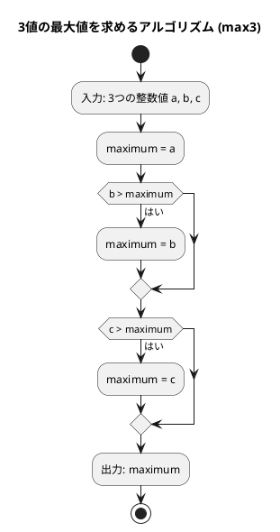
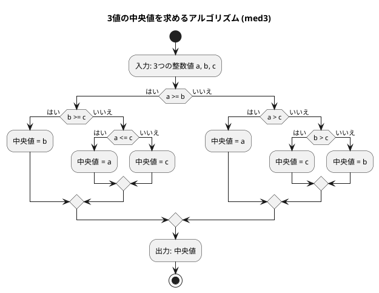

# 第 1 章 基本的なアルゴリズム

## はじめに

プログラミングを学ぶ上で、アルゴリズムの理解は非常に重要です。アルゴリズムとは、問題を解決するための手順や方法のことです。この章では、PHP を使って基本的なアルゴリズムを学びながら、テスト駆動開発（TDD）の手法を用いて実装していきます。

テスト駆動開発とは、コードを書く前にまずテストを書き、そのテストが通るようにコードを実装していく開発手法です。Red-Green-Refactor というサイクルを繰り返しながら、確実に動作するコードを段階的に作り上げます。

## 準備

### 環境構築

```bash
# Nix 環境に入る（PHP + Composer が利用可能になる）
nix develop .#php

# プロジェクトディレクトリへ移動
cd apps/php

# 依存パッケージのインストール
composer install
```

### プロジェクト構成

```
apps/php/
├── composer.json            # プロジェクト設定
├── phpunit.xml              # PHPUnit 設定
├── src/
│   └── BasicAlgorithms.php  # 実装ファイル
└── tests/
    └── BasicAlgorithmsTest.php  # テストファイル
```

### テスト実行コマンド

```bash
# テスト実行（全テスト）
vendor/bin/phpunit

# 特定クラスのみ実行
vendor/bin/phpunit --filter BasicAlgorithms

# テスト結果を読みやすく表示
vendor/bin/phpunit --testdox
```

---

## 1. アルゴリズムとは

アルゴリズムとは、問題を解決するための明確な手順のことです。コンピュータプログラムは、アルゴリズムを実行可能な形で表現したものと言えます。

良いアルゴリズムは以下の特徴を持ちます：

- 入力と出力が明確である
- 各ステップが明確である
- 有限のステップで終了する
- 効率的である

---

## 2. 3 値の最大値

3 つの整数値の中から最大値を求めるアルゴリズムを TDD で実装します。

### Red — 失敗するテストを書く

```php
<?php
declare(strict_types=1);
namespace Tests;

use Algorithm\BasicAlgorithms;
use PHPUnit\Framework\TestCase;
use PHPUnit\Framework\Attributes\DataProvider;

class BasicAlgorithmsTest extends TestCase
{
    public static function max3Provider(): array
    {
        return [
            [3, 2, 1, 3],  // a > b > c
            [3, 2, 2, 3],  // a > b = c
            [3, 1, 2, 3],  // a > c > b
            [3, 2, 3, 3],  // a = c > b
            [2, 1, 3, 3],  // c > a > b
            [3, 3, 2, 3],  // a = b > c
            [3, 3, 3, 3],  // a = b = c
            [2, 2, 3, 3],  // c > a = b
            [2, 3, 1, 3],  // b > a > c
            [2, 3, 2, 3],  // b > a = c
            [1, 3, 2, 3],  // b > c > a
            [2, 3, 3, 3],  // b = c > a
            [1, 2, 3, 3],  // c > b > a
        ];
    }

    #[DataProvider('max3Provider')]
    public function test3値の最大値を返す(int $a, int $b, int $c, int $expected): void
    {
        $this->assertSame($expected, BasicAlgorithms::max3($a, $b, $c));
    }
}
```

3 つの値の大小関係の全パターン（13 通り）を網羅したテストです。PHPUnit の `#[DataProvider]` アトリビュートを使うことで、同じテストメソッドを異なるデータセットで繰り返し実行できます。

### Green — テストを通す最小限の実装

```php
<?php
declare(strict_types=1);
namespace Algorithm;

class BasicAlgorithms
{
    /** 3つの整数値の最大値を返す */
    public static function max3(int $a, int $b, int $c): int
    {
        $maximum = $a;
        if ($b > $maximum) {
            $maximum = $b;
        }
        if ($c > $maximum) {
            $maximum = $c;
        }
        return $maximum;
    }
}
```

### アルゴリズムの考え方



1. 最初の値を最大値と仮定する
2. 残りの値と比較し、より大きい値があれば最大値を更新する
3. すべての値との比較が終わったら、最大値を返す

---

## 3. 3 値の中央値

3 つの整数値の中央値（3 つの値を大きさの順に並べたときに真ん中に来る値）を求めます。

### Red — 失敗するテストを書く

```php
public static function med3Provider(): array
{
    return [
        [3, 2, 1, 2],  // a > b > c
        [3, 2, 2, 2],  // a > b = c
        [3, 1, 2, 2],  // a > c > b
        [3, 2, 3, 3],  // a = c > b
        [2, 1, 3, 2],  // c > a > b
        [3, 3, 2, 3],  // a = b > c
        [3, 3, 3, 3],  // a = b = c
        [2, 2, 3, 2],  // c > a = b
        [2, 3, 1, 2],  // b > a > c
        [2, 3, 2, 2],  // b > a = c
        [1, 3, 2, 2],  // b > c > a
        [2, 3, 3, 3],  // b = c > a
        [1, 2, 3, 2],  // c > b > a
    ];
}

#[DataProvider('med3Provider')]
public function test3値の中央値を返す(int $a, int $b, int $c, int $expected): void
{
    $this->assertSame($expected, BasicAlgorithms::med3($a, $b, $c));
}
```

### Green — テストを通す最小限の実装

```php
/** 3つの整数値の中央値を返す */
public static function med3(int $a, int $b, int $c): int
{
    if ($a >= $b) {
        if ($b >= $c) {
            return $b;
        } elseif ($a <= $c) {
            return $a;
        } else {
            return $c;
        }
    } elseif ($a > $c) {
        return $a;
    } elseif ($b > $c) {
        return $c;
    } else {
        return $b;
    }
}
```

### アルゴリズムの考え方



中央値を求めるアルゴリズムは、最大値よりも複雑です。すべての場合分けを考える必要があります：

| 条件 | 中央値 |
|------|--------|
| a >= b かつ b >= c | b |
| a >= b かつ a <= c | a |
| a >= b（それ以外、a > c > b） | c |
| a < b かつ a > c | a |
| a < b かつ b > c | c |
| a < b（それ以外、c >= b > a） | b |

---

## 4. 条件判定と分岐

プログラミングでは、条件に応じて処理を分岐させることが頻繁にあります。

### Red — 失敗するテストを書く

```php
public function test正の値の符号判定(): void
{
    $this->assertSame('その値は正です。', BasicAlgorithms::judgeSign(17));
}

public function test負の値の符号判定(): void
{
    $this->assertSame('その値は負です。', BasicAlgorithms::judgeSign(-5));
}

public function testゼロの符号判定(): void
{
    $this->assertSame('その値は0です。', BasicAlgorithms::judgeSign(0));
}
```

### Green — テストを通す最小限の実装

```php
/** 整数値の符号を判定する */
public static function judgeSign(int $n): string
{
    if ($n > 0) {
        return 'その値は正です。';
    } elseif ($n < 0) {
        return 'その値は負です。';
    } else {
        return 'その値は0です。';
    }
}
```

`if`, `elseif`, `else` を使うことで、複数の条件に応じて処理を分岐させることができます。

---

## 5. 繰り返し処理

プログラミングでは、同じ処理を繰り返し実行することがよくあります。PHP では `while` 文と `for` 文を使って繰り返し処理を実現できます。

### 5-1. 1 から n までの総和

#### Red — 失敗するテストを書く

```php
public function testWhileループで1からnまでの総和(): void
{
    $this->assertSame(15, BasicAlgorithms::sum1ToNWhile(5));
}

public function testForループで1からnまでの総和(): void
{
    $this->assertSame(15, BasicAlgorithms::sum1ToNFor(5));
}
```

#### Green — テストを通す実装

```php
/** while ループで 1 から n までの総和を求める */
public static function sum1ToNWhile(int $n): int
{
    $total = 0;
    $i = 1;
    while ($i <= $n) {
        $total += $i;
        $i++;
    }
    return $total;
}

/** for ループで 1 から n までの総和を求める */
public static function sum1ToNFor(int $n): int
{
    $total = 0;
    for ($i = 1; $i <= $n; $i++) {
        $total += $i;
    }
    return $total;
}
```

`while` 文は条件が真の間、繰り返し実行します。`for` 文は初期化・条件・更新を 1 行にまとめて記述できます。

### 5-2. 記号文字の交互表示

`+` と `-` を交互に表示する 2 通りの実装を比較します。

#### Red — 失敗するテストを書く

```php
public function test剰余判定方式で偶数個(): void
{
    $this->assertSame('+-+-+-+-+-+-', BasicAlgorithms::alternative1(12));
}

public function testパターン繰り返し方式で偶数個(): void
{
    $this->assertSame('+-+-+-+-+-+-', BasicAlgorithms::alternative2(12));
}

public function test剰余判定方式で奇数個(): void
{
    $this->assertSame('+-+-+', BasicAlgorithms::alternative1(5));
}

public function testパターン繰り返し方式で奇数個(): void
{
    $this->assertSame('+-+-+', BasicAlgorithms::alternative2(5));
}
```

#### Green — テストを通す実装

```php
/** 記号文字 '+' と '-' を交互に表示する（剰余判定方式） */
public static function alternative1(int $n): string
{
    $result = '';
    for ($i = 0; $i < $n; $i++) {
        $result .= ($i % 2 === 0) ? '+' : '-';
    }
    return $result;
}

/** 記号文字 '+' と '-' を交互に表示する（パターン繰り返し方式） */
public static function alternative2(int $n): string
{
    $result = str_repeat('+-', intdiv($n, 2));
    if ($n % 2 !== 0) {
        $result .= '+';
    }
    return $result;
}
```

`alternative1` は剰余（`%`）を使って偶数・奇数を判定します。`alternative2` は `str_repeat()` を使ったよりシンプルな実装です。PHP では整数除算に `intdiv()` 関数を使います。

### 5-3. 長方形の辺の長さを列挙

面積が指定された長方形の辺の長さをすべて列挙します。

#### Red — 失敗するテストを書く

```php
public function test面積32の長方形の辺の組み合わせ(): void
{
    $this->assertSame('1x32 2x16 4x8 ', BasicAlgorithms::rectangle(32));
}
```

#### Green — テストを通す実装

```php
/** 縦横が整数で面積が area の長方形の辺の長さを列挙する */
public static function rectangle(int $area): string
{
    $result = '';
    for ($i = 1; $i * $i <= $area; $i++) {
        if ($area % $i === 0) {
            $result .= "{$i}x" . ($area / $i) . ' ';
        }
    }
    return $result;
}
```

`break` や `continue` を使って繰り返しを制御できます。`$i * $i <= $area` で探索範囲を絞り込むことで効率化しています。PHP では `"{$i}x"` のようにダブルクォート内で変数展開ができます。

---

## 6. 多重ループ

ループの中にループを重ねることで、2 次元的な処理を実現できます。

### 6-1. 九九の表

#### Red — 失敗するテストを書く

```php
public function test九九の表(): void
{
    $expected = implode("\n", [
        '---------------------------',
        '  1  2  3  4  5  6  7  8  9',
        '  2  4  6  8 10 12 14 16 18',
        '  3  6  9 12 15 18 21 24 27',
        '  4  8 12 16 20 24 28 32 36',
        '  5 10 15 20 25 30 35 40 45',
        '  6 12 18 24 30 36 42 48 54',
        '  7 14 21 28 35 42 49 56 63',
        '  8 16 24 32 40 48 56 64 72',
        '  9 18 27 36 45 54 63 72 81',
        '---------------------------',
    ]);
    $this->assertSame($expected, BasicAlgorithms::multiplicationTable());
}
```

#### Green — テストを通す実装

```php
/** 九九の表を返す */
public static function multiplicationTable(): string
{
    $result = str_repeat('-', 27) . "\n";
    for ($i = 1; $i <= 9; $i++) {
        for ($j = 1; $j <= 9; $j++) {
            $result .= sprintf('%3d', $i * $j);
        }
        $result .= "\n";
    }
    $result .= str_repeat('-', 27);
    return $result;
}
```

外側のループが行（`$i`）、内側のループが列（`$j`）を担当します。`sprintf('%3d', $i * $j)` は 3 文字幅の右揃えで数値をフォーマットします。

### 6-2. 直角三角形の表示

#### Red — 失敗するテストを書く

```php
public function test左下直角の二等辺三角形(): void
{
    $this->assertSame("*\n**\n***\n****\n*****\n", BasicAlgorithms::triangleLb(5));
}
```

#### Green — テストを通す実装

```php
/** 左下側が直角の二等辺三角形を返す */
public static function triangleLb(int $n): string
{
    $result = '';
    for ($i = 1; $i <= $n; $i++) {
        $result .= str_repeat('*', $i) . "\n";
    }
    return $result;
}
```

---

## テスト実行結果

```bash
$ vendor/bin/phpunit --testdox --filter BasicAlgorithms

PHPUnit 11.5.x by Sebastian Bergmann and contributors.

Basic Algorithms (Tests\BasicAlgorithmsTest)
 ✔ 3値の最大値を返す with data set #0 (3, 2, 1, 3)
 ✔ 3値の最大値を返す with data set #1 (3, 2, 2, 3)
 ✔ 3値の最大値を返す with data set #2 (3, 1, 2, 3)
 ✔ 3値の最大値を返す with data set #3 (3, 2, 3, 3)
 ✔ 3値の最大値を返す with data set #4 (2, 1, 3, 3)
 ✔ 3値の最大値を返す with data set #5 (3, 3, 2, 3)
 ✔ 3値の最大値を返す with data set #6 (3, 3, 3, 3)
 ✔ 3値の最大値を返す with data set #7 (2, 2, 3, 3)
 ✔ 3値の最大値を返す with data set #8 (2, 3, 1, 3)
 ✔ 3値の最大値を返す with data set #9 (2, 3, 2, 3)
 ✔ 3値の最大値を返す with data set #10 (1, 3, 2, 3)
 ✔ 3値の最大値を返す with data set #11 (2, 3, 3, 3)
 ✔ 3値の最大値を返す with data set #12 (1, 2, 3, 3)
 ✔ 3値の中央値を返す with data set #0 (3, 2, 1, 2)
 ✔ 3値の中央値を返す with data set #1 (3, 2, 2, 2)
 ✔ 3値の中央値を返す with data set #2 (3, 1, 2, 2)
 ✔ 3値の中央値を返す with data set #3 (3, 2, 3, 3)
 ✔ 3値の中央値を返す with data set #4 (2, 1, 3, 2)
 ✔ 3値の中央値を返す with data set #5 (3, 3, 2, 3)
 ✔ 3値の中央値を返す with data set #6 (3, 3, 3, 3)
 ✔ 3値の中央値を返す with data set #7 (2, 2, 3, 2)
 ✔ 3値の中央値を返す with data set #8 (2, 3, 1, 2)
 ✔ 3値の中央値を返す with data set #9 (2, 3, 2, 2)
 ✔ 3値の中央値を返す with data set #10 (1, 3, 2, 2)
 ✔ 3値の中央値を返す with data set #11 (2, 3, 3, 3)
 ✔ 3値の中央値を返す with data set #12 (1, 2, 3, 2)
 ✔ 正の値の符号判定
 ✔ 負の値の符号判定
 ✔ ゼロの符号判定
 ✔ While ループで1からnまでの総和
 ✔ For ループで1からnまでの総和
 ✔ 剰余判定方式で偶数個
 ✔ パターン繰り返し方式で偶数個
 ✔ 剰余判定方式で奇数個
 ✔ パターン繰り返し方式で奇数個
 ✔ 面積32の長方形の辺の組み合わせ
 ✔ 九九の表
 ✔ 左下直角の二等辺三角形

39 tests, 39 assertions
```

---

## Python 版との違い

| 概念 | Python | PHP |
|------|--------|-----|
| 関数定義 | `def max3(a, b, c):` | `public static function max3(int $a, int $b, int $c): int` |
| パラメータ化テスト | `@pytest.mark.parametrize` | `#[DataProvider('providerMethod')]` |
| 文字列繰り返し | `"+-" * (n // 2)` | `str_repeat('+-', intdiv($n, 2))` |
| 書式指定 | `f"{i * j:3}"` | `sprintf('%3d', $i * $j)` |
| 型宣言 | 任意（型ヒント） | 必須（`declare(strict_types=1)`） |
| 文字列結合 | `result += "+"` | `$result .= '+'` |
| 三項演算子 | `'+' if i % 2 == 0 else '-'` | `($i % 2 === 0) ? '+' : '-'` |
| 整数除算 | `area // i` | `intdiv($area, $i)` または `($area / $i)` |

---

## まとめ

この章では、以下の基本的なアルゴリズムを TDD で実装しました：

| アルゴリズム | メソッド | キーポイント |
|-------------|----------|------------|
| 3 値の最大値 | `max3` | 順次比較と更新 |
| 3 値の中央値 | `med3` | 全パターンの条件分岐 |
| 符号判定 | `judgeSign` | `if/elseif/else` の基本 |
| 総和（while） | `sum1ToNWhile` | `while` 文の繰り返し |
| 総和（for） | `sum1ToNFor` | `for` 文の繰り返し |
| 交互表示 | `alternative1/2` | 剰余判定 vs パターン繰り返し |
| 長方形列挙 | `rectangle` | ループと条件分岐の活用 |
| 九九の表 | `multiplicationTable` | 二重ループ |
| 直角三角形 | `triangleLb` | ループと `str_repeat` |

TDD の Red-Green-Refactor サイクルを通じて、テストが仕様の役割を果たし、確実に動作するコードを構築できることを確認しました。

## 参考文献

- 『新・明解 Python で学ぶアルゴリズムとデータ構造』 — 柴田望洋
- 『テスト駆動開発』 — Kent Beck
