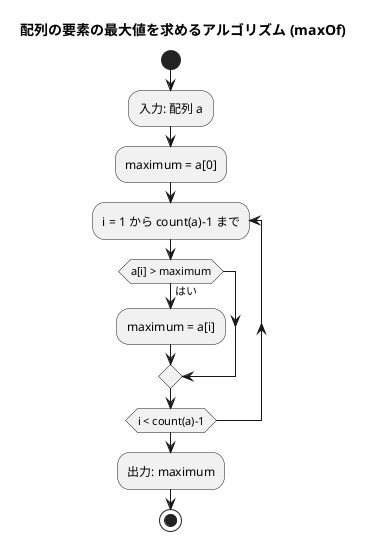
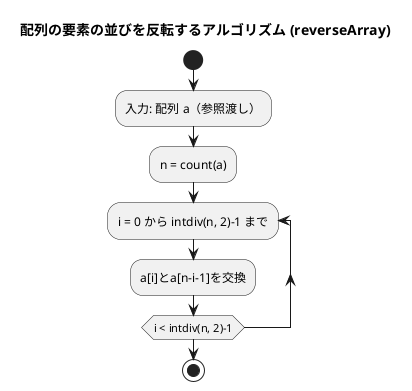
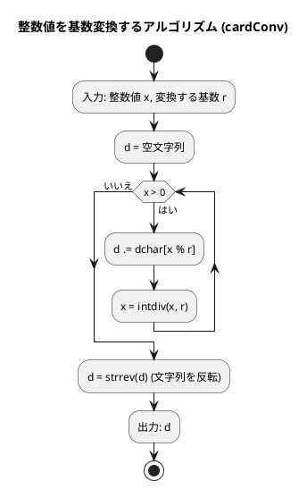
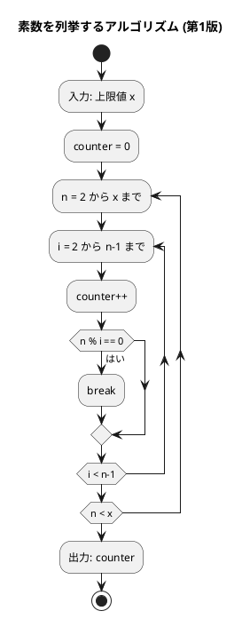
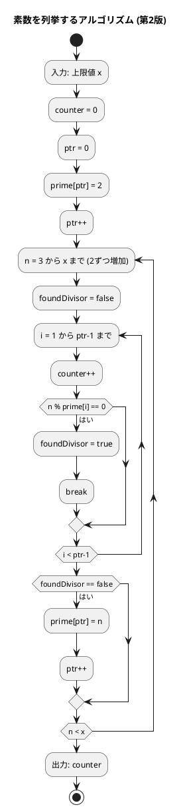
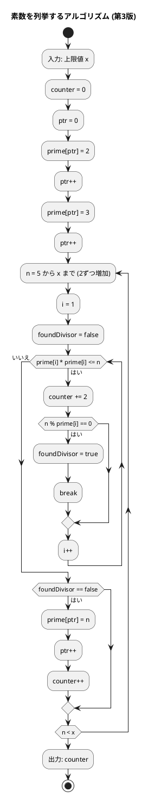

# 第 2 章 配列

## はじめに

前章では基本的なアルゴリズムについて学びました。この章では、プログラミングにおいて非常に重要なデータ構造である「配列」について学んでいきます。配列は、同じ型のデータを連続して格納するためのデータ構造で、多くのアルゴリズムの基礎となります。

PHP では、配列に相当するデータ構造として「array」があります。PHP の配列は、他の言語のリスト・連想配列・ハッシュマップの機能を兼ね備えた柔軟なデータ構造です。

---

## 1. データ構造と配列

### データ構造とは

データ構造とは、データ単位とデータ自身との間の物理的または論理的な関係を表したものです。適切なデータ構造を選ぶことで、効率的なアルゴリズムを実装することができます。

### 配列の必要性

まず、配列がなぜ必要なのかを考えてみましょう。例えば、5人の学生の点数を読み込んで合計点と平均点を求めるプログラムを考えます。

配列を使わない場合、以下のようなコードになります：

```php
$tensu1 = 85;
$tensu2 = 72;
$tensu3 = 90;
$tensu4 = 68;
$tensu5 = 95;

$total = $tensu1 + $tensu2 + $tensu3 + $tensu4 + $tensu5;
echo "合計は{$total}点です。\n";
echo "平均は" . ($total / 5) . "点です。\n";
```

このコードでは、5人分の変数を個別に用意しています。しかし、100人や1000人の点数を扱う場合、このアプローチは現実的ではありません。

### PHP における配列

PHP では、`array` 型がリストと連想配列の両方の役割を果たします。

**インデックス配列**（リストに相当）

```php
$x = [11, 22, 33, 44, 55, 66, 77];   // 整数の配列
$names = ['John', 'Paul', 'George', 'Ringo'];  // 文字列の配列
```

**連想配列**（辞書に相当）

```php
$person = ['name' => 'Alice', 'age' => 30, 'score' => 95.5];
```

### list() によるアンパック

PHP では、`list()` または短縮構文 `[]` を使って配列の要素を個別の変数に展開できます。

```php
$x = [1, 2, 3];
[$a, $b, $c] = $x;  // $a=1, $b=2, $c=3 となる
```

### インデックスによるアクセス

配列の要素には、インデックス（添え字）を使ってアクセスします。PHP のインデックスは 0 から始まります。

```php
$x = [11, 22, 33, 44, 55, 66, 77];
echo $x[2];     // 33（3番目の要素）
$x[3] = 3.14;   // 要素の値を変更
```

### array_slice によるスライス

PHP では、`array_slice()` を使って配列の一部を取り出すことができます。

```php
$s = [11, 22, 33, 44, 55, 66, 77];
$slice1 = array_slice($s, 0, 6);  // [11, 22, 33, 44, 55, 66]
$slice2 = array_slice($s, -4, 2); // [44, 55]
```

### 配列の走査

配列の全要素を処理するには、いくつかの方法があります。

#### インデックスを使った走査

```php
$x = ['John', 'George', 'Paul', 'Ringo'];
for ($i = 0; $i < count($x); $i++) {
    echo "x[{$i}] = {$x[$i]}\n";
}
```

#### foreach を使った走査（インデックス付き）

```php
$x = ['John', 'George', 'Paul', 'Ringo'];
foreach ($x as $i => $name) {
    echo "x[{$i}] = {$name}\n";
}
```

#### foreach を使った走査（値のみ）

```php
$x = ['John', 'George', 'Paul', 'Ringo'];
foreach ($x as $name) {
    echo "{$name}\n";
}
```

---

## 2. 配列の要素の最大値

### Red — 失敗するテストを書く

```php
<?php
declare(strict_types=1);
namespace Tests;

use Algorithm\Arrays;
use PHPUnit\Framework\TestCase;

class ArraysTest extends TestCase
{
    public function test配列の最大値を返す(): void
    {
        $this->assertSame(192, Arrays::maxOf([172, 153, 192, 140, 165]));
    }
}
```

### Green — テストを通す最小限の実装

```php
<?php
declare(strict_types=1);
namespace Algorithm;

class Arrays
{
    /** 配列の要素の最大値を返す */
    public static function maxOf(array $a): int
    {
        $maximum = $a[0];
        for ($i = 1; $i < count($a); $i++) {
            if ($a[$i] > $maximum) {
                $maximum = $a[$i];
            }
        }
        return $maximum;
    }
}
```

### アルゴリズムの考え方



この図は、配列の要素の最大値を求めるアルゴリズム（maxOf メソッド）のフローチャートです。

アルゴリズムの流れ：
1. 配列 a を入力として受け取ります
2. 変数 maximum に a の最初の要素（a[0]）を代入します
3. 1 から count(a)-1 までの各インデックス i について、以下の処理を繰り返します：
   - a[i] が maximum より大きければ、maximum の値を a[i] に更新します
4. 最終的な maximum の値（配列の最大値）を出力します

計算量は O(n) です（n は配列の要素数）。

---

## 3. 配列の要素の並びを反転

### Red — 失敗するテストを書く

```php
public function test配列を逆順にする(): void
{
    $a = [2, 5, 1, 3, 9, 6, 7];
    Arrays::reverseArray($a);
    $this->assertSame([7, 6, 9, 3, 1, 5, 2], $a);
}
```

### Green — テストを通す最小限の実装

```php
/** 配列の要素の並びを反転する（参照渡しで破壊的） */
public static function reverseArray(array &$a): void
{
    $n = count($a);
    for ($i = 0; $i < intdiv($n, 2); $i++) {
        [$a[$i], $a[$n - $i - 1]] = [$a[$n - $i - 1], $a[$i]];
    }
}
```

### アルゴリズムの考え方

配列の前半と後半の要素を対称的に交換することで反転します。

```
[2, 5, 1, 3, 9, 6, 7]
 ↕              ↕
[7, 5, 1, 3, 9, 6, 2]  → i=0: 2と7を交換
      ↕        ↕
[7, 6, 1, 3, 9, 5, 2]  → i=1: 5と6を交換
         ↕  ↕
[7, 6, 9, 3, 1, 5, 2]  → i=2: 1と9を交換（3は中央なので交換不要）
```

PHP では `[$a[$i], $a[$n-$i-1]] = [$a[$n-$i-1], $a[$i]]` で簡潔に交換できます。計算量は O(n/2) = O(n) です。

**重要**: PHP では配列は値渡しがデフォルトです。配列をインプレースで変更するには、引数に `&` を付けて参照渡しにする必要があります。

#### フローチャート



この図は、配列の要素の並びを反転するアルゴリズム（reverseArray メソッド）のフローチャートです。

アルゴリズムの流れ：
1. 配列 a を参照渡しで入力として受け取ります
2. 変数 n に a の長さを代入します
3. 0 から intdiv(n, 2)-1 までの各インデックス i について、以下の処理を繰り返します：
   - a[i] と a[n-i-1] を交換します（前半と後半の対応する要素を交換）

配列 [2, 5, 1, 3, 9, 6, 7] を反転する場合：
- i=0: 2と7を交換 → [7, 5, 1, 3, 9, 6, 2]
- i=1: 5と6を交換 → [7, 6, 1, 3, 9, 5, 2]
- i=2: 1と9を交換 → [7, 6, 9, 3, 1, 5, 2]
- 3は中央の要素なので交換不要

---

## 4. 基数変換

### Red — 失敗するテストを書く

```php
public function test2進数変換(): void
{
    $this->assertSame('11101', Arrays::cardConv(29, 2));
}

public function test16進数変換(): void
{
    $this->assertSame('FF', Arrays::cardConv(255, 16));
}
```

### Green — テストを通す最小限の実装

```php
/** 整数値xをr進数に変換した文字列を返す */
public static function cardConv(int $x, int $r): string
{
    $d = '';
    $dchar = '0123456789ABCDEFGHIJKLMNOPQRSTUVWXYZ';
    while ($x > 0) {
        $d .= $dchar[$x % $r];
        $x = intdiv($x, $r);
    }
    return strrev($d);
}
```

### アルゴリズムの考え方



29 を 2 進数に変換する例：

| x | x % 2 | 文字 | d（途中） |
|---|-------|------|---------|
| 29 | 1 | '1' | '1' |
| 14 | 0 | '0' | '10' |
| 7  | 1 | '1' | '101' |
| 3  | 1 | '1' | '1101' |
| 1  | 1 | '1' | '11101' |

反転して `'11101'`。

---

## 5. 素数の列挙

素数を列挙する 3 つのアルゴリズムを実装し、効率を比較します。

### Red — 失敗するテストを書く

テストでは「1000 以下の素数を列挙する際の除算回数」を検証します。

```php
public function test1000以下の素数の除算回数_第1版(): void
{
    $this->assertSame(78022, Arrays::prime1(1000));
}

public function test1000以下の素数の除算回数_第2版(): void
{
    $this->assertSame(14622, Arrays::prime2(1000));
}

public function test1000以下の素数の除算回数_第3版(): void
{
    $this->assertSame(3774, Arrays::prime3(1000));
}
```

### Green — テストを通す実装（3 バージョン）

#### 第 1 版：素直な実装

```php
/** x以下の素数を列挙する（第1版）— 除算回数を返す */
public static function prime1(int $x): int
{
    $counter = 0;
    for ($n = 2; $n <= $x; $n++) {
        for ($i = 2; $i < $n; $i++) {
            $counter++;
            if ($n % $i === 0) {
                break;
            }
        }
    }
    return $counter;
}
```

#### 第 2 版：奇数のみ + 素数リスト活用

```php
/** x以下の素数を列挙する（第2版）— 除算回数を返す */
public static function prime2(int $x): int
{
    $counter = 0;
    $ptr = 0;
    $prime = array_fill(0, 500, 0);

    $prime[$ptr++] = 2;

    for ($n = 3; $n <= $x; $n += 2) {
        $foundDivisor = false;
        for ($i = 1; $i < $ptr; $i++) {
            $counter++;
            if ($n % $prime[$i] === 0) {
                $foundDivisor = true;
                break;
            }
        }
        if (!$foundDivisor) {
            $prime[$ptr++] = $n;
        }
    }
    return $counter;
}
```

#### 第 3 版：平方根以下のみ確認

```php
/** x以下の素数を列挙する（第3版）— 除算回数を返す */
public static function prime3(int $x): int
{
    $counter = 0;
    $ptr = 0;
    $prime = array_fill(0, 500, 0);

    $prime[$ptr++] = 2;
    $prime[$ptr++] = 3;

    for ($n = 5; $n <= 1000; $n += 2) {
        $i = 1;
        $foundDivisor = false;
        while ($prime[$i] * $prime[$i] <= $n) {
            $counter += 2;
            if ($n % $prime[$i] === 0) {
                $foundDivisor = true;
                break;
            }
            $i++;
        }
        if (!$foundDivisor) {
            $prime[$ptr++] = $n;
            $counter++;
        }
    }
    return $counter;
}
```

### 効率の比較

| バージョン | 除算回数 | 改善率 |
|-----------|---------|--------|
| 第 1 版（素直な実装） | 78,022 | — |
| 第 2 版（奇数 + 素数リスト） | 14,622 | 約 81% 削減 |
| 第 3 版（平方根以下） | 3,774 | 約 95% 削減 |

アルゴリズムの改善で計算量が大幅に削減されることがわかります。

#### フローチャート（第 1 版）



第 1 版は単純ですが、効率が悪いです。n が素数でない場合でも、割り切れる数が見つかった後も不要な除算を行います。

#### フローチャート（第 2 版）



第 2 版の最適化：偶数はチェックしない（2以外の偶数は素数ではないため）、すでに見つけた素数だけで割り切れるかをチェックする。

#### フローチャート（第 3 版）



第 3 版の最適化：各数 n について、その平方根以下の素数でのみ割り切れるかをチェックする（それ以上の数でチェックする必要はない）。

---

## テスト実行結果

```bash
$ vendor/bin/phpunit --testdox --filter ArraysTest

PHPUnit 11.5.x by Sebastian Bergmann and contributors.

Arrays (Tests\ArraysTest)
 ✔ 配列の最大値を返す
 ✔ 配列を逆順にする
 ✔ 2進数変換
 ✔ 16進数変換
 ✔ 1000以下の素数の除算回数 第1版
 ✔ 1000以下の素数の除算回数 第2版
 ✔ 1000以下の素数の除算回数 第3版

7 tests, 7 assertions
```

---

## 配列の要素とコピー

PHP の配列は、異なる型の要素を混在させることができます：

```php
$x = [15, 64, 7, 3.14, [32, 55], 'ABC'];
```

PHP の配列は値渡しがデフォルトのため、代入するだけでコピーされます（浅いコピー）：

```php
// 浅いコピー（代入）
$x = [[1, 2, 3], [4, 5, 6]];
$y = $x;
$x[0][1] = 9;  // $y も変更される（ネストした配列は参照を共有）

// 深いコピー（PHP ではスカラ値のみの場合は代入で十分）
// ネストした配列がある場合は array_map + clone や再帰的コピーが必要
```

Python のリストと異なり、PHP の配列は代入時にコピーが作られます（Copy-on-Write）。ただし、ネストした配列を含む場合、内側の配列は参照を共有するため注意が必要です。

---

## Python 版との違い

| 概念 | Python | PHP |
|------|--------|-----|
| 配列型 | `list` / `tuple` | `array` |
| 参照渡し | 不要（リストは参照型） | `array &$a`（明示的に参照渡し） |
| 整数除算 | `x // r` | `intdiv($x, $r)` |
| 文字列反転 | `d[::-1]` | `strrev($d)` |
| 配列の長さ | `len(a)` | `count($a)` |
| 配列の初期化 | `[None] * 500` | `array_fill(0, 500, 0)` |
| スライス | `a[0:6]` | `array_slice($a, 0, 6)` |
| for-else | `for ... else:` | `$foundDivisor` フラグで代替 |
| enumerate | `enumerate(x)` | `foreach ($x as $i => $name)` |
| アンパック | `a, b, c = x` | `[$a, $b, $c] = $x` |

---

## まとめ

| アルゴリズム | メソッド | 計算量 |
|-------------|----------|-------|
| 配列の最大値 | `maxOf` | O(n) |
| 配列の反転 | `reverseArray` | O(n) |
| 基数変換 | `cardConv` | O(log x) |
| 素数の列挙 v1 | `prime1` | O(n^2) |
| 素数の列挙 v2 | `prime2` | O(n sqrt(n)) |
| 素数の列挙 v3 | `prime3` | O(n sqrt(n) / log n) |

アルゴリズムを改良するほど、処理効率が向上することを確認しました。

この章で学んだ内容：

1. データ構造と配列の基本概念
2. PHP の配列の特徴と使い方
3. インデックスと array_slice によるアクセス
4. 配列の走査方法（for、foreach）
5. 配列の要素の最大値を求めるアルゴリズム
6. 配列の要素の並びを反転するアルゴリズム
7. 基数変換アルゴリズム
8. 素数を列挙するアルゴリズムとその改良
9. 配列のコピー（値渡しと参照渡し）

これらの知識は、より複雑なアルゴリズムやデータ構造を理解する上での基礎となります。

## 参考文献

- 『新・明解 Python で学ぶアルゴリズムとデータ構造』 — 柴田望洋
- 『テスト駆動開発』 — Kent Beck
