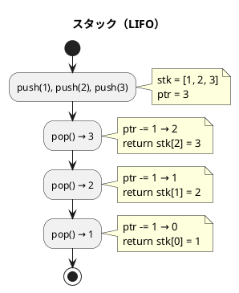
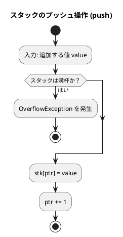
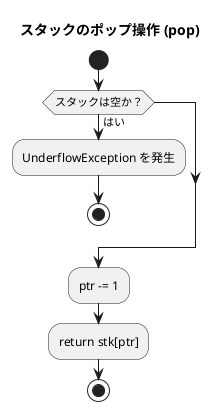
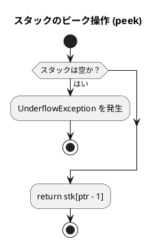
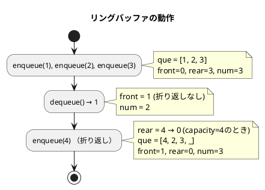
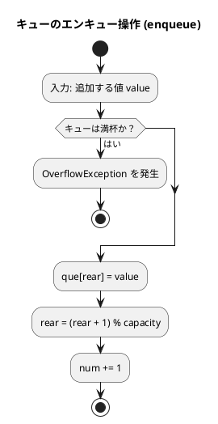
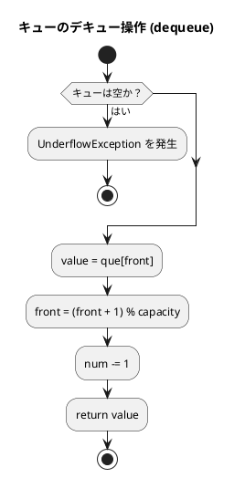
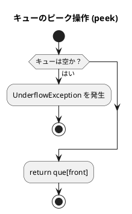

# 第 4 章 スタックとキュー

## はじめに

前章では探索アルゴリズムを学びました。この章では、データを特定の順序で格納・取り出すための基本的なデータ構造である「スタック」と「キュー」について TDD で実装します。

スタックとキューは、多くのアルゴリズムやプログラムの基礎となる重要なデータ構造です。これらの構造は、データの追加と削除の方法が異なり、それぞれ特定の問題に対して効率的な解決策を提供します。

### 目次

1. [スタック](#1-スタック)
2. [キュー](#2-キュー)
3. [スタックとキューの比較](#スタックとキューの比較)

---

## 1. スタック

スタックは **LIFO（Last In First Out）** — 後から入れたものを最初に取り出す — データ構造です。

皿を積み重ねるのに似ています。新しい皿は常に一番上に置かれ（プッシュ）、皿を取るときも一番上から取ります（ポップ）。

スタックの主な操作は以下の通りです：

- **プッシュ（Push）**: スタックの一番上にデータを追加する
- **ポップ（Pop）**: スタックの一番上からデータを取り出す
- **ピーク（Peek）**: スタックの一番上のデータを参照する（取り出さない）

スタックは、関数呼び出し、式の評価、構文解析、バックトラッキングなど、多くのアルゴリズムで使用されます。

### Red — 失敗するテストを書く

```php
<?php
declare(strict_types=1);
namespace Tests;

use Algorithm\FixedStack;
use Algorithm\FixedQueue;
use PHPUnit\Framework\TestCase;

class StackQueueTest extends TestCase
{
    private FixedStack $stack;

    protected function setUp(): void
    {
        $this->stack = new FixedStack(64);
    }

    public function test初期状態(): void
    {
        $this->assertTrue($this->stack->isEmpty());
        $this->assertFalse($this->stack->isFull());
    }

    public function testプッシュとポップ(): void
    {
        $this->stack->push(1);
        $this->assertSame(1, $this->stack->pop());
    }

    public function test複数プッシュしてポップするとLIFO順(): void
    {
        $this->stack->push(1);
        $this->stack->push(2);
        $this->stack->push(3);
        $this->assertSame(3, $this->stack->pop());  // LIFO
        $this->assertSame(2, $this->stack->pop());
    }

    public function test空のスタックからのポップは例外(): void
    {
        $this->expectException(\UnderflowException::class);
        $this->stack->pop();
    }

    public function test満杯のスタックへのプッシュは例外(): void
    {
        $stack = new FixedStack(5);
        for ($i = 0; $i < 5; $i++) {
            $stack->push($i);
        }
        $this->expectException(\OverflowException::class);
        $stack->push(99);
    }

    public function testピークは値を取り出さない(): void
    {
        $this->stack->push(42);
        $this->assertSame(42, $this->stack->peek());
        $this->assertSame(42, $this->stack->peek()); // 2回呼んでも同じ
        $this->assertSame(1, $this->stack->length());
    }
}
```

### Green — テストを通す実装

```php
<?php
declare(strict_types=1);
namespace Algorithm;

class FixedStack
{
    /** @var array<int, mixed> */
    private array $stk;
    private int $ptr = 0;

    public function __construct(private int $capacity)
    {
        $this->stk = array_fill(0, $capacity, null);
    }

    /** スタックに value をプッシュ */
    public function push(mixed $value): void
    {
        if ($this->isFull()) {
            throw new \OverflowException('Stack is full');
        }
        $this->stk[$this->ptr] = $value;
        $this->ptr++;
    }

    /** スタックからポップ */
    public function pop(): mixed
    {
        if ($this->isEmpty()) {
            throw new \UnderflowException('Stack is empty');
        }
        $this->ptr--;
        return $this->stk[$this->ptr];
    }

    /** スタックの先頭要素を参照（取り出さない） */
    public function peek(): mixed
    {
        if ($this->isEmpty()) {
            throw new \UnderflowException('Stack is empty');
        }
        return $this->stk[$this->ptr - 1];
    }

    public function isEmpty(): bool
    {
        return $this->ptr === 0;
    }

    public function isFull(): bool
    {
        return $this->ptr === $this->capacity;
    }

    public function length(): int
    {
        return $this->ptr;
    }

    /** top からの距離を返す（見つからなければ -1） */
    public function find(mixed $value): int
    {
        for ($i = $this->ptr - 1; $i >= 0; $i--) {
            if ($this->stk[$i] === $value) {
                return $this->ptr - $i - 1;
            }
        }
        return -1;
    }

    /** value の出現回数 */
    public function count(mixed $value): int
    {
        $count = 0;
        for ($i = 0; $i < $this->ptr; $i++) {
            if ($this->stk[$i] === $value) {
                $count++;
            }
        }
        return $count;
    }

    public function includes(mixed $value): bool
    {
        return $this->find($value) !== -1;
    }

    public function clear(): void
    {
        $this->ptr = 0;
    }

    /** @return list<mixed> */
    public function dump(): array
    {
        return array_slice($this->stk, 0, $this->ptr);
    }
}
```

### SplStack を使った実装

PHP の標準ライブラリである `SplStack` を使って、より簡潔にスタックを実装することもできます：

```php
<?php
declare(strict_types=1);
namespace Algorithm;

class Stack
{
    private \SplStack $stk;

    public function __construct(private int $capacity = 256)
    {
        $this->stk = new \SplStack();
    }

    public function isEmpty(): bool
    {
        return $this->stk->isEmpty();
    }

    public function isFull(): bool
    {
        return $this->stk->count() === $this->capacity;
    }

    public function push(mixed $value): void
    {
        $this->stk->push($value);
    }

    public function pop(): mixed
    {
        return $this->stk->pop();
    }

    public function peek(): mixed
    {
        return $this->stk->top();
    }

    public function clear(): void
    {
        while (!$this->stk->isEmpty()) {
            $this->stk->pop();
        }
    }

    public function length(): int
    {
        return $this->stk->count();
    }
}
```

### 解説

スタックの実装には、主に以下の 2 つの方法があります：

1. **配列を使った実装**：
   - 長所：シンプルで理解しやすい
   - 短所：固定長の場合、容量を超えるとエラーになる

2. **SplStack を使った実装**：
   - 長所：PHP の標準ライブラリを活用でき、コードが簡潔になる
   - 短所：内部実装の詳細が隠蔽されるため、学習目的では理解しにくい場合がある

どちらの実装も、スタックの基本操作（プッシュ、ポップ、ピーク）を提供します。また、便宜上、要素の検索や個数のカウントなどの追加機能も実装しています。

### アルゴリズムの考え方



**主な操作**:

| 操作 | メソッド | 計算量 | 説明 |
|------|---------|--------|------|
| プッシュ | `push($value)` | O(1) | 頂上に追加 |
| ポップ | `pop()` | O(1) | 頂上から取り出す |
| ピーク | `peek()` | O(1) | 頂上を参照（取り出さない） |
| 探索 | `find($value)` | O(n) | 値のインデックスを返す |
| カウント | `count($value)` | O(n) | 値の出現回数 |

### フローチャート

#### スタックのプッシュ操作

以下は、スタックのプッシュ操作のフローチャートです：



この図は、スタックのプッシュ操作（FixedStack クラスの push メソッド）のフローチャートです。

アルゴリズムの流れ：
1. 追加する値 value を入力として受け取ります
2. スタックが満杯かどうかをチェックします
   - 満杯の場合、`\OverflowException` を発生させて終了します
3. スタック配列の現在のポインタ位置に value を格納します
4. ポインタを 1 増やします（次の格納位置を指すように）

#### スタックのポップ操作

以下は、スタックのポップ操作のフローチャートです：



この図は、スタックのポップ操作（FixedStack クラスの pop メソッド）のフローチャートです。

アルゴリズムの流れ：
1. スタックが空かどうかをチェックします
   - 空の場合、`\UnderflowException` を発生させて終了します
2. ポインタを 1 減らします（最後に追加された要素の位置を指すように）
3. スタック配列のポインタ位置の値を返します

#### スタックのピーク操作

以下は、スタックのピーク操作のフローチャートです：



この図は、スタックのピーク操作（FixedStack クラスの peek メソッド）のフローチャートです。

アルゴリズムの流れ：
1. スタックが空かどうかをチェックします
   - 空の場合、`\UnderflowException` を発生させて終了します
2. スタック配列の ptr - 1 位置（最後に追加された要素の位置）の値を返します
   - ポインタは変更せず、値の参照のみを行います

スタックの基本操作は非常にシンプルで効率的です。すべての操作が O(1) の時間複雑度で実行できるため、多くのアルゴリズムで活用されています。

---

## 2. キュー

キューは **FIFO（First In First Out）** — 最初に入れたものを最初に取り出す — データ構造です。

銀行の行列をイメージすると分かりやすいです。新しい人は列の最後尾に並び（エンキュー）、サービスを受けるのは列の先頭の人からです（デキュー）。

キューの主な操作は以下の通りです：

- **エンキュー（Enqueue）**: キューの末尾にデータを追加する
- **デキュー（Dequeue）**: キューの先頭からデータを取り出す
- **ピーク（Peek）**: キューの先頭のデータを参照する（取り出さない）

キューは、幅優先探索、プリンタのスプーリング、プロセススケジューリングなど、多くのアルゴリズムやシステムで使用されます。

### 単純な配列によるキューの実現

単純な配列を使ってキューを実装する場合、デキュー操作を行うたびに残りの要素をシフトする必要があり、効率が悪くなります（O(n) の時間複雑度）。そのため、実用的なキューの実装には、リングバッファを使用することが一般的です。

### リングバッファ

固定長配列でキューを実現する際、素朴な実装では先頭要素を取り出すたびにすべての要素をシフトする必要があり O(n) のコストがかかります。

**リングバッファ**を使うと、`front`（先頭インデックス）と `rear`（末尾インデックス）を管理することで、エンキュー・デキューを O(1) で実現できます。



### Red — 失敗するテストを書く

```php
<?php
// StackQueueTest クラスに追加

    public function testエンキューとデキューはFIFO順(): void
    {
        $queue = new FixedQueue(64);
        $queue->enqueue(1);
        $queue->enqueue(2);
        $queue->enqueue(3);
        $this->assertSame(1, $queue->dequeue());  // FIFO
    }

    public function testリングバッファの折り返し動作確認(): void
    {
        $queue = new FixedQueue(3);
        $queue->enqueue(1);
        $queue->enqueue(2);
        $queue->enqueue(3);
        $queue->dequeue();  // 1 を取り出す
        $queue->enqueue(4); // 空き位置（先頭）に追加
        $this->assertSame(2, $queue->dequeue());
        $this->assertSame(3, $queue->dequeue());
        $this->assertSame(4, $queue->dequeue());
    }

    public function testキューリングバッファとして動作する(): void
    {
        $queue = new FixedQueue(5);
        for ($i = 0; $i < 3; $i++) {
            $queue->enqueue($i);
        }
        $queue->dequeue();
        $queue->dequeue();
        for ($i = 0; $i < 3; $i++) {
            $queue->enqueue($i + 10);
        }
        $this->assertSame(2, $queue->dequeue());
        $this->assertSame(10, $queue->dequeue());
    }

    public function test空のキューからのデキューは例外(): void
    {
        $queue = new FixedQueue(5);
        $this->expectException(\UnderflowException::class);
        $queue->dequeue();
    }

    public function test満杯のキューへのエンキューは例外(): void
    {
        $queue = new FixedQueue(3);
        $queue->enqueue(1);
        $queue->enqueue(2);
        $queue->enqueue(3);
        $this->expectException(\OverflowException::class);
        $queue->enqueue(4);
    }
```

### Green — テストを通す実装

```php
<?php
declare(strict_types=1);
namespace Algorithm;

class FixedQueue
{
    /** @var array<int, mixed> */
    private array $que;
    private int $front = 0;
    private int $rear  = 0;
    private int $num   = 0;

    public function __construct(private int $capacity)
    {
        $this->que = array_fill(0, $capacity, null);
    }

    /** キューに value をエンキュー */
    public function enqueue(mixed $value): void
    {
        if ($this->isFull()) {
            throw new \OverflowException('Queue is full');
        }
        $this->que[$this->rear] = $value;
        $this->rear = ($this->rear + 1) % $this->capacity;
        $this->num++;
    }

    /** キューからデキュー */
    public function dequeue(): mixed
    {
        if ($this->isEmpty()) {
            throw new \UnderflowException('Queue is empty');
        }
        $value = $this->que[$this->front];
        $this->front = ($this->front + 1) % $this->capacity;
        $this->num--;
        return $value;
    }

    /** キューの先頭要素を参照（取り出さない） */
    public function peek(): mixed
    {
        if ($this->isEmpty()) {
            throw new \UnderflowException('Queue is empty');
        }
        return $this->que[$this->front];
    }

    public function isEmpty(): bool
    {
        return $this->num === 0;
    }

    public function isFull(): bool
    {
        return $this->num === $this->capacity;
    }

    public function length(): int
    {
        return $this->num;
    }

    public function clear(): void
    {
        $this->front = 0;
        $this->rear  = 0;
        $this->num   = 0;
    }
}
```

### 解説

キューの実装には、主に以下の 2 つの方法があります：

1. **単純な配列を使った実装**：
   - 長所：シンプルで理解しやすい
   - 短所：デキュー操作が非効率（O(n) の時間複雑度）

2. **リングバッファを使った実装**：
   - 長所：すべての操作が効率的（O(1) の時間複雑度）
   - 短所：実装がやや複雑

リングバッファを使った実装では、`front` と `rear` の 2 つのポインタを使用して、キューの先頭と末尾を追跡します。これにより、配列の物理的な終端に達した後も、論理的に連続したキューを維持することができます。

PHP の標準ライブラリには、`SplQueue` というクラスがあり、これを使ってキューを簡単に実装することもできます。`SplQueue` は `SplDoublyLinkedList` を継承しており、FIFO のセマンティクスを持ちます。

### フローチャート

#### キューのエンキュー操作

以下は、リングバッファを使ったキューのエンキュー操作のフローチャートです：



この図は、リングバッファを使ったキューのエンキュー操作（FixedQueue クラスの enqueue メソッド）のフローチャートです。

アルゴリズムの流れ：
1. 追加する値 value を入力として受け取ります
2. キューが満杯かどうかをチェックします
   - 満杯の場合、`\OverflowException` を発生させて終了します
3. キュー配列の rear 位置（末尾）に value を格納します
4. rear を `(rear + 1) % capacity` で更新します（リングバッファの折り返し）
5. num（格納されているデータ数）を 1 増やします

#### キューのデキュー操作

以下は、リングバッファを使ったキューのデキュー操作のフローチャートです：



この図は、リングバッファを使ったキューのデキュー操作（FixedQueue クラスの dequeue メソッド）のフローチャートです。

アルゴリズムの流れ：
1. キューが空かどうかをチェックします
   - 空の場合、`\UnderflowException` を発生させて終了します
2. キュー配列の front 位置（先頭）の値を変数 value に格納します
3. front を `(front + 1) % capacity` で更新します（リングバッファの折り返し）
4. num（格納されているデータ数）を 1 減らします
5. 取り出した値 value を返します

#### キューのピーク操作

以下は、リングバッファを使ったキューのピーク操作のフローチャートです：



この図は、リングバッファを使ったキューのピーク操作（FixedQueue クラスの peek メソッド）のフローチャートです。

アルゴリズムの流れ：
1. キューが空かどうかをチェックします
   - 空の場合、`\UnderflowException` を発生させて終了します
2. キュー配列の front 位置（先頭）の値を返します
   - ポインタは変更せず、値の参照のみを行います

リングバッファを使ったキューの実装は、すべての操作が O(1) の時間複雑度で実行できるため、効率的です。また、配列の物理的な終端に達した後も、論理的に連続したキューを維持できる点が大きな利点です。

---

## テスト実行結果

```bash
$ ./vendor/bin/phpunit tests/StackQueueTest.php

...（全テストパス）...

OK
```

---

## スタックとキューの比較

| 項目 | スタック | キュー |
|------|---------|--------|
| 取り出し順序 | LIFO（後入れ先出し） | FIFO（先入れ先出し） |
| 追加操作 | `push()` | `enqueue()` |
| 取り出し操作 | `pop()` | `dequeue()` |
| 主な用途 | 関数呼び出し、DFS | タスクキュー、BFS |
| 計算量（追加/取り出し） | O(1) | O(1) |

## Python 版との違い

| 概念 | Python | PHP |
|------|--------|-----|
| 例外クラス（空） | `class Empty(Exception)` カスタム定義 | `\UnderflowException`（組み込み） |
| 例外クラス（満杯） | `class Full(Exception)` カスタム定義 | `\OverflowException`（組み込み） |
| リングバッファの折り返し | `rear = (rear + 1) % capacity` | `$rear = ($rear + 1) % $capacity` |
| 型宣言 | `list[Any]` | `array`（+ `mixed` 型ヒント） |
| 標準ライブラリのスタック | `collections.deque` | `SplStack` |
| 標準ライブラリのキュー | `collections.deque` | `SplQueue` |
| 配列初期化 | `[None] * capacity` | `array_fill(0, $capacity, null)` |
| メソッド名 | `is_empty()` / `is_full()` | `isEmpty()` / `isFull()`（camelCase） |

## まとめ

この章では、2 つの基本的なデータ構造、スタックとキューについて学びました：

1. **スタック**：後入れ先出し（LIFO）の原則に従うデータ構造。主な操作はプッシュ、ポップ、ピーク。

2. **キュー**：先入れ先出し（FIFO）の原則に従うデータ構造。主な操作はエンキュー、デキュー、ピーク。

これらのデータ構造は、それぞれ異なる問題に対して効率的な解決策を提供します。スタックは関数呼び出しや式の評価に適しており、キューは幅優先探索やプロセススケジューリングに適しています。

テスト駆動開発の手法を用いることで、これらのデータ構造の正確な実装と理解を深めることができました。

次の章では、再帰アルゴリズムについて学んでいきましょう。

## 参考文献

- 『新・明解 Python で学ぶアルゴリズムとデータ構造』 — 柴田望洋
- 『テスト駆動開発』 — Kent Beck
