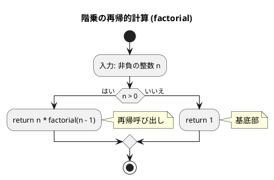
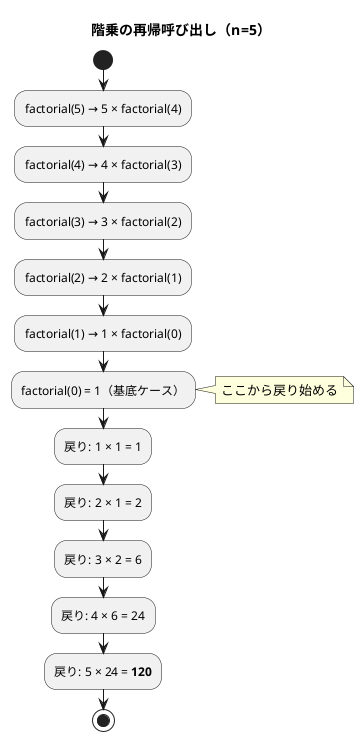
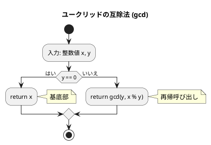
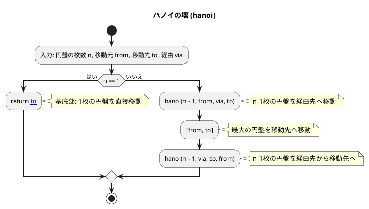
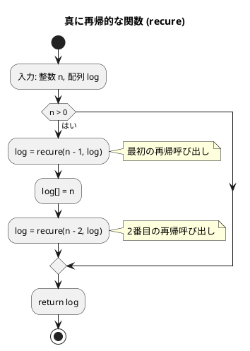
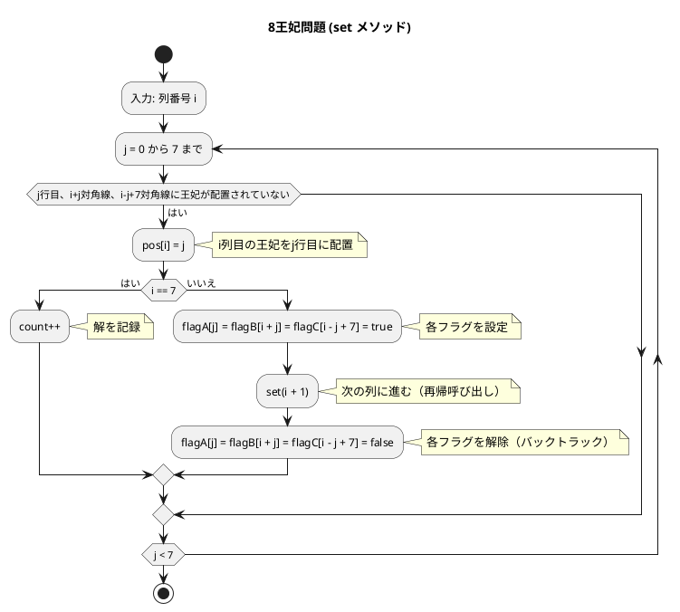

# 第 5 章 再帰アルゴリズム

## はじめに

前章ではスタックとキューというデータ構造を学びました。この章では「**再帰（Recursion）**」というアルゴリズム設計手法を TDD で実装します。

再帰とは、**ある関数が自分自身を呼び出す**ことで問題を解く手法です。大きな問題を同じ構造の小さな問題に分解し、最終的に自明な基底ケースに到達したら戻り始めます。

再帰は、多くの複雑な問題を簡潔かつエレガントに解決できる強力なツールですが、理解するのが難しい概念でもあります。この章では、テスト駆動開発の手法を用いて、再帰の基本から応用までを段階的に学んでいきます。

再帰アルゴリズムは、一般的に以下の 2 つの部分から構成されます：

1. **基底部（base case）**: 再帰呼び出しを終了する条件
2. **再帰部（recursive case）**: 問題を小さくして自分自身を呼び出す部分

### 目次

1. [階乗](#1-階乗)
2. [最大公約数（ユークリッドの互除法）](#2-最大公約数ユークリッドの互除法)
3. [ハノイの塔](#3-ハノイの塔)
4. [再帰アルゴリズムの解析](#4-再帰アルゴリズムの解析)
5. [8 王妃問題](#5-8-王妃問題)
6. [迷路探索（バックトラッキング）](#6-迷路探索バックトラッキング)

---

## 1. 階乗

`n! = n x (n-1) x ... x 1` を再帰で実装します。

### Red — 失敗するテストを書く

```php
<?php
declare(strict_types=1);
namespace Tests;

use Algorithm\Recursion;
use Algorithm\EightQueen;
use Algorithm\EightQueen2;
use Algorithm\EightQueen3;
use PHPUnit\Framework\TestCase;

class RecursionTest extends TestCase
{
    public function test0の階乗(): void
    {
        $this->assertSame(1, Recursion::factorial(0));
    }

    public function test5の階乗(): void
    {
        $this->assertSame(120, Recursion::factorial(5));
    }
}
```

### Green — テストを通す実装

```php
<?php
declare(strict_types=1);
namespace Algorithm;

class Recursion
{
    /** n の階乗を再帰的に計算 */
    public static function factorial(int $n): int
    {
        if ($n <= 0) {
            return 1;
        }
        return $n * self::factorial($n - 1);
    }
}
```

### アルゴリズムの考え方

#### フローチャート

以下は、階乗を再帰的に計算するアルゴリズムのフローチャートです：



この図は、階乗を再帰的に計算するアルゴリズム（factorial メソッド）のフローチャートです。

アルゴリズムの流れ：
1. 非負の整数 n を入力として受け取ります
2. n が 0 より大きいかどうかを判定します
   - n > 0 の場合：n と factorial(n - 1) の積を返します（再帰呼び出し）
   - n = 0 の場合：1 を返します（基底部）

再帰アルゴリズムでは、問題を「より小さな同じ問題」に分割して解きます。階乗の場合、n! = n x (n-1)! という関係を利用しています。再帰の終了条件（基底部）は n = 0 の場合で、0! = 1 と定義されています。

#### 再帰呼び出しの展開



**計算量**: O(n)（n 回の再帰呼び出し）

---

## 2. 最大公約数（ユークリッドの互除法）

`gcd(a, b) = gcd(b, a % b)` という関係を再帰で実装します。

### Red — 失敗するテストを書く

```php
    public function test22と8の最大公約数(): void
    {
        $this->assertSame(2, Recursion::gcd(22, 8));
    }

    public function test互いに素な数の最大公約数(): void
    {
        $this->assertSame(1, Recursion::gcd(7, 11));
    }
```

### Green — テストを通す実装

```php
    /** ユークリッドの互除法で最大公約数を求める */
    public static function gcd(int $x, int $y): int
    {
        if ($y === 0) {
            return $x;
        }
        return self::gcd($y, $x % $y);
    }
```

### アルゴリズムの考え方

#### フローチャート

以下は、ユークリッドの互除法による最大公約数を求めるアルゴリズムのフローチャートです：



この図は、ユークリッドの互除法による最大公約数を求めるアルゴリズム（gcd メソッド）のフローチャートです。

アルゴリズムの流れ：
1. 整数値 x と y を入力として受け取ります
2. y が 0 かどうかを判定します
   - y = 0 の場合：x を返します（基底部）
   - y が 0 でない場合：gcd(y, x % y) を返します（再帰呼び出し）

ユークリッドの互除法は、「2 つの整数の最大公約数は、一方の整数と、もう一方の整数を一方で割った余りの最大公約数に等しい」という性質を利用しています。

例えば、gcd(22, 8) を計算する場合：
1. y = 8 が 0 でないので、gcd(8, 22 % 8) = gcd(8, 6) を計算
2. y = 6 が 0 でないので、gcd(6, 8 % 6) = gcd(6, 2) を計算
3. y = 2 が 0 でないので、gcd(2, 6 % 2) = gcd(2, 0) を計算
4. y = 0 なので、x = 2 を返す

よって、gcd(22, 8) = 2 となります。

**計算量**: O(log min(x, y))

---

## 3. ハノイの塔

n 枚の円盤を A から C へ B を経由して移動する問題です。

```
ルール:
1. 一度に 1 枚しか移動できない
2. 大きい円盤を小さい円盤の上に置けない
```

### Red — 失敗するテストを書く

```php
    public function test円盤1枚のハノイ(): void
    {
        $moves = Recursion::hanoi(1, 'A', 'C', 'B');
        $this->assertSame([['A', 'C']], $moves);
    }

    public function test円盤3枚のハノイの手順数(): void
    {
        $moves = Recursion::hanoi(3, 'A', 'C', 'B');
        $this->assertCount(7, $moves);
    }

    public function testハノイの塔の手順数は2のn乗マイナス1(): void
    {
        for ($n = 1; $n <= 5; $n++) {
            $moves = Recursion::hanoi($n, 'A', 'C', 'B');
            $this->assertCount(2 ** $n - 1, $moves);
        }
    }
```

### Green — テストを通す実装

```php
    /**
     * ハノイの塔: n 枚の円盤を from から to へ via を経由して移動する手順を返す
     * @return list<array{0: string, 1: string}>
     */
    public static function hanoi(int $n, string $from, string $to, string $via): array
    {
        if ($n === 1) {
            return [[$from, $to]];
        }
        return array_merge(
            self::hanoi($n - 1, $from, $via, $to),  // n-1 枚を via へ
            [[$from, $to]],                           // 最大の円盤を to へ
            self::hanoi($n - 1, $via, $to, $from)    // n-1 枚を to へ
        );
    }
```

### アルゴリズムの考え方

#### フローチャート

以下は、ハノイの塔を解くアルゴリズムのフローチャートです：



この図は、ハノイの塔を解くアルゴリズム（hanoi メソッド）のフローチャートです。

アルゴリズムの流れ：
1. 円盤の枚数 n、移動元 from、移動先 to、経由 via を入力として受け取ります
2. n が 1 の場合（基底部）：移動元から移動先へ直接移動します
3. n が 1 より大きい場合：
   - n-1 枚の円盤を移動元から経由先へ移動します（再帰呼び出し）
   - 最大の円盤を移動元から移動先へ移動します
   - n-1 枚の円盤を経由先から移動先へ移動します（再帰呼び出し）

例えば、3 枚の円盤を A から C へ移動する場合（hanoi(3, 'A', 'C', 'B')）：
1. まず、上の 2 枚の円盤を A から B に移動します（hanoi(2, 'A', 'B', 'C')）
   - 上の 1 枚の円盤を A から C に移動し
   - 2 枚目の円盤を A から B に移動し
   - 上の 1 枚の円盤を C から B に移動する
2. 次に、3 枚目（最大）の円盤を A から C に移動します
3. 最後に、上の 2 枚の円盤を B から C に移動します（hanoi(2, 'B', 'C', 'A')）
   - 上の 1 枚の円盤を B から A に移動し
   - 2 枚目の円盤を B から C に移動し
   - 上の 1 枚の円盤を A から C に移動する

**計算量**: O(2^n)（移動回数 2^n - 1 回）

---

## 4. 再帰アルゴリズムの解析

### 真に再帰的な関数

「真に再帰的な関数」とは、複数の再帰呼び出しを含む関数のことです。

#### Red — 失敗するテストを書く

```php
    public function test真に再帰的な関数_recure4(): void
    {
        $this->assertSame([1, 2, 3, 1, 4, 1, 2], Recursion::recure(4, []));
    }
```

#### Green — テストを通す実装

```php
    /**
     * 真に再帰的な関数 recure
     * @param list<int> $log
     * @return list<int>
     */
    public static function recure(int $n, array $log): array
    {
        if ($n > 0) {
            $log = self::recure($n - 1, $log); // 最初の再帰呼び出し
            $log[] = $n;
            $log = self::recure($n - 2, $log); // 2番目の再帰呼び出し
        }
        return $log;
    }
```

#### フローチャート

以下は、真に再帰的な関数のフローチャートです：



この関数は「真に再帰的」と呼ばれます。なぜなら、1 つの関数呼び出しの中で複数回の再帰呼び出しを行うからです。

例えば、recure(4, []) を実行すると、以下のような呼び出しの連鎖が発生します：
- recure(4, []) は recure(3, []) を呼び出す
  - recure(3, []) は recure(2, []) を呼び出す
    - recure(2, []) は recure(1, []) を呼び出す
      - recure(1, []) は recure(0, []) を呼び出す（何もしない）
      - 1 を追加して [1] になる
      - recure(-1, [1]) を呼び出す（何もしない）
    - 2 を追加して [1, 2] になる
    - recure(0, [1, 2]) を呼び出す（何もしない）
  - 3 を追加して [1, 2, 3] になる
  - recure(1, [1, 2, 3]) を呼び出す
    - recure(0, ...) → 何もしない
    - 1 を追加して [1, 2, 3, 1] になる
    - recure(-1, ...) → 何もしない
- 4 を追加して [1, 2, 3, 1, 4] になる
- recure(2, [1, 2, 3, 1, 4]) を呼び出す
  - recure(1, ...) → 1 を追加して [1, 2, 3, 1, 4, 1] になる
  - 2 を追加して [1, 2, 3, 1, 4, 1, 2] になる

最終的に、recure(4, []) は [1, 2, 3, 1, 4, 1, 2] を返します。

### 再帰アルゴリズムの非再帰表現

再帰は概念的に理解しやすいですが、実行効率の面では問題があることがあります。特に、深い再帰呼び出しはスタックオーバーフローを引き起こす可能性があります。そのため、再帰アルゴリズムを非再帰（反復的）な形に変換することが重要です。

#### 末尾再帰の除去

末尾再帰（tail recursion）とは、関数の最後の操作が再帰呼び出しである場合の再帰のことです。末尾再帰は、ループに変換することで簡単に除去できます。

以下は、先ほどの `recure` 関数の末尾再帰を除去した例です：

```php
    /**
     * 末尾再帰を除去した関数 recure
     * @param list<int> $log
     * @return list<int>
     */
    public static function recure2(int $n, array $log): array
    {
        while ($n > 0) {
            $log = self::recure2($n - 1, $log); // 最初の再帰呼び出しはそのまま
            $log[] = $n;
            $n = $n - 2; // 2番目の再帰呼び出しをループに変換
        }
        return $log;
    }
```

#### 再帰の完全除去（明示的スタック）

すべての再帰呼び出しを除去するには、スタックを使用して関数の呼び出し状態を明示的に管理する必要があります。

以下は、`recure` 関数の再帰を完全に除去した例です：

```php
    /**
     * 明示的スタックによる非再帰実装
     * @param list<int> $log
     * @return list<int>
     */
    public static function recure3(int $n, array $log): array
    {
        $stack = [['type' => 'call', 'n' => $n]];

        while (!empty($stack)) {
            $item = array_pop($stack);
            if ($item['type'] === 'call') {
                $v = $item['n'];
                if ($v > 0) {
                    $stack[] = ['type' => 'call',  'n' => $v - 2];
                    $stack[] = ['type' => 'print', 'n' => $v];
                    $stack[] = ['type' => 'call',  'n' => $v - 1];
                }
            } else {
                $log[] = $item['n'];
            }
        }

        return $log;
    }
```

この実装では、スタック（PHP の配列を `array_pop` でスタックとして使用）を使って関数の呼び出し状態を明示的に管理しています。これにより、再帰呼び出しを使わずに同じ結果を得ることができます。

#### テスト

```php
    public function test末尾再帰除去版_recure2_4(): void
    {
        $this->assertSame([1, 2, 3, 1, 4, 1, 2], Recursion::recure2(4, []));
    }

    public function test完全非再帰版_recure3_4(): void
    {
        $this->assertSame([1, 2, 3, 1, 4, 1, 2], Recursion::recure3(4, []));
    }
```

---

## 5. 8 王妃問題

8 王妃問題は、8x8 のチェス盤上に 8 個の王妃を互いに攻撃できないように配置する問題です。王妃は、同じ行、同じ列、または同じ対角線上にある他の王妃を攻撃できます。

8 王妃問題は、バックトラッキング（試行錯誤）と再帰を使って解くことができる典型的な問題です。基本的なアプローチは、1 列目から順に王妃を配置し、矛盾が生じたら前の列に戻って別の配置を試すというものです。

### 王妃の配置

まず、各列に 1 個の王妃を配置する組み合わせを列挙する関数を実装します：

```php
<?php
declare(strict_types=1);
namespace Algorithm;

class EightQueen
{
    protected int $count = 0;
    /** @var list<int> */
    protected array $pos;

    public function __construct()
    {
        $this->pos = array_fill(0, 8, 0);
    }

    /** i 列目に王妃を配置 */
    public function set(int $i): void
    {
        for ($j = 0; $j < 8; $j++) {
            $this->pos[$i] = $j; // i 列目の王妃を j 行目に配置
            if ($i === 7) {       // 全列に配置完了
                $this->count++;
            } else {
                $this->set($i + 1); // 次の列に進む
            }
        }
    }

    /** @return \Countable */
    public function getResult(): \Countable
    {
        $count = $this->count;
        return new class($count) implements \Countable {
            public function __construct(private int $n) {}
            public function count(): int { return $this->n; }
        };
    }
}
```

この実装では、各列に王妃を配置する可能な組み合わせをすべて列挙しています。しかし、これでは王妃同士が攻撃できる配置も含まれてしまいます。

> **PHP 固有の設計判断**: `getResult()` が `Countable` を返す理由は、8^8 = 16,777,216 件の配列をメモリに保持するとメモリ不足になるため、カウンタのみ保持する設計にしています。PHP の匿名クラスを使って `Countable` インターフェースを実装しています。

### 限定操作と分岐限定法

次に、各行・各列に 1 個の王妃を配置する組み合わせを列挙する関数を実装します：

```php
<?php
declare(strict_types=1);
namespace Algorithm;

class EightQueen2 extends EightQueen
{
    /** @var list<bool> */
    private array $flag;

    public function __construct()
    {
        parent::__construct();
        $this->flag = array_fill(0, 8, false); // 各行に王妃が配置済みかのフラグ
    }

    /** i 列目の適切な位置に王妃を配置 */
    public function set(int $i): void
    {
        for ($j = 0; $j < 8; $j++) {
            if (!$this->flag[$j]) {            // j 行目に王妃が配置されていない
                $this->pos[$i] = $j;           // i 列目の王妃を j 行目に配置
                if ($i === 7) {                // 全列に配置完了
                    $this->count++;
                } else {
                    $this->flag[$j] = true;    // j 行目に王妃を配置済みとマーク
                    $this->set($i + 1);        // 次の列に進む
                    $this->flag[$j] = false;   // j 行目の王妃を取り除く（バックトラック）
                }
            }
        }
    }
}
```

この実装では、各行に 1 個の王妃を配置するという制約を追加しています。しかし、対角線上の制約はまだ考慮されていません。

### 8 王妃問題を解くプログラム

最後に、すべての制約（行、列、対角線）を考慮した完全な解を求める関数を実装します：

```php
<?php
declare(strict_types=1);
namespace Algorithm;

class EightQueen3 extends EightQueen
{
    /** @var list<bool> */
    private array $flagA;  // 各行に王妃が配置済みかのフラグ
    /** @var list<bool> */
    private array $flagB;  // 右上がりの対角線に王妃が配置済みかのフラグ
    /** @var list<bool> */
    private array $flagC;  // 右下がりの対角線に王妃が配置済みかのフラグ

    public function __construct()
    {
        parent::__construct();
        $this->flagA = array_fill(0, 8, false);
        $this->flagB = array_fill(0, 15, false);
        $this->flagC = array_fill(0, 15, false);
    }

    /** i 列目の適切な位置に王妃を配置 */
    public function set(int $i): void
    {
        for ($j = 0; $j < 8; $j++) {
            // j 行目、i+j 対角線、i-j+7 対角線に王妃が配置されていない
            if (!$this->flagA[$j]
                && !$this->flagB[$i + $j]
                && !$this->flagC[$i - $j + 7]
            ) {
                $this->pos[$i] = $j; // i 列目の王妃を j 行目に配置
                if ($i === 7) {       // 全列に配置完了
                    $this->count++;
                } else {
                    // 各フラグを設定
                    $this->flagA[$j] = true;
                    $this->flagB[$i + $j] = true;
                    $this->flagC[$i - $j + 7] = true;
                    $this->set($i + 1); // 次の列に進む
                    // 各フラグを解除（バックトラック）
                    $this->flagA[$j] = false;
                    $this->flagB[$i + $j] = false;
                    $this->flagC[$i - $j + 7] = false;
                }
            }
        }
    }
}
```

### テスト

```php
    public function test8クイーン全組み合わせは8の8乗(): void
    {
        $q = new EightQueen();
        $q->set(0);
        $this->assertCount(8 ** 8, $q->getResult());
    }

    public function test8クイーン行制約付きは8の階乗通り(): void
    {
        $q = new EightQueen2();
        $q->set(0);
        $this->assertCount(40320, $q->getResult()); // 8! = 40320
    }

    public function test8クイーン完全は92通り(): void
    {
        $q = new EightQueen3();
        $q->set(0);
        $this->assertCount(92, $q->getResult());
    }
```

#### フローチャート

以下は、8 王妃問題を解くアルゴリズムのフローチャートです：



このアルゴリズムは、バックトラッキング（試行錯誤）と再帰を使って 8 王妃問題を解きます。各列に 1 個の王妃を配置し、行、列、および両方向の対角線上に他の王妃がないことを確認しながら進めます。

矛盾が生じた場合（すべての行に配置できない場合）は、前の列に戻って別の配置を試します。これにより、8 王妃問題の 92 個の解をすべて見つけることができます。

バックトラッキングは、解の候補を少しずつ構築し、候補が解になる見込みがなくなった時点で打ち切る（バックトラックする）効率的な探索手法です。

---

## 6. 迷路探索（バックトラッキング）

再帰的バックトラッキングで迷路を解きます。行き止まりに達したら戻り、別の経路を試みます。

### Red — 失敗するテストを書く

```php
    public function test迷路が解ける(): void
    {
        $maze = [
            [1, 1, 1, 1, 1],
            [1, 0, 0, 0, 1],
            [1, 0, 1, 0, 1],
            [1, 0, 0, 0, 1],
            [1, 1, 1, 1, 1],
        ];
        $this->assertTrue(Recursion::mazeSolve($maze, 1, 1, 3, 3));
    }

    public function test迷路が解けない(): void
    {
        $maze = [
            [1, 1, 1, 1, 1],
            [1, 0, 1, 0, 1],
            [1, 0, 1, 0, 1],
            [1, 0, 1, 0, 1],
            [1, 1, 1, 1, 1],
        ];
        $this->assertFalse(Recursion::mazeSolve($maze, 1, 1, 3, 3));
    }
```

### Green — テストを通す実装

```php
    /**
     * 迷路探索（バックトラッキング）
     * @param list<list<int>> $maze
     * @param array<string, bool> $visited
     */
    public static function mazeSolve(
        array $maze,
        int $row,
        int $col,
        int $goalRow,
        int $goalCol,
        array &$visited = []
    ): bool {
        if ($row === $goalRow && $col === $goalCol) {
            return true;
        }

        $key = "{$row},{$col}";
        $visited[$key] = true;

        $directions = [[-1, 0], [1, 0], [0, -1], [0, 1]];
        foreach ($directions as [$dr, $dc]) {
            $nr = $row + $dr;
            $nc = $col + $dc;
            $nKey = "{$nr},{$nc}";
            if ($nr >= 0 && $nr < count($maze)
                && $nc >= 0 && $nc < count($maze[0])
                && $maze[$nr][$nc] === 0
                && !isset($visited[$nKey])
            ) {
                if (self::mazeSolve($maze, $nr, $nc, $goalRow, $goalCol, $visited)) {
                    return true;
                }
            }
        }

        return false;
    }
```

> **PHP 固有の注意点**: Python の `set` に相当する訪問済み管理として、PHP では連想配列 `array<string, bool>` を使用しています。キーとして `"行,列"` 形式の文字列を使い、`isset()` で存在チェックを行います。また、`$visited` は参照渡し（`&$visited`）にすることで、再帰呼び出し間で状態を共有しています。

---

## テスト実行結果

```bash
$ ./vendor/bin/phpunit tests/RecursionTest.php

...（全テストパス）...

OK
```

---

## 再帰アルゴリズムの比較

| アルゴリズム | 計算量 | 特徴 |
|-------------|--------|------|
| 階乗 | O(n) | 単純な線形再帰 |
| GCD（ユークリッド） | O(log min(x,y)) | 対数的収束 |
| ハノイの塔 | O(2^n) | 指数的成長 |
| 8 王妃問題 | O(n!) | バックトラッキングによる枝刈り |
| 迷路探索 | O(行数 x 列数) | バックトラッキング |

## Python 版との違い

| 概念 | Python | PHP |
|------|--------|-----|
| 静的メソッド | `@staticmethod` / モジュール関数 | `public static function` |
| 配列結合 | `list.extend()` / `+` 演算子 | `array_merge()` |
| タプル | `(src, dst)` | `[$from, $to]`（配列で代用） |
| 集合（訪問済み管理） | `set()` / `(row, col) not in visited` | 連想配列 + `isset()` |
| 参照渡し | リストは参照型（自動） | `array &$visited`（明示的に `&` が必要） |
| 冪乗演算子 | `2 ** n` | `2 ** $n`（PHP 5.6+ で同じ構文） |
| 配列初期化 | `[0] * 8` / `[False] * 15` | `array_fill(0, 8, 0)` / `array_fill(0, 15, false)` |
| カスタムクラスの結果 | `list` に全解を保持 | `Countable` でカウンタのみ保持（メモリ節約） |
| 分割代入 | `for dr, dc in directions` | `foreach ($directions as [$dr, $dc])` |
| スタック操作 | `list.append()` / `list.pop()` | `$stack[]` / `array_pop($stack)` |

## まとめ

この章では、再帰アルゴリズムについて学びました：

1. **再帰の基本**：階乗やユークリッドの互除法などの基本的な再帰アルゴリズム
2. **再帰アルゴリズムの解析**：真に再帰的な関数と再帰の非再帰表現（末尾再帰の除去、スタックによる完全除去）
3. **ハノイの塔**：再帰の古典的な応用例
4. **8 王妃問題**：バックトラッキングと再帰を組み合わせた複雑な問題
5. **迷路探索**：バックトラッキングによる経路探索

再帰は、問題を小さな部分問題に分割して解くための強力なツールです。しかし、深い再帰呼び出しはスタックオーバーフローを引き起こす可能性があるため、必要に応じて非再帰的な実装に変換することも重要です。

テスト駆動開発の手法を用いることで、これらの複雑な再帰アルゴリズムの正確な実装と理解を深めることができました。

次の章では、ソートアルゴリズムについて学んでいきましょう。

## 参考文献

- 『新・明解 Python で学ぶアルゴリズムとデータ構造』 — 柴田望洋
- 『テスト駆動開発』 — Kent Beck
