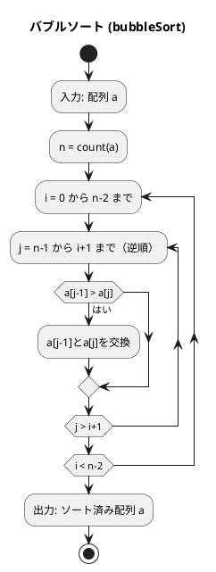
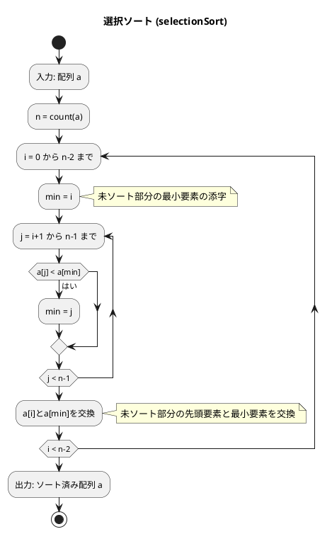
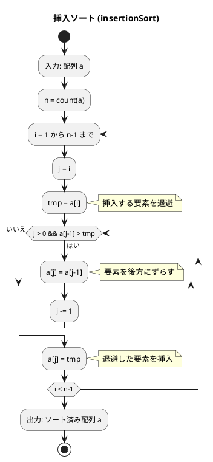
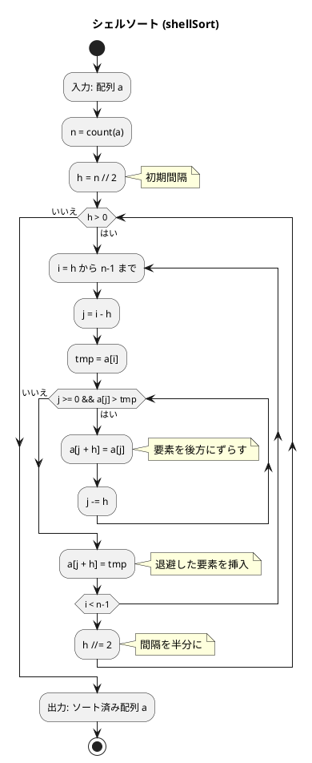
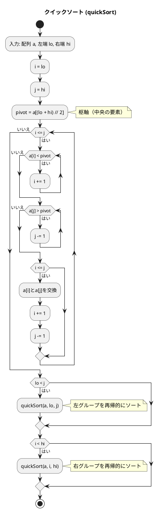
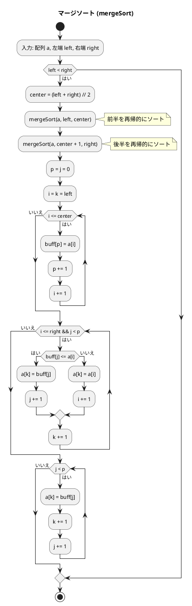

# 第 6 章 ソートアルゴリズム

## はじめに

前章では再帰アルゴリズムを学びました。この章では、データを特定の順序に並べ替える「ソートアルゴリズム」を TDD で実装します。

ソートは、コンピュータサイエンスにおける最も基本的かつ重要な操作の一つです。データが整列されていると、検索や他の操作が効率的に行えるようになります。様々なソートアルゴリズムが存在し、それぞれに長所と短所があります。

この章では、テスト駆動開発の手法を用いて、基本的なソートアルゴリズムから高度なものまで、様々なソート手法を実装していきます。

### 目次

1. [ソートとは](#ソートとは)
2. [バブルソート](#1-バブルソート)
3. [選択ソート](#2-選択ソート)
4. [挿入ソート](#3-挿入ソート)
5. [シェルソート](#4-シェルソート)
6. [クイックソート](#5-クイックソート)
7. [マージソート](#6-マージソート)
8. [ヒープソート](#7-ヒープソート)
9. [度数ソート](#8-度数ソート)

---

## ソートとは

ソートとは、データを特定の順序（通常は昇順または降順）に並べ替える操作です。ソートアルゴリズムは、以下のような特性によって評価されます：

- **時間計算量**: アルゴリズムの実行に必要な時間
- **空間計算量**: アルゴリズムが使用するメモリ量
- **安定性**: 同じ値を持つ要素の相対的な順序が保存されるか
- **適応性**: 既にある程度ソートされているデータに対する効率性

それでは、具体的なソートアルゴリズムを見ていきましょう。

---

## 1. バブルソート

隣接する要素を比較・交換し、最大値を末尾へ「浮き上がらせる」アルゴリズムです。

### Red — 失敗するテストを書く

```php
<?php
declare(strict_types=1);
namespace Tests;

use Algorithm\Sort;
use PHPUnit\Framework\TestCase;

class SortTest extends TestCase
{
    private array $unsorted = [6, 4, 3, 7, 1, 9, 8];
    private array $sorted   = [1, 3, 4, 6, 7, 8, 9];

    public function testバブルソート(): void
    {
        $a = $this->unsorted;
        Sort::bubbleSort($a);
        $this->assertSame($this->sorted, $a);
    }

    public function testバブルソート_整列済み(): void
    {
        $a = $this->sorted;
        Sort::bubbleSort($a);
        $this->assertSame($this->sorted, $a);
    }
}
```

### Green — テストを通す実装

```php
<?php
declare(strict_types=1);
namespace Algorithm;

class Sort
{
    /** バブルソート（in-place） */
    public static function bubbleSort(array &$a): void
    {
        $n = count($a);
        for ($i = 0; $i < $n - 1; $i++) {
            $swapped = false;
            for ($j = $n - 1; $j > $i; $j--) {
                if ($a[$j - 1] > $a[$j]) {
                    [$a[$j - 1], $a[$j]] = [$a[$j], $a[$j - 1]];
                    $swapped = true;
                }
            }
            if (!$swapped) {
                break; // 交換なし → 整列完了
            }
        }
    }
}
```

### フローチャート



この図は、バブルソート（単純交換ソート）のアルゴリズムのフローチャートです。

アルゴリズムの流れ：
1. 配列 a を入力として受け取ります
2. 変数 n に配列の長さを代入します
3. 0 から n-2 までの各インデックス i について、以下の処理を繰り返します：
   - n-1 から i+1 までの各インデックス j について（逆順に）、以下の処理を繰り返します：
     - a[j-1] が a[j] より大きい場合、a[j-1] と a[j] を交換します
4. ソート済みの配列 a を出力します

各パスが終わるごとに、最大の要素が配列の末尾に移動します。そのため、i 回目のパスでは、配列の末尾の i 個の要素は既にソート済みとなり、次のパスでは考慮する必要がありません。

### バブルソートの最適化

バブルソートは、以下のような最適化が可能です：

#### 走査範囲の限定

各走査で、最後に交換が行われた位置より先は既にソート済みであるため、次の走査ではその位置までしか見る必要がありません。

```php
    /** 単純交換ソート（第3版：走査範囲の限定） */
    public static function bubbleSort3(array &$a): void
    {
        $n = count($a);
        $k = 0;
        while ($k < $n - 1) {
            $last = $n - 1;
            for ($j = $n - 1; $j > $k; $j--) {
                if ($a[$j - 1] > $a[$j]) {
                    [$a[$j - 1], $a[$j]] = [$a[$j], $a[$j - 1]];
                    $last = $j;
                }
            }
            $k = $last;
        }
    }
```

### シェーカーソート

シェーカーソート（双方向バブルソート）は、バブルソートの変種で、走査を交互に上向きと下向きに行います。これにより、小さな値が先頭に、大きな値が末尾に同時に移動します。

```php
    /** シェーカーソート（双方向バブルソート） */
    public static function shakerSort(array &$a): void
    {
        $left = 0;
        $right = count($a) - 1;
        $last = $right;

        while ($left < $right) {
            // 下向きの走査
            for ($j = $right; $j > $left; $j--) {
                if ($a[$j - 1] > $a[$j]) {
                    [$a[$j - 1], $a[$j]] = [$a[$j], $a[$j - 1]];
                    $last = $j;
                }
            }
            $left = $last;

            // 上向きの走査
            for ($j = $left; $j < $right; $j++) {
                if ($a[$j] > $a[$j + 1]) {
                    [$a[$j], $a[$j + 1]] = [$a[$j + 1], $a[$j]];
                    $last = $j;
                }
            }
            $right = $last;
        }
    }
```

### 解説

**計算量**: 最悪 O(n^2)、最良 O(n)（整列済みの場合、最適化版）

バブルソートは単純で理解しやすいですが、大きなデータセットに対しては非効率です。しかし、データがほぼソート済みの場合は、最適化版が効率的に動作します。

---

## 2. 選択ソート

未整列部分の最小値を探し、先頭と交換するアルゴリズムです。

### Red — 失敗するテストを書く

```php
    public function test選択ソート(): void
    {
        $a = $this->unsorted;
        Sort::selectionSort($a);
        $this->assertSame($this->sorted, $a);
    }
```

### Green — テストを通す実装

```php
    /** 選択ソート（in-place） */
    public static function selectionSort(array &$a): void
    {
        $n = count($a);
        for ($i = 0; $i < $n - 1; $i++) {
            $minIdx = $i;
            for ($j = $i + 1; $j < $n; $j++) {
                if ($a[$j] < $a[$minIdx]) {
                    $minIdx = $j;
                }
            }
            if ($minIdx !== $i) {
                [$a[$i], $a[$minIdx]] = [$a[$minIdx], $a[$i]];
            }
        }
    }
```

### フローチャート



この図は、選択ソート（単純選択ソート）のアルゴリズムのフローチャートです。

アルゴリズムの流れ：
1. 配列 a を入力として受け取ります
2. 変数 n に配列の長さを代入します
3. 0 から n-2 までの各インデックス i について、以下の処理を繰り返します：
   - min を i に初期化します（未ソート部分の最小要素の添字）
   - i+1 から n-1 までの各インデックス j について、以下の処理を繰り返します：
     - a[j] が a[min] より小さい場合、min を j に更新します
   - a[i] と a[min] を交換します（未ソート部分の先頭要素と最小要素を交換）
4. ソート済みの配列 a を出力します

バブルソートと比較すると、選択ソートは交換回数が少ないという利点があります。具体的には、各パスで最大でも1回の交換しか行われません。

### 解説

**計算量**: 常に O(n^2)（整列済みでも改善されない）

選択ソートは、バブルソートと同様に単純ですが、交換回数が少ないという利点があります。具体的には、各パスで最大でも1回の交換しか行われません。しかし、大きなデータセットに対しては依然として非効率です。

---

## 3. 挿入ソート

未整列部分の先頭要素を、整列済み部分の適切な位置に挿入するアルゴリズムです。トランプのカードを手に持って並べ替える操作に似ています。

### Red — 失敗するテストを書く

```php
    public function test挿入ソート(): void
    {
        $a = $this->unsorted;
        Sort::insertionSort($a);
        $this->assertSame($this->sorted, $a);
    }
```

### Green — テストを通す実装

```php
    /** 挿入ソート（in-place） */
    public static function insertionSort(array &$a): void
    {
        $n = count($a);
        for ($i = 1; $i < $n; $i++) {
            $key = $a[$i];
            $j = $i - 1;
            while ($j >= 0 && $a[$j] > $key) {
                $a[$j + 1] = $a[$j];
                $j--;
            }
            $a[$j + 1] = $key;
        }
    }
```

### フローチャート



この図は、挿入ソート（単純挿入ソート）のアルゴリズムのフローチャートです。

アルゴリズムの流れ：
1. 配列 a を入力として受け取ります
2. 変数 n に配列の長さを代入します
3. 1 から n-1 までの各インデックス i について、以下の処理を繰り返します：
   - j を i に初期化します
   - tmp に a[i] を代入します（挿入する要素を退避）
   - j が 0 より大きく、かつ a[j-1] が tmp より大きい間、以下の処理を繰り返します：
     - a[j] に a[j-1] を代入します（要素を後方にずらす）
     - j を 1 減らします
   - a[j] に tmp を代入します（退避した要素を挿入）
4. ソート済みの配列 a を出力します

### 二分挿入ソート

挿入ソートの改良版として、二分探索を使って挿入位置を効率的に見つける「二分挿入ソート」があります：

```php
    /** 二分挿入ソート */
    public static function binaryInsertionSort(array &$a): void
    {
        $n = count($a);
        for ($i = 1; $i < $n; $i++) {
            $key = $a[$i];
            $pl = 0;       // 探索範囲の先頭要素の添字
            $pr = $i - 1;  // 探索範囲の末尾要素の添字

            // 二分探索で挿入位置を見つける
            while (true) {
                $pc = intdiv($pl + $pr, 2); // 探索範囲の中央要素の添字
                if ($a[$pc] === $key) {      // 探索成功
                    break;
                } elseif ($a[$pc] < $key) {
                    $pl = $pc + 1;
                } else {
                    $pr = $pc - 1;
                }
                if ($pl > $pr) {
                    break;
                }
            }

            // 挿入すべき位置の添字
            $pd = ($pl <= $pr) ? $pc + 1 : $pr + 1;

            // 要素を後方にずらす
            for ($j = $i; $j > $pd; $j--) {
                $a[$j] = $a[$j - 1];
            }

            $a[$pd] = $key; // 退避した要素を挿入
        }
    }
```

### 解説

**計算量**: 最悪 O(n^2)、最良 O(n)（整列済みの場合）

挿入ソートは、小さなデータセットや、ほぼソート済みのデータに対して効率的です。また、安定なソートアルゴリズムであり、オンラインアルゴリズム（データが逐次的に到着する場合に適用可能）としても使用できます。

二分挿入ソートは、挿入位置の探索を効率化しますが、要素の移動コストは変わらないため、全体の時間計算量は依然として O(n^2) です。

---

## 4. シェルソート

挿入ソートの改良版。間隔（gap）を縮小しながら複数回の挿入ソートを行います。離れた要素同士を先に比較・交換することで、大きな値を素早く後方に、小さな値を素早く前方に移動させることができます。

### Red — 失敗するテストを書く

```php
    public function testシェルソート(): void
    {
        $a = $this->unsorted;
        Sort::shellSort($a);
        $this->assertSame($this->sorted, $a);
    }
```

### Green — テストを通す実装

```php
    /** シェルソート（Knuth 数列使用） */
    public static function shellSort(array &$a): void
    {
        $n = count($a);
        $gap = 1;
        while ($gap * 3 + 1 < $n) {
            $gap = $gap * 3 + 1; // 1, 4, 13, 40, ...
        }

        while ($gap > 0) {
            for ($i = $gap; $i < $n; $i++) {
                $key = $a[$i];
                $j = $i - $gap;
                while ($j >= 0 && $a[$j] > $key) {
                    $a[$j + $gap] = $a[$j];
                    $j -= $gap;
                }
                $a[$j + $gap] = $key;
            }
            $gap = intdiv($gap, 3);
        }
    }
```

### フローチャート



この図は、シェルソートのアルゴリズムのフローチャートです。

アルゴリズムの流れ：
1. 配列 a を入力として受け取ります
2. 変数 n に配列の長さを代入します
3. 変数 h に初期間隔を設定します（Knuth 数列: 1, 4, 13, 40, ...）
4. h が 0 より大きい間、以下の処理を繰り返します：
   - h から n-1 までの各インデックス i について、以下の処理を繰り返します：
     - j を i-h に初期化します
     - tmp に a[i] を代入します（挿入する要素を退避）
     - j が 0 以上、かつ a[j] が tmp より大きい間、以下の処理を繰り返します：
       - a[j+h] に a[j] を代入します（要素を後方にずらす）
       - j を h 減らします
     - a[j+h] に tmp を代入します（退避した要素を挿入）
   - h を 3 で割ります（h = intdiv(h, 3)）
5. ソート済みの配列 a を出力します

最初は大きな間隔で要素を比較し、徐々に間隔を小さくしていきます。最終的に間隔が 1 になると、通常の挿入ソートと同じ処理になりますが、その時点で配列はほぼソートされているため、効率的に動作します。

### 解説

**計算量**: O(n^(3/2)) ~ O(n log^2 n)（gap 数列に依存）

シェルソートの時間計算量は、間隔列の選び方によって異なります：
- 最良の場合：O(n log n)
- 最悪の場合：O(n^2)（単純な間隔列の場合）
- 平均の場合：O(n^1.25)（Knuth の間隔列の場合）

シェルソートは、挿入ソートの欠点（小さな値が配列の後方にある場合の非効率性）を克服するために設計されました。

---

## 5. クイックソート

ピボットを基準に配列を 2 分割し、再帰的にソートします。「分割統治法」に基づく効率的なソートアルゴリズムで、実用的に最も高速なアルゴリズムの一つです。

### 分割手順

クイックソートの核心は、配列を枢軸を中心に分割する手順です：

```php
    /** 配列を分割 */
    private static function partition(array &$a, int $left, int $right): array
    {
        $pivot = $a[intdiv($left + $right, 2)]; // 枢軸（中央の要素）
        $i = $left;
        $j = $right;

        while ($i <= $j) {
            while ($a[$i] < $pivot) {
                $i++;
            }
            while ($a[$j] > $pivot) {
                $j--;
            }
            if ($i <= $j) {
                [$a[$i], $a[$j]] = [$a[$j], $a[$i]];
                $i++;
                $j--;
            }
        }

        return [$i, $j];
    }
```

### Red — 失敗するテストを書く

```php
    public function testクイックソート(): void
    {
        $a = $this->unsorted;
        Sort::quickSort($a);
        $this->assertSame($this->sorted, $a);
    }

    public function testクイックソート_大規模データ(): void
    {
        $a = range(0, 199);
        shuffle($a);
        Sort::quickSort($a);
        $this->assertSame(range(0, 199), $a);
    }
```

### Green — テストを通す実装

```php
    /** クイックソート（in-place） */
    public static function quickSort(array &$a, int $lo = 0, int $hi = -1): void
    {
        if ($hi === -1) {
            $hi = count($a) - 1;
        }
        if ($lo >= $hi) {
            return;
        }

        $pivot = $a[intdiv($lo + $hi, 2)];
        $i = $lo;
        $j = $hi;

        while ($i <= $j) {
            while ($a[$i] < $pivot) {
                $i++;
            }
            while ($a[$j] > $pivot) {
                $j--;
            }
            if ($i <= $j) {
                [$a[$i], $a[$j]] = [$a[$j], $a[$i]];
                $i++;
                $j--;
            }
        }

        self::quickSort($a, $lo, $j);
        self::quickSort($a, $i, $hi);
    }
```

### フローチャート



この図は、クイックソートのアルゴリズム（quickSort メソッド）のフローチャートです。

アルゴリズムの流れ：
1. 配列 a、左端 lo、右端 hi を入力として受け取ります
2. 左カーソル i を lo に、右カーソル j を hi に初期化します
3. 枢軸 pivot を a[(lo + hi) // 2]（中央の要素）に設定します
4. i が j 以下である間、以下の処理を繰り返します：
   - a[i] が pivot より小さい間、i を 1 増やします
   - a[j] が pivot より大きい間、j を 1 減らします
   - i が j 以下の場合：
     - a[i] と a[j] を交換します
     - i を 1 増やします
     - j を 1 減らします
5. lo が j より小さい場合、左グループ（lo から j まで）を再帰的にソートします
6. i が hi より小さい場合、右グループ（i から hi まで）を再帰的にソートします

### 非再帰的クイックソート

再帰を使わずにスタックを用いて実装することもできます：

```php
    /** 非再帰版クイックソート */
    public static function qsortStack(array &$a): void
    {
        $stack = [[0, count($a) - 1]];

        while (!empty($stack)) {
            [$left, $right] = array_pop($stack);
            $i = $left;
            $j = $right;
            $pivot = $a[intdiv($left + $right, 2)];

            while ($i <= $j) {
                while ($a[$i] < $pivot) {
                    $i++;
                }
                while ($a[$j] > $pivot) {
                    $j--;
                }
                if ($i <= $j) {
                    [$a[$i], $a[$j]] = [$a[$j], $a[$i]];
                    $i++;
                    $j--;
                }
            }

            if ($left < $j) {
                $stack[] = [$left, $j];  // 左グループのカーソルを保存
            }
            if ($i < $right) {
                $stack[] = [$i, $right]; // 右グループのカーソルを保存
            }
        }
    }
```

### 解説

**計算量**: 平均 O(n log n)、最悪 O(n^2)

クイックソートは、平均的には非常に効率的なアルゴリズムですが、最悪の場合（例えば、既にソート済みの配列や、すべての要素が同じ値の配列）では効率が悪くなることがあります。また、不安定なソートアルゴリズムです。しかし、適切な枢軸選択や小さな配列に対する挿入ソートへの切り替えなどの最適化により、実用的には非常に高速に動作します。

---

## 6. マージソート

配列を半分に分割し、再帰的にソートして結合します。「分割統治法」に基づくもう一つの効率的なソートアルゴリズムです。

### ソート済み配列のマージ

マージソートの核心は、2 つのソート済み配列をマージする手順です：

```php
    /** ソート済み配列 a と b をマージして c に格納 */
    public static function mergeSortedArray(array $a, array $b, array &$c): void
    {
        $pa = 0;
        $pb = 0;
        $pc = 0;
        $na = count($a);
        $nb = count($b);

        while ($pa < $na && $pb < $nb) { // 小さいほうを格納
            if ($a[$pa] <= $b[$pb]) {
                $c[$pc] = $a[$pa];
                $pa++;
            } else {
                $c[$pc] = $b[$pb];
                $pb++;
            }
            $pc++;
        }

        while ($pa < $na) { // a に残った要素をコピー
            $c[$pc] = $a[$pa];
            $pa++;
            $pc++;
        }

        while ($pb < $nb) { // b に残った要素をコピー
            $c[$pc] = $b[$pb];
            $pb++;
            $pc++;
        }
    }
```

### Red — 失敗するテストを書く

```php
    public function testマージソート(): void
    {
        $a = $this->unsorted;
        $this->assertSame($this->sorted, Sort::mergeSort($a));
    }

    public function testソート済み配列のマージ(): void
    {
        $a = [1, 3, 5, 7];
        $b = [2, 4, 6, 8];
        $c = array_fill(0, 8, 0);
        Sort::mergeSortedArray($a, $b, $c);
        $this->assertSame([1, 2, 3, 4, 5, 6, 7, 8], $c);
    }
```

### Green — テストを通す実装

```php
    /** マージソート（新しい配列を返す） */
    public static function mergeSort(array $a): array
    {
        $n = count($a);
        if ($n <= 1) {
            return $a;
        }

        $mid = intdiv($n, 2);
        $left  = self::mergeSort(array_slice($a, 0, $mid));
        $right = self::mergeSort(array_slice($a, $mid));

        return self::merge($left, $right);
    }

    /** 2 つの整列済み配列をマージ */
    private static function merge(array $left, array $right): array
    {
        $result = [];
        $i = 0;
        $j = 0;

        while ($i < count($left) && $j < count($right)) {
            if ($left[$i] <= $right[$j]) {
                $result[] = $left[$i];
                $i++;
            } else {
                $result[] = $right[$j];
                $j++;
            }
        }

        while ($i < count($left)) {
            $result[] = $left[$i];
            $i++;
        }

        while ($j < count($right)) {
            $result[] = $right[$j];
            $j++;
        }

        return $result;
    }
```

### フローチャート



この図は、マージソートのアルゴリズムのフローチャートです。

アルゴリズムの流れ：
1. 配列 a、左端 left、右端 right を入力として受け取ります
2. left が right より小さい場合（ソートする要素が 2 つ以上ある場合）：
   - center を (left + right) // 2 に設定します（配列の中央位置）
   - 前半部分（left から center まで）を再帰的にソートします
   - 後半部分（center + 1 から right まで）を再帰的にソートします
   - 前半部分を作業用配列 buff にコピーします
   - 前半部分（buff に格納）と後半部分（a に格納）をマージします：
     - buff[j] と a[i] を比較し、小さい方を a[k] に格納します
     - 対応するインデックス（j または i）を 1 増やします
     - k を 1 増やします
   - buff に残った要素を a にコピーします

このアルゴリズムの特徴は、どのような入力に対しても安定した性能を発揮する点です。また、安定なソートアルゴリズムであるという利点もあります。ただし、追加のメモリ空間（作業用配列）が必要であるという欠点があります。

### 解説

**計算量**: 常に O(n log n)

マージソートは、どのような入力に対しても安定した性能を発揮する安定なソートアルゴリズムです。しかし、追加のメモリ空間（作業用配列）が必要であるという欠点があります。

---

## 7. ヒープソート

ヒープデータ構造を利用したソートアルゴリズムです。ヒープは、親ノードが子ノードよりも大きい（または小さい）という性質を持つ二分木です。

### Red — 失敗するテストを書く

```php
    public function testヒープソート(): void
    {
        $a = $this->unsorted;
        Sort::heapSort($a);
        $this->assertSame($this->sorted, $a);
    }
```

### Green — テストを通す実装

```php
    /** ヒープソート */
    public static function heapSort(array &$a): void
    {
        $n = count($a);

        // a[i]~a[n-1] をヒープ化
        for ($i = intdiv($n - 1, 2); $i >= 0; $i--) {
            self::downHeap($a, $i, $n - 1);
        }

        // ヒープの最大要素と未ソート部末尾要素を交換
        for ($i = $n - 1; $i > 0; $i--) {
            [$a[0], $a[$i]] = [$a[$i], $a[0]];
            self::downHeap($a, 0, $i - 1);
        }
    }

    /** a[left]~a[right] をヒープ化 */
    private static function downHeap(array &$a, int $left, int $right): void
    {
        $temp = $a[$left]; // 根
        $parent = $left;

        while ($parent < intdiv($right + 1, 2)) {
            $cl = $parent * 2 + 1; // 左の子
            $cr = $cl + 1;          // 右の子
            $child = ($cr <= $right && $a[$cr] > $a[$cl]) ? $cr : $cl; // 大きいほう
            if ($temp >= $a[$child]) {
                break;
            }
            $a[$parent] = $a[$child];
            $parent = $child;
        }

        $a[$parent] = $temp;
    }
```

### 解説

**計算量**: 常に O(n log n)

ヒープソートは、どのような入力に対しても安定した性能を発揮し、追加のメモリ空間を必要としないという利点があります。しかし、不安定なソートアルゴリズムであり、キャッシュ効率が悪いという欠点もあります。

---

## 8. 度数ソート

度数ソート（カウンティングソート）は、要素の値の範囲が限られている場合に効率的なソートアルゴリズムです。各値の出現回数をカウントし、それに基づいてソートを行います。

### Red — 失敗するテストを書く

```php
    public function test度数ソート(): void
    {
        $a = $this->unsorted;
        $this->assertSame($this->sorted, Sort::countingSort($a));
    }

    public function test度数ソート_大きな値(): void
    {
        $a = [22, 5, 11, 32, 120, 68, 70];
        $this->assertSame([5, 11, 22, 32, 68, 70, 120], Sort::countingSort($a));
    }
```

### Green — テストを通す実装

```php
    /** 度数ソート（新しい配列を返す） */
    public static function countingSort(array $a): array
    {
        return self::fsort($a, max($a));
    }

    /** 度数ソート（配列要素の値は 0 以上 maxVal 以下） */
    private static function fsort(array $a, int $maxVal): array
    {
        $n = count($a);
        $f = array_fill(0, $maxVal + 1, 0); // 累積度数
        $b = array_fill(0, $n, 0);           // 作業用目的配列

        // 各要素の度数をカウント
        for ($i = 0; $i < $n; $i++) {
            $f[$a[$i]]++;
        }

        // 累積度数を計算
        for ($i = 1; $i <= $maxVal; $i++) {
            $f[$i] += $f[$i - 1];
        }

        // 各要素を作業用配列に格納
        for ($i = $n - 1; $i >= 0; $i--) {
            $f[$a[$i]]--;
            $b[$f[$a[$i]]] = $a[$i];
        }

        return $b;
    }
```

### 解説

**計算量**: O(n + k)（n は要素数、k は値の範囲）

度数ソートは、値の範囲が小さい場合に非常に効率的ですが、値の範囲が大きい場合はメモリ使用量が増大するという欠点があります。また、浮動小数点数や文字列などの比較可能なデータ型には直接適用できません。

---

## テスト実行結果

```bash
$ ./vendor/bin/phpunit tests/SortTest.php

...（全テストパス）...

OK
```

---

## ソートアルゴリズムの比較

| アルゴリズム | 最良 | 平均 | 最悪 | 安定 | 備考 |
|-------------|------|------|------|------|------|
| バブルソート | O(n) | O(n^2) | O(n^2) | Yes | 整列済み検出あり |
| 選択ソート | O(n^2) | O(n^2) | O(n^2) | No | 交換回数が少ない |
| 挿入ソート | O(n) | O(n^2) | O(n^2) | Yes | 小規模データに有効 |
| シェルソート | O(n) | O(n^1.5) | O(n^2) | No | 挿入ソートの改良 |
| クイックソート | O(n log n) | O(n log n) | O(n^2) | No | 実用的に最速 |
| マージソート | O(n log n) | O(n log n) | O(n log n) | Yes | 追加メモリが必要 |
| ヒープソート | O(n log n) | O(n log n) | O(n log n) | No | 追加メモリ不要 |
| 度数ソート | O(n + k) | O(n + k) | O(n + k) | Yes | 値の範囲が限定的な場合に有効 |

## Python 版との違い

| 概念 | Python | PHP |
|------|--------|-----|
| インプレース変更 | `a[i], a[j] = a[j], a[i]` | `[$a[$i], $a[$j]] = [$a[$j], $a[$i]]` |
| 参照渡し | リストは参照型（自動） | `array &$a`（明示的に `&` が必要） |
| 新配列を返す | 引数はそのまま | `mergeSort()` / `countingSort()` は値渡し |
| 整数除算 | `n // 2` | `intdiv($n, 2)` |
| 配列の長さ | `len(a)` | `count($a)` |
| 配列スライス | `a[:mid]` / `a[mid:]` | `array_slice($a, 0, $mid)` / `array_slice($a, $mid)` |
| 最大値 | `max(a)` | `max($a)` |
| 配列初期化 | `[0] * n` | `array_fill(0, $n, 0)` |
| 配列追加 | `result.append(x)` | `$result[] = $x` |
| range ループ | `for i in range(n)` | `for ($i = 0; $i < $n; $i++)` |
| スタック操作 | `list.append()` / `list.pop()` | `$stack[]` / `array_pop($stack)` |
| bisect ライブラリ | `bisect.insort()` | 手動実装（標準ライブラリに相当機能なし） |

## まとめ

この章では、様々なソートアルゴリズムについて学びました：

1. **バブルソート** — 隣接する要素を比較・交換する単純なアルゴリズム
2. **選択ソート** — 未ソート部分から最小要素を選択するアルゴリズム
3. **挿入ソート** — ソート済み部分に要素を挿入するアルゴリズム
4. **シェルソート** — 挿入ソートを改良したアルゴリズム
5. **クイックソート** — 分割統治法に基づく高速なアルゴリズム
6. **マージソート** — 分割統治法に基づく安定なアルゴリズム
7. **ヒープソート** — ヒープデータ構造を利用するアルゴリズム
8. **度数ソート** — 要素の値の範囲が限られている場合に効率的なアルゴリズム

各アルゴリズムには長所と短所があり、データの特性や要件に応じて適切なアルゴリズムを選択することが重要です。

テスト駆動開発の手法を用いることで、これらの複雑なソートアルゴリズムの正確な実装と理解を深めることができました。

次の章では、文字列処理について学んでいきましょう。

## 参考文献

- 『新・明解 Python で学ぶアルゴリズムとデータ構造』 — 柴田望洋
- 『テスト駆動開発』 — Kent Beck
