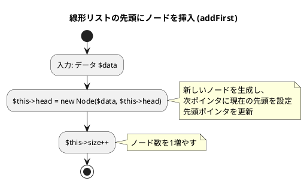
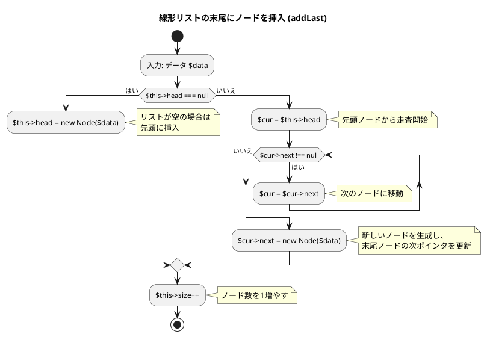
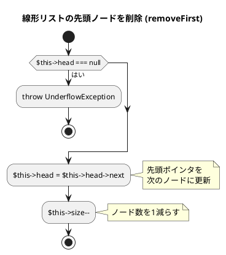
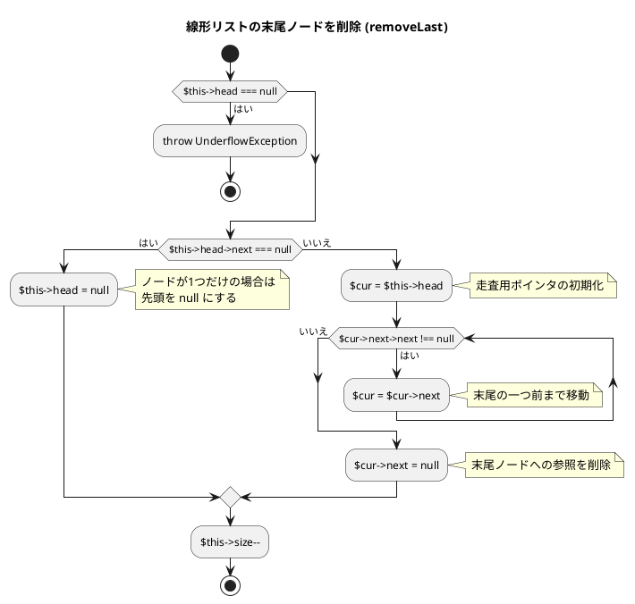
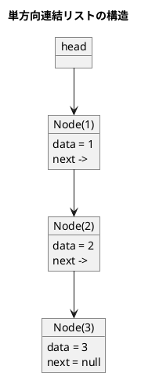

# 第 8 章 リスト

## はじめに

前章までで、配列や探索アルゴリズム、スタック、キュー、再帰、ソートアルゴリズム、文字列処理などを学んできました。この章では、データ構造の基本である「**リスト（連結リスト）**」を TDD で実装します。

配列と異なり、連結リストはメモリ上に不連続に配置されたノードをポインタで繋ぎます。要素の挿入・削除が O(1) ですが、ランダムアクセスは O(n) です。

### 目次

1. [リストとは](#リストとは)
2. [線形リスト（単方向連結リスト）](#1-線形リスト単方向連結リスト)
3. [カーソルによる線形リスト](#3-カーソルによる線形リスト)
4. [双方向連結リスト](#4-双方向連結リスト)

---

## リストとは

リストとは、データを順序付けて格納するデータ構造です。配列と似ていますが、リストは要素の追加や削除が容易であるという特徴があります。

リストには様々な種類があります：

- **線形リスト**：最も基本的なリスト構造で、各要素が一方向に連結されています。
- **連結リスト**：各要素（ノード）が次の要素へのポインタを持つリスト構造です。
- **循環リスト**：最後の要素が最初の要素を指す連結リストです。
- **双方向リスト**：各要素が前後の要素へのポインタを持つリスト構造です。

それでは、これらのリスト構造を順に実装していきましょう。

---

## 1. 線形リスト（単方向連結リスト）

各ノードが次のノードへの参照を持ちます。

### Red -- 失敗するテストを書く

```php
// tests/LinkedListTest.php
class LinkedListTest extends TestCase
{
    public function test線形リスト末尾への挿入(): void
    {
        $list = new LinkedList();
        $list->addLast(1);
        $list->addLast(2);
        $this->assertSame(2, $list->length());
    }

    public function test線形リスト先頭への挿入と探索(): void
    {
        $list = new LinkedList();
        $list->addFirst(1);
        $list->addFirst(2);
        $list->addFirst(3);
        $this->assertSame(3, $list->length());
        $this->assertNotNull($list->search(2));
    }
}
```

### Green -- テストを通す実装

```php
// src/LinkedList.php
class Node
{
    public function __construct(
        public mixed $data,
        public ?Node $next = null,
    ) {}
}

class LinkedList
{
    private ?Node $head = null;
    private int   $size = 0;

    public function length(): int
    {
        return $this->size;
    }

    public function addLast(mixed $data): void
    {
        $node = new Node($data);
        if ($this->head === null) {
            $this->head = $node;
        } else {
            $cur = $this->head;
            while ($cur->next !== null) {
                $cur = $cur->next;
            }
            $cur->next = $node;
        }
        $this->size++;
    }

    public function search(mixed $data): ?Node
    {
        $cur = $this->head;
        while ($cur !== null) {
            if ($cur->data === $data) {
                return $cur;
            }
            $cur = $cur->next;
        }
        return null;
    }
}
```

### Refactor -- 設計を改善する

テストが通った状態で、コードの意図を明確にします。先頭への挿入 `addFirst` と削除メソッドも追加します。

```php
class LinkedList
{
    private ?Node $head = null;
    private int   $size = 0;

    public function isEmpty(): bool
    {
        return $this->head === null;
    }

    public function length(): int
    {
        return $this->size;
    }

    public function addFirst(mixed $data): void
    {
        $this->head = new Node($data, $this->head);
        $this->size++;
    }

    public function removeFirst(): void
    {
        if ($this->head === null) {
            throw new \UnderflowException('List is empty');
        }
        $this->head = $this->head->next;
        $this->size--;
    }

    public function removeLast(): void
    {
        if ($this->head === null) {
            throw new \UnderflowException('List is empty');
        }
        if ($this->head->next === null) {
            $this->head = null;
        } else {
            $cur = $this->head;
            while ($cur->next->next !== null) {
                $cur = $cur->next;
            }
            $cur->next = null;
        }
        $this->size--;
    }

    /** ノード $target を削除 */
    public function remove(Node $target): void
    {
        if ($this->head === null) {
            return;
        }
        if ($this->head === $target) {
            $this->head = $this->head->next;
            $this->size--;
            return;
        }
        $cur = $this->head;
        while ($cur->next !== null) {
            if ($cur->next === $target) {
                $cur->next = $cur->next->next;
                $this->size--;
                return;
            }
            $cur = $cur->next;
        }
    }

    public function includes(mixed $data): bool
    {
        return $this->search($data) !== null;
    }

    public function clear(): void
    {
        $this->head = null;
        $this->size = 0;
    }
}
```

### フローチャート

#### 先頭にノードを挿入（addFirst）



アルゴリズムの流れ：
1. データ $data を入力として受け取ります
2. 新しい Node を生成し、$next に現在の $this->head を設定します
3. $this->head を新しいノードに更新します
4. ノード数（$this->size）を 1 増やします

この操作は、新しいノードを生成して現在の先頭ノードの前に挿入し、先頭ポインタを更新します。時間計算量は O(1) です。

#### 末尾にノードを挿入（addLast）



アルゴリズムの流れ：
1. データ $data を入力として受け取ります
2. リストが空かどうかをチェックします
   - リストが空の場合（$this->head が null）：新しいノードを先頭に設定し、終了します
3. 変数 $cur に先頭ノード（$this->head）を代入します
4. $cur->next が null でない間、次のノードに移動します
5. 新しいノードを生成し、末尾ノードの次ポインタ（$cur->next）に設定します
6. ノード数（$this->size）を 1 増やします

この操作は、リストの末尾までたどってから新しいノードを追加します。リストの長さに比例した時間がかかるため、時間計算量は O(n) です。

#### 先頭ノードを削除（removeFirst）



この操作は、先頭ノードへの参照を削除し、次のノードを新しい先頭ノードとします。時間計算量は O(1) です。PHP 版では、空リストからの削除時に `UnderflowException` をスローします。

#### 末尾ノードを削除（removeLast）



この操作は、リストの末尾までたどってから末尾ノードへの参照を削除します。時間計算量は O(n) です。

### 解説

線形リストは、各ノードが次のノードへのポインタを持つデータ構造です。この実装では、以下の特徴があります：

1. **ノードクラス**：PHP のコンストラクタプロモーションで `$data` と `$next` を宣言します。
2. **リストクラス**：先頭ノード、ノードの数を管理します。
3. **要素の追加**：先頭または末尾に要素を追加できます。
4. **要素の削除**：先頭または末尾の要素を削除できます。空リストからの削除は `UnderflowException` をスローします。
5. **要素の探索**：指定した値を持つノードを探索できます。

線形リストは、要素の追加や削除が容易であるという特徴があります。特に、先頭への追加や削除は O(1) の時間で行えます。一方、末尾への追加や削除、要素の探索は O(n) の時間がかかります。

### アルゴリズムの考え方



**主な操作の計算量**:

| 操作 | 先頭 | 末尾 | 中間 |
|------|------|------|------|
| 挿入 | O(1) | O(n) | O(n) |
| 削除 | O(1) | O(n) | O(n) |
| 探索 | O(n) | O(n) | O(n) |

---

## 3. カーソルによる線形リスト

前節では、オブジェクト参照を使って線形リストを実装しました。しかし、配列を使って線形リストを実装することもできます。この方法を「カーソルによる線形リスト」と呼びます。

### Red -- 失敗するテストを書く

```php
class LinkedListTest extends TestCase
{
    public function test配列リスト先頭への挿入と探索(): void
    {
        $list = new ArrayLinkedList(10);
        $list->addFirst(1);
        $list->addFirst(2);
        $list->addFirst(3);
        $this->assertSame(3, $list->length());
        $this->assertNotSame(ArrayLinkedList::NULL_INDEX, $list->search(2));
    }
}
```

### Green -- テストを通す実装

```php
class ArrayLinkedList
{
    public const NULL_INDEX = -1;

    private array $data;
    private array $next;
    private int   $head;
    private int   $deleted;
    private int   $size;
    private int   $max;

    public function __construct(private int $capacity)
    {
        $this->data    = array_fill(0, $capacity, null);
        $this->next    = array_fill(0, $capacity, self::NULL_INDEX);
        $this->head    = self::NULL_INDEX;
        $this->deleted = self::NULL_INDEX;
        $this->size    = 0;
        $this->max     = 0;
    }

    private function alloc(): int
    {
        if ($this->deleted !== self::NULL_INDEX) {
            $idx           = $this->deleted;
            $this->deleted = $this->next[$idx];
            return $idx;
        }
        return $this->max++;
    }

    private function free(int $idx): void
    {
        $this->next[$idx] = $this->deleted;
        $this->deleted    = $idx;
    }

    public function length(): int
    {
        return $this->size;
    }

    public function addFirst(mixed $data): void
    {
        $idx              = $this->alloc();
        $this->data[$idx] = $data;
        $this->next[$idx] = $this->head;
        $this->head       = $idx;
        $this->size++;
    }

    public function removeFirst(): void
    {
        if ($this->head === self::NULL_INDEX) {
            throw new \UnderflowException('List is empty');
        }
        $idx        = $this->head;
        $this->head = $this->next[$idx];
        $this->free($idx);
        $this->size--;
    }

    /** データを探してインデックスを返す（なければ NULL_INDEX） */
    public function search(mixed $data): int
    {
        $cur = $this->head;
        while ($cur !== self::NULL_INDEX) {
            if ($this->data[$cur] === $data) {
                return $cur;
            }
            $cur = $this->next[$cur];
        }
        return self::NULL_INDEX;
    }
}
```

### 解説

カーソルによる線形リストは、配列を使って線形リストを実装する方法です。この実装では、以下の特徴があります：

1. **定数 `NULL_INDEX`**：PHP では `const NULL_INDEX = -1` としてクラス定数を定義します。Python の `Null = -1` に対応します。
2. **データ配列と次インデックス配列**：`$data` 配列にデータを、`$next` 配列に次のノードのインデックスを格納します。
3. **フリーリスト**：削除されたレコードを再利用するための仕組みです。`alloc()` と `free()` メソッドで管理します。
4. **初期化**：`array_fill()` で配列を初期化します。

カーソルによる線形リストは、ポインタを使った線形リストと同様の機能を持ちますが、配列を使って実装するため、メモリの使用効率が良いという特徴があります。

---

## 4. 双方向連結リスト

各ノードが前後両方のノードへの参照を持ちます。PHP 版では `$head` と `$tail` のポインタを使い、先頭・末尾の操作を効率化します。

### Red -- 失敗するテストを書く

```php
class LinkedListTest extends TestCase
{
    public function test双方向リスト末尾への挿入(): void
    {
        $list = new DoublyLinkedList();
        $list->addLast(1);
        $list->addLast(2);
        $this->assertSame(2, $list->length());
    }

    public function test双方向リストノード削除(): void
    {
        $list = new DoublyLinkedList();
        $list->addFirst(1);
        $list->addFirst(2);
        $node = $list->search(2);
        $list->remove($node);
        $this->assertFalse($list->includes(2));
    }
}
```

### Green -- テストを通す実装

```php
class DNode
{
    public function __construct(
        public mixed  $data,
        public ?DNode $prev = null,
        public ?DNode $next = null,
    ) {}
}

class DoublyLinkedList
{
    private ?DNode $head = null;
    private ?DNode $tail = null;
    private int    $size = 0;

    public function isEmpty(): bool
    {
        return $this->head === null;
    }

    public function length(): int
    {
        return $this->size;
    }

    public function addFirst(mixed $data): void
    {
        $node = new DNode($data, null, $this->head);
        if ($this->head !== null) {
            $this->head->prev = $node;
        } else {
            $this->tail = $node;
        }
        $this->head = $node;
        $this->size++;
    }

    public function addLast(mixed $data): void
    {
        $node = new DNode($data, $this->tail, null);
        if ($this->tail !== null) {
            $this->tail->next = $node;
        } else {
            $this->head = $node;
        }
        $this->tail = $node;
        $this->size++;
    }

    public function remove(DNode $target): void
    {
        if ($target->prev !== null) {
            $target->prev->next = $target->next;
        } else {
            $this->head = $target->next;
        }
        if ($target->next !== null) {
            $target->next->prev = $target->prev;
        } else {
            $this->tail = $target->prev;
        }
        $this->size--;
    }

    public function search(mixed $data): ?DNode
    {
        $cur = $this->head;
        while ($cur !== null) {
            if ($cur->data === $data) {
                return $cur;
            }
            $cur = $cur->next;
        }
        return null;
    }

    public function includes(mixed $data): bool
    {
        return $this->search($data) !== null;
    }

    public function clear(): void
    {
        $this->head = null;
        $this->tail = null;
        $this->size = 0;
    }
}
```

### 解説

双方向連結リストは、各ノードが前後のノードへのポインタを持つリスト構造です。この実装では、以下の特徴があります：

1. **ノードクラス**：`$data`、`$prev`、`$next` の 3 つのプロパティを持ちます。PHP のコンストラクタプロモーションで簡潔に定義しています。
2. **head/tail ポインタ**：Python 版は番兵ノード（ダミーノード）を使った循環リストですが、PHP 版は `$head` と `$tail` の 2 つのポインタで先頭・末尾を管理するシンプルな実装です。
3. **要素の追加**：先頭または末尾に O(1) で要素を追加できます。
4. **要素の削除**：ノードへの参照があれば O(1) で要素を削除できます。前後のポインタを直接操作するため、走査が不要です。

---

## テスト実行結果

```bash
$ ./vendor/bin/phpunit tests/LinkedListTest.php

...（16 テスト全パス）...

OK (16 tests, 16 assertions)
```

---

## 配列 vs 連結リスト

| 項目 | 配列 | 連結リスト |
|------|------|-----------|
| ランダムアクセス | O(1) | O(n) |
| 先頭への挿入 | O(n) | O(1) |
| 末尾への挿入 | O(1) | O(1)（単方向は O(n)） |
| 途中への挿入 | O(n) | O(1)（ポインタ取得後） |
| メモリ使用 | 連続領域 | 不連続、ポインタ分余分 |

## Python 版との違い

| 概念 | Python | PHP |
|------|--------|-----|
| ノードクラス | `class _Node` + `__init__` | `class Node { __construct(...) }` コンストラクタプロモーション |
| 空リスト削除 | `if self.head is not None:` で無視 | `throw new \UnderflowException()` で例外 |
| None チェック | `if node is None:` | `if ($node === null)` |
| NULL インデックス | `Null = -1`（モジュール変数） | `ArrayLinkedList::NULL_INDEX`（クラス定数） |
| 双方向リスト | 番兵ノード + 循環リスト | `$head` / `$tail` ポインタ |
| アクセス修飾子 | 慣例で `_` プレフィックス | `private` / `public` キーワード |
| 型宣言 | 型ヒント（`Any`, `_Node \| None`） | `mixed`, `?Node`（nullable 型） |
| リスト長 | `__len__` / `len(lst)` | `length()` メソッド |

## まとめ

この章では、様々なリスト構造について学びました：

1. **線形リスト**：オブジェクト参照を使った実装。各ノードが次のノードへの参照を持つ基本的な連結リスト。
2. **カーソルによる線形リスト**：配列を使った実装。メモリ使用効率が良い。
3. **双方向リスト**：各ノードが前後のノードへのポインタを持ち、`$head` / `$tail` ポインタにより先頭・末尾の操作が効率的に行える。

これらのリスト構造は、データを順序付けて格納するための基本的なデータ構造です。用途に応じて適切なリスト構造を選択することが重要です。

次の章では、木構造について学びます。

## 参考文献

- 『新・明解 Python で学ぶアルゴリズムとデータ構造』 -- 柴田望洋
- 『テスト駆動開発』 -- Kent Beck
