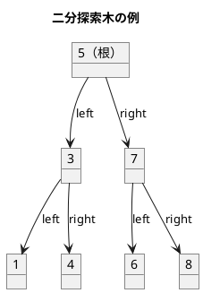
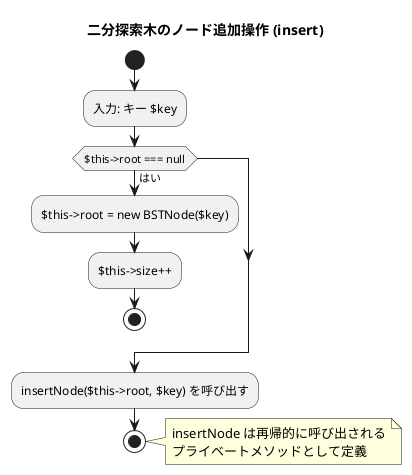
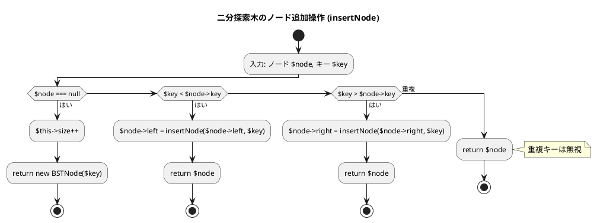
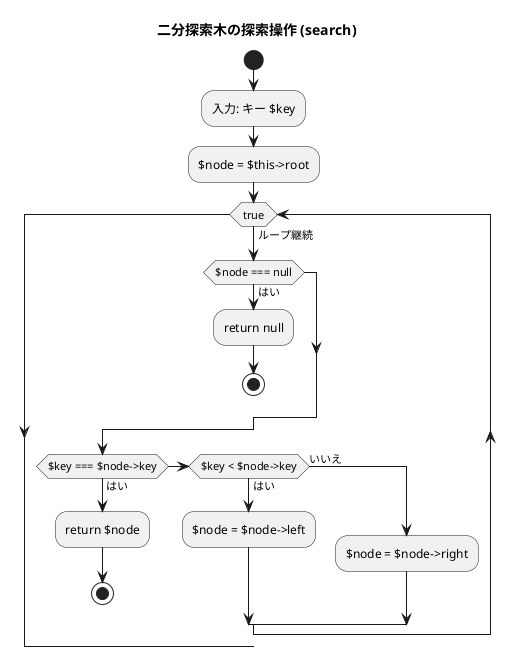
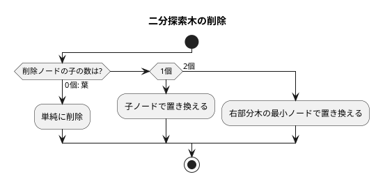
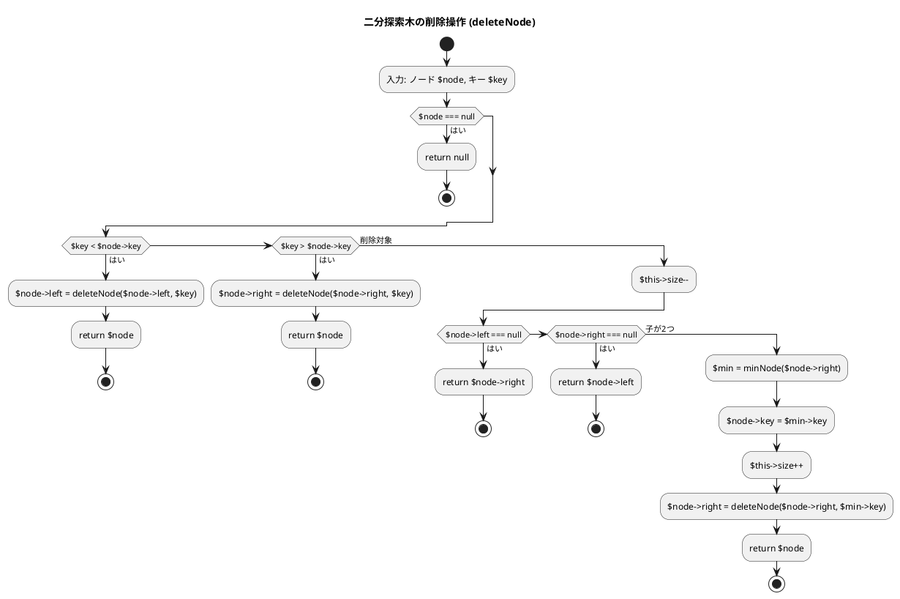
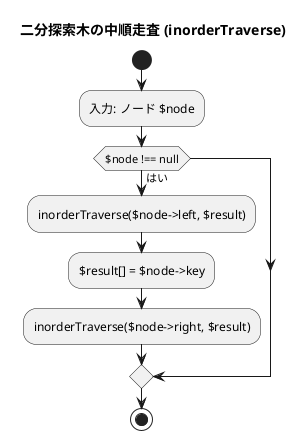

# 第 9 章 木構造

## はじめに

前章までで、配列、探索アルゴリズム、スタック、キュー、再帰、ソートアルゴリズム、文字列処理、リストなどを学んできました。この章では、データ構造の中でも特に重要な「**木構造**」、特に**二分探索木（BST: Binary Search Tree）**を TDD で実装します。

木構造はノードが親子関係で繋がった非線形データ構造です。二分探索木は左の子 < 親 < 右の子という性質を持ち、効率的な探索・挿入・削除を実現します。

### 目次

1. [木構造とは](#木構造とは)
2. [二分木](#二分木)
3. [二分探索木の性質](#二分探索木の性質)
4. [Red -- 失敗するテストを書く](#red----失敗するテストを書く)
5. [Green -- テストを通す実装](#green----テストを通す実装)
6. [ノードの削除](#ノードの削除)
7. [木の走査](#木の走査)
8. [ヒープ](#ヒープ)

---

## 木構造とは

木構造とは、データを階層的に表現するデータ構造です。木構造は、以下の要素から構成されます：

- **ノード**：データを格納する要素
- **エッジ**：ノード間の関係を表す線
- **ルート**：木の最上位に位置するノード
- **親ノード**：あるノードの上位に位置するノード
- **子ノード**：あるノードの下位に位置するノード
- **葉ノード**：子ノードを持たないノード

木構造は、以下のような特徴を持ちます：

1. 一つのルートノードから始まる
2. 各ノードは 0 個以上の子ノードを持つ
3. 循環構造を持たない（サイクルがない）

### 順序木と無順序木

木構造は、子ノードの順序に意味があるかどうかによって、「順序木」と「無順序木」に分類されます。

- **順序木**：子ノードの順序に意味がある木構造
- **無順序木**：子ノードの順序に意味がない木構造

### 順序木の探索

順序木を探索する方法には、主に以下の 3 つがあります：

1. **先行順（行きがけ順）探索**：ノード自身 -> 左部分木 -> 右部分木の順に探索
2. **中間順（通りがけ順）探索**：左部分木 -> ノード自身 -> 右部分木の順に探索
3. **後行順（帰りがけ順）探索**：左部分木 -> 右部分木 -> ノード自身の順に探索

これらの探索方法は、再帰を用いて実装することができます。

---

## 二分木

二分木は、各ノードが最大 2 つの子ノード（左の子と右の子）を持つ木構造です。二分木は、以下のような特徴を持ちます：

1. 各ノードは最大 2 つの子ノードを持つ
2. 左の子と右の子が明確に区別される
3. 空の二分木も存在する

二分木は、様々なアルゴリズムやデータ構造の基礎となります。例えば、二分探索木、ヒープ、ハフマン木などは、二分木の一種です。

---

## 二分探索木の性質



**性質**:
- 左部分木のすべてのキー < ルートのキー
- 右部分木のすべてのキー > ルートのキー
- 中順探索（left -> root -> right）は昇順になる

---

## Red -- 失敗するテストを書く

```php
// tests/TreeTest.php
class TreeTest extends TestCase
{
    private function buildBst(): BinarySearchTree
    {
        $bst = new BinarySearchTree();
        foreach ([5, 3, 7, 1, 4, 6, 8] as $k) {
            $bst->insert($k);
        }
        return $bst;
    }

    public function test挿入と探索(): void
    {
        $bst = $this->buildBst();
        $this->assertNotNull($bst->search(5));
        $this->assertSame(5, $bst->search(5)->key);
        $this->assertNull($bst->search(99));
    }

    public function test中順探索昇順(): void
    {
        $bst = $this->buildBst();
        $this->assertSame([1, 3, 4, 5, 6, 7, 8], $bst->inorder());
    }

    public function test子が2つのノードの削除(): void
    {
        $bst = $this->buildBst();
        $bst->delete(7);
        $this->assertFalse($bst->includes(7));
        $this->assertSame([1, 3, 4, 5, 6, 8], $bst->inorder());
    }

    public function test空の木のminは例外(): void
    {
        $bst = new BinarySearchTree();
        $this->expectException(\UnderflowException::class);
        $bst->min();
    }
}
```

---

## Green -- テストを通す実装

```php
// src/BinarySearchTree.php
class BSTNode
{
    public function __construct(
        public mixed    $key,
        public ?BSTNode $left  = null,
        public ?BSTNode $right = null,
    ) {}
}

class BinarySearchTree
{
    private ?BSTNode $root = null;
    private int      $size = 0;

    public function insert(mixed $key): void
    {
        $this->root = $this->insertNode($this->root, $key);
    }

    private function insertNode(?BSTNode $node, mixed $key): BSTNode
    {
        if ($node === null) {
            $this->size++;
            return new BSTNode($key);
        }
        if ($key < $node->key) {
            $node->left = $this->insertNode($node->left, $key);
        } elseif ($key > $node->key) {
            $node->right = $this->insertNode($node->right, $key);
        }
        // 重複は無視
        return $node;
    }

    public function search(mixed $key): ?BSTNode
    {
        return $this->searchNode($this->root, $key);
    }

    private function searchNode(?BSTNode $node, mixed $key): ?BSTNode
    {
        if ($node === null) {
            return null;
        }
        if ($key === $node->key) {
            return $node;
        }
        if ($key < $node->key) {
            return $this->searchNode($node->left, $key);
        }
        return $this->searchNode($node->right, $key);
    }

    public function includes(mixed $key): bool
    {
        return $this->search($key) !== null;
    }

    public function length(): int
    {
        return $this->size;
    }
}
```

### フローチャート

#### ノード追加操作





アルゴリズムの流れ：
1. **insert メソッド**: `insertNode` を再帰的に呼び出し、戻り値で `$this->root` を更新します。
2. **insertNode メソッド**: $node が null の場合は新しいノードを作成して返します。$key が小さければ左の子に、大きければ右の子に再帰的に追加します。重複キーは無視します。

この操作により、二分探索木の性質（左の子のキーは親より小さく、右の子のキーは親より大きい）が維持されます。

#### 探索操作



この操作は、二分探索木の性質を利用して効率的に探索を行います。平均的な場合、時間計算量は O(log n) となります。

---

## ノードの削除

削除は 3 つのケースに分かれます：



```php
/** ノード削除 */
public function delete(mixed $key): void
{
    $this->root = $this->deleteNode($this->root, $key);
}

private function deleteNode(?BSTNode $node, mixed $key): ?BSTNode
{
    if ($node === null) {
        return null;
    }
    if ($key < $node->key) {
        $node->left = $this->deleteNode($node->left, $key);
    } elseif ($key > $node->key) {
        $node->right = $this->deleteNode($node->right, $key);
    } else {
        // 削除対象ノード
        $this->size--;
        if ($node->left === null) {
            return $node->right;
        }
        if ($node->right === null) {
            return $node->left;
        }
        // 子が2つ: 右部分木の最小値で置き換える
        $min         = $this->minNode($node->right);
        $node->key   = $min->key;
        $this->size++; // deleteNode 内で再び --size されるので補正
        $node->right = $this->deleteNode($node->right, $min->key);
    }
    return $node;
}
```

### フローチャート



アルゴリズムの流れ：
1. 削除するノードを再帰的に探索します
2. 削除するノードの子ノードの状況に応じて処理を分けます：
   - **左の子がない場合**：右の子で置き換えます
   - **右の子がない場合**：左の子で置き換えます
   - **両方の子がある場合**：右部分木の中から最小のノードを探し、そのキーで置き換えてから、最小ノードを削除します

PHP 版では再帰的な実装を採用しています。Python 版がループで親ノードを追跡する手法を使うのに対し、PHP 版は `deleteNode` の戻り値でノードの参照を更新するスタイルです。

---

## 木の走査

| 走査方法 | 順序 | 用途 |
|---------|------|------|
| 前順（preorder） | 根 -> 左 -> 右 | ツリーのコピー |
| 中順（inorder） | 左 -> 根 -> 右 | ソート済みリスト取得 |
| 後順（postorder） | 左 -> 右 -> 根 | ツリーの削除 |

### 中順走査（inorder）の実装

```php
/** 中順探索（昇順） */
public function inorder(): array
{
    $result = [];
    $this->inorderTraverse($this->root, $result);
    return $result;
}

private function inorderTraverse(?BSTNode $node, array &$result): void
{
    if ($node === null) {
        return;
    }
    $this->inorderTraverse($node->left, $result);
    $result[] = $node->key;
    $this->inorderTraverse($node->right, $result);
}
```

### フローチャート



中順走査では、左部分木 -> ノード自身 -> 右部分木の順に処理するため、二分探索木のノードをキーの昇順に取得することができます。

### 前順・後順走査の実装

```php
/** 前順探索 */
public function preorder(): array
{
    $result = [];
    $this->preorderTraverse($this->root, $result);
    return $result;
}

private function preorderTraverse(?BSTNode $node, array &$result): void
{
    if ($node === null) {
        return;
    }
    $result[] = $node->key;
    $this->preorderTraverse($node->left, $result);
    $this->preorderTraverse($node->right, $result);
}

/** 後順探索 */
public function postorder(): array
{
    $result = [];
    $this->postorderTraverse($this->root, $result);
    return $result;
}

private function postorderTraverse(?BSTNode $node, array &$result): void
{
    if ($node === null) {
        return;
    }
    $this->postorderTraverse($node->left, $result);
    $this->postorderTraverse($node->right, $result);
    $result[] = $node->key;
}
```

### 最小キー・最大キーの取得

```php
/** 最小値 */
public function min(): mixed
{
    if ($this->root === null) {
        throw new \UnderflowException('Tree is empty');
    }
    return $this->minNode($this->root)->key;
}

private function minNode(BSTNode $node): BSTNode
{
    while ($node->left !== null) {
        $node = $node->left;
    }
    return $node;
}

/** 最大値 */
public function max(): mixed
{
    if ($this->root === null) {
        throw new \UnderflowException('Tree is empty');
    }
    $node = $this->root;
    while ($node->right !== null) {
        $node = $node->right;
    }
    return $node->key;
}
```

### 解説

二分探索木は、各ノードが左右の子ノードを持ち、左の子ノードのキーは親ノードのキーより小さく、右の子ノードのキーは親ノードのキーより大きいという性質を持つデータ構造です。

この性質により、二分探索木は効率的な探索が可能になります。平均的な場合、探索、挿入、削除の操作の時間計算量は O(log n) となります（n はノードの数）。

ただし、最悪の場合（例えば、すべてのノードが右の子ノードしか持たない場合）、時間計算量は O(n) となります。このような偏りを防ぐために、AVL 木や赤黒木などの自己平衡二分探索木が考案されています。

---

## テスト実行結果

```bash
$ ./vendor/bin/phpunit tests/TreeTest.php

...（13 テスト全パス）...

OK (13 tests, 13 assertions)
```

---

## 二分探索木の計算量

| 操作 | 平均 | 最悪（偏り木） |
|------|------|--------------|
| 探索 | O(log n) | O(n) |
| 挿入 | O(log n) | O(n) |
| 削除 | O(log n) | O(n) |

バランス木（AVL 木、赤黒木）を使うと最悪でも O(log n) を保証できます。

---

## ヒープ

ヒープは、完全二分木の一種で、以下の性質を持ちます：

1. 各ノードの値は、その子ノードの値以上（または以下）である
2. 木は可能な限り左から右へ、上から下へ詰めて構築される

ヒープには、最大ヒープと最小ヒープの 2 種類があります：

- **最大ヒープ**：各ノードの値は、その子ノードの値以上である
- **最小ヒープ**：各ノードの値は、その子ノードの値以下である

### ヒープの実装

ヒープは、通常、配列を用いて実装されます。完全二分木の性質を利用すると、配列のインデックスを用いて親子関係を表現することができます：

- インデックス i のノードの左の子ノードのインデックスは 2i + 1
- インデックス i のノードの右の子ノードのインデックスは 2i + 2
- インデックス i のノードの親ノードのインデックスは (i - 1) / 2（整数除算）

PHP の標準ライブラリには、`SplPriorityQueue` クラスがあり、優先度付きキューを実装しています：

```php
$heap = new SplPriorityQueue();
$heap->insert('task1', 3);
$heap->insert('task2', 1);
$heap->insert('task3', 4);
$heap->insert('task4', 2);

echo $heap->extract(); // task3（優先度 4）
echo $heap->extract(); // task1（優先度 3）
echo $heap->extract(); // task4（優先度 2）
echo $heap->extract(); // task2（優先度 1）
```

### 解説

ヒープは、最大値または最小値を効率的に取得できるデータ構造です。要素の追加と削除の時間計算量は O(log n) となります（n は要素の数）。

ヒープは、優先度付きキューの実装や、ヒープソートなどのアルゴリズムに利用されます。また、ダイクストラのアルゴリズムなど、グラフアルゴリズムでも利用されます。

---

## Python 版との違い

| 概念 | Python | PHP |
|------|--------|-----|
| データクラス | `class _BSTNode` + `__init__` | `class BSTNode { __construct(...) }` コンストラクタプロモーション |
| 例外 | `raise ValueError()` | `throw new \UnderflowException()` |
| None | `None` | `null` |
| プロパティアクセス | `node.key` | `$node->key` |
| 削除の実装 | ループ + 親ノード追跡 | 再帰 + 戻り値でノード更新 |
| 子が 2 つの削除 | 左部分木の最大ノードで置換 | 右部分木の最小ノードで置換 |
| 走査結果の収集 | リスト + `append` | 配列 + 参照渡し `array &$result` |
| ヒープ | `heapq` モジュール（最小ヒープ） | `SplPriorityQueue`（最大ヒープ） |
| アクセス修飾子 | `_` プレフィックスで慣例的に private | `private` キーワードで明示 |
| insert の戻り値 | `add()` が `bool` を返す | `insert()` は `void`（重複は無視） |

## まとめ

この章では、木構造について学びました：

1. **木構造**：データを階層的に表現するデータ構造。ノード、エッジ、ルートなどの基本要素から構成される。
2. **二分木**：各ノードが最大 2 つの子ノードを持つ木構造。
3. **二分探索木**：効率的な探索を可能にする二分木。平均 O(log n) で探索・挿入・削除が可能。
4. **ヒープ**：完全二分木の一種で、優先度付きキューの実装などに利用される。

これらの木構造は、様々なアルゴリズムやデータ構造の基礎となります。用途に応じて適切な木構造を選択することが重要です。

## 参考文献

- 『新・明解 Python で学ぶアルゴリズムとデータ構造』 -- 柴田望洋
- 『テスト駆動開発』 -- Kent Beck
