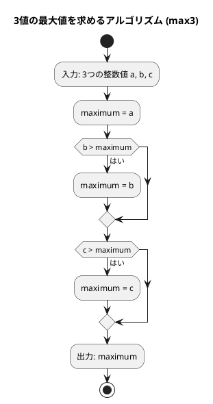
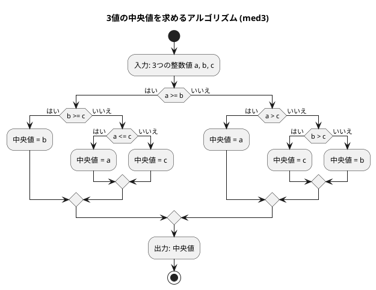

# 第 1 章 基本的なアルゴリズム

## はじめに

プログラミングを学ぶ上で、アルゴリズムの理解は非常に重要です。アルゴリズムとは、問題を解決するための手順や方法のことです。この章では、Python を使って基本的なアルゴリズムを学びながら、テスト駆動開発（TDD）の手法を用いて実装していきます。

テスト駆動開発とは、コードを書く前にまずテストを書き、そのテストが通るようにコードを実装していく開発手法です。Red-Green-Refactor というサイクルを繰り返しながら、確実に動作するコードを段階的に作り上げます。

## 準備

### 環境構築

```bash
# Nix 環境に入る（Python + uv が利用可能になる）
nix develop .#python

# プロジェクトディレクトリへ移動
cd apps/python

# 依存パッケージのインストール
uv sync
```

### プロジェクト構成

```
apps/python/
├── pyproject.toml          # プロジェクト設定
├── tox.ini                 # タスクランナー設定
├── .ruff.toml              # リンター設定
├── src/
│   └── algorithm/
│       ├── __init__.py
│       └── basic_algorithms.py   # 実装ファイル
└── tests/
    └── test_basic_algorithms.py  # テストファイル
```

### テスト実行コマンド

```bash
# テスト実行（カバレッジ付き）
uv run pytest --cov=algorithm --cov-report=term-missing --verbose

# tox で全チェック（test/lint/type）
uv run tox

# リントとフォーマット
uv run ruff check .
uv run ruff format .
```

---

## 1. アルゴリズムとは

アルゴリズムとは、問題を解決するための明確な手順のことです。コンピュータプログラムは、アルゴリズムを実行可能な形で表現したものと言えます。

良いアルゴリズムは以下の特徴を持ちます：

- 入力と出力が明確である
- 各ステップが明確である
- 有限のステップで終了する
- 効率的である

---

## 2. 3 値の最大値

3 つの整数値の中から最大値を求めるアルゴリズムを TDD で実装します。

### Red — 失敗するテストを書く

```python
# tests/test_basic_algorithms.py
class TestMax3:
    """3値の最大値"""

    def test_max3_cases(self):
        cases = [
            (3, 2, 1, 3),  # a > b > c
            (3, 2, 2, 3),  # a > b = c
            (3, 1, 2, 3),  # a > c > b
            (3, 2, 3, 3),  # a = c > b
            (2, 1, 3, 3),  # c > a > b
            (3, 3, 2, 3),  # a = b > c
            (3, 3, 3, 3),  # a = b = c
            (2, 2, 3, 3),  # c > a = b
            (2, 3, 1, 3),  # b > a > c
            (2, 3, 2, 3),  # b > a = c
            (1, 3, 2, 3),  # b > c > a
            (2, 3, 3, 3),  # b = c > a
            (1, 2, 3, 3),  # c > b > a
        ]
        for a, b, c, expected in cases:
            assert max3(a, b, c) == expected, (
                f"max3({a}, {b}, {c}) should be {expected}"
            )
```

3 つの値の大小関係の全パターン（13 通り）を網羅したテストです。

### Green — テストを通す最小限の実装

```python
# src/algorithm/basic_algorithms.py
def max3(a: int, b: int, c: int) -> int:
    """3つの整数値の最大値を返す

    >>> max3(1, 3, 2)
    3
    >>> max3(3, 3, 3)
    3
    """
    maximum = a
    if b > maximum:
        maximum = b
    if c > maximum:
        maximum = c
    return maximum
```

### アルゴリズムの考え方



1. 最初の値を最大値と仮定する
2. 残りの値と比較し、より大きい値があれば最大値を更新する
3. すべての値との比較が終わったら、最大値を返す

---

## 3. 3 値の中央値

3 つの整数値の中央値（3 つの値を大きさの順に並べたときに真ん中に来る値）を求めます。

### Red — 失敗するテストを書く

```python
class TestMed3:
    """3値の中央値"""

    def test_med3_cases(self):
        cases = [
            (3, 2, 1, 2),  # a > b > c
            (3, 2, 2, 2),  # a > b = c
            (3, 1, 2, 2),  # a > c > b
            (3, 2, 3, 3),  # a = c > b
            (2, 1, 3, 2),  # c > a > b
            (3, 3, 2, 3),  # a = b > c
            (3, 3, 3, 3),  # a = b = c
            (2, 2, 3, 2),  # c > a = b
            (2, 3, 1, 2),  # b > a > c
            (2, 3, 2, 2),  # b > a = c
            (1, 3, 2, 2),  # b > c > a
            (2, 3, 3, 3),  # b = c > a
            (1, 2, 3, 2),  # c > b > a
        ]
        for a, b, c, expected in cases:
            assert med3(a, b, c) == expected, (
                f"med3({a}, {b}, {c}) should be {expected}"
            )
```

### Green — テストを通す最小限の実装

```python
def med3(a: int, b: int, c: int) -> int:
    """3つの整数値の中央値を返す

    >>> med3(1, 3, 2)
    2
    >>> med3(3, 3, 3)
    3
    """
    if a >= b:
        if b >= c:
            return b
        elif a <= c:
            return a
        else:
            return c
    elif a > c:
        return a
    elif b > c:
        return c
    else:
        return b
```

### アルゴリズムの考え方



中央値を求めるアルゴリズムは、最大値よりも複雑です。すべての場合分けを考える必要があります：

| 条件 | 中央値 |
|------|--------|
| a >= b かつ b >= c | b |
| a >= b かつ a <= c | a |
| a >= b（それ以外、a > c > b） | c |
| a < b かつ a > c | a |
| a < b かつ b > c | c |
| a < b（それ以外、c >= b > a） | b |

---

## 4. 条件判定と分岐

プログラミングでは、条件に応じて処理を分岐させることが頻繁にあります。

### Red — 失敗するテストを書く

```python
class TestJudgeSign:
    """条件判定と分岐"""

    def test_positive(self):
        assert judge_sign(17) == "その値は正です。"

    def test_negative(self):
        assert judge_sign(-5) == "その値は負です。"

    def test_zero(self):
        assert judge_sign(0) == "その値は0です。"
```

### Green — テストを通す最小限の実装

```python
def judge_sign(n: int) -> str:
    """整数値の符号を判定する

    >>> judge_sign(17)
    'その値は正です。'
    >>> judge_sign(-5)
    'その値は負です。'
    >>> judge_sign(0)
    'その値は0です。'
    """
    if n > 0:
        return "その値は正です。"
    elif n < 0:
        return "その値は負です。"
    else:
        return "その値は0です。"
```

`if`, `elif`, `else` を使うことで、複数の条件に応じて処理を分岐させることができます。

---

## 5. 繰り返し処理

プログラミングでは、同じ処理を繰り返し実行することがよくあります。Python では `while` 文と `for` 文を使って繰り返し処理を実現できます。

### 5-1. 1 から n までの総和

#### Red — 失敗するテストを書く

```python
class TestSum1ToN:
    """繰り返し処理 — 1からnまでの総和"""

    def test_sum_while(self):
        assert sum_1_to_n_while(5) == 15

    def test_sum_for(self):
        assert sum_1_to_n_for(5) == 15
```

#### Green — テストを通す実装

```python
def sum_1_to_n_while(n: int) -> int:
    """while 文で 1 から n までの総和を求める

    >>> sum_1_to_n_while(5)
    15
    """
    total = 0
    i = 1
    while i <= n:
        total += i
        i += 1
    return total


def sum_1_to_n_for(n: int) -> int:
    """for 文で 1 から n までの総和を求める

    >>> sum_1_to_n_for(5)
    15
    """
    total = 0
    for i in range(1, n + 1):
        total += i
    return total
```

`while` 文は条件が真の間、繰り返し実行します。`for` 文は `range()` で指定した範囲を繰り返します。

### 5-2. 記号文字の交互表示

`+` と `-` を交互に表示する 2 通りの実装を比較します。

#### Red — 失敗するテストを書く

```python
class TestAlternative:
    """繰り返し処理 — 記号文字の交互表示"""

    def test_alternative_1(self):
        assert alternative_1(12) == "+-+-+-+-+-+-"

    def test_alternative_2(self):
        assert alternative_2(12) == "+-+-+-+-+-+-"

    def test_alternative_odd(self):
        assert alternative_1(5) == "+-+-+"
        assert alternative_2(5) == "+-+-+"
```

#### Green — テストを通す実装

```python
def alternative_1(n: int) -> str:
    """記号文字 '+' と '-' を交互に表示する（剰余判定方式）

    >>> alternative_1(12)
    '+-+-+-+-+-+-'
    """
    result = ""
    for i in range(n):
        if i % 2:
            result += "-"
        else:
            result += "+"
    return result


def alternative_2(n: int) -> str:
    """記号文字 '+' と '-' を交互に表示する（パターン繰り返し方式）

    >>> alternative_2(12)
    '+-+-+-+-+-+-'
    """
    result = "+-" * (n // 2)
    if n % 2:
        result += "+"
    return result
```

`alternative_1` は剰余（`%`）を使って偶数・奇数を判定します。`alternative_2` は文字列の繰り返し（`*`）を使ったよりシンプルな実装です。

### 5-3. 長方形の辺の長さを列挙

面積が指定された長方形の辺の長さをすべて列挙します。

#### Red — 失敗するテストを書く

```python
class TestRectangle:
    """繰り返し処理 — 長方形の辺の長さを列挙"""

    def test_rectangle(self):
        assert rectangle(32) == "1x32 2x16 4x8 "
```

#### Green — テストを通す実装

```python
def rectangle(area: int) -> str:
    """縦横が整数で面積が area の長方形の辺の長さを列挙する

    >>> rectangle(32)
    '1x32 2x16 4x8 '
    """
    result = ""
    for i in range(1, area + 1):
        if i * i > area:
            break
        if area % i:
            continue
        result += f"{i}x{area // i} "
    return result
```

`break` は繰り返しを中断し、`continue` は次の繰り返しへスキップします。`i * i > area` で探索範囲を絞り込むことで効率化しています。

---

## 6. 多重ループ

ループの中にループを重ねることで、2 次元的な処理を実現できます。

### 6-1. 九九の表

#### Red — 失敗するテストを書く

```python
class TestMultiplicationTable:
    """多重ループ — 九九の表"""

    def test_multiplication_table(self):
        expected = (
            "---------------------------\n"
            "  1  2  3  4  5  6  7  8  9\n"
            "  2  4  6  8 10 12 14 16 18\n"
            "  3  6  9 12 15 18 21 24 27\n"
            "  4  8 12 16 20 24 28 32 36\n"
            "  5 10 15 20 25 30 35 40 45\n"
            "  6 12 18 24 30 36 42 48 54\n"
            "  7 14 21 28 35 42 49 56 63\n"
            "  8 16 24 32 40 48 56 64 72\n"
            "  9 18 27 36 45 54 63 72 81\n"
            "---------------------------"
        )
        assert multiplication_table() == expected
```

#### Green — テストを通す実装

```python
def multiplication_table() -> str:
    """九九の表を返す

    >>> '1  2  3' in multiplication_table()
    True
    """
    result = "-" * 27 + "\n"
    for i in range(1, 10):
        for j in range(1, 10):
            result += f"{i * j:3}"
        result += "\n"
    result += "-" * 27
    return result
```

外側のループが行（`i`）、内側のループが列（`j`）を担当します。`f"{i * j:3}"` は 3 文字幅の右揃えで数値を出力します。

### 6-2. 直角三角形の表示

#### Red — 失敗するテストを書く

```python
class TestTraiangleLb:
    """多重ループ — 直角三角形の表示"""

    def test_traiangle_lb(self):
        expected = "*\n**\n***\n****\n*****\n"
        assert traiangle_lb(5) == expected
```

#### Green — テストを通す実装

```python
def traiangle_lb(n: int) -> str:
    """左下側が直角の二等辺三角形を返す

    >>> traiangle_lb(3)
    '*\\n**\\n***\\n'
    """
    result = ""
    for i in range(n):
        result += "*" * (i + 1) + "\n"
    return result
```

---

## テスト実行結果

```bash
$ uv run pytest --cov=algorithm --cov-report=term-missing --verbose

tests/test_basic_algorithms.py::TestMax3::test_max3_cases PASSED
tests/test_basic_algorithms.py::TestMed3::test_med3_cases PASSED
tests/test_basic_algorithms.py::TestJudgeSign::test_positive PASSED
tests/test_basic_algorithms.py::TestJudgeSign::test_negative PASSED
tests/test_basic_algorithms.py::TestJudgeSign::test_zero PASSED
tests/test_basic_algorithms.py::TestSum1ToN::test_sum_while PASSED
tests/test_basic_algorithms.py::TestSum1ToN::test_sum_for PASSED
tests/test_basic_algorithms.py::TestAlternative::test_alternative_1 PASSED
tests/test_basic_algorithms.py::TestAlternative::test_alternative_2 PASSED
tests/test_basic_algorithms.py::TestAlternative::test_alternative_odd PASSED
tests/test_basic_algorithms.py::TestRectangle::test_rectangle PASSED
tests/test_basic_algorithms.py::TestMultiplicationTable::test_multiplication_table PASSED
tests/test_basic_algorithms.py::TestTraiangleLb::test_traiangle_lb PASSED

Name                                Stmts   Miss  Cover   Missing
-----------------------------------------------------------------
src/algorithm/__init__.py               0      0   100%
src/algorithm/basic_algorithms.py      71      0   100%
-----------------------------------------------------------------
TOTAL                                  71      0   100%
13 passed in 0.07s
```

カバレッジ 100% 達成しました。

---

## まとめ

この章では、以下の基本的なアルゴリズムを TDD で実装しました：

| アルゴリズム | 関数 | キーポイント |
|-------------|------|------------|
| 3 値の最大値 | `max3` | 順次比較と更新 |
| 3 値の中央値 | `med3` | 全パターンの条件分岐 |
| 符号判定 | `judge_sign` | `if/elif/else` の基本 |
| 総和（while） | `sum_1_to_n_while` | `while` 文の繰り返し |
| 総和（for） | `sum_1_to_n_for` | `for` + `range()` の繰り返し |
| 交互表示 | `alternative_1/2` | 剰余判定 vs パターン繰り返し |
| 長方形列挙 | `rectangle` | `break`/`continue` の活用 |
| 九九の表 | `multiplication_table` | 二重ループ |
| 直角三角形 | `traiangle_lb` | ループと文字列繰り返し |

TDD の Red-Green-Refactor サイクルを通じて、テストが仕様の役割を果たし、確実に動作するコードを構築できることを確認しました。

## 参考文献

- 『新・明解 Python で学ぶアルゴリズムとデータ構造』 — 柴田望洋
- 『テスト駆動開発』 — Kent Beck
