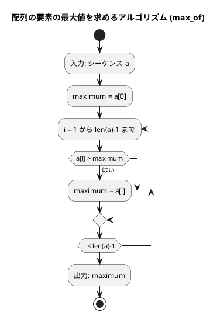
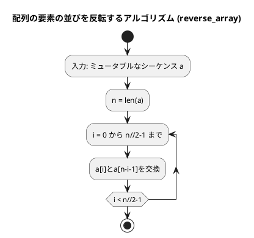
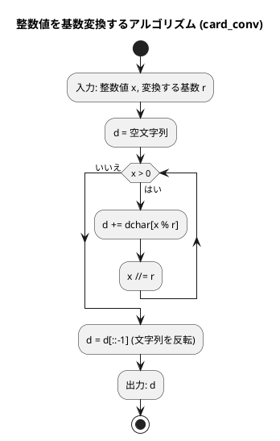
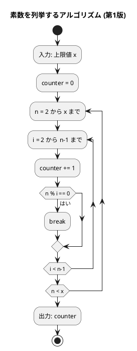
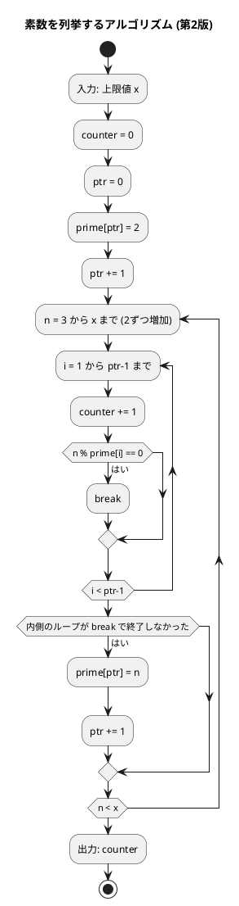
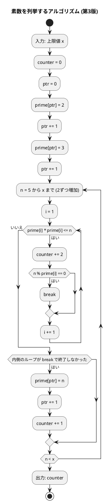

# 第 2 章 配列

## はじめに

前章では基本的なアルゴリズムについて学びました。この章では、プログラミングにおいて非常に重要なデータ構造である「配列」について学んでいきます。配列は、同じ型のデータを連続して格納するためのデータ構造で、多くのアルゴリズムの基礎となります。

Python では、配列に相当するデータ構造として「リスト」や「タプル」があります。

---

## 1. データ構造と配列

### データ構造とは

データ構造とは、データ単位とデータ自身との間の物理的または論理的な関係を表したものです。適切なデータ構造を選ぶことで、効率的なアルゴリズムを実装することができます。

### 配列の必要性

まず、配列がなぜ必要なのかを考えてみましょう。例えば、5人の学生の点数を読み込んで合計点と平均点を求めるプログラムを考えます。

配列を使わない場合、以下のようなコードになります：

```python
print('5人の点数の合計と平均点を求めます。')
tensu1 = int(input('1番の点数：'))
tensu2 = int(input('2番の点数：'))
tensu3 = int(input('3番の点数：'))
tensu4 = int(input('4番の点数：'))
tensu5 = int(input("5番の点数："))

total = 0
total += tensu1
total += tensu2
total += tensu3
total += tensu4
total += tensu5

print(f'合計は{total}点です。')
print(f'平均は{total/5}点です。')
```

このコードでは、5人分の変数を個別に用意しています。しかし、100人や1000人の点数を扱う場合、このアプローチは現実的ではありません。

### Python における配列：リストとタプル

Python では、配列に相当するデータ構造として主に「リスト」と「タプル」があります。

**リスト**（可変 / mutable）

```python
x = [11, 22, 33, 44, 55, 66, 77]  # 整数のリスト
names = ['John', 'Paul', 'George', 'Ringo']  # 文字列のリスト
```

**タプル**（不変 / immutable）

```python
t = (4, 7, 5.6, 2, 3.14, 1)  # 数値のタプル
```

### アンパック

Python では、シーケンスの要素を個別の変数に展開する「アンパック」という機能があります。

```python
x = [1, 2, 3]
a, b, c = x  # a=1, b=2, c=3 となる
```

### インデックス式によるアクセス

配列（リストやタプル）の要素には、インデックス（添え字）を使ってアクセスします。Python のインデックスは 0 から始まります。

```python
x = [11, 22, 33, 44, 55, 66, 77]
print(x[2])     # 33（3番目の要素）
print(x[-3])    # 55（後ろから3番目の要素）
x[-4] = 3.14   # 要素の値を変更（リストの場合のみ可能）
```

### スライス式によるアクセス

Python では、スライス式を使って配列の一部を取り出すことができます。

```python
s = [11, 22, 33, 44, 55, 66, 77]
print(s[0:6])    # [11, 22, 33, 44, 55, 66]（0番目から5番目までの要素）
print(s[0:7:2])  # [11, 33, 55, 77]（0番目から6番目まで、2つおきの要素）
print(s[-4:-2])  # [44, 55]（後ろから4番目から後ろから3番目までの要素）
```

### 配列の走査

配列の全要素を処理するには、いくつかの方法があります。

#### インデックスを使った走査

```python
x = ['John', 'George', 'Paul', 'Ringo']
for i in range(len(x)):
    print(f'x[{i}] = {x[i]}')
```

#### enumerate 関数を使った走査

```python
x = ['John', 'George', 'Paul', 'Ringo']
for i, name in enumerate(x):
    print(f'x[{i}] = {name}')
```

#### インデックスを使わない走査

```python
x = ['John', 'George', 'Paul', 'Ringo']
for name in x:
    print(name)
```

---

## 2. 配列の要素の最大値

### Red — 失敗するテストを書く

```python
# tests/test_arrays.py
class TestMaxOf:
    """配列の要素の最大値"""

    def test_max_of(self):
        assert max_of([172, 153, 192, 140, 165]) == 192

    def test_max_of_single(self):
        assert max_of([42]) == 42

    def test_max_of_equal(self):
        assert max_of([5, 5, 5]) == 5
```

### Green — テストを通す最小限の実装

```python
# src/algorithm/arrays.py
from collections.abc import Sequence
from typing import Any


def max_of(a: Sequence) -> Any:
    """シーケンスaの要素の最大値を返す

    >>> max_of([172, 153, 192, 140, 165])
    192
    """
    maximum = a[0]
    for i in range(1, len(a)):
        if a[i] > maximum:
            maximum = a[i]
    return maximum
```

### アルゴリズムの考え方



この図は、配列（シーケンス）の要素の最大値を求めるアルゴリズム（max_of 関数）のフローチャートです。

アルゴリズムの流れ：
1. シーケンス a を入力として受け取ります
2. 変数 maximum に a の最初の要素（a[0]）を代入します
3. 1 から len(a)-1 までの各インデックス i について、以下の処理を繰り返します：
   - a[i] が maximum より大きければ、maximum の値を a[i] に更新します
4. 最終的な maximum の値（配列の最大値）を出力します

1. 配列の最初の要素を最大値と仮定する
2. 残りの要素を順に比較し、より大きい値があれば最大値を更新する
3. 全要素の比較が終わったら最大値を返す

計算量は O(n) です（n は配列の要素数）。

---

## 3. 配列の要素の並びを反転

### Red — 失敗するテストを書く

```python
class TestReverseArray:
    """配列の要素の並びを反転"""

    def test_reverse_array(self):
        a = [2, 5, 1, 3, 9, 6, 7]
        reverse_array(a)
        assert a == [7, 6, 9, 3, 1, 5, 2]

    def test_reverse_array_even(self):
        a = [1, 2, 3, 4]
        reverse_array(a)
        assert a == [4, 3, 2, 1]

    def test_reverse_array_single(self):
        a = [42]
        reverse_array(a)
        assert a == [42]
```

### Green — テストを通す最小限の実装

```python
from collections.abc import MutableSequence


def reverse_array(a: MutableSequence) -> None:
    """ミュータブルなシーケンスaの要素の並びを反転する

    >>> a = [2, 5, 1, 3, 9, 6, 7]
    >>> reverse_array(a)
    >>> a
    [7, 6, 9, 3, 1, 5, 2]
    """
    n = len(a)
    for i in range(n // 2):
        a[i], a[n - i - 1] = a[n - i - 1], a[i]
```

### アルゴリズムの考え方

配列の前半と後半の要素を対称的に交換することで反転します。

```
[2, 5, 1, 3, 9, 6, 7]
 ↕              ↕
[7, 5, 1, 3, 9, 6, 2]  → i=0: 2と7を交換
      ↕        ↕
[7, 6, 1, 3, 9, 5, 2]  → i=1: 5と6を交換
         ↕  ↕
[7, 6, 9, 3, 1, 5, 2]  → i=2: 1と9を交換（3は中央なので交換不要）
```

Python のタプルアンパッキング `a[i], a[n-i-1] = a[n-i-1], a[i]` で簡潔に交換できます。計算量は O(n/2) = O(n) です。

#### フローチャート



この図は、配列（ミュータブルなシーケンス）の要素の並びを反転するアルゴリズム（reverse_array 関数）のフローチャートです。

アルゴリズムの流れ：
1. ミュータブルなシーケンス a を入力として受け取ります
2. 変数 n に a の長さを代入します
3. 0 から n//2-1 までの各インデックス i について、以下の処理を繰り返します：
   - a[i] と a[n-i-1] を交換します（前半と後半の対応する要素を交換）

配列 [2, 5, 1, 3, 9, 6, 7] を反転する場合：
- i=0: 2と7を交換 → [7, 5, 1, 3, 9, 6, 2]
- i=1: 5と6を交換 → [7, 6, 1, 3, 9, 5, 2]
- i=2: 1と9を交換 → [7, 6, 9, 3, 1, 5, 2]
- 3は中央の要素なので交換不要

---

## 4. 基数変換

### Red — 失敗するテストを書く

```python
class TestCardConv:
    """基数変換"""

    def test_binary(self):
        assert card_conv(29, 2) == "11101"

    def test_octal(self):
        assert card_conv(29, 8) == "35"

    def test_hex(self):
        assert card_conv(255, 16) == "FF"
```

### Green — テストを通す最小限の実装

```python
def card_conv(x: int, r: int) -> str:
    """整数値xをr進数に変換した数値を表す文字列を返す

    >>> card_conv(29, 2)
    '11101'
    >>> card_conv(255, 16)
    'FF'
    """
    d = ""
    dchar = "0123456789ABCDEFGHIJKLMNOPQRSTUVWXYZ"

    while x > 0:
        d += dchar[x % r]
        x //= r

    return d[::-1]
```

### アルゴリズムの考え方



29 を 2 進数に変換する例：

| x | x % 2 | 文字 | d（途中） |
|---|-------|------|---------|
| 29 | 1 | '1' | '1' |
| 14 | 0 | '0' | '10' |
| 7  | 1 | '1' | '101' |
| 3  | 1 | '1' | '1101' |
| 1  | 1 | '1' | '11101' |

反転して `'11101'`。

---

## 5. 素数の列挙

素数を列挙する 3 つのアルゴリズムを実装し、効率を比較します。

### Red — 失敗するテストを書く

テストでは「1000 以下の素数を列挙する際の除算回数」を検証します。

```python
class TestPrime:
    """素数の列挙"""

    def test_prime1(self):
        assert prime1(1000) == 78022

    def test_prime2(self):
        assert prime2(1000) == 14622

    def test_prime3(self):
        assert prime3(1000) == 3774
```

### Green — テストを通す実装（3 バージョン）

#### 第 1 版：素直な実装

```python
def prime1(x: int) -> int:
    """x以下の素数を列挙する（第1版）— 除算回数を返す"""
    counter = 0
    for n in range(2, x + 1):
        for i in range(2, n):
            counter += 1
            if n % i == 0:
                break
    return counter
```

#### 第 2 版：奇数のみ + 素数リスト活用

```python
def prime2(x: int) -> int:
    """x以下の素数を列挙する（第2版）— 除算回数を返す

    奇数のみを候補にし、すでに見つけた素数で割り切れるか確認する。
    """
    counter = 0
    ptr = 0
    prime = [None] * 500

    prime[ptr] = 2
    ptr += 1

    for n in range(3, x + 1, 2):
        for i in range(1, ptr):
            counter += 1
            if n % prime[i] == 0:
                break
        else:
            prime[ptr] = n
            ptr += 1

    return counter
```

#### 第 3 版：平方根以下のみ確認

```python
def prime3(x: int) -> int:
    """x以下の素数を列挙する（第3版）— 除算回数を返す

    平方根以下の素数でのみ割り切れるか確認することで効率化する。
    """
    counter = 0
    ptr = 0
    prime = [None] * 500

    prime[ptr] = 2
    ptr += 1
    prime[ptr] = 3
    ptr += 1

    for n in range(5, 1001, 2):
        i = 1
        while prime[i] * prime[i] <= n:
            counter += 2
            if n % prime[i] == 0:
                break
            i += 1
        else:
            prime[ptr] = n
            ptr += 1
            counter += 1

    return counter
```

### 効率の比較

| バージョン | 除算回数 | 改善率 |
|-----------|---------|--------|
| 第 1 版（素直な実装） | 78,022 | — |
| 第 2 版（奇数 + 素数リスト） | 14,622 | 約 81% 削減 |
| 第 3 版（平方根以下） | 3,774 | 約 95% 削減 |

アルゴリズムの改善で計算量が大幅に削減されることがわかります。

#### フローチャート（第 1 版）



第 1 版は単純ですが、効率が悪いです。n が素数でない場合でも、割り切れる数が見つかった後も不要な除算を行います。

#### フローチャート（第 2 版）



第 2 版の最適化：偶数はチェックしない（2以外の偶数は素数ではないため）、すでに見つけた素数だけで割り切れるかをチェックする。

#### フローチャート（第 3 版）



第 3 版の最適化：各数 n について、その平方根以下の素数でのみ割り切れるかをチェックする（それ以上の数でチェックする必要はない）。

---

## テスト実行結果

```bash
$ uv run pytest tests/test_arrays.py --cov=algorithm --cov-report=term-missing -v

tests/test_arrays.py::TestMaxOf::test_max_of PASSED
tests/test_arrays.py::TestMaxOf::test_max_of_single PASSED
tests/test_arrays.py::TestMaxOf::test_max_of_equal PASSED
tests/test_arrays.py::TestReverseArray::test_reverse_array PASSED
tests/test_arrays.py::TestReverseArray::test_reverse_array_even PASSED
tests/test_arrays.py::TestReverseArray::test_reverse_array_single PASSED
tests/test_arrays.py::TestCardConv::test_binary PASSED
tests/test_arrays.py::TestCardConv::test_octal PASSED
tests/test_arrays.py::TestCardConv::test_hex PASSED
tests/test_arrays.py::TestPrime::test_prime1 PASSED
tests/test_arrays.py::TestPrime::test_prime2 PASSED
tests/test_arrays.py::TestPrime::test_prime3 PASSED

Name                         Stmts   Miss  Cover
------------------------------------------------
src/algorithm/arrays.py         60      0   100%
------------------------------------------------
12 passed in 0.12s
```

---

## リストの要素とコピー

Python のリストは、異なる型の要素を混在させることができます：

```python
x = [15, 64, 7, 3.14, [32, 55], 'ABC']
```

また、リストのコピーには浅いコピー（shallow copy）と深いコピー（deep copy）の 2 種類があります：

```python
# 浅いコピー
x = [[1, 2, 3], [4, 5, 6]]
y = x.copy()
x[0][1] = 9  # y も変更される

# 深いコピー
import copy
x = [[1, 2, 3], [4, 5, 6]]
y = copy.deepcopy(x)
x[0][1] = 9  # y は変更されない
```

浅いコピーでは、リストの要素への参照がコピーされるため、ネストしたリストの要素を変更すると、コピー元とコピー先の両方に影響します。一方、深いコピーでは、リストとその中のすべての要素が再帰的にコピーされるため、コピー元とコピー先は完全に独立しています。

---

## まとめ

| アルゴリズム | 関数 | 計算量 |
|-------------|------|-------|
| 配列の最大値 | `max_of` | O(n) |
| 配列の反転 | `reverse_array` | O(n) |
| 基数変換 | `card_conv` | O(log x) |
| 素数の列挙 v1 | `prime1` | O(n²) |
| 素数の列挙 v2 | `prime2` | O(n√n) |
| 素数の列挙 v3 | `prime3` | O(n√n / log n) |

アルゴリズムを改良するほど、処理効率が向上することを確認しました。

この章で学んだ内容：

1. データ構造と配列の基本概念
2. Python のリストとタプルの特徴と使い方
3. インデックス式とスライス式によるアクセス
4. 配列の走査方法（インデックス、enumerate、直接）
5. 配列の要素の最大値を求めるアルゴリズム
6. 配列の要素の並びを反転するアルゴリズム
7. 基数変換アルゴリズム
8. 素数を列挙するアルゴリズムとその改良
9. リストのコピー（浅いコピーと深いコピー）

これらの知識は、より複雑なアルゴリズムやデータ構造を理解する上での基礎となります。

## 参考文献

- 『新・明解 Python で学ぶアルゴリズムとデータ構造』 — 柴田望洋
- 『テスト駆動開発』 — Kent Beck
