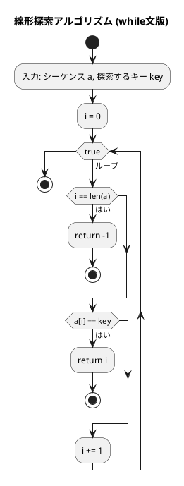
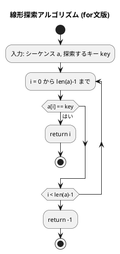
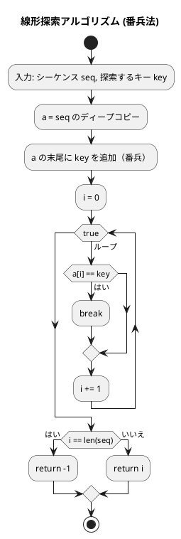
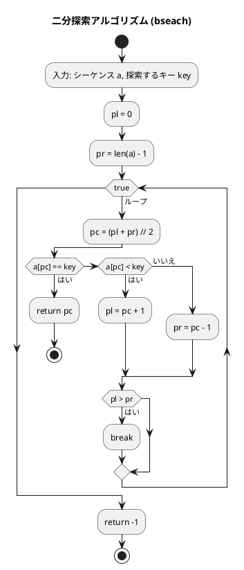

# 第 3 章 探索アルゴリズム

## はじめに

前章では配列とデータ構造について学びました。この章では、データの中から特定の値を見つけ出す「探索アルゴリズム」について学んでいきます。

主に以下の 3 つの方法を TDD で実装します：

1. 線形探索（シーケンシャルサーチ）
2. 二分探索（バイナリサーチ）
3. ハッシュ法

---

## 探索アルゴリズムとは

探索アルゴリズムとは、データの集合から特定の条件を満たす要素を見つけ出すための手順です。探索の対象となるデータは「キー」と呼ばれ、探索の結果は通常、キーが見つかった位置（インデックス）または見つからなかったことを示す特別な値（多くの場合は -1）となります。

探索アルゴリズムの性能は、主に以下の要素によって評価されます：

- 時間効率（計算量）：探索にかかる時間
- 空間効率：使用するメモリ量
- 前提条件：データが整列されている必要があるかなど

---

## 1. 線形探索

配列の先頭から順に各要素を調べ、目的のキーと一致する要素を探します。

### Red — 失敗するテストを書く

```python
# tests/test_search.py
class TestSsearch:
    """線形探索"""

    def test_ssearch_while_int(self):
        assert ssearch_while([6, 4, 3, 2, 1, 2, 8], 2) == 3

    def test_ssearch_while_float_str(self):
        assert ssearch_while([12.7, 3.14, 6.4, 7.2, 'End'], 6.4) == 2

    def test_ssearch_while_tuple(self):
        assert ssearch_while((4, 7, 5.6, 2, 3.14, 1), 5.6) == 2

    def test_ssearch_while_str_list(self):
        assert ssearch_while(['DTS', 'AAC', 'FLAC'], 'DTS') == 0

    def test_ssearch_for_int(self):
        assert ssearch_for([6, 4, 3, 2, 1, 2, 8], 2) == 3

    def test_ssearch_for_float_str(self):
        assert ssearch_for([12.7, 3.14, 6.4, 7.2, 'End'], 6.4) == 2

    def test_ssearch_while_not_found(self):
        assert ssearch_while([1, 2, 3], 99) == -1
```

### Green — テストを通す実装

```python
# src/algorithm/search.py
from collections.abc import Sequence
from typing import Any


def ssearch_while(a: Sequence, key: Any) -> int:
    """シーケンスaからkeyと等価な要素を線形探索（while文）

    >>> ssearch_while([6, 4, 3, 2, 1, 2, 8], 2)
    3
    """
    i = 0
    while True:
        if i == len(a):
            return -1
        if a[i] == key:
            return i
        i += 1


def ssearch_for(a: Sequence, key: Any) -> int:
    """シーケンスaからkeyと等価な要素を線形探索（for文）

    >>> ssearch_for([6, 4, 3, 2, 1, 2, 8], 2)
    3
    """
    for i in range(len(a)):
        if a[i] == key:
            return i
    return -1
```

### アルゴリズムの考え方

線形探索は、配列が整列されているかどうかに関わらず使用できる汎用的なアルゴリズムです。

計算量：
- 最良の場合：O(1)（最初の要素がキーと一致する場合）
- 最悪の場合：O(n)（キーが見つからないか、最後の要素である場合）
- 平均の場合：O(n/2) = O(n)

#### while 文による線形探索のフローチャート



この図は、while 文を使った線形探索アルゴリズム（ssearch_while 関数）のフローチャートです。

アルゴリズムの流れ：
1. シーケンス a と探索するキー key を入力として受け取ります
2. 変数 i を 0 で初期化します（現在の検索位置）
3. 無限ループ内で以下の処理を繰り返します：
   - i が a の長さに達した場合（配列の末尾を超えた場合）、-1 を返して終了します（探索失敗）
   - a[i] が key と一致する場合、i を返して終了します（探索成功）
   - i を 1 増やします（次の要素へ）

#### for 文による線形探索のフローチャート



この図は、for 文を使った線形探索アルゴリズム（ssearch_for 関数）のフローチャートです。

アルゴリズムの流れ：
1. シーケンス a と探索するキー key を入力として受け取ります
2. 0 から len(a)-1 までの各インデックス i について、以下の処理を繰り返します：
   - a[i] が key と一致する場合、i を返して終了します（探索成功）
3. ループが終了した場合（一致する要素が見つからなかった場合）、-1 を返します（探索失敗）

**計算量**: 最悪 O(n)、平均 O(n/2)

### 番兵法

末尾にキーを追加（番兵）することで、ループ内の終了判定を省略します。

```python
def ssearch_sentinel(seq: Sequence, key: Any) -> int:
    """シーケンスseqからkeyと一致する要素を線形探索（番兵法）

    >>> ssearch_sentinel([6, 4, 3, 2, 1, 2, 8], 2)
    3
    """
    a = copy.deepcopy(list(seq))
    a.append(key)  # 番兵を追加

    i = 0
    while True:
        if a[i] == key:
            break
        i += 1
    return -1 if i == len(seq) else i
```

### 番兵法の解説

番兵法では、探索対象の配列の末尾に探索するキーを追加（番兵として配置）することで、ループ内での終了判定を簡略化します。



番兵法の利点：ループ内での終了判定（i == len(a)）を省略できるため、わずかながら効率が向上します。番兵に到達した場合でも a[i] == key の条件は真になるため、ループから抜けることができます。その後、番兵に到達したかどうかを判定することで、探索の成功/失敗を決定します。

---

## 2. 二分探索

**前提**: 配列が整列されていること。

中央の要素とキーを比較し、探索範囲を半分に絞り込むことを繰り返します。

### Red — 失敗するテストを書く

```python
class TestBseach:
    """二分探索"""

    def test_bseach_found(self):
        assert bseach([1, 2, 3, 5, 7, 8, 9], 5) == 3

    def test_bseach_first(self):
        assert bseach([1, 2, 3, 5, 7, 8, 9], 1) == 0

    def test_bseach_last(self):
        assert bseach([1, 2, 3, 5, 7, 8, 9], 9) == 6

    def test_bseach_not_found(self):
        assert bseach([1, 2, 3, 5, 7, 8, 9], 4) == -1
```

### Green — テストを通す実装

```python
def bseach(a: Sequence, key: Any) -> int:
    """シーケンスaからkeyと一致する要素を二分探索

    >>> bseach([1, 2, 3, 5, 7, 8, 9], 5)
    3
    """
    pl = 0
    pr = len(a) - 1

    while True:
        pc = (pl + pr) // 2
        if a[pc] == key:
            return pc
        elif a[pc] < key:
            pl = pc + 1
        else:
            pr = pc - 1
        if pl > pr:
            break
    return -1
```

### アルゴリズムの考え方



**計算量**: O(log n)

### 解説

二分探索は、線形探索よりも効率的ですが、配列が整列されていることが前提条件となります。

二分探索の計算量：
- 最良の場合：O(1)（最初の中央要素がキーと一致する場合）
- 最悪の場合：O(log n)（キーが見つからないか、最後の絞り込みで見つかる場合）
- 平均の場合：O(log n)

例えば、1,000,000 要素の配列では、線形探索は最悪の場合 1,000,000 回の比較が必要ですが、二分探索では約 20 回（log₂ 1,000,000 ≈ 20）の比較で済みます。

フローチャートの詳細説明：
1. シーケンス a と探索するキー key を入力として受け取ります
2. 変数 pl を 0 で初期化します（探索範囲の先頭要素のインデックス）
3. 変数 pr を len(a) - 1 で初期化します（探索範囲の末尾要素のインデックス）
4. 無限ループ内で以下の処理を繰り返します：
   - 変数 pc に (pl + pr) // 2 を代入します（中央要素のインデックス）
   - a[pc] が key と一致する場合、pc を返して終了します（探索成功）
   - a[pc] が key より小さい場合、pl を pc + 1 に更新します（探索範囲を後半に絞り込む）
   - a[pc] が key より大きい場合、pr を pc - 1 に更新します（探索範囲を前半に絞り込む）
   - pl が pr より大きくなった場合、ループを抜けます（探索範囲がなくなった）
5. ループを抜けた場合（一致する要素が見つからなかった場合）、-1 を返します（探索失敗）

| 要素数 | 線形探索（最悪） | 二分探索（最悪） |
|--------|--------------|--------------|
| 100 | 100回 | 7回 |
| 1,000 | 1,000回 | 10回 |
| 1,000,000 | 1,000,000回 | 20回 |

---

## 3. ハッシュ法

キーからハッシュ関数でアドレスを求め、直接要素にアクセスします。理想的な場合 O(1) で探索できます。

衝突（異なるキーが同じハッシュ値を生成する）の解決方法として、「チェイン法」と「オープンアドレス法」を実装します。

### チェイン法

同じハッシュ値を持つ要素を連結リストで管理します。

#### Red — 失敗するテストを書く

```python
class TestChainedHash:
    """チェイン法ハッシュ"""

    def setup_method(self):
        self.h = ChainedHash(13)
        self.h.add(1, "赤尾")
        self.h.add(14, "神崎")  # 1%13=1, 14%13=1 → 衝突

    def test_search_found(self):
        assert self.h.search(1) == "赤尾"
        assert self.h.search(14) == "神崎"

    def test_search_not_found(self):
        assert self.h.search(100) is None

    def test_add_duplicate(self):
        assert self.h.add(1, "重複") is False
```

#### Green — テストを通す実装

```python
class _Node:
    """チェイン法を構成するノード"""
    def __init__(self, key: Any, value: Any, next: Any) -> None:
        self.key = key      # キー
        self.value = value  # 値
        self.next = next    # 後続ノードへの参照


class ChainedHash:
    """チェイン法を実現するハッシュクラス"""

    def __init__(self, capacity: int) -> None:
        self.capacity = capacity
        self.table: list[Any] = [None] * self.capacity

    def _hash_value(self, key: Any) -> int:
        if isinstance(key, int):
            return key % self.capacity
        return int(hashlib.sha256(str(key).encode()).hexdigest(), 16) % self.capacity

    def search(self, key: Any) -> Any:
        h = self._hash_value(key)
        p = self.table[h]
        while p is not None:
            if p.key == key:
                return p.value
            p = p.next
        return None

    def add(self, key: Any, value: Any) -> bool:
        h = self._hash_value(key)
        p = self.table[h]
        while p is not None:
            if p.key == key:
                return False  # 重複は追加しない
            p = p.next
        self.table[h] = _Node(key, value, self.table[h])
        return True

    def remove(self, key: Any) -> bool:
        h = self._hash_value(key)
        p = self.table[h]
        pp = None
        while p is not None:
            if p.key == key:
                if pp is None:
                    self.table[h] = p.next  # 先頭ノードを削除
                else:
                    pp.next = p.next        # 後続ノードを削除
                return True
            pp = p
            p = p.next
        return False
```

### オープンアドレス法

衝突時に空きスロットを探して要素を格納します。

```python
from enum import Enum


class _Status(Enum):
    """バケットの状態"""
    OCCUPIED = 0  # データ格納
    EMPTY = 1     # 空
    DELETED = 2   # 削除済み


class _Bucket:
    """ハッシュを構成するバケット"""
    def __init__(self, key: Any = None, value: Any = None,
                 stat: _Status = _Status.EMPTY) -> None:
        self.key = key
        self.value = value
        self.stat = stat

    def set(self, key: Any, value: Any, stat: _Status) -> None:
        self.key = key
        self.value = value
        self.stat = stat

    def set_status(self, stat: _Status) -> None:
        self.stat = stat


class OpenHash:
    """オープンアドレス法（線形探索法）を実現するハッシュクラス"""

    def __init__(self, capacity: int) -> None:
        self.capacity = capacity
        self.table = [_Bucket()] * self.capacity

    def _hash_value(self, key: Any) -> int:
        if isinstance(key, int):
            return key % self.capacity
        return int(hashlib.md5(str(key).encode()).hexdigest(), 16) % self.capacity

    def _rehash_value(self, key: Any) -> int:
        return (self._hash_value(key) + 1) % self.capacity

    def search(self, key: Any) -> Any:
        h = self._hash_value(key)
        p = self.table[h]
        for _ in range(self.capacity):
            if p.stat == _Status.EMPTY:
                break
            elif p.stat == _Status.OCCUPIED and p.key == key:
                return p.value
            h = (h + 1) % self.capacity  # 次のスロットへ
            p = self.table[h]
        return None

    def add(self, key: Any, value: Any) -> bool:
        if self.search(key) is not None:
            return False
        h = self._hash_value(key)
        p = self.table[h]
        for _ in range(self.capacity):
            if p.stat == _Status.EMPTY or p.stat == _Status.DELETED:
                self.table[h] = _Bucket(key, value, _Status.OCCUPIED)
                return True
            h = (h + 1) % self.capacity
            p = self.table[h]
        return False

    def remove(self, key: Any) -> bool:
        h = self._hash_value(key)
        p = self.table[h]
        for _ in range(self.capacity):
            if p.stat == _Status.EMPTY:
                return False
            elif p.stat == _Status.OCCUPIED and p.key == key:
                p.set_status(_Status.DELETED)
                return True
            h = (h + 1) % self.capacity
            p = self.table[h]
        return False
```

バケットの状態は `OCCUPIED`/`EMPTY`/`DELETED` の 3 種類で管理します。`DELETED` は削除済みを示し、探索をここで止めないためのマーカーです。

---

## テスト実行結果

```bash
$ uv run pytest tests/test_search.py -v

...（29 テスト全パス）...

Name                         Stmts   Miss  Cover
------------------------------------------------
src/algorithm/search.py        134      0   100%
------------------------------------------------
56 passed in 0.23s
```

カバレッジ 100% 達成しました。

---

## 探索アルゴリズムの比較

| アルゴリズム | 事前条件 | 計算量 | 適用場面 |
|-------------|---------|--------|---------|
| 線形探索 | なし | O(n) | 小規模・未整列データ |
| 二分探索 | 整列済み | O(log n) | 大規模・整列データ |
| ハッシュ法 | なし | O(1)平均 | 高速な挿入・削除・探索 |

## まとめ

この章では、3 つの主要な探索アルゴリズムについて学びました：

1. **線形探索**：最も単純な探索方法で、配列の先頭から順に探索します。整列されていない配列でも使用できますが、効率は良くありません。番兵法を使うことでわずかに効率化できます。

2. **二分探索**：整列された配列に対して使用できる効率的な探索方法で、探索範囲を半分ずつ絞り込みます。O(log n) の計算量で高速な探索が可能です。

3. **ハッシュ法**：キーから直接アドレスを求める方法で、理想的な状況では定数時間 O(1) で探索できます。衝突解決方法として、チェイン法とオープンアドレス法があります。

探索アルゴリズムの選択は、データの性質（整列されているか）、データ量、探索の頻度などによって異なります。テスト駆動開発の手法を用いることで、各アルゴリズムの正確な実装と理解を深めることができました。

次の章では、スタックとキューについて学んでいきましょう。

## 参考文献

- 『新・明解 Python で学ぶアルゴリズムとデータ構造』 — 柴田望洋
- 『テスト駆動開発』 — Kent Beck
