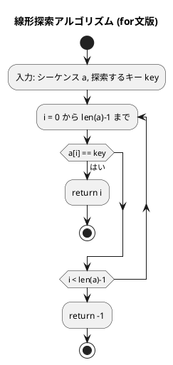
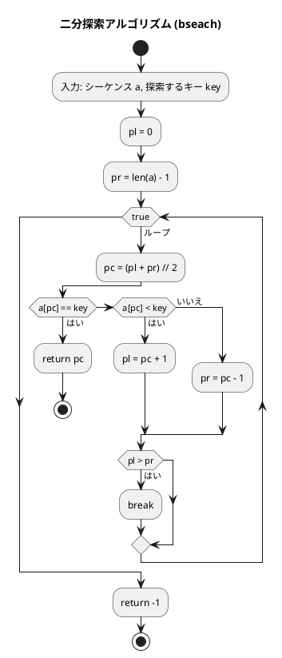

# 第 3 章 探索アルゴリズム

## はじめに

前章では配列とデータ構造について学びました。この章では、データの中から特定の値を見つけ出す「探索アルゴリズム」について学んでいきます。

主に以下の 3 つの方法を TDD で実装します：

1. 線形探索（シーケンシャルサーチ）
2. 二分探索（バイナリサーチ）
3. ハッシュ法

---

## 1. 線形探索

配列の先頭から順に各要素を調べ、目的のキーと一致する要素を探します。

### Red — 失敗するテストを書く

```python
# tests/test_search.py
class TestSsearch:
    """線形探索"""

    def test_ssearch_while_int(self):
        assert ssearch_while([6, 4, 3, 2, 1, 2, 8], 2) == 3

    def test_ssearch_for_int(self):
        assert ssearch_for([6, 4, 3, 2, 1, 2, 8], 2) == 3

    def test_ssearch_while_not_found(self):
        assert ssearch_while([1, 2, 3], 99) == -1
```

### Green — テストを通す実装

```python
# src/algorithm/search.py
from collections.abc import Sequence
from typing import Any


def ssearch_while(a: Sequence, key: Any) -> int:
    """シーケンスaからkeyと等価な要素を線形探索（while文）

    >>> ssearch_while([6, 4, 3, 2, 1, 2, 8], 2)
    3
    """
    i = 0
    while True:
        if i == len(a):
            return -1
        if a[i] == key:
            return i
        i += 1


def ssearch_for(a: Sequence, key: Any) -> int:
    """シーケンスaからkeyと等価な要素を線形探索（for文）

    >>> ssearch_for([6, 4, 3, 2, 1, 2, 8], 2)
    3
    """
    for i in range(len(a)):
        if a[i] == key:
            return i
    return -1
```

### アルゴリズムの考え方



**計算量**: 最悪 O(n)、平均 O(n/2)

### 番兵法

末尾にキーを追加（番兵）することで、ループ内の終了判定を省略します。

```python
def ssearch_sentinel(seq: Sequence, key: Any) -> int:
    """シーケンスseqからkeyと一致する要素を線形探索（番兵法）

    >>> ssearch_sentinel([6, 4, 3, 2, 1, 2, 8], 2)
    3
    """
    a = copy.deepcopy(list(seq))
    a.append(key)  # 番兵を追加

    i = 0
    while True:
        if a[i] == key:
            break
        i += 1
    return -1 if i == len(seq) else i
```

---

## 2. 二分探索

**前提**: 配列が整列されていること。

中央の要素とキーを比較し、探索範囲を半分に絞り込むことを繰り返します。

### Red — 失敗するテストを書く

```python
class TestBseach:
    """二分探索"""

    def test_bseach_found(self):
        assert bseach([1, 2, 3, 5, 7, 8, 9], 5) == 3

    def test_bseach_first(self):
        assert bseach([1, 2, 3, 5, 7, 8, 9], 1) == 0

    def test_bseach_last(self):
        assert bseach([1, 2, 3, 5, 7, 8, 9], 9) == 6

    def test_bseach_not_found(self):
        assert bseach([1, 2, 3, 5, 7, 8, 9], 4) == -1
```

### Green — テストを通す実装

```python
def bseach(a: Sequence, key: Any) -> int:
    """シーケンスaからkeyと一致する要素を二分探索

    >>> bseach([1, 2, 3, 5, 7, 8, 9], 5)
    3
    """
    pl = 0
    pr = len(a) - 1

    while True:
        pc = (pl + pr) // 2
        if a[pc] == key:
            return pc
        elif a[pc] < key:
            pl = pc + 1
        else:
            pr = pc - 1
        if pl > pr:
            break
    return -1
```

### アルゴリズムの考え方



**計算量**: O(log n)

| 要素数 | 線形探索（最悪） | 二分探索（最悪） |
|--------|--------------|--------------|
| 100 | 100回 | 7回 |
| 1,000 | 1,000回 | 10回 |
| 1,000,000 | 1,000,000回 | 20回 |

---

## 3. ハッシュ法

キーからハッシュ関数でアドレスを求め、直接要素にアクセスします。理想的な場合 O(1) で探索できます。

衝突（異なるキーが同じハッシュ値を生成する）の解決方法として、「チェイン法」と「オープンアドレス法」を実装します。

### チェイン法

同じハッシュ値を持つ要素を連結リストで管理します。

#### Red — 失敗するテストを書く

```python
class TestChainedHash:
    """チェイン法ハッシュ"""

    def setup_method(self):
        self.h = ChainedHash(13)
        self.h.add(1, "赤尾")
        self.h.add(14, "神崎")  # 1%13=1, 14%13=1 → 衝突

    def test_search_found(self):
        assert self.h.search(1) == "赤尾"
        assert self.h.search(14) == "神崎"

    def test_search_not_found(self):
        assert self.h.search(100) is None

    def test_add_duplicate(self):
        assert self.h.add(1, "重複") is False
```

#### Green — テストを通す実装

```python
class ChainedHash:
    """チェイン法を実現するハッシュクラス"""

    def __init__(self, capacity: int) -> None:
        self.capacity = capacity
        self.table: list[Any] = [None] * self.capacity

    def _hash_value(self, key: Any) -> int:
        if isinstance(key, int):
            return key % self.capacity
        return int(hashlib.sha256(str(key).encode()).hexdigest(), 16) % self.capacity

    def search(self, key: Any) -> Any:
        h = self._hash_value(key)
        p = self.table[h]
        while p is not None:
            if p.key == key:
                return p.value
            p = p.next
        return None

    def add(self, key: Any, value: Any) -> bool:
        h = self._hash_value(key)
        p = self.table[h]
        while p is not None:
            if p.key == key:
                return False  # 重複は追加しない
            p = p.next
        self.table[h] = _Node(key, value, self.table[h])
        return True

    def remove(self, key: Any) -> bool:
        h = self._hash_value(key)
        p = self.table[h]
        pp = None
        while p is not None:
            if p.key == key:
                if pp is None:
                    self.table[h] = p.next  # 先頭ノードを削除
                else:
                    pp.next = p.next        # 後続ノードを削除
                return True
            pp = p
            p = p.next
        return False
```

### オープンアドレス法

衝突時に空きスロットを探して要素を格納します。

```python
class OpenHash:
    """オープンアドレス法（線形探索法）を実現するハッシュクラス"""

    def search(self, key: Any) -> Any:
        h = self._hash_value(key)
        for _ in range(self.capacity):
            p = self.table[h]
            if p.stat == _Status.EMPTY:
                break
            elif p.stat == _Status.OCCUPIED and p.key == key:
                return p.value
            h = (h + 1) % self.capacity  # 次のスロットへ
        return None
```

バケットの状態は `OCCUPIED`/`EMPTY`/`DELETED` の 3 種類で管理します。`DELETED` は削除済みを示し、探索をここで止めないためのマーカーです。

---

## テスト実行結果

```bash
$ uv run pytest tests/test_search.py -v

...（29 テスト全パス）...

Name                         Stmts   Miss  Cover
------------------------------------------------
src/algorithm/search.py        134      0   100%
------------------------------------------------
56 passed in 0.23s
```

カバレッジ 100% 達成コロ助。

---

## 探索アルゴリズムの比較

| アルゴリズム | 事前条件 | 計算量 | 適用場面 |
|-------------|---------|--------|---------|
| 線形探索 | なし | O(n) | 小規模・未整列データ |
| 二分探索 | 整列済み | O(log n) | 大規模・整列データ |
| ハッシュ法 | なし | O(1)平均 | 高速な挿入・削除・探索 |

## 参考文献

- 『新・明解 Python で学ぶアルゴリズムとデータ構造』 — 柴田望洋
- 『テスト駆動開発』 — Kent Beck
