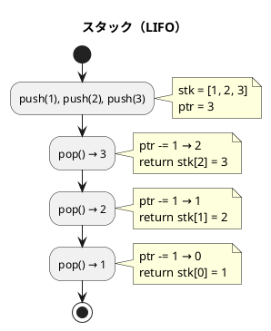
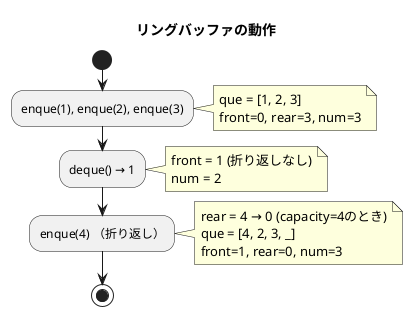

# 第 4 章 スタックとキュー

## はじめに

前章では探索アルゴリズムを学びました。この章では、データを一時的に保管するための代表的なデータ構造である「スタック」と「キュー」について TDD で実装します。

---

## 1. スタック

スタックは **LIFO（Last In First Out）** — 後から入れたものを最初に取り出す — データ構造です。

本の積み重ねをイメージすると分かりやすいです。一番上に積んだ本を最初に取り出します。

### Red — 失敗するテストを書く

```python
# tests/test_stack_queue.py
class TestFixedStack:
    """固定長スタック"""

    def setup_method(self):
        self.stack = FixedStack(64)

    def test_initial_state(self):
        assert self.stack.is_empty() is True
        assert self.stack.is_full() is False

    def test_push_and_pop(self):
        self.stack.push(1)
        assert self.stack.pop() == 1

    def test_push_multiple(self):
        self.stack.push(1)
        self.stack.push(2)
        self.stack.push(3)
        assert self.stack.pop() == 3  # LIFO
```

### Green — テストを通す実装

```python
# src/algorithm/stack_queue.py
from typing import Any


class FixedStack:
    """固定長スタック"""

    class Empty(Exception):
        """スタックが空の場合の例外"""

    class Full(Exception):
        """スタックが満杯の場合の例外"""

    def __init__(self, capacity: int) -> None:
        self.stk: list[Any] = [None] * capacity
        self.capacity = capacity
        self.ptr = 0  # スタックポインタ（積まれた要素数）

    def push(self, value: Any) -> None:
        """スタックにvalueをプッシュ"""
        if self.is_full():
            raise FixedStack.Full
        self.stk[self.ptr] = value
        self.ptr += 1

    def pop(self) -> Any:
        """スタックからポップ"""
        if self.is_empty():
            raise FixedStack.Empty
        self.ptr -= 1
        return self.stk[self.ptr]

    def peek(self) -> Any:
        """スタックの先頭要素を参照（取り出さない）"""
        if self.is_empty():
            raise FixedStack.Empty
        return self.stk[self.ptr - 1]
```

### アルゴリズムの考え方



**主な操作**:

| 操作 | メソッド | 計算量 | 説明 |
|------|---------|--------|------|
| プッシュ | `push(value)` | O(1) | 頂上に追加 |
| ポップ | `pop()` | O(1) | 頂上から取り出す |
| ピーク | `peek()` | O(1) | 頂上を参照（取り出さない） |
| 探索 | `find(value)` | O(n) | 値のインデックスを返す |
| カウント | `count(value)` | O(n) | 値の出現回数 |

---

## 2. キュー

キューは **FIFO（First In First Out）** — 最初に入れたものを最初に取り出す — データ構造です。

銀行の行列をイメージすると分かりやすいです。最初に並んだ人が最初にサービスを受けます。

### リングバッファ

固定長配列でキューを実現する際、素朴な実装では先頭要素を取り出すたびにすべての要素をシフトする必要があり O(n) のコストがかかります。

**リングバッファ**を使うと、`front`（先頭インデックス）と `rear`（末尾インデックス）を管理することで、エンキュー・デキューを O(1) で実現できます。



### Red — 失敗するテストを書く

```python
class TestFixedQueue:
    """固定長キュー（リングバッファ）"""

    def test_enque_multiple(self):
        self.queue.enque(1)
        self.queue.enque(2)
        self.queue.enque(3)
        assert self.queue.deque() == 1  # FIFO

    def test_ring_buffer_wrap_around(self):
        """リングバッファの折り返し動作確認"""
        small = FixedQueue(3)
        small.enque(1)
        small.enque(2)
        small.enque(3)
        small.deque()  # 1 を取り出す
        small.enque(4)  # 空き位置（先頭）に追加
        assert small.deque() == 2
        assert small.deque() == 3
        assert small.deque() == 4
```

### Green — テストを通す実装

```python
class FixedQueue:
    """固定長キュー（リングバッファ）"""

    def __init__(self, capacity: int) -> None:
        self.que: list[Any] = [None] * capacity
        self.capacity = capacity
        self.front = 0   # 先頭インデックス
        self.rear = 0    # 末尾インデックス
        self.num = 0     # キューに積まれた要素数

    def enque(self, value: Any) -> None:
        """キューにvalueをエンキュー"""
        if self.is_full():
            raise FixedQueue.Full
        self.que[self.rear] = value
        self.rear += 1
        self.num += 1
        if self.rear == self.capacity:
            self.rear = 0  # リングバッファの折り返し

    def deque(self) -> Any:
        """キューからデキュー"""
        if self.is_empty():
            raise FixedQueue.Empty
        value = self.que[self.front]
        self.front += 1
        self.num -= 1
        if self.front == self.capacity:
            self.front = 0  # リングバッファの折り返し
        return value
```

---

## テスト実行結果

```bash
$ uv run pytest tests/test_stack_queue.py -v

...（35 テスト全パス）...

Name                              Stmts   Miss  Cover
-----------------------------------------------------
src/algorithm/stack_queue.py      102      0   100%
-----------------------------------------------------
35 passed in 0.20s
```

カバレッジ 100% 達成コロ助。

---

## スタックとキューの比較

| 項目 | スタック | キュー |
|------|---------|--------|
| 取り出し順序 | LIFO（後入れ先出し） | FIFO（先入れ先出し） |
| 追加操作 | `push()` | `enque()` |
| 取り出し操作 | `pop()` | `deque()` |
| 主な用途 | 関数呼び出し、DFS | タスクキュー、BFS |
| 計算量（追加/取り出し） | O(1) | O(1) |

## 参考文献

- 『新・明解 Python で学ぶアルゴリズムとデータ構造』 — 柴田望洋
- 『テスト駆動開発』 — Kent Beck
