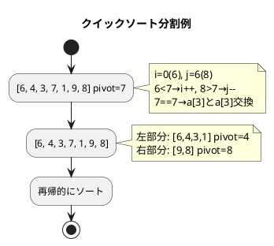

# 第 6 章 ソートアルゴリズム

## はじめに

前章では再帰アルゴリズムを学びました。この章では、データを順序付きに並べ替える「ソートアルゴリズム」を TDD で実装します。

主に以下の 6 種類を実装します：

1. バブルソート
2. 選択ソート
3. 挿入ソート
4. シェルソート
5. クイックソート
6. マージソート

---

## 1. バブルソート

隣接する要素を比較・交換し、最大値を末尾へ「浮き上がらせる」アルゴリズムです。

### Red — 失敗するテストを書く

```python
# tests/test_sort.py
class TestBubbleSort:
    def test_bubble_sort(self):
        a = [6, 4, 3, 7, 1, 9, 8]
        bubble_sort(a)
        assert a == [1, 3, 4, 6, 7, 8, 9]

    def test_already_sorted(self):
        a = [1, 3, 4, 6, 7, 8, 9]
        bubble_sort(a)
        assert a == [1, 3, 4, 6, 7, 8, 9]
```

### Green — テストを通す実装

```python
# src/algorithm/sort.py
def bubble_sort(a: list) -> None:
    """バブルソート（in-place）"""
    n = len(a)
    for i in range(n - 1):
        swapped = False
        for j in range(n - 1, i, -1):
            if a[j - 1] > a[j]:
                a[j - 1], a[j] = a[j], a[j - 1]
                swapped = True
        if not swapped:
            break  # 交換なし → 整列完了
```

**計算量**: 最悪 O(n²)、最良 O(n)（整列済みの場合）

---

## 2. 選択ソート

未整列部分の最小値を探し、先頭と交換するアルゴリズムです。

### Green — テストを通す実装

```python
def selection_sort(a: list) -> None:
    """選択ソート（in-place）"""
    n = len(a)
    for i in range(n - 1):
        min_idx = i
        for j in range(i + 1, n):
            if a[j] < a[min_idx]:
                min_idx = j
        if min_idx != i:
            a[i], a[min_idx] = a[min_idx], a[i]
```

**計算量**: 常に O(n²)（整列済みでも改善されない）

---

## 3. 挿入ソート

未整列部分の先頭要素を、整列済み部分の適切な位置に挿入するアルゴリズムです。

### Green — テストを通す実装

```python
def insertion_sort(a: list) -> None:
    """挿入ソート（in-place）"""
    n = len(a)
    for i in range(1, n):
        key = a[i]
        j = i - 1
        while j >= 0 and a[j] > key:
            a[j + 1] = a[j]
            j -= 1
        a[j + 1] = key
```

**計算量**: 最悪 O(n²)、最良 O(n)（整列済みの場合）

---

## 4. シェルソート

挿入ソートの改良版。間隔（gap）を縮小しながら複数回の挿入ソートを行います。

### Green — テストを通す実装

```python
def shell_sort(a: list) -> None:
    """シェルソート（Knuth 数列使用）"""
    n = len(a)
    gap = 1
    while gap * 3 + 1 < n:
        gap = gap * 3 + 1  # 1, 4, 13, 40, ...

    while gap > 0:
        for i in range(gap, n):
            key = a[i]
            j = i - gap
            while j >= 0 and a[j] > key:
                a[j + gap] = a[j]
                j -= gap
            a[j + gap] = key
        gap //= 3
```

**計算量**: O(n^(3/2)) ～ O(n log² n)（gap 数列に依存）

---

## 5. クイックソート

ピボットを基準に配列を 2 分割し、再帰的にソートします。実用的に最も高速なアルゴリズムの一つです。

### Red — 失敗するテストを書く

```python
class TestQuickSort:
    def test_quick_sort(self):
        a = [6, 4, 3, 7, 1, 9, 8]
        quick_sort(a)
        assert a == [1, 3, 4, 6, 7, 8, 9]

    def test_large(self):
        import random
        a = list(range(200))
        random.shuffle(a)
        quick_sort(a)
        assert a == list(range(200))
```

### Green — テストを通す実装

```python
def quick_sort(a: list, left: int = 0, right: int | None = None) -> None:
    """クイックソート（in-place）"""
    if right is None:
        right = len(a) - 1

    if left >= right:
        return

    pivot = a[(left + right) // 2]
    i, j = left, right

    while i <= j:
        while a[i] < pivot:
            i += 1
        while a[j] > pivot:
            j -= 1
        if i <= j:
            a[i], a[j] = a[j], a[i]
            i += 1
            j -= 1

    quick_sort(a, left, j)
    quick_sort(a, i, right)
```

### アルゴリズムの考え方



**計算量**: 平均 O(n log n)、最悪 O(n²)

---

## 6. マージソート

配列を半分に分割し、再帰的にソートして結合します。

### Green — テストを通す実装

```python
def merge_sort(a: list) -> list:
    """マージソート（新しいリストを返す）"""
    if len(a) <= 1:
        return a[:]

    mid = len(a) // 2
    left = merge_sort(a[:mid])
    right = merge_sort(a[mid:])
    return _merge(left, right)


def _merge(left: list, right: list) -> list:
    """2 つの整列済みリストをマージ"""
    result = []
    i = j = 0
    while i < len(left) and j < len(right):
        if left[i] <= right[j]:
            result.append(left[i])
            i += 1
        else:
            result.append(right[j])
            j += 1
    result.extend(left[i:])
    result.extend(right[j:])
    return result
```

**計算量**: 常に O(n log n)

---

## テスト実行結果

```bash
$ uv run pytest tests/test_sort.py -v

...（27 テスト全パス）...

Name                    Stmts   Miss  Cover
-------------------------------------------
src/algorithm/sort.py      79      0   100%
-------------------------------------------
27 passed in 0.15s
```

カバレッジ 100% 達成コロ助。

---

## ソートアルゴリズムの比較

| アルゴリズム | 最良 | 平均 | 最悪 | 安定 | 備考 |
|-------------|------|------|------|------|------|
| バブルソート | O(n) | O(n²) | O(n²) | ✓ | 整列済み検出あり |
| 選択ソート | O(n²) | O(n²) | O(n²) | ✗ | 交換回数が少ない |
| 挿入ソート | O(n) | O(n²) | O(n²) | ✓ | 小規模データに有効 |
| シェルソート | O(n) | O(n^1.5) | O(n²) | ✗ | 挿入ソートの改良 |
| クイックソート | O(n log n) | O(n log n) | O(n²) | ✗ | 実用的に最速 |
| マージソート | O(n log n) | O(n log n) | O(n log n) | ✓ | 追加メモリが必要 |

## 参考文献

- 『新・明解 Python で学ぶアルゴリズムとデータ構造』 — 柴田望洋
- 『テスト駆動開発』 — Kent Beck
