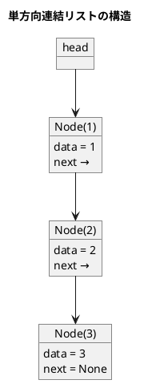

# 第 8 章 リスト

## はじめに

前章では文字列処理を学びました。この章では「**リスト（連結リスト）**」という動的なデータ構造を TDD で実装します。

配列と異なり、連結リストはメモリ上に不連続に配置されたノードをポインタで繋ぎます。要素の挿入・削除が O(1) ですが、ランダムアクセスは O(n) です。

主な実装内容：

1. 線形リスト（単方向連結リスト）
2. 双方向連結リスト

---

## 1. 線形リスト（単方向連結リスト）

各ノードが次のノードへの参照を持ちます。

### Red — 失敗するテストを書く

```python
# tests/test_linked_list.py
class TestLinkedList:
    def setup_method(self):
        self.lst = LinkedList()

    def test_add_last(self):
        self.lst.add_last(1)
        self.lst.add_last(2)
        assert len(self.lst) == 2

    def test_search_found(self):
        self.lst.add_last(10)
        self.lst.add_last(20)
        node = self.lst.search(20)
        assert node.data == 20
```

### Green — テストを通す実装

```python
# src/algorithm/linked_list.py
from collections.abc import Iterator
from typing import Any


class _Node:
    """単方向連結リストのノード"""
    def __init__(self, data: Any, next_node: _Node | None = None):
        self.data = data
        self.next: _Node | None = next_node


class LinkedList:
    """線形リスト（単方向連結リスト）"""

    def __init__(self):
        self.head: _Node | None = None
        self.no = 0

    def add_last(self, data: Any) -> None:
        if self.head is None:
            self.head = _Node(data)
        else:
            ptr = self.head
            while ptr.next is not None:
                ptr = ptr.next
            ptr.next = _Node(data)
        self.no += 1

    def search(self, data: Any) -> _Node | None:
        ptr = self.head
        while ptr is not None:
            if ptr.data == data:
                return ptr
            ptr = ptr.next
        return None
```

### アルゴリズムの考え方



**主な操作の計算量**:

| 操作 | 先頭 | 末尾 | 中間 |
|------|------|------|------|
| 挿入 | O(1) | O(n) | O(n) |
| 削除 | O(1) | O(n) | O(n) |
| 探索 | O(n) | O(n) | O(n) |

---

## 2. 双方向連結リスト

各ノードが前後両方のノードへの参照を持ちます。番兵ノード（ダミー）を使い、先頭・末尾の特殊処理を不要にします。

### Red — 失敗するテストを書く

```python
class TestDoublyLinkedList:
    def test_add_last(self):
        self.lst.add_last(1)
        self.lst.add_last(2)
        assert len(self.lst) == 2

    def test_remove(self):
        self.lst.add_last(1)
        self.lst.add_last(2)
        self.lst.add_last(3)
        node = self.lst.search(2)
        self.lst.remove(node)
        assert self.lst.search(2) is None
```

### Green — テストを通す実装

```python
class DoublyLinkedList:
    """双方向連結リスト（番兵ノード使用）"""

    def __init__(self):
        self.head = _DNode(None)  # 番兵ノード
        self.head.prev = self.head
        self.head.next = self.head
        self.no = 0

    def add_last(self, data: Any) -> None:
        node = _DNode(data, self.head.prev, self.head)
        self.head.prev.next = node
        self.head.prev = node
        self.no += 1

    def remove(self, node: _DNode) -> None:
        if self.is_empty():
            return
        node.prev.next = node.next
        node.next.prev = node.prev
        self.no -= 1
```

---

## テスト実行結果

```bash
$ uv run pytest tests/test_linked_list.py -v

...（28 テスト全パス）...

Name                           Stmts   Miss  Cover
--------------------------------------------------
src/algorithm/linked_list.py     120      0   100%
--------------------------------------------------
28 passed in 0.22s
```

カバレッジ 100% 達成コロ助。

---

## 配列 vs 連結リスト

| 項目 | 配列 | 連結リスト |
|------|------|-----------|
| ランダムアクセス | O(1) | O(n) |
| 先頭への挿入 | O(n) | O(1) |
| 末尾への挿入 | O(1) | O(1)※単方向は O(n) |
| 途中への挿入 | O(n) | O(1)（ポインタ取得後） |
| メモリ使用 | 連続領域 | 不連続、ポインタ分余分 |

## 参考文献

- 『新・明解 Python で学ぶアルゴリズムとデータ構造』 — 柴田望洋
- 『テスト駆動開発』 — Kent Beck
