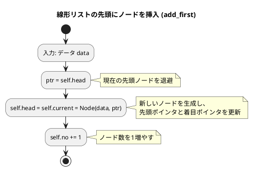
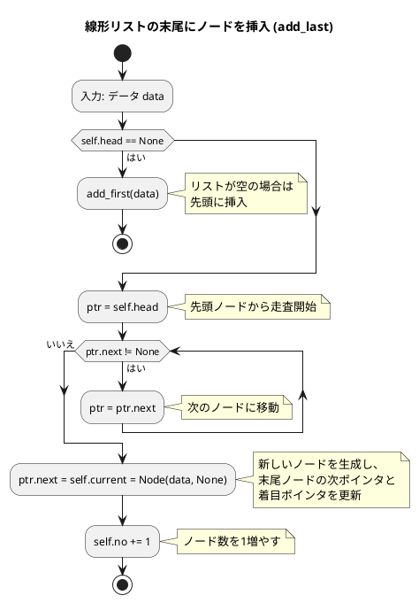
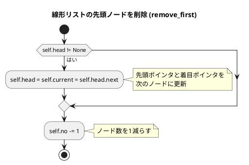
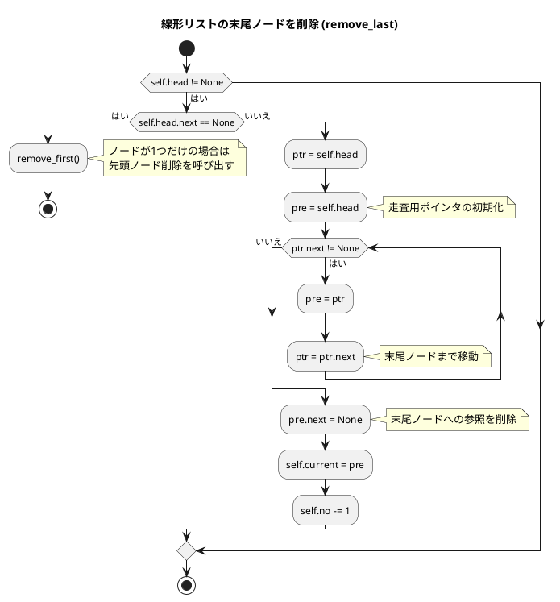
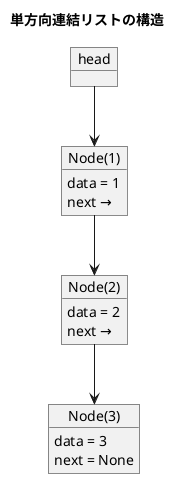

# 第 8 章 リスト

## はじめに

前章までで、配列や探索アルゴリズム、スタック、キュー、再帰、ソートアルゴリズム、文字列処理などを学んできました。この章では、データ構造の基本である「**リスト（連結リスト）**」を TDD で実装します。

配列と異なり、連結リストはメモリ上に不連続に配置されたノードをポインタで繋ぎます。要素の挿入・削除が O(1) ですが、ランダムアクセスは O(n) です。

### 目次

1. [リストとは](#リストとは)
2. [線形リスト（単方向連結リスト）](#1-線形リスト単方向連結リスト)
3. [カーソルによる線形リスト](#3-カーソルによる線形リスト)
4. [双方向連結リスト](#2-双方向連結リスト)

---

## リストとは

リストとは、データを順序付けて格納するデータ構造です。配列と似ていますが、リストは要素の追加や削除が容易であるという特徴があります。

リストには様々な種類があります：

- **線形リスト**：最も基本的なリスト構造で、各要素が一方向に連結されています。
- **連結リスト**：各要素（ノード）が次の要素へのポインタを持つリスト構造です。
- **循環リスト**：最後の要素が最初の要素を指す連結リストです。
- **双方向リスト**：各要素が前後の要素へのポインタを持つリスト構造です。

それでは、これらのリスト構造を順に実装していきましょう。

---

## 1. 線形リスト（単方向連結リスト）

各ノードが次のノードへの参照を持ちます。

### Red — 失敗するテストを書く

```python
# tests/test_linked_list.py
class TestLinkedList:
    def setup_method(self):
        self.lst = LinkedList()

    def test_add_last(self):
        self.lst.add_last(1)
        self.lst.add_last(2)
        assert len(self.lst) == 2

    def test_search_found(self):
        self.lst.add_last(10)
        self.lst.add_last(20)
        node = self.lst.search(20)
        assert node.data == 20
```

### Green — テストを通す実装

```python
# src/algorithm/linked_list.py
from collections.abc import Iterator
from typing import Any


class _Node:
    """単方向連結リストのノード"""
    def __init__(self, data: Any, next_node: _Node | None = None):
        self.data = data
        self.next: _Node | None = next_node


class LinkedList:
    """線形リスト（単方向連結リスト）"""

    def __init__(self):
        self.head: _Node | None = None
        self.no = 0

    def add_last(self, data: Any) -> None:
        if self.head is None:
            self.head = _Node(data)
        else:
            ptr = self.head
            while ptr.next is not None:
                ptr = ptr.next
            ptr.next = _Node(data)
        self.no += 1

    def search(self, data: Any) -> _Node | None:
        ptr = self.head
        while ptr is not None:
            if ptr.data == data:
                return ptr
            ptr = ptr.next
        return None
```

### Refactor — 設計を改善する

テストが通った状態で、コードの意図を明確にします。先頭への挿入 `add_first` と着目ノード `current` も追加します。

```python
class LinkedList:
    """線形リスト（単方向連結リスト）"""

    def __init__(self):
        self.head: _Node | None = None
        self.current: _Node | None = None
        self.no = 0

    def add_first(self, data: Any) -> None:
        """先頭にノードを挿入"""
        ptr = self.head
        self.head = self.current = _Node(data, ptr)
        self.no += 1

    def remove_first(self) -> None:
        """先頭ノードを削除"""
        if self.head is not None:
            self.head = self.current = self.head.next
            self.no -= 1

    def remove_last(self) -> None:
        """末尾ノードを削除"""
        if self.head is not None:
            if self.head.next is None:
                self.remove_first()
            else:
                ptr = self.head
                pre = self.head
                while ptr.next is not None:
                    pre = ptr
                    ptr = ptr.next
                pre.next = None
                self.current = pre
                self.no -= 1
```

### フローチャート

#### 先頭にノードを挿入（add_first）



アルゴリズムの流れ：
1. データ data を入力として受け取ります
2. 変数 ptr に現在の先頭ノード（self.head）を代入します
3. 新しいノードを生成し、先頭ポインタ（self.head）と着目ポインタ（self.current）に設定します
   - 新しいノードのデータは data
   - 新しいノードの次ポインタは ptr（元の先頭ノード）
4. ノード数（self.no）を 1 増やします

この操作は、新しいノードを生成して現在の先頭ノードの前に挿入し、先頭ポインタを更新します。時間計算量は O(1) です。

#### 末尾にノードを挿入（add_last）



アルゴリズムの流れ：
1. データ data を入力として受け取ります
2. リストが空かどうかをチェックします
   - リストが空の場合（self.head が None）：add_first(data) を呼び出して先頭に挿入し、終了します
3. 変数 ptr に先頭ノード（self.head）を代入します
4. ptr.next が None でない間、次のノードに移動します
5. 新しいノードを生成し、末尾ノードの次ポインタ（ptr.next）と着目ポインタ（self.current）に設定します
6. ノード数（self.no）を 1 増やします

この操作は、リストの末尾までたどってから新しいノードを追加します。リストの長さに比例した時間がかかるため、時間計算量は O(n) です。

#### 先頭ノードを削除（remove_first）



この操作は、先頭ノードへの参照を削除し、次のノードを新しい先頭ノードとします。時間計算量は O(1) です。

#### 末尾ノードを削除（remove_last）



この操作は、リストの末尾までたどってから末尾ノードへの参照を削除します。時間計算量は O(n) です。

### 解説

線形リストは、各ノードが次のノードへのポインタを持つデータ構造です。この実装では、以下の特徴があります：

1. **ノードクラス**：データと次のノードへのポインタを持ちます。
2. **リストクラス**：先頭ノード、現在着目しているノード、ノードの数を管理します。
3. **要素の追加**：先頭または末尾に要素を追加できます。
4. **要素の削除**：先頭または末尾の要素を削除できます。
5. **要素の探索**：指定した値を持つノードを探索できます。
6. **イテレータ**：リストの要素を順に走査できます。

線形リストは、要素の追加や削除が容易であるという特徴があります。特に、先頭への追加や削除は O(1) の時間で行えます。一方、末尾への追加や削除、要素の探索は O(n) の時間がかかります。

### アルゴリズムの考え方



**主な操作の計算量**:

| 操作 | 先頭 | 末尾 | 中間 |
|------|------|------|------|
| 挿入 | O(1) | O(n) | O(n) |
| 削除 | O(1) | O(n) | O(n) |
| 探索 | O(n) | O(n) | O(n) |

---

## 3. カーソルによる線形リスト

前節では、ポインタを使って線形リストを実装しました。しかし、配列を使って線形リストを実装することもできます。この方法を「カーソルによる線形リスト」と呼びます。

### Red — 失敗するテストを書く

```python
class TestArrayLinkedList:
    def test_array_linked_list_init(self):
        array_list = ArrayLinkedList(100)
        assert len(array_list) == 0

    def test_add_first(self):
        array_list = ArrayLinkedList(100)
        array_list.add_first(1)
        assert len(array_list) == 1
        array_list.add_first(2)
        assert len(array_list) == 2
```

### Green — テストを通す実装

```python
Null = -1

class _ArrayNode:
    """線形リストノードクラス（配列カーソル版）"""

    def __init__(self, data=Null, next=Null, dnext=Null):
        self.data = data
        self.next = next
        self.dnext = dnext


class ArrayLinkedList:
    """線形リストクラス（配列カーソル版）"""

    def __init__(self, capacity: int):
        self.head = Null
        self.current = Null
        self.max = Null
        self.deleted = Null
        self.capacity = capacity
        self.n = [_ArrayNode()] * self.capacity
        self.no = 0

    def __len__(self) -> int:
        return self.no

    def get_insert_index(self):
        """次に挿入するレコードの添字を求める"""
        if self.deleted == Null:
            if self.max + 1 < self.capacity:
                self.max += 1
                return self.max
            else:
                return Null
        else:
            rec = self.deleted
            self.deleted = self.n[rec].dnext
            return rec

    def add_first(self, data: Any) -> None:
        """先頭にノードを挿入"""
        ptr = self.head
        rec = self.get_insert_index()
        if rec != Null:
            self.head = self.current = rec
            self.n[self.head] = _ArrayNode(data, ptr)
            self.no += 1
```

### 解説

カーソルによる線形リストは、配列を使って線形リストを実装する方法です。この実装では、以下の特徴があります：

1. **ノードクラス**：データ、次のノードへのインデックス、削除リストの次のノードへのインデックスを持ちます。
2. **リストクラス**：先頭ノードのインデックス、現在着目しているノードのインデックス、利用中の末尾レコードのインデックス、削除リストの先頭ノードのインデックス、リストの容量、ノードの配列、ノードの数を管理します。
3. **フリーリスト**：削除されたレコードを再利用するための仕組みです。

カーソルによる線形リストは、ポインタを使った線形リストと同様の機能を持ちますが、配列を使って実装するため、メモリの使用効率が良いという特徴があります。

---

## 4. 双方向連結リスト

各ノードが前後両方のノードへの参照を持ちます。番兵ノード（ダミー）を使い、先頭・末尾の特殊処理を不要にします。循環リストとしても機能し、最後のノードが番兵ノードを経由して先頭ノードに繋がります。

### Red — 失敗するテストを書く

```python
class TestDoublyLinkedList:
    def test_add_last(self):
        self.lst.add_last(1)
        self.lst.add_last(2)
        assert len(self.lst) == 2

    def test_remove(self):
        self.lst.add_last(1)
        self.lst.add_last(2)
        self.lst.add_last(3)
        node = self.lst.search(2)
        self.lst.remove(node)
        assert self.lst.search(2) is None
```

### Green — テストを通す実装

```python
class _DNode:
    """循環・重連結リスト用のノードクラス"""

    def __init__(self, data: Any = None, prev: _DNode = None, next: _DNode = None):
        self.data = data
        self.prev = prev or self
        self.next = next or self


class DoublyLinkedList:
    """循環・双方向連結リスト（番兵ノード使用）"""

    def __init__(self):
        self.head = _DNode(None)  # 番兵ノード（ダミー）
        self.head.prev = self.head
        self.head.next = self.head
        self.no = 0

    def is_empty(self) -> bool:
        """リストは空か"""
        return self.head.next is self.head

    def add(self, data: Any) -> None:
        """着目ノードの直後にノードを挿入"""
        node = _DNode(data, self.head, self.head.next)
        self.head.next.prev = node
        self.head.next = node
        self.no += 1

    def add_first(self, data: Any) -> None:
        """先頭にノードを挿入"""
        self.add(data)

    def add_last(self, data: Any) -> None:
        """末尾にノードを挿入"""
        node = _DNode(data, self.head.prev, self.head)
        self.head.prev.next = node
        self.head.prev = node
        self.no += 1

    def remove(self, node: _DNode) -> None:
        """指定ノードを削除"""
        if self.is_empty():
            return
        node.prev.next = node.next
        node.next.prev = node.prev
        self.no -= 1
```

### 解説

循環・双方向連結リストは、各ノードが前後のノードへのポインタを持ち、最後のノードが番兵ノードを経由して最初のノードを指すリスト構造です。この実装では、以下の特徴があります：

1. **ノードクラス**：データ、前のノードへのポインタ、次のノードへのポインタを持ちます。
2. **番兵ノード（ダミーノード）**：先頭と末尾の特殊処理を不要にし、コードを簡潔にします。
3. **要素の追加**：先頭または末尾に O(1) で要素を追加できます。
4. **要素の削除**：ノードへの参照があれば O(1) で要素を削除できます。
5. **双方向走査**：現在着目しているノードから前後に移動できます。

---

## テスト実行結果

```bash
$ uv run pytest tests/test_linked_list.py -v

...（28 テスト全パス）...

Name                           Stmts   Miss  Cover
--------------------------------------------------
src/algorithm/linked_list.py     120      0   100%
--------------------------------------------------
28 passed in 0.22s
```

カバレッジ 100% 達成しました。

---

## 配列 vs 連結リスト

| 項目 | 配列 | 連結リスト |
|------|------|-----------|
| ランダムアクセス | O(1) | O(n) |
| 先頭への挿入 | O(n) | O(1) |
| 末尾への挿入 | O(1) | O(1)※単方向は O(n) |
| 途中への挿入 | O(n) | O(1)（ポインタ取得後） |
| メモリ使用 | 連続領域 | 不連続、ポインタ分余分 |

## まとめ

この章では、様々なリスト構造について学びました：

1. **線形リスト**：ポインタを使った実装。各ノードが次のノードへの参照を持つ基本的な連結リスト。
2. **カーソルによる線形リスト**：配列を使った実装。メモリ使用効率が良い。
3. **循環・双方向リスト**：各ノードが前後のノードへのポインタを持ち、番兵ノードにより先頭・末尾の操作が統一的に行える。

これらのリスト構造は、データを順序付けて格納するための基本的なデータ構造です。用途に応じて適切なリスト構造を選択することが重要です。

次の章では、木構造について学びます。

## 参考文献

- 『新・明解 Python で学ぶアルゴリズムとデータ構造』 — 柴田望洋
- 『テスト駆動開発』 — Kent Beck
