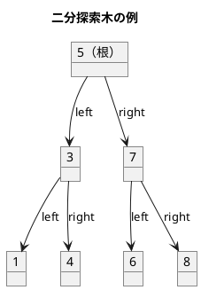
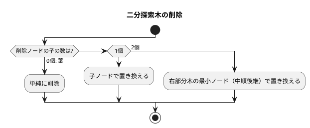

# 第 9 章 木構造

## はじめに

前章では連結リストを学びました。この章では「**木構造**」、特に**二分探索木（BST: Binary Search Tree）**を TDD で実装します。

木構造はノードが親子関係で繋がった非線形データ構造です。二分探索木は左の子 < 親 < 右の子という性質を持ち、効率的な探索・挿入・削除を実現します。

---

## 二分探索木の性質



**性質**:
- 左部分木のすべてのキー < ルートのキー
- 右部分木のすべてのキー > ルートのキー
- 中順探索（left → root → right）は昇順になる

---

## Red — 失敗するテストを書く

```python
# tests/test_tree.py
class TestBinarySearchTree:
    def setup_method(self):
        self.bst = BinarySearchTree()

    def test_insert_and_search(self):
        self.bst.insert(5)
        assert self.bst.search(5).key == 5

    def test_inorder_traversal(self):
        """中順探索は昇順に返す"""
        for v in [5, 3, 7, 1, 4, 6, 8]:
            self.bst.insert(v)
        assert self.bst.inorder() == [1, 3, 4, 5, 6, 7, 8]

    def test_delete_node_with_two_children(self):
        """子が 2 つのノードの削除"""
        for v in [5, 3, 7, 1, 4]:
            self.bst.insert(v)
        self.bst.delete(3)
        assert self.bst.search(3) is None
```

---

## Green — テストを通す実装

```python
# src/algorithm/tree.py
from typing import Any


class _BSTNode:
    def __init__(self, key: Any):
        self.key = key
        self.left: _BSTNode | None = None
        self.right: _BSTNode | None = None


class BinarySearchTree:
    def search(self, key: Any) -> _BSTNode | None:
        ptr = self.root
        while ptr is not None:
            if key == ptr.key:
                return ptr
            elif key < ptr.key:
                ptr = ptr.left
            else:
                ptr = ptr.right
        return None

    def insert(self, key: Any) -> None:
        if self.root is None:
            self.root = _BSTNode(key)
            self.no += 1
            return
        ptr = self.root
        while True:
            if key == ptr.key:
                return  # 重複は無視
            elif key < ptr.key:
                if ptr.left is None:
                    ptr.left = _BSTNode(key)
                    self.no += 1
                    return
                ptr = ptr.left
            else:
                if ptr.right is None:
                    ptr.right = _BSTNode(key)
                    self.no += 1
                    return
                ptr = ptr.right
```

---

## ノードの削除

削除は 3 つのケースに分かれます：



```python
def delete(self, key: Any) -> None:
    # ...（対象ノードを探索）
    if ptr.left is None and ptr.right is None:
        self._replace_node(parent, is_left_child, None)
    elif ptr.right is None:
        self._replace_node(parent, is_left_child, ptr.left)
    elif ptr.left is None:
        self._replace_node(parent, is_left_child, ptr.right)
    else:
        # 右部分木の最小ノードを後継として使用
        successor = ptr.right
        while successor.left is not None:
            successor = successor.left
        ptr.key = successor.key
        # 後継ノードを削除
        ...
```

---

## 木の走査

| 走査方法 | 順序 | 用途 |
|---------|------|------|
| 前順（preorder） | 根→左→右 | ツリーのコピー |
| 中順（inorder） | 左→根→右 | ソート済みリスト取得 |
| 後順（postorder） | 左→右→根 | ツリーの削除 |

---

## テスト実行結果

```bash
$ uv run pytest tests/test_tree.py -v

...（23 テスト全パス）...

Name                     Stmts   Miss  Cover
--------------------------------------------
src/algorithm/tree.py      128      0   100%
--------------------------------------------
23 passed in 0.22s
```

カバレッジ 100% 達成コロ助。

---

## 二分探索木の計算量

| 操作 | 平均 | 最悪（偏り木） |
|------|------|--------------|
| 探索 | O(log n) | O(n) |
| 挿入 | O(log n) | O(n) |
| 削除 | O(log n) | O(n) |

バランス木（AVL 木、赤黒木）を使うと最悪でも O(log n) を保証できます。

## 参考文献

- 『新・明解 Python で学ぶアルゴリズムとデータ構造』 — 柴田望洋
- 『テスト駆動開発』 — Kent Beck
