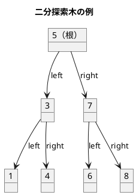
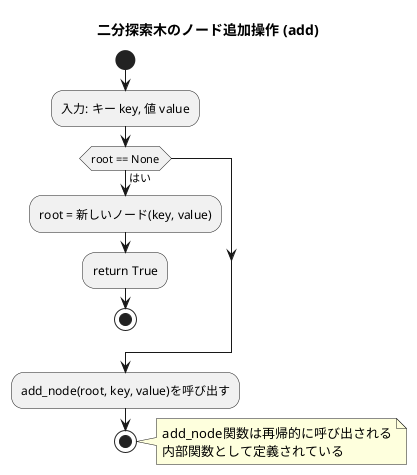
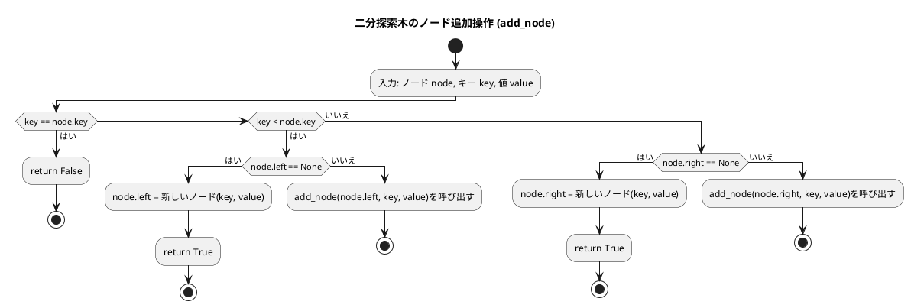
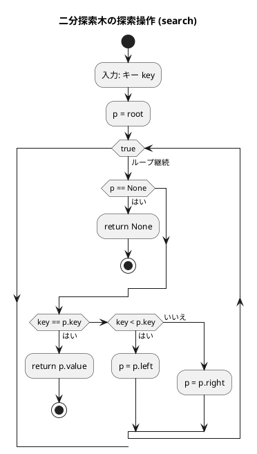
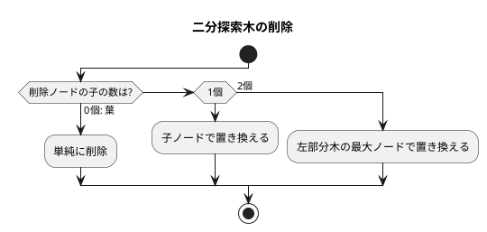
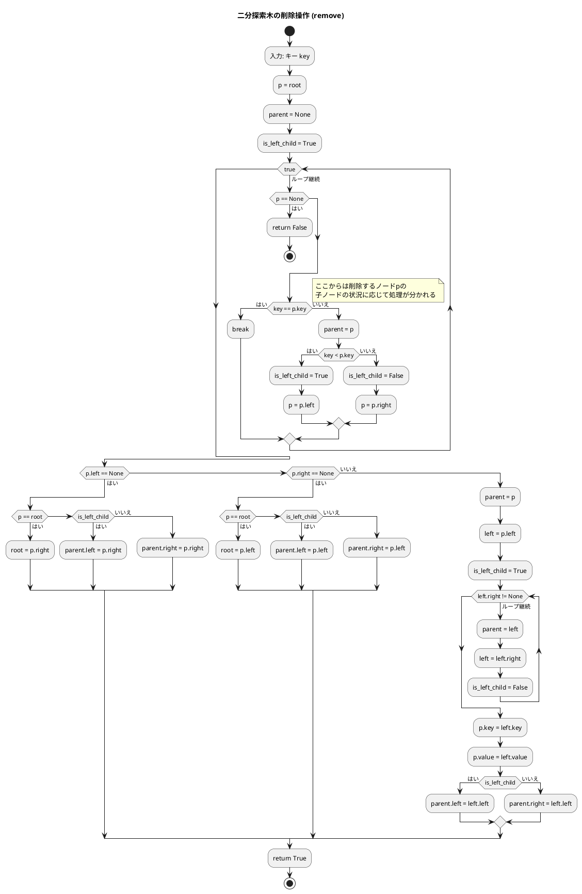
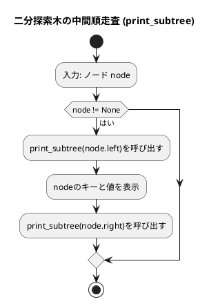

# 第 9 章 木構造

## はじめに

前章までで、配列、探索アルゴリズム、スタック、キュー、再帰、ソートアルゴリズム、文字列処理、リストなどを学んできました。この章では、データ構造の中でも特に重要な「**木構造**」、特に**二分探索木（BST: Binary Search Tree）**を TDD で実装します。

木構造はノードが親子関係で繋がった非線形データ構造です。二分探索木は左の子 < 親 < 右の子という性質を持ち、効率的な探索・挿入・削除を実現します。

### 目次

1. [木構造とは](#木構造とは)
2. [二分木](#二分木)
3. [二分探索木の性質](#二分探索木の性質)
4. [Red — 失敗するテストを書く](#red--失敗するテストを書く)
5. [Green — テストを通す実装](#green--テストを通す実装)
6. [ノードの削除](#ノードの削除)
7. [木の走査](#木の走査)
8. [ヒープ](#ヒープ)

---

## 木構造とは

木構造とは、データを階層的に表現するデータ構造です。木構造は、以下の要素から構成されます：

- **ノード**：データを格納する要素
- **エッジ**：ノード間の関係を表す線
- **ルート**：木の最上位に位置するノード
- **親ノード**：あるノードの上位に位置するノード
- **子ノード**：あるノードの下位に位置するノード
- **葉ノード**：子ノードを持たないノード

木構造は、以下のような特徴を持ちます：

1. 一つのルートノードから始まる
2. 各ノードは 0 個以上の子ノードを持つ
3. 循環構造を持たない（サイクルがない）

### 順序木と無順序木

木構造は、子ノードの順序に意味があるかどうかによって、「順序木」と「無順序木」に分類されます。

- **順序木**：子ノードの順序に意味がある木構造
- **無順序木**：子ノードの順序に意味がない木構造

### 順序木の探索

順序木を探索する方法には、主に以下の 3 つがあります：

1. **先行順（行きがけ順）探索**：ノード自身 → 左部分木 → 右部分木の順に探索
2. **中間順（通りがけ順）探索**：左部分木 → ノード自身 → 右部分木の順に探索
3. **後行順（帰りがけ順）探索**：左部分木 → 右部分木 → ノード自身の順に探索

これらの探索方法は、再帰を用いて実装することができます。

---

## 二分木

二分木は、各ノードが最大 2 つの子ノード（左の子と右の子）を持つ木構造です。二分木は、以下のような特徴を持ちます：

1. 各ノードは最大 2 つの子ノードを持つ
2. 左の子と右の子が明確に区別される
3. 空の二分木も存在する

二分木は、様々なアルゴリズムやデータ構造の基礎となります。例えば、二分探索木、ヒープ、ハフマン木などは、二分木の一種です。

---

## 二分探索木の性質



**性質**:
- 左部分木のすべてのキー < ルートのキー
- 右部分木のすべてのキー > ルートのキー
- 中順探索（left → root → right）は昇順になる

---

## Red — 失敗するテストを書く

```python
# tests/test_tree.py
class TestBinarySearchTree:
    def setup_method(self):
        self.bst = BinarySearchTree()

    def test_insert_and_search(self):
        self.bst.insert(5)
        assert self.bst.search(5).key == 5

    def test_inorder_traversal(self):
        """中順探索は昇順に返す"""
        for v in [5, 3, 7, 1, 4, 6, 8]:
            self.bst.insert(v)
        assert self.bst.inorder() == [1, 3, 4, 5, 6, 7, 8]

    def test_delete_node_with_two_children(self):
        """子が 2 つのノードの削除"""
        for v in [5, 3, 7, 1, 4]:
            self.bst.insert(v)
        self.bst.delete(3)
        assert self.bst.search(3) is None
```

---

## Green — テストを通す実装

```python
# src/algorithm/tree.py
from typing import Any


class _BSTNode:
    """二分探索木のノード"""

    def __init__(self, key: Any, value: Any = None,
                 left: _BSTNode | None = None, right: _BSTNode | None = None):
        self.key = key
        self.value = value
        self.left = left
        self.right = right


class BinarySearchTree:
    """二分探索木"""

    def __init__(self):
        self.root: _BSTNode | None = None

    def search(self, key: Any) -> Any | None:
        """キー key をもつノードを探索"""
        p = self.root
        while True:
            if p is None:
                return None
            if key == p.key:
                return p.value
            elif key < p.key:
                p = p.left
            else:
                p = p.right

    def add(self, key: Any, value: Any) -> bool:
        """キーが key で値が value のノードを挿入"""

        def add_node(node: _BSTNode, key: Any, value: Any) -> bool:
            if key == node.key:
                return False  # 重複キーは挿入失敗
            elif key < node.key:
                if node.left is None:
                    node.left = _BSTNode(key, value)
                else:
                    add_node(node.left, key, value)
            else:
                if node.right is None:
                    node.right = _BSTNode(key, value)
                else:
                    add_node(node.right, key, value)
            return True

        if self.root is None:
            self.root = _BSTNode(key, value)
            return True
        else:
            return add_node(self.root, key, value)

    def insert(self, key: Any) -> None:
        """キーのみでノードを挿入（簡易版）"""
        self.add(key, key)
```

### フローチャート

#### ノード追加操作





アルゴリズムの流れ：
1. **add メソッド**: 根ノード root が None の場合は新しいノードを作成して root に設定します。それ以外の場合は内部関数 add_node を呼び出します。
2. **add_node 関数**: key が node のキーと等しい場合は重複なので False を返します。key が小さければ左の子に、大きければ右の子に再帰的に追加します。

この操作により、二分探索木の性質（左の子のキーは親より小さく、右の子のキーは親より大きい）が維持されます。

#### 探索操作



この操作は、二分探索木の性質を利用して効率的に探索を行います。平均的な場合、時間計算量は O(log n) となります。

---

## ノードの削除

削除は 3 つのケースに分かれます：



```python
def remove(self, key: Any) -> bool:
    """キーが key のノードを削除"""
    p = self.root
    parent = None
    is_left_child = True

    while True:
        if p is None:
            return False
        if key == p.key:
            break
        else:
            parent = p
            if key < p.key:
                is_left_child = True
                p = p.left
            else:
                is_left_child = False
                p = p.right

    if p.left is None:
        if p is self.root:
            self.root = p.right
        elif is_left_child:
            parent.left = p.right
        else:
            parent.right = p.right
    elif p.right is None:
        if p is self.root:
            self.root = p.left
        elif is_left_child:
            parent.left = p.left
        else:
            parent.right = p.left
    else:
        parent = p
        left = p.left
        is_left_child = True
        while left.right is not None:
            parent = left
            left = left.right
            is_left_child = False
        p.key = left.key
        p.value = left.value
        if is_left_child:
            parent.left = left.left
        else:
            parent.right = left.left
    return True
```

### フローチャート



アルゴリズムの流れ：
1. 削除するノードを探索します
2. 削除するノードの子ノードの状況に応じて処理を分けます：
   - **左の子がない場合**：右の子で置き換えます
   - **右の子がない場合**：左の子で置き換えます
   - **両方の子がある場合**：左部分木の中から最大のノードを探し、そのキーと値で置き換えてから、最大ノードを削除します

---

---

## 木の走査

| 走査方法 | 順序 | 用途 |
|---------|------|------|
| 前順（preorder） | 根→左→右 | ツリーのコピー |
| 中順（inorder） | 左→根→右 | ソート済みリスト取得 |
| 後順（postorder） | 左→右→根 | ツリーの削除 |

### 中間順走査（dump）の実装

```python
def dump(self) -> None:
    """ダンプ（全ノードをキーの昇順に表示）"""

    def print_subtree(node: _BSTNode):
        if node is not None:
            print_subtree(node.left)
            print(f'{node.key}  {node.value}')
            print_subtree(node.right)

    print_subtree(self.root)
```

### フローチャート



中間順走査では、左部分木 → ノード自身 → 右部分木の順に処理するため、二分探索木のノードをキーの昇順に表示することができます。

### 最小キー・最大キーの取得

```python
def min_key(self) -> Any:
    """最小のキー"""
    if self.root is None:
        return None
    p = self.root
    while p.left is not None:
        p = p.left
    return p.key

def max_key(self) -> Any:
    """最大のキー"""
    if self.root is None:
        return None
    p = self.root
    while p.right is not None:
        p = p.right
    return p.key
```

### 解説

二分探索木は、各ノードが左右の子ノードを持ち、左の子ノードのキーは親ノードのキーより小さく、右の子ノードのキーは親ノードのキーより大きいという性質を持つデータ構造です。

この性質により、二分探索木は効率的な探索が可能になります。平均的な場合、探索、挿入、削除の操作の時間計算量は O(log n) となります（n はノードの数）。

ただし、最悪の場合（例えば、すべてのノードが右の子ノードしか持たない場合）、時間計算量は O(n) となります。このような偏りを防ぐために、AVL 木や赤黒木などの自己平衡二分探索木が考案されています。

---

## テスト実行結果

```bash
$ uv run pytest tests/test_tree.py -v

...（23 テスト全パス）...

Name                     Stmts   Miss  Cover
--------------------------------------------
src/algorithm/tree.py      128      0   100%
--------------------------------------------
23 passed in 0.22s
```

カバレッジ 100% 達成しました。

---

## 二分探索木の計算量

| 操作 | 平均 | 最悪（偏り木） |
|------|------|--------------|
| 探索 | O(log n) | O(n) |
| 挿入 | O(log n) | O(n) |
| 削除 | O(log n) | O(n) |

バランス木（AVL 木、赤黒木）を使うと最悪でも O(log n) を保証できます。

---

## ヒープ

ヒープは、完全二分木の一種で、以下の性質を持ちます：

1. 各ノードの値は、その子ノードの値以上（または以下）である
2. 木は可能な限り左から右へ、上から下へ詰めて構築される

ヒープには、最大ヒープと最小ヒープの 2 種類があります：

- **最大ヒープ**：各ノードの値は、その子ノードの値以上である
- **最小ヒープ**：各ノードの値は、その子ノードの値以下である

### ヒープの実装

ヒープは、通常、配列を用いて実装されます。完全二分木の性質を利用すると、配列のインデックスを用いて親子関係を表現することができます：

- インデックス i のノードの左の子ノードのインデックスは 2i + 1
- インデックス i のノードの右の子ノードのインデックスは 2i + 2
- インデックス i のノードの親ノードのインデックスは (i - 1) // 2

Python の標準ライブラリには、`heapq` モジュールがあり、最小ヒープを実装しています：

```python
import heapq

heap = []
heapq.heappush(heap, 3)
heapq.heappush(heap, 1)
heapq.heappush(heap, 4)
heapq.heappush(heap, 2)

print(heapq.heappop(heap))  # 1
print(heapq.heappop(heap))  # 2
print(heapq.heappop(heap))  # 3
print(heapq.heappop(heap))  # 4
```

### 解説

ヒープは、最大値または最小値を効率的に取得できるデータ構造です。要素の追加と削除の時間計算量は O(log n) となります（n は要素の数）。

ヒープは、優先度付きキューの実装や、ヒープソートなどのアルゴリズムに利用されます。また、ダイクストラのアルゴリズムなど、グラフアルゴリズムでも利用されます。

---

## まとめ

この章では、木構造について学びました：

1. **木構造**：データを階層的に表現するデータ構造。ノード、エッジ、ルートなどの基本要素から構成される。
2. **二分木**：各ノードが最大 2 つの子ノードを持つ木構造。
3. **二分探索木**：効率的な探索を可能にする二分木。平均 O(log n) で探索・挿入・削除が可能。
4. **ヒープ**：完全二分木の一種で、優先度付きキューの実装などに利用される。

これらの木構造は、様々なアルゴリズムやデータ構造の基礎となります。用途に応じて適切な木構造を選択することが重要です。

## 参考文献

- 『新・明解 Python で学ぶアルゴリズムとデータ構造』 — 柴田望洋
- 『テスト駆動開発』 — Kent Beck
