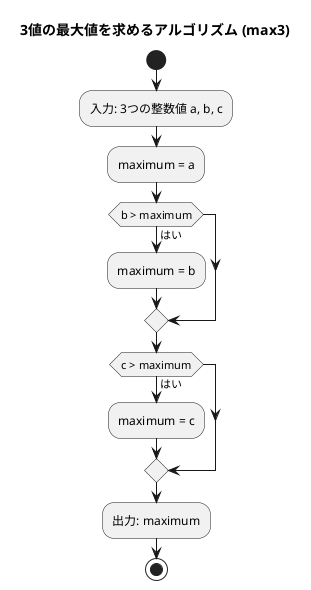

# 第 1 章 基本的なアルゴリズム

## はじめに

プログラミングを学ぶ上で、アルゴリズムの理解は非常に重要です。アルゴリズムとは、問題を解決するための手順や方法のことです。この章では、Ruby を使って基本的なアルゴリズムを学びながら、テスト駆動開発（TDD）の手法を用いて実装していきます。

テスト駆動開発とは、コードを書く前にまずテストを書き、そのテストが通るようにコードを実装していく開発手法です。Red-Green-Refactor というサイクルを繰り返しながら、確実に動作するコードを段階的に作り上げます。

## 準備

### 環境構築

```bash
# Nix 環境に入る（Ruby + Bundler が利用可能になる）
nix develop .#ruby

# プロジェクトディレクトリへ移動
cd apps/ruby

# 依存パッケージのインストール
bundle install
```

### プロジェクト構成

```
apps/ruby/
├── Gemfile              # 依存関係
├── .rspec               # RSpec 設定
├── lib/
│   └── algorithm/
│       └── basic_algorithms.rb   # 実装ファイル
└── spec/
    ├── spec_helper.rb
    └── basic_algorithms_spec.rb  # テストファイル
```

### テスト実行コマンド

```bash
# テスト実行（全ファイル）
bundle exec rspec

# 特定のファイルのみ
bundle exec rspec spec/basic_algorithms_spec.rb

# ドキュメント形式で表示
bundle exec rspec --format documentation
```

---

## 1. アルゴリズムとは

アルゴリズムとは、問題を解決するための明確な手順のことです。コンピュータプログラムは、アルゴリズムを実行可能な形で表現したものと言えます。

良いアルゴリズムは以下の特徴を持ちます：

- 入力と出力が明確である
- 各ステップが明確である
- 有限のステップで終了する
- 効率的である

---

## 2. 3 値の最大値

3 つの整数値の中から最大値を求めるアルゴリズムを TDD で実装します。

### Red — 失敗するテストを書く

```ruby
# spec/basic_algorithms_spec.rb
RSpec.describe "Algorithm.max3" do
  [
    [3, 2, 1, 3],  # a > b > c
    [3, 2, 2, 3],  # a > b = c
    [3, 1, 2, 3],  # a > c > b
    [3, 2, 3, 3],  # a = c > b
    [2, 1, 3, 3],  # c > a > b
    [3, 3, 2, 3],  # a = b > c
    [3, 3, 3, 3],  # a = b = c
    [2, 2, 3, 3],  # c > a = b
    [2, 3, 1, 3],  # b > a > c
    [2, 3, 2, 3],  # b > a = c
    [1, 3, 2, 3],  # b > c > a
    [2, 3, 3, 3],  # b = c > a
    [1, 2, 3, 3]   # c > b > a
  ].each do |a, b, c, expected|
    context "max3(#{a}, #{b}, #{c})" do
      it { expect(Algorithm.max3(a, b, c)).to eq(expected) }
    end
  end
end
```

3 つの値の大小関係の全パターン（13 通り）を網羅したテストです。

### Green — テストを通す最小限の実装

```ruby
# lib/algorithm/basic_algorithms.rb
module Algorithm
  def self.max3(a, b, c)
    maximum = a
    maximum = b if b > maximum
    maximum = c if c > maximum
    maximum
  end
end
```

### Python 版との違い

| 概念 | Python | Ruby |
|------|--------|------|
| 条件付き代入 | `if b > maximum: maximum = b` | `maximum = b if b > maximum` |
| モジュール | クラスなし（関数として定義） | `module Algorithm` + `def self.メソッド名` |

Ruby では `if` を後置修飾子として使えるため、短く書けます。

### アルゴリズムの考え方



1. 最初の値を最大値と仮定する
2. 残りの値と比較し、より大きい値があれば最大値を更新する
3. すべての値との比較が終わったら、最大値を返す

---

## 3. 3 値の中央値

3 つの整数値の中央値（3 つの値を大きさの順に並べたときに真ん中に来る値）を求めます。

### Red — 失敗するテストを書く

```ruby
RSpec.describe "Algorithm.med3" do
  [
    [3, 2, 1, 2],  # a > b > c
    [3, 2, 2, 2],  # a > b = c
    [3, 1, 2, 2],  # a > c > b
    [3, 2, 3, 3],  # a = c > b
    [2, 1, 3, 2],  # c > a > b
    [3, 3, 2, 3],  # a = b > c
    [3, 3, 3, 3],  # a = b = c
    [2, 2, 3, 2],  # c > a = b
    [2, 3, 1, 2],  # b > a > c
    [2, 3, 2, 2],  # b > a = c
    [1, 3, 2, 2],  # b > c > a
    [2, 3, 3, 3],  # b = c > a
    [1, 2, 3, 2]   # c > b > a
  ].each do |a, b, c, expected|
    it "med3(#{a}, #{b}, #{c}) == #{expected}" do
      expect(Algorithm.med3(a, b, c)).to eq(expected)
    end
  end
end
```

### Green — テストを通す最小限の実装

```ruby
def self.med3(a, b, c)
  if a >= b
    if b >= c
      b
    elsif a <= c
      a
    else
      c
    end
  elsif a > c
    a
  elsif b > c
    c
  else
    b
  end
end
```

### アルゴリズムの考え方

中央値の判定は場合分けが多いため、体系的に考える必要があります。条件の組み合わせを網羅するためにテストケースをすべて用意することが重要です。

---

## 4. 条件判定（符号判定）

整数の符号（正・負・ゼロ）を判定するアルゴリズムです。

### Red — テストを書く

```ruby
describe "Algorithm.judge_sign" do
  it "正の値" do
    expect(Algorithm.judge_sign(17)).to eq("その値は正です。")
  end

  it "負の値" do
    expect(Algorithm.judge_sign(-5)).to eq("その値は負です。")
  end

  it "0" do
    expect(Algorithm.judge_sign(0)).to eq("その値は0です。")
  end
end
```

### Green — 実装

```ruby
def self.judge_sign(n)
  if n > 0
    "その値は正です。"
  elsif n < 0
    "その値は負です。"
  else
    "その値は0です。"
  end
end
```

### Python 版との違い

Ruby の `if/elsif/else` は Python の `if/elif/else` に対応します。末尾の `end` が必要です。

---

## 5. 繰り返し処理

### 5-1. 1 から n までの総和（while 文）

```ruby
def self.sum_1_to_n_while(n)
  total = 0
  i = 1
  while i <= n
    total += i
    i += 1
  end
  total
end
```

### 5-2. 1 から n までの総和（each 文）

```ruby
def self.sum_1_to_n_for(n)
  total = 0
  (1..n).each { |i| total += i }
  total
end
```

### Python 版との違い

| 概念 | Python | Ruby |
|------|--------|------|
| for ループ | `for i in range(1, n+1):` | `(1..n).each { \|i\| ... }` |
| 範囲オブジェクト | `range(1, n+1)` | `(1..n)` または `(1...n+1)` |

Ruby では `for` 文より `each` を使うのが慣習です。範囲オブジェクト `..` は両端を含み、`...` は右端を除きます。

---

## 6. 記号文字の交互表示

```ruby
# 剰余判定方式
def self.alternative_1(n)
  result = ""
  n.times { |i| result += i.odd? ? "-" : "+" }
  result
end

# パターン繰り返し方式
def self.alternative_2(n)
  result = "+-" * (n / 2)
  result += "+" if n.odd?
  result
end
```

### Python 版との違い

| 概念 | Python | Ruby |
|------|--------|------|
| 繰り返し | `for i in range(n)` | `n.times { \|i\| }` |
| 奇数判定 | `if i % 2` | `i.odd?` |
| 文字列繰り返し | `"+-" * (n // 2)` | `"+-" * (n / 2)` |
| 奇数チェック | `if n % 2` | `if n.odd?` |

Ruby ではオブジェクトに `.odd?`、`.even?` メソッドが組み込まれています。

---

## 7. 長方形の辺の列挙

```ruby
def self.rectangle(area)
  result = ""
  (1..area).each do |i|
    break if i * i > area
    next if area % i != 0

    result += "#{i}x#{area / i} "
  end
  result
end
```

### テスト

```ruby
it "面積32の長方形の辺の組み合わせ" do
  expect(Algorithm.rectangle(32)).to eq("1x32 2x16 4x8 ")
end
```

Ruby の文字列補間は `"#{式}"` で、Python の f 文字列 `f"{式}"` に相当します。

---

## 8. 九九の表（多重ループ）

```ruby
def self.multiplication_table
  result = "-" * 27 + "\n"
  (1..9).each do |i|
    (1..9).each { |j| result += format("%3d", i * j) }
    result += "\n"
  end
  result + "-" * 27
end
```

### Python 版との違い

| 概念 | Python | Ruby |
|------|--------|------|
| 書式指定 | `f"{i * j:3}"` | `format("%3d", i * j)` |
| ネストループ | `for i in range(1,10): for j in ...` | `(1..9).each { \|i\| (1..9).each { \|j\| } }` |

---

## 9. 直角三角形の表示

```ruby
def self.traiangle_lb(n)
  result = ""
  n.times { |i| result += "*" * (i + 1) + "\n" }
  result
end
```

---

## まとめ

この章では、Ruby を使って基本的なアルゴリズムを TDD で実装しました。

| アルゴリズム | メソッド | 計算量 |
|-------------|---------|--------|
| 3 値の最大値 | `max3` | O(1) |
| 3 値の中央値 | `med3` | O(1) |
| 符号判定 | `judge_sign` | O(1) |
| 1 から n の総和 | `sum_1_to_n_*` | O(n) |
| 交互表示 | `alternative_*` | O(n) |
| 長方形の辺 | `rectangle` | O(√area) |
| 九九の表 | `multiplication_table` | O(1) |
| 三角形表示 | `traiangle_lb` | O(n²) |

### Ruby の特徴

- `i.odd?` / `i.even?` で奇偶を簡潔に判定
- `n.times { |i| }` で繰り返し
- `(start..end).each` で範囲を反復
- `if/unless` を後置修飾子として使用可能
- `format("%3d", n)` で書式付き文字列生成
