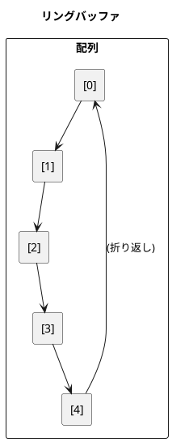

# 第 4 章 スタックとキュー

## はじめに

スタックとキューは、データを格納・取り出す順序が異なる基本的なデータ構造です。この章では、固定長のスタックとキューを TDD で実装します。

---

## 1. スタック（Stack）

LIFO（Last In First Out）— 後から入れたデータを先に取り出す構造です。

### Red — テストを書く

```ruby
describe "Algorithm::FixedStack" do
  let(:stack) { Algorithm::FixedStack.new(5) }

  it "プッシュ・ポップ" do
    stack.push(1)
    stack.push(2)
    stack.push(3)
    expect(stack.pop).to eq(3)
    expect(stack.pop).to eq(2)
  end

  it "空のスタックからのポップは例外" do
    expect { stack.pop }.to raise_error(Algorithm::FixedStack::Empty)
  end

  it "満杯のスタックへのプッシュは例外" do
    5.times { |i| stack.push(i) }
    expect { stack.push(99) }.to raise_error(Algorithm::FixedStack::Full)
  end
end
```

### Green — 実装

```ruby
class FixedStack
  class Empty < StandardError; end
  class Full < StandardError; end

  def initialize(capacity)
    @stk = Array.new(capacity)
    @capacity = capacity
    @ptr = 0
  end

  def push(value)
    raise Full if full?
    @stk[@ptr] = value
    @ptr += 1
  end

  def pop
    raise Empty if empty?
    @ptr -= 1
    @stk[@ptr]
  end

  def peek
    raise Empty if empty?
    @stk[@ptr - 1]
  end

  def find(value)
    (@ptr - 1).downto(0) do |i|
      return i if @stk[i] == value
    end
    -1
  end

  def count(value)
    @stk[0...@ptr].count(value)
  end

  def empty?
    @ptr <= 0
  end

  def full?
    @ptr >= @capacity
  end

  def clear
    @ptr = 0
  end
end
```

### Python 版との違い

| 概念 | Python | Ruby |
|------|--------|------|
| 例外クラス | `class Empty(Exception):` | `class Empty < StandardError; end` |
| `__len__` | `def __len__(self):` | `def length` |
| `__contains__` | `def __contains__(self, val):` | `def include?(val)` |
| downto ループ | `range(ptr-1, -1, -1)` | `(ptr-1).downto(0)` |
| 配列スライス | `self.stk[:self.ptr]` | `@stk[0...@ptr]` |

Ruby の例外クラスは `StandardError` を継承するのが慣習です。`downto` メソッドで逆順ループを簡潔に書けます。

---

## 2. キュー（Queue）

FIFO（First In First Out）— 先に入れたデータを先に取り出す構造です。リングバッファで実装します。

### Red — テストを書く

```ruby
describe "Algorithm::FixedQueue" do
  let(:queue) { Algorithm::FixedQueue.new(5) }

  it "エンキュー・デキュー" do
    queue.enque(1)
    queue.enque(2)
    queue.enque(3)
    expect(queue.deque).to eq(1)
    expect(queue.deque).to eq(2)
  end

  it "リングバッファとして動作する" do
    3.times { |i| queue.enque(i) }
    2.times { queue.deque }
    3.times { |i| queue.enque(i + 10) }
    expect(queue.deque).to eq(2)
    expect(queue.deque).to eq(10)
  end
end
```

### Green — 実装

```ruby
class FixedQueue
  class Empty < StandardError; end
  class Full < StandardError; end

  def initialize(capacity)
    @que = Array.new(capacity)
    @capacity = capacity
    @front = 0
    @rear = 0
    @num = 0
  end

  def enque(value)
    raise Full if full?
    @que[@rear] = value
    @rear += 1
    @num += 1
    @rear = 0 if @rear == @capacity
  end

  def deque
    raise Empty if empty?
    value = @que[@front]
    @front += 1
    @num -= 1
    @front = 0 if @front == @capacity
    value
  end

  def peek
    raise Empty if empty?
    @que[@front]
  end

  def find(value)
    @num.times do |i|
      idx = (i + @front) % @capacity
      return i if @que[idx] == value
    end
    -1
  end

  def count(value)
    c = 0
    @num.times do |i|
      idx = (i + @front) % @capacity
      c += 1 if @que[idx] == value
    end
    c
  end

  def empty? = @num <= 0
  def full? = @num >= @capacity

  def clear
    @front = @rear = @num = 0
  end
end
```

### リングバッファの動作原理



rear インデックスが配列の末尾に達したとき、0 に戻ることでリングバッファを実現します。

---

## まとめ

| データ構造 | 取り出し順 | 主な操作 |
|-----------|----------|---------|
| スタック | LIFO（後入れ先出し） | push / pop / peek |
| キュー | FIFO（先入れ先出し） | enque / deque / peek |

### Ruby の特徴

- 例外クラスは `StandardError` を継承（Python は `Exception`）
- `n.downto(0)` で逆順イテレーション
- `@変数名` でインスタンス変数（Python の `self.変数名` に相当）
- 多重代入: `@front = @rear = @num = 0` で一度に初期化
