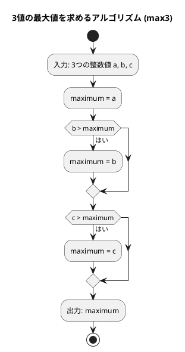
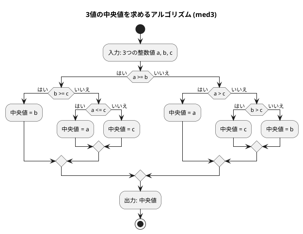

# 第 1 章 基本的なアルゴリズム

## はじめに

この章では、Rust を使って基本的なアルゴリズムを学びながら、テスト駆動開発（TDD）の手法で実装します。

Rust はメモリ安全性と高速性を両立させた言語です。所有権（ownership）と借用（borrowing）の仕組みにより、コンパイル時にメモリの安全性が保証されます。また、型推論と豊富な標準ライブラリにより、簡潔で表現力の高いコードを書けます。

テスト駆動開発とは、コードを書く前にまずテストを書き、そのテストが通るようにコードを実装していく開発手法です。Red-Green-Refactor というサイクルを繰り返しながら、確実に動作するコードを段階的に作り上げます。

## 準備

### 環境構築

```bash
# Nix 環境に入る（Rust + cargo が利用可能になる）
nix develop .#rust

# プロジェクトディレクトリへ移動
cd apps/rust
```

### プロジェクト構成

```
apps/rust/
├── Cargo.toml              # ワークスペース設定
├── Cargo.lock              # 依存関係ロックファイル
└── chapter01/
    ├── Cargo.toml           # クレート設定
    └── src/
        └── lib.rs           # 実装 + テスト（同一ファイル）
```

Rust では、テストを実装と同じファイル内に `#[cfg(test)]` モジュールとして記述するのが一般的です。これにより、テストと実装の距離が近くなり、保守しやすくなります。

### テスト実行コマンド

```bash
# 全章テスト
cargo test

# 特定章のテスト
cargo test -p chapter01

# テスト名を指定して実行
cargo test -p chapter01 max3

# リント（clippy）
cargo clippy

# フォーマット
cargo fmt
```

### Python との比較表

Rust と Python の対応する概念を一覧にまとめます。

| 概念 | Python | Rust |
|------|--------|------|
| 変数宣言 | `x = 5` | `let x = 5;`（不変） / `let mut x = 5;`（可変） |
| 型注釈 | `x: int = 5` | `let x: i32 = 5;` |
| 文字列 | `str`（不変） | `&str`（スライス） / `String`（所有あり） |
| 関数定義 | `def f(x: int) -> int:` | `fn f(x: i32) -> i32 { }` |
| 条件分岐 | `if/elif/else` | `if/else if/else` |
| 範囲ループ | `for i in range(n):` | `for i in 0..n { }` |
| 範囲（含む） | `for i in range(1, n+1):` | `for i in 1..=n { }` |
| テスト | `assert x == y` | `assert_eq!(x, y);` |
| 出力フォーマット | `f"{x:3}"` | `format!("{:3}", x)` |
| 文字列結合 | `result += "text"` | `result.push_str("text");` |

---

## 1. アルゴリズムとは

アルゴリズムとは、問題を解決するための明確な手順のことです。コンピュータプログラムは、アルゴリズムを実行可能な形で表現したものと言えます。

良いアルゴリズムは以下の特徴を持ちます：

- 入力と出力が明確である
- 各ステップが明確である
- 有限のステップで終了する
- 効率的である

---

## 2. 3 値の最大値

3 つの整数値の中から最大値を求めるアルゴリズムを TDD で実装します。

### Red -- 失敗するテストを書く

```rust
// chapter01/src/lib.rs
#[cfg(test)]
mod tests {
    use super::*;

    mod max3_tests {
        use super::*;

        #[test]
        fn test_max3_all_cases() {
            let cases = vec![
                (3, 2, 1, 3), // a > b > c
                (3, 2, 2, 3), // a > b = c
                (3, 1, 2, 3), // a > c > b
                (3, 2, 3, 3), // a = c > b
                (2, 1, 3, 3), // c > a > b
                (3, 3, 2, 3), // a = b > c
                (3, 3, 3, 3), // a = b = c
                (2, 2, 3, 3), // c > a = b
                (2, 3, 1, 3), // b > a > c
                (2, 3, 2, 3), // b > a = c
                (1, 3, 2, 3), // b > c > a
                (2, 3, 3, 3), // b = c > a
                (1, 2, 3, 3), // c > b > a
            ];
            for (a, b, c, expected) in cases {
                assert_eq!(
                    max3(a, b, c),
                    expected,
                    "max3({}, {}, {}) should be {}",
                    a, b, c, expected
                );
            }
        }
    }
}
```

3 つの値の大小関係の全パターン（13 通り）を網羅したテストです。Rust では `#[test]` 属性を付けた関数がテストとして認識されます。`assert_eq!` マクロは、左右の値が等しくない場合にテストを失敗させます。

### Green -- テストを通す最小限の実装

```rust
/// 3つの整数値の最大値を返す
pub fn max3(a: i32, b: i32, c: i32) -> i32 {
    let mut maximum = a;
    if b > maximum {
        maximum = b;
    }
    if c > maximum {
        maximum = c;
    }
    maximum
}
```

**Rust 固有のポイント：**

- `let mut maximum = a;` -- Rust では変数はデフォルトで不変（immutable）です。値を変更するには `mut` キーワードが必要です。
- `i32` -- 32 ビット符号付き整数型。Rust では型を明示的に指定します。
- 関数の最後の式（`maximum`）がセミコロンなしで書かれると、その値が戻り値になります。`return` は不要です。

### アルゴリズムの考え方



1. 最初の値を最大値と仮定する
2. 残りの値と比較し、より大きい値があれば最大値を更新する
3. すべての値との比較が終わったら、最大値を返す

---

## 3. 3 値の中央値

3 つの整数値の中央値（3 つの値を大きさの順に並べたときに真ん中に来る値）を求めます。

### Red -- 失敗するテストを書く

```rust
mod med3_tests {
    use super::*;

    #[test]
    fn test_med3_all_cases() {
        let cases = vec![
            (3, 2, 1, 2), // a > b > c
            (3, 2, 2, 2), // a > b = c
            (3, 1, 2, 2), // a > c > b
            (3, 2, 3, 3), // a = c > b
            (2, 1, 3, 2), // c > a > b
            (3, 3, 2, 3), // a = b > c
            (3, 3, 3, 3), // a = b = c
            (2, 2, 3, 2), // c > a = b
            (2, 3, 1, 2), // b > a > c
            (2, 3, 2, 2), // b > a = c
            (1, 3, 2, 2), // b > c > a
            (2, 3, 3, 3), // b = c > a
            (1, 2, 3, 2), // c > b > a
        ];
        for (a, b, c, expected) in cases {
            assert_eq!(
                med3(a, b, c),
                expected,
                "med3({}, {}, {}) should be {}",
                a, b, c, expected
            );
        }
    }
}
```

### Green -- テストを通す最小限の実装

```rust
/// 3つの整数値の中央値を返す
pub fn med3(a: i32, b: i32, c: i32) -> i32 {
    if a >= b {
        if b >= c {
            b
        } else if a <= c {
            a
        } else {
            c
        }
    } else if a > c {
        a
    } else if b > c {
        c
    } else {
        b
    }
}
```

**Rust 固有のポイント：**

- Rust の `if` は式（expression）です。各分岐の最後の値がそのまま `if` 式全体の値になります。Python のように `return` を各分岐に書く必要がなく、関数全体が 1 つの `if` 式として構成されています。

### アルゴリズムの考え方



中央値を求めるアルゴリズムは、最大値よりも複雑です。すべての場合分けを考える必要があります：

| 条件 | 中央値 |
|------|--------|
| a >= b かつ b >= c | b |
| a >= b かつ a <= c | a |
| a >= b（それ以外、a > c > b） | c |
| a < b かつ a > c | a |
| a < b かつ b > c | c |
| a < b（それ以外、c >= b > a） | b |

---

## 4. 条件判定と分岐

プログラミングでは、条件に応じて処理を分岐させることが頻繁にあります。

### Red -- 失敗するテストを書く

```rust
mod judge_sign_tests {
    use super::*;

    #[test]
    fn test_positive() {
        assert_eq!(judge_sign(17), "positive");
    }

    #[test]
    fn test_negative() {
        assert_eq!(judge_sign(-5), "negative");
    }

    #[test]
    fn test_zero() {
        assert_eq!(judge_sign(0), "zero");
    }
}
```

### Green -- テストを通す最小限の実装

```rust
/// 整数値の符号を判定する
pub fn judge_sign(n: i32) -> &'static str {
    if n > 0 {
        "positive"
    } else if n < 0 {
        "negative"
    } else {
        "zero"
    }
}
```

**Rust 固有のポイント：**

- 戻り値の型 `&'static str` は「静的ライフタイムを持つ文字列スライス」です。文字列リテラル（`"positive"` など）はプログラムの実行期間中ずっとメモリに存在するため、`'static` ライフタイムを持ちます。
- Rust には `elif` はなく、`else if` と書きます。
- Python との違い: Python は `str` を返しますが、Rust では `&str`（借用した文字列スライス）と `String`（所有権を持つ文字列）の区別があります。ここではリテラル文字列を返すだけなので `&str` で十分です。

---

## 5. 繰り返し処理

プログラミングでは、同じ処理を繰り返し実行することがよくあります。Rust では `while` 文と `for` 文を使って繰り返し処理を実現できます。

### 5-1. 1 から n までの総和

#### Red -- 失敗するテストを書く

```rust
mod sum_tests {
    use super::*;

    #[test]
    fn test_sum_while() {
        assert_eq!(sum_while(5), 15);
    }

    #[test]
    fn test_sum_for() {
        assert_eq!(sum_for(5), 15);
    }

    #[test]
    fn test_sum_zero() {
        assert_eq!(sum_while(0), 0);
        assert_eq!(sum_for(0), 0);
    }

    #[test]
    fn test_sum_one() {
        assert_eq!(sum_while(1), 1);
        assert_eq!(sum_for(1), 1);
    }
}
```

#### Green -- テストを通す実装

```rust
/// while 文で 1 から n までの総和を求める
pub fn sum_while(n: u32) -> u32 {
    let mut total = 0u32;
    let mut i = 1u32;
    while i <= n {
        total += i;
        i += 1;
    }
    total
}

/// for 文で 1 から n までの総和を求める
pub fn sum_for(n: u32) -> u32 {
    let mut total = 0u32;
    for i in 1..=n {
        total += i;
    }
    total
}
```

**Rust 固有のポイント：**

- `u32` -- 32 ビット符号なし整数型。n は自然数なので符号なしが適切です。
- `0u32` -- 型サフィックスを付けて `u32` 型を明示しています。
- `1..=n` -- `=` を付けることで n を含む範囲（inclusive range）になります。Python の `range(1, n+1)` に相当します。
- `1..n` -- n を含まない範囲（exclusive range）です。Python の `range(1, n)` に相当します。

### 5-2. 記号文字の交互表示

`+` と `-` を交互に表示する 2 通りの実装を比較します。

#### Red -- 失敗するテストを書く

```rust
mod alternative_tests {
    use super::*;

    #[test]
    fn test_alternative_1_even() {
        assert_eq!(alternative_1(12), "+-+-+-+-+-+-");
    }

    #[test]
    fn test_alternative_2_even() {
        assert_eq!(alternative_2(12), "+-+-+-+-+-+-");
    }

    #[test]
    fn test_alternative_odd() {
        assert_eq!(alternative_1(5), "+-+-+");
        assert_eq!(alternative_2(5), "+-+-+");
    }
}
```

#### Green -- テストを通す実装

```rust
/// 記号文字 '+' と '-' を交互に表示する（剰余判定方式）
pub fn alternative_1(n: u32) -> String {
    let mut result = String::new();
    for i in 0..n {
        if i % 2 == 0 {
            result.push('+');
        } else {
            result.push('-');
        }
    }
    result
}

/// 記号文字 '+' と '-' を交互に表示する（パターン繰り返し方式）
pub fn alternative_2(n: u32) -> String {
    let mut result = "+-".repeat((n / 2) as usize);
    if n % 2 != 0 {
        result.push('+');
    }
    result
}
```

**Rust 固有のポイント：**

- `String::new()` -- 空の `String`（ヒープに確保される可変長文字列）を生成します。
- `result.push('+')` -- `char` 型（1 文字）を追加します。Python の `result += "+"` に相当します。
- `"+-".repeat((n / 2) as usize)` -- 文字列を繰り返します。`as usize` はキャスト（型変換）です。`repeat` メソッドは `usize` 型の引数を要求するため、`u32` から変換しています。
- Python の `i % 2` は真偽値として扱えますが、Rust では `i % 2 == 0` と明示的に比較する必要があります。

### 5-3. 長方形の辺の長さを列挙

面積が指定された長方形の辺の長さをすべて列挙します。

#### Red -- 失敗するテストを書く

```rust
mod rectangle_tests {
    use super::*;

    #[test]
    fn test_rectangle() {
        assert_eq!(rectangle(32), "1x32 2x16 4x8 ");
    }
}
```

#### Green -- テストを通す実装

```rust
/// 縦横が整数で面積が area の長方形の辺の長さを列挙する
pub fn rectangle(area: u32) -> String {
    let mut result = String::new();
    for i in 1..=area {
        if i * i > area {
            break;
        }
        if area % i != 0 {
            continue;
        }
        result.push_str(&format!("{}x{} ", i, area / i));
    }
    result
}
```

**Rust 固有のポイント：**

- `result.push_str(...)` -- `&str`（文字列スライス）を追加します。`push` は `char`、`push_str` は `&str` を受け取る点に注意してください。
- `&format!(...)` -- `format!` マクロは `String` を返します。`push_str` は `&str` を要求するため、`&` で参照に変換しています。
- `break` と `continue` は Python と同じ意味です。`i * i > area` で探索範囲を絞り込むことで効率化しています。

---

## 6. 多重ループ

ループの中にループを重ねることで、2 次元的な処理を実現できます。

### 6-1. 九九の表

#### Red -- 失敗するテストを書く

```rust
mod multiplication_table_tests {
    use super::*;

    #[test]
    fn test_multiplication_table() {
        let expected = "\
---------------------------
  1  2  3  4  5  6  7  8  9
  2  4  6  8 10 12 14 16 18
  3  6  9 12 15 18 21 24 27
  4  8 12 16 20 24 28 32 36
  5 10 15 20 25 30 35 40 45
  6 12 18 24 30 36 42 48 54
  7 14 21 28 35 42 49 56 63
  8 16 24 32 40 48 56 64 72
  9 18 27 36 45 54 63 72 81
---------------------------";
        assert_eq!(multiplication_table(), expected);
    }
}
```

#### Green -- テストを通す実装

```rust
/// 九九の表を返す
pub fn multiplication_table() -> String {
    let mut result = format!("{}\n", "-".repeat(27));
    for i in 1..=9u32 {
        for j in 1..=9u32 {
            result.push_str(&format!("{:3}", i * j));
        }
        result.push('\n');
    }
    result.push_str(&"-".repeat(27));
    result
}
```

外側のループが行（`i`）、内側のループが列（`j`）を担当します。`format!("{:3}", i * j)` は 3 文字幅の右揃えで数値を出力します。これは Python の `f"{i * j:3}"` と同等です。

**Rust 固有のポイント：**

- `1..=9u32` -- 型サフィックス `u32` を付けることで、ループ変数の型を明示しています。
- `"-".repeat(27)` -- 文字列リテラルの `repeat` メソッドで文字列を繰り返します。Python の `"-" * 27` に相当します。

### 6-2. 直角三角形の表示

#### Red -- 失敗するテストを書く

```rust
mod triangle_lb_tests {
    use super::*;

    #[test]
    fn test_triangle_lb() {
        let expected = "*\n**\n***\n****\n*****\n";
        assert_eq!(triangle_lb(5), expected);
    }
}
```

#### Green -- テストを通す実装

```rust
/// 左下側が直角の二等辺三角形を返す
pub fn triangle_lb(n: u32) -> String {
    let mut result = String::new();
    for i in 0..n {
        for _ in 0..=i {
            result.push('*');
        }
        result.push('\n');
    }
    result
}
```

**Rust 固有のポイント：**

- `for _ in 0..=i` -- 使わない変数は `_` で無視します。これは Python でも同じ慣習です。
- Python 版では `"*" * (i + 1)` で一気に文字列を生成しますが、ここでは内側のループで 1 文字ずつ追加しています。Rust でも `"*".repeat((i + 1) as usize)` と書くことができます。

---

## 7. 追加の練習問題

実装コードには、本章の追加課題として以下の関数も含まれています。

### 7-1. 各桁の合計

```rust
/// 各桁の合計を返す
pub fn sum_of_digits(mut n: u32) -> u32 {
    let mut total = 0u32;
    while n > 0 {
        total += n % 10;
        n /= 10;
    }
    total
}
```

引数に `mut` を付けることで、関数の中で引数の値を変更できます。`n % 10` で下 1 桁を取り出し、`n /= 10` で桁を 1 つずつ削っていきます。

### 7-2. n 以下の正の奇数を列挙

```rust
/// n 以下の正の奇数を昇順で返す
pub fn odd_numbers(n: u32) -> Vec<u32> {
    let mut result = Vec::new();
    let mut i = 1u32;
    while i <= n {
        result.push(i);
        i += 2;
    }
    result
}
```

`Vec<u32>` は可変長の配列（ベクター）です。Python のリスト（`list`）に相当します。

### 7-3. n x n の掛け算表

```rust
/// n x n の掛け算表を 2次元ベクターで返す
pub fn multiplication_table_n(n: u32) -> Vec<Vec<u32>> {
    let mut table = Vec::new();
    for i in 1..=n {
        let mut row = Vec::new();
        for j in 1..=n {
            row.push(i * j);
        }
        table.push(row);
    }
    table
}
```

`Vec<Vec<u32>>` は 2 次元のベクターです。Python の `list[list[int]]` に相当します。

---

## テスト実行結果

```bash
$ cargo test -p chapter01

running 25 tests
test tests::alternative_tests::test_alternative_2_even ... ok
test tests::alternative_tests::test_alternative_odd ... ok
test tests::alternative_tests::test_alternative_1_even ... ok
test tests::judge_sign_tests::test_negative ... ok
test tests::judge_sign_tests::test_positive ... ok
test tests::judge_sign_tests::test_zero ... ok
test tests::max3_tests::test_max3_all_cases ... ok
test tests::med3_tests::test_med3_all_cases ... ok
test tests::multiplication_table_n_tests::test_multiplication_table_1x1 ... ok
test tests::multiplication_table_n_tests::test_multiplication_table_3x3 ... ok
test tests::multiplication_table_tests::test_multiplication_table ... ok
test tests::odd_numbers_tests::test_odd_numbers_up_to_0 ... ok
test tests::odd_numbers_tests::test_odd_numbers_up_to_1 ... ok
test tests::odd_numbers_tests::test_odd_numbers_up_to_10 ... ok
test tests::odd_numbers_tests::test_odd_numbers_up_to_7 ... ok
test tests::rectangle_tests::test_rectangle ... ok
test tests::sum_of_digits_tests::test_large_number ... ok
test tests::sum_of_digits_tests::test_multiple_digits ... ok
test tests::sum_of_digits_tests::test_single_digit ... ok
test tests::sum_of_digits_tests::test_zero ... ok
test tests::sum_tests::test_sum_for ... ok
test tests::sum_tests::test_sum_one ... ok
test tests::sum_tests::test_sum_while ... ok
test tests::sum_tests::test_sum_zero ... ok
test tests::triangle_lb_tests::test_triangle_lb ... ok

test result: ok. 25 passed; 0 failed; 0 ignored; 0 measured; 0 filtered out
```

全 25 テストが通過しました。

---

## まとめ

この章では、以下の基本的なアルゴリズムを TDD で実装しました：

| アルゴリズム | 関数 | キーポイント |
|-------------|------|------------|
| 3 値の最大値 | `max3` | `let mut` による可変変数、順次比較と更新 |
| 3 値の中央値 | `med3` | `if` 式による値の返却、全パターンの条件分岐 |
| 符号判定 | `judge_sign` | `&'static str` の戻り値、ライフタイム |
| 総和（while） | `sum_while` | `u32` 型、`while` ループ |
| 総和（for） | `sum_for` | `1..=n` 範囲式（inclusive range） |
| 交互表示 | `alternative_1/2` | `String` と `&str` の使い分け、`as usize` キャスト |
| 長方形列挙 | `rectangle` | `format!` マクロ、`push_str` と参照 |
| 九九の表 | `multiplication_table` | 二重ループ、フォーマット指定子 |
| 直角三角形 | `triangle_lb` | `_` による変数の無視 |
| 桁の合計 | `sum_of_digits` | `mut` 引数、剰余と整数除算 |
| 奇数列挙 | `odd_numbers` | `Vec<u32>` ベクター |
| n x n 掛け算表 | `multiplication_table_n` | `Vec<Vec<u32>>` 2 次元ベクター |

### Rust を学ぶ上での重要な概念

この章で登場した Rust 固有の概念をまとめます：

| 概念 | 説明 |
|------|------|
| 不変性がデフォルト | `let x = 5;` は変更不可。`let mut x = 5;` で可変にする |
| 式ベースの構文 | `if` や `match` は式であり、値を返す |
| `&str` と `String` | `&str` は借用（読み取り専用）、`String` は所有（変更可能） |
| 型の厳密さ | `u32` と `usize` など、型が異なれば `as` で明示的に変換する |
| ライフタイム | `&'static str` はプログラム全体で有効な文字列参照 |
| `format!` マクロ | Python の f-string に相当するフォーマット機能 |

TDD の Red-Green-Refactor サイクルを通じて、テストが仕様の役割を果たし、確実に動作するコードを構築できることを確認しました。

## 参考文献

- 『新・明解 Python で学ぶアルゴリズムとデータ構造』 -- 柴田望洋
- 『テスト駆動開発』 -- Kent Beck
- 『プログラミング Rust 第 2 版』 -- Jim Blandy, Jason Orendorff, Leonora F. S. Tindall
