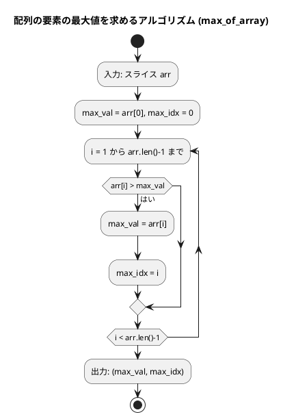
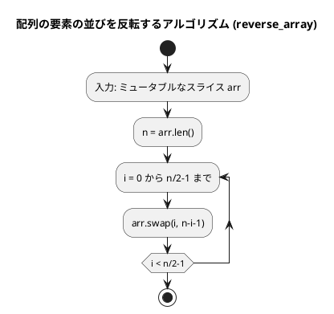
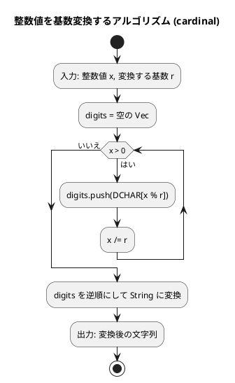
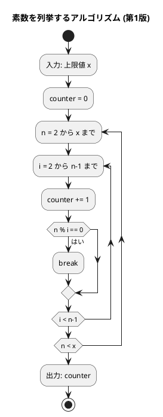
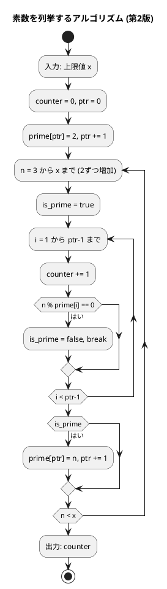
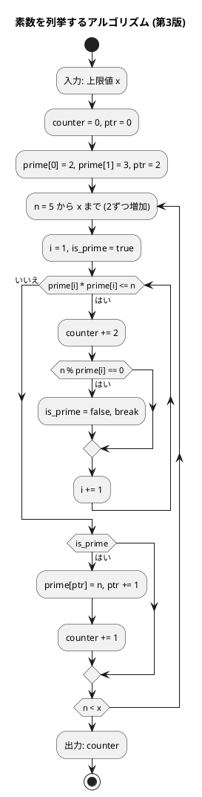

# 第 2 章 配列

## はじめに

前章では基本的なアルゴリズムについて学びました。この章では、プログラミングにおいて非常に重要なデータ構造である「配列」について学んでいきます。配列は、同じ型のデータを連続して格納するためのデータ構造で、多くのアルゴリズムの基礎となります。

Rust では、配列に相当するデータ構造として固定長配列 `[T; N]`、スライス `&[T]`、可変長の `Vec<T>` があります。

---

## 1. データ構造と配列

### データ構造とは

データ構造とは、データ単位とデータ自身との間の物理的または論理的な関係を表したものです。適切なデータ構造を選ぶことで、効率的なアルゴリズムを実装することができます。

### 配列の必要性

まず、配列がなぜ必要なのかを考えてみましょう。例えば、5 人の学生の点数を格納して合計点と平均点を求めるプログラムを考えます。

配列を使わない場合、5 つの変数を個別に用意する必要があります。100 人や 1000 人の場合、このアプローチは現実的ではありません。

### Rust における配列

Rust には以下の配列型があります。

**固定長配列**（サイズがコンパイル時に決まる）

```rust
let x: [i32; 7] = [11, 22, 33, 44, 55, 66, 77];
let names: [&str; 4] = ["John", "Paul", "George", "Ringo"];
```

**Vec（可変長）**

```rust
let mut v: Vec<i32> = vec![11, 22, 33, 44, 55, 66, 77];
v.push(88);  // 要素を追加できる
```

**スライス**（配列やVecの一部を借用する参照）

```rust
let arr = [11, 22, 33, 44, 55, 66, 77];
let slice: &[i32] = &arr[2..5];  // [33, 44, 55]
```

### インデックスによるアクセス

配列の要素には、インデックス（添え字）を使ってアクセスします。Rust のインデックスは 0 から始まります。

```rust
let x = [11, 22, 33, 44, 55, 66, 77];
println!("{}", x[2]);     // 33（3番目の要素）
// Rust では負のインデックスは使えない
// 最後の要素: x[x.len() - 1]
```

### 配列の走査

配列の全要素を処理するには、いくつかの方法があります。

#### インデックスを使った走査

```rust
let x = ["John", "George", "Paul", "Ringo"];
for i in 0..x.len() {
    println!("x[{}] = {}", i, x[i]);
}
```

#### enumerate を使った走査

```rust
let x = ["John", "George", "Paul", "Ringo"];
for (i, name) in x.iter().enumerate() {
    println!("x[{}] = {}", i, name);
}
```

#### インデックスを使わない走査

```rust
let x = ["John", "George", "Paul", "Ringo"];
for name in &x {
    println!("{}", name);
}
```

---

## 2. 配列の要素の最大値

### Red — 失敗するテストを書く

```rust
#[cfg(test)]
mod test_max_of_array {
    use super::*;

    #[test]
    fn test_max_of_array_basic() {
        assert_eq!(max_of_array(&[172, 153, 192, 140, 165]), (192, 2));
    }

    #[test]
    fn test_max_of_array_single() {
        assert_eq!(max_of_array(&[42]), (42, 0));
    }

    #[test]
    fn test_max_of_array_equal() {
        assert_eq!(max_of_array(&[5, 5, 5]), (5, 0));
    }

    #[test]
    fn test_max_of_array_negative() {
        assert_eq!(max_of_array(&[-3, -1, -5]), (-1, 1));
    }
}
```

### Green — テストを通す最小限の実装

```rust
pub fn max_of_array(arr: &[i32]) -> (i32, usize) {
    let mut max_val = arr[0];
    let mut max_idx = 0;
    for i in 1..arr.len() {
        if arr[i] > max_val {
            max_val = arr[i];
            max_idx = i;
        }
    }
    (max_val, max_idx)
}
```

### アルゴリズムの考え方



1. 配列の最初の要素を最大値と仮定する
2. 残りの要素を順に比較し、より大きい値があれば最大値とインデックスを更新する
3. 全要素の比較が終わったらタプルで返す

Rust では戻り値としてタプル `(i32, usize)` を使い、最大値とインデックスの両方を返します。Python 版の `max_of` は値のみを返しますが、Rust 版ではインデックスも返すことで情報量を増やしています。

計算量は O(n) です。

---

## 3. 配列の要素の並びを反転

### Red — 失敗するテストを書く

```rust
#[cfg(test)]
mod test_reverse_array {
    use super::*;

    #[test]
    fn test_reverse_array_odd() {
        let mut a = vec![2, 5, 1, 3, 9, 6, 7];
        reverse_array(&mut a);
        assert_eq!(a, vec![7, 6, 9, 3, 1, 5, 2]);
    }

    #[test]
    fn test_reverse_array_even() {
        let mut a = vec![1, 2, 3, 4];
        reverse_array(&mut a);
        assert_eq!(a, vec![4, 3, 2, 1]);
    }

    #[test]
    fn test_reverse_array_single() {
        let mut a = vec![42];
        reverse_array(&mut a);
        assert_eq!(a, vec![42]);
    }
}
```

### Green — テストを通す最小限の実装

```rust
pub fn reverse_array(arr: &mut [i32]) {
    let n = arr.len();
    for i in 0..n / 2 {
        arr.swap(i, n - i - 1);
    }
}
```

### アルゴリズムの考え方

配列の前半と後半の要素を対称的に交換することで反転します。

```
[2, 5, 1, 3, 9, 6, 7]
 ↕              ↕
[7, 5, 1, 3, 9, 6, 2]  → i=0: 2と7を交換
      ↕        ↕
[7, 6, 1, 3, 9, 5, 2]  → i=1: 5と6を交換
         ↕  ↕
[7, 6, 9, 3, 1, 5, 2]  → i=2: 1と9を交換（3は中央なので交換不要）
```

Rust のスライスには `swap` メソッドが用意されているため、一時変数を使わずに簡潔に交換できます。Python のタプルアンパッキングに相当する機能です。

計算量は O(n/2) = O(n) です。

#### フローチャート



---

## 4. 基数変換

### Red — 失敗するテストを書く

```rust
#[cfg(test)]
mod test_cardinal {
    use super::*;

    #[test]
    fn test_binary() {
        assert_eq!(cardinal(29, 2), "11101");
    }

    #[test]
    fn test_octal() {
        assert_eq!(cardinal(29, 8), "35");
    }

    #[test]
    fn test_hex() {
        assert_eq!(cardinal(255, 16), "FF");
    }

    #[test]
    fn test_zero() {
        assert_eq!(cardinal(0, 2), "0");
    }
}
```

### Green — テストを通す最小限の実装

```rust
pub fn cardinal(mut x: u64, r: u32) -> String {
    const DCHAR: &[u8] = b"0123456789ABCDEFGHIJKLMNOPQRSTUVWXYZ";
    let r = r as u64;
    let mut digits = Vec::new();

    while x > 0 {
        digits.push(DCHAR[(x % r) as usize] as char);
        x /= r;
    }

    if digits.is_empty() {
        return "0".to_string();
    }

    digits.iter().rev().collect()
}
```

### アルゴリズムの考え方



29 を 2 進数に変換する例：

| x | x % 2 | 文字 | digits（途中） |
|---|-------|------|---------------|
| 29 | 1 | '1' | ['1'] |
| 14 | 0 | '0' | ['1', '0'] |
| 7  | 1 | '1' | ['1', '0', '1'] |
| 3  | 1 | '1' | ['1', '0', '1', '1'] |
| 1  | 1 | '1' | ['1', '0', '1', '1', '1'] |

逆順にして `"11101"`。

Rust では `Vec<char>` に桁を収集し、`iter().rev().collect()` で逆順の `String` を生成します。Python の `d[::-1]` に相当します。

---

## 5. 素数の列挙

素数を列挙する 3 つのアルゴリズムを実装し、効率を比較します。

### Red — 失敗するテストを書く

テストでは「1000 以下の素数を列挙する際の除算回数」を検証します。

```rust
#[cfg(test)]
mod test_prime {
    use super::*;

    #[test]
    fn test_prime1() {
        assert_eq!(prime1(1000), 78022);
    }

    #[test]
    fn test_prime2() {
        assert_eq!(prime2(1000), 14622);
    }

    #[test]
    fn test_prime3() {
        assert_eq!(prime3(1000), 3774);
    }
}
```

### Green — テストを通す実装（3 バージョン）

#### 第 1 版：素直な実装

```rust
pub fn prime1(x: usize) -> u64 {
    let mut counter: u64 = 0;
    for n in 2..=x {
        for i in 2..n {
            counter += 1;
            if n % i == 0 {
                break;
            }
        }
    }
    counter
}
```

#### 第 2 版：奇数のみ + 素数リスト活用

```rust
pub fn prime2(x: usize) -> u64 {
    let mut counter: u64 = 0;
    let mut prime = vec![0u64; 500];
    let mut ptr: usize = 0;

    prime[ptr] = 2;
    ptr += 1;

    let mut n = 3usize;
    while n <= x {
        let mut is_prime = true;
        for i in 1..ptr {
            counter += 1;
            if (n as u64) % prime[i] == 0 {
                is_prime = false;
                break;
            }
        }
        if is_prime {
            prime[ptr] = n as u64;
            ptr += 1;
        }
        n += 2;
    }
    counter
}
```

#### 第 3 版：平方根以下のみ確認

```rust
pub fn prime3(x: usize) -> u64 {
    let mut counter: u64 = 0;
    let mut prime = vec![0u64; 500];
    let mut ptr: usize = 0;

    prime[ptr] = 2;
    ptr += 1;
    prime[ptr] = 3;
    ptr += 1;

    let mut n = 5usize;
    while n <= x {
        let mut i = 1usize;
        let mut is_prime = true;
        while prime[i] * prime[i] <= n as u64 {
            counter += 2;
            if (n as u64) % prime[i] == 0 {
                is_prime = false;
                break;
            }
            i += 1;
        }
        if is_prime {
            prime[ptr] = n as u64;
            ptr += 1;
            counter += 1;
        }
        n += 2;
    }
    counter
}
```

### 効率の比較

| バージョン | 除算回数 | 改善率 |
|-----------|---------|--------|
| 第 1 版（素直な実装） | 78,022 | — |
| 第 2 版（奇数 + 素数リスト） | 14,622 | 約 81% 削減 |
| 第 3 版（平方根以下） | 3,774 | 約 95% 削減 |

アルゴリズムの改善で計算量が大幅に削減されることがわかります。

#### フローチャート（第 1 版）



#### フローチャート（第 2 版）



#### フローチャート（第 3 版）



---

## テスト実行結果

```bash
$ cargo test --manifest-path apps/rust/Cargo.toml -p chapter02

running 17 tests
test tests::test_cardinal::test_binary ... ok
test tests::test_cardinal::test_decimal ... ok
test tests::test_cardinal::test_hex ... ok
test tests::test_cardinal::test_octal ... ok
test tests::test_cardinal::test_zero ... ok
test tests::test_max_of_array::test_max_of_array_basic ... ok
test tests::test_max_of_array::test_max_of_array_equal ... ok
test tests::test_max_of_array::test_max_of_array_last ... ok
test tests::test_max_of_array::test_max_of_array_negative ... ok
test tests::test_max_of_array::test_max_of_array_single ... ok
test tests::test_prime::test_prime1 ... ok
test tests::test_prime::test_prime2 ... ok
test tests::test_prime::test_prime3 ... ok
test tests::test_reverse_array::test_reverse_array_empty ... ok
test tests::test_reverse_array::test_reverse_array_even ... ok
test tests::test_reverse_array::test_reverse_array_odd ... ok
test tests::test_reverse_array::test_reverse_array_single ... ok

test result: ok. 17 passed; 0 failed; 0 ignored; 0 measured; 0 filtered out

Doc-tests: 6 passed
```

---

## Python との比較

| 機能 | Python | Rust |
|------|--------|------|
| 配列型 | `list`（可変長、任意型） | `[T; N]`（固定長）、`Vec<T>`（可変長）、`&[T]`（スライス） |
| 型安全性 | 動的型付け | 静的型付け（コンパイル時に型チェック） |
| 最大値の返り値 | 値のみ | タプル `(値, インデックス)` |
| 配列の反転 | `a[i], a[n-i-1] = a[n-i-1], a[i]` | `arr.swap(i, n - i - 1)` |
| 文字列逆順 | `d[::-1]`（スライス） | `digits.iter().rev().collect()` |
| 整数除算 | `//` 演算子 | `/` 演算子（整数型同士なら自動的に整数除算） |
| for-else 構文 | `for ... else:` で break 判定 | `bool` フラグ `is_prime` で判定 |
| 負のインデックス | `a[-1]` で末尾要素 | 不可（`a[a.len() - 1]` を使用） |
| メモリ管理 | GC による自動管理 | 所有権モデルによるコンパイル時保証 |
| 境界チェック | `IndexError` 例外 | パニック（実行時）、`get()` メソッドで `Option<T>` |

### Rust の特徴的なポイント

1. **`&[T]` スライス**: 関数の引数にスライスを使うことで、固定長配列でも `Vec` でも同じ関数で処理できます
2. **`arr.swap()`**: 借用チェッカーにより、同じスライスの 2 箇所を同時にミュータブル参照できないため、`swap` メソッドが用意されています
3. **`for-else` の代替**: Python の `for-else` 構文は Rust にはないため、`bool` フラグで代替しています
4. **型変換**: `usize` と `u64` の間の型変換が必要で、`as` キーワードで明示的に行います

---

## まとめ

| アルゴリズム | 関数 | 計算量 |
|-------------|------|-------|
| 配列の最大値 | `max_of_array` | O(n) |
| 配列の反転 | `reverse_array` | O(n) |
| 基数変換 | `cardinal` | O(log x) |
| 素数の列挙 v1 | `prime1` | O(n^2) |
| 素数の列挙 v2 | `prime2` | O(n * sqrt(n)) |
| 素数の列挙 v3 | `prime3` | O(n * sqrt(n) / log n) |

この章で学んだ内容：

1. Rust の配列型（固定長配列、`Vec<T>`、スライス `&[T]`）
2. インデックスアクセスと走査方法（`for`、`enumerate`、イテレータ）
3. 配列の要素の最大値を求めるアルゴリズム
4. 配列の要素の並びを反転するアルゴリズム（`swap` メソッド活用）
5. 基数変換アルゴリズム（`Vec` + イテレータで逆順変換）
6. 素数を列挙するアルゴリズムとその改良（3 段階の最適化）
7. Python と Rust の配列操作の違い（型安全性、所有権モデル、`for-else` の代替）

## 参考文献

- 『新・明解 Rust で学ぶアルゴリズムとデータ構造』 — 柴田望洋
- 『テスト駆動開発』 — Kent Beck
- 『プログラミング Rust 第 2 版』 — Jim Blandy, Jason Orendorff, Leonora F. S. Tindall
