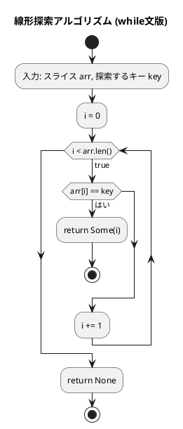
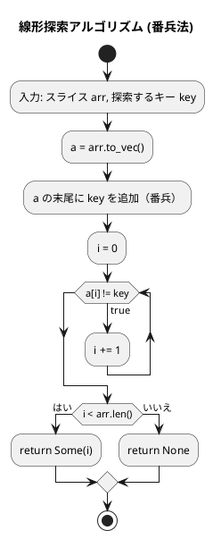
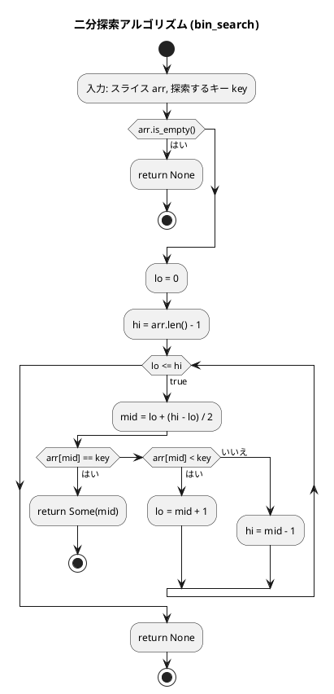

# 第 3 章 探索アルゴリズム

## はじめに

前章では配列とデータ構造について学びました。この章では、データの中から特定の値を見つけ出す「探索アルゴリズム」について学んでいきます。

主に以下の 3 つの方法を TDD で実装します：

1. 線形探索（シーケンシャルサーチ）
2. 二分探索（バイナリサーチ）
3. ハッシュ法

Rust では探索結果を `Option<usize>` で返します。Python の `-1`（未発見）を `None` で、発見時のインデックスを `Some(index)` で表現することで、型安全に結果を扱えます。

---

## 探索アルゴリズムとは

探索アルゴリズムとは、データの集合から特定の条件を満たす要素を見つけ出すための手順です。探索の対象となるデータは「キー」と呼ばれ、探索の結果は通常、キーが見つかった位置（インデックス）または見つからなかったことを示す値となります。

探索アルゴリズムの性能は、主に以下の要素によって評価されます：

- 時間効率（計算量）：探索にかかる時間
- 空間効率：使用するメモリ量
- 前提条件：データが整列されている必要があるかなど

---

## 1. 線形探索

配列の先頭から順に各要素を調べ、目的のキーと一致する要素を探します。

### Red -- 失敗するテストを書く

```rust
#[test]
fn test_seq_search_found() {
    assert_eq!(seq_search(&[6, 4, 3, 2, 1, 2, 8], 2), Some(3));
}

#[test]
fn test_seq_search_first_element() {
    assert_eq!(seq_search(&[6, 4, 3, 2, 1, 2, 8], 6), Some(0));
}

#[test]
fn test_seq_search_last_element() {
    assert_eq!(seq_search(&[6, 4, 3, 2, 1, 2, 8], 8), Some(6));
}

#[test]
fn test_seq_search_not_found() {
    assert_eq!(seq_search(&[1, 2, 3], 99), None);
}

#[test]
fn test_seq_search_empty_array() {
    assert_eq!(seq_search(&[], 1), None);
}
```

### Green -- テストを通す実装

```rust
pub fn seq_search(arr: &[i32], key: i32) -> Option<usize> {
    let mut i = 0;
    while i < arr.len() {
        if arr[i] == key {
            return Some(i);
        }
        i += 1;
    }
    None
}
```

### アルゴリズムの考え方

線形探索は、配列が整列されているかどうかに関わらず使用できる汎用的なアルゴリズムです。

計算量：
- 最良の場合：O(1)（最初の要素がキーと一致する場合）
- 最悪の場合：O(n)（キーが見つからないか、最後の要素である場合）
- 平均の場合：O(n/2) = O(n)

#### while 文による線形探索のフローチャート



この図は、while 文を使った線形探索アルゴリズム（`seq_search` 関数）のフローチャートです。

アルゴリズムの流れ：
1. スライス `arr` と探索するキー `key` を入力として受け取ります
2. 変数 `i` を 0 で初期化します（現在の検索位置）
3. `i < arr.len()` の間、以下を繰り返します：
   - `arr[i]` が `key` と一致する場合、`Some(i)` を返して終了します（探索成功）
   - `i` を 1 増やします（次の要素へ）
4. ループ終了後、`None` を返します（探索失敗）

**計算量**: 最悪 O(n)、平均 O(n/2)

### 番兵法

末尾にキーを追加（番兵）することで、ループ内の終了判定を省略します。

#### Red -- 失敗するテストを書く

```rust
#[test]
fn test_seq_search_sentinel_found() {
    assert_eq!(seq_search_sentinel(&[6, 4, 3, 2, 1, 2, 8], 2), Some(3));
}

#[test]
fn test_seq_search_sentinel_not_found() {
    assert_eq!(seq_search_sentinel(&[1, 2, 3], 99), None);
}

#[test]
fn test_seq_search_sentinel_empty() {
    assert_eq!(seq_search_sentinel(&[], 1), None);
}
```

#### Green -- テストを通す実装

```rust
pub fn seq_search_sentinel(arr: &[i32], key: i32) -> Option<usize> {
    let mut a = arr.to_vec();
    a.push(key); // 番兵を追加

    let mut i = 0;
    while a[i] != key {
        i += 1;
    }

    if i < arr.len() {
        Some(i)
    } else {
        None
    }
}
```

#### 番兵法のフローチャート



番兵法の利点：ループ内での終端判定（`i < arr.len()`）を省略できるため、わずかながら効率が向上します。番兵に到達した場合でも `a[i] == key` の条件は真になるため、ループから抜けることができます。その後、番兵に到達したかどうかを判定することで、探索の成功/失敗を決定します。

Rust では `arr.to_vec()` でスライスからベクタへのコピーを行い、番兵を `push` で追加しています。元のスライスは不変のまま保たれます。

---

## 2. 二分探索

**前提**: 配列が整列されていること。

中央の要素とキーを比較し、探索範囲を半分に絞り込むことを繰り返します。

### Red -- 失敗するテストを書く

```rust
#[test]
fn test_bin_search_found() {
    assert_eq!(bin_search(&[1, 2, 3, 5, 7, 8, 9], 5), Some(3));
}

#[test]
fn test_bin_search_first() {
    assert_eq!(bin_search(&[1, 2, 3, 5, 7, 8, 9], 1), Some(0));
}

#[test]
fn test_bin_search_last() {
    assert_eq!(bin_search(&[1, 2, 3, 5, 7, 8, 9], 9), Some(6));
}

#[test]
fn test_bin_search_not_found() {
    assert_eq!(bin_search(&[1, 2, 3, 5, 7, 8, 9], 4), None);
}

#[test]
fn test_bin_search_empty() {
    assert_eq!(bin_search(&[], 1), None);
}
```

### Green -- テストを通す実装

```rust
pub fn bin_search(arr: &[i32], key: i32) -> Option<usize> {
    if arr.is_empty() {
        return None;
    }
    let mut lo: usize = 0;
    let mut hi: usize = arr.len() - 1;

    while lo <= hi {
        let mid = lo + (hi - lo) / 2;
        if arr[mid] == key {
            return Some(mid);
        } else if arr[mid] < key {
            lo = mid + 1;
        } else {
            if mid == 0 {
                break;
            }
            hi = mid - 1;
        }
    }
    None
}
```

### アルゴリズムの考え方



**計算量**: O(log n)

### 解説

二分探索は、線形探索よりも効率的ですが、配列が整列されていることが前提条件となります。

二分探索の計算量：
- 最良の場合：O(1)（最初の中央要素がキーと一致する場合）
- 最悪の場合：O(log n)（キーが見つからないか、最後の絞り込みで見つかる場合）
- 平均の場合：O(log n)

例えば、1,000,000 要素の配列では、線形探索は最悪の場合 1,000,000 回の比較が必要ですが、二分探索では約 20 回（log2 1,000,000 = 20）の比較で済みます。

Rust 固有のポイント：
- `usize` 型は符号なし整数のため、`hi = mid - 1` で `mid` が 0 の場合にアンダーフローが発生します。`mid == 0` のガードを入れることで安全に処理します。
- オーバーフロー防止のため、中央値の計算は `lo + (hi - lo) / 2` で行います。

| 要素数 | 線形探索（最悪） | 二分探索（最悪） |
|--------|--------------|--------------|
| 100 | 100回 | 7回 |
| 1,000 | 1,000回 | 10回 |
| 1,000,000 | 1,000,000回 | 20回 |

---

## 3. ハッシュ法

キーからハッシュ関数でアドレスを求め、直接要素にアクセスします。理想的な場合 O(1) で探索できます。

衝突（異なるキーが同じハッシュ値を生成する）の解決方法として、「チェイン法」と「オープンアドレス法」を実装します。

### チェイン法

同じハッシュ値を持つ要素を `Vec`（連結リスト相当）で管理します。

#### Red -- 失敗するテストを書く

```rust
#[test]
fn test_chain_hash_add_and_search() {
    let mut h = ChainHash::new(13);
    assert!(h.add(1, 100));
    assert!(h.add(14, 200)); // 1%13==1, 14%13==1 → 衝突
    assert_eq!(h.search(1), Some(100));
    assert_eq!(h.search(14), Some(200));
}

#[test]
fn test_chain_hash_search_not_found() {
    let h = ChainHash::new(13);
    assert_eq!(h.search(99), None);
}

#[test]
fn test_chain_hash_add_duplicate() {
    let mut h = ChainHash::new(13);
    assert!(h.add(1, 100));
    assert!(!h.add(1, 999)); // 重複
}

#[test]
fn test_chain_hash_remove() {
    let mut h = ChainHash::new(13);
    h.add(1, 100);
    h.add(14, 200);
    assert!(h.remove(1));
    assert_eq!(h.search(1), None);
    assert_eq!(h.search(14), Some(200)); // 衝突先は残る
}
```

#### Green -- テストを通す実装

```rust
pub struct ChainHash {
    capacity: usize,
    table: Vec<Vec<(i32, i32)>>,
}

impl ChainHash {
    pub fn new(capacity: usize) -> Self {
        Self {
            capacity,
            table: vec![Vec::new(); capacity],
        }
    }

    fn hash(&self, key: i32) -> usize {
        (key.unsigned_abs() as usize) % self.capacity
    }

    pub fn search(&self, key: i32) -> Option<i32> {
        let h = self.hash(key);
        for &(k, v) in &self.table[h] {
            if k == key {
                return Some(v);
            }
        }
        None
    }

    pub fn add(&mut self, key: i32, value: i32) -> bool {
        let h = self.hash(key);
        for &(k, _) in &self.table[h] {
            if k == key {
                return false;
            }
        }
        self.table[h].push((key, value));
        true
    }

    pub fn remove(&mut self, key: i32) -> bool {
        let h = self.hash(key);
        if let Some(pos) = self.table[h].iter().position(|&(k, _)| k == key) {
            self.table[h].remove(pos);
            true
        } else {
            false
        }
    }
}
```

#### 解説

Python 版ではノードクラス (`_Node`) を使った連結リストでチェインを構成していますが、Rust 版では `Vec<(i32, i32)>` を使っています。`Vec` は動的配列であり、要素の追加・削除・検索をサポートするため、連結リストと同等の機能を簡潔に提供します。

### オープンアドレス法

衝突時に空きスロットを探して要素を格納します。

#### Red -- 失敗するテストを書く

```rust
#[test]
fn test_open_hash_add_and_search() {
    let mut h = OpenHash::new(13);
    assert!(h.add(1, 100));
    assert!(h.add(14, 200)); // 衝突
    assert_eq!(h.search(1), Some(100));
    assert_eq!(h.search(14), Some(200));
}

#[test]
fn test_open_hash_add_duplicate() {
    let mut h = OpenHash::new(13);
    assert!(h.add(1, 100));
    assert!(!h.add(1, 999));
}

#[test]
fn test_open_hash_remove() {
    let mut h = OpenHash::new(13);
    h.add(1, 100);
    h.add(14, 200);
    assert!(h.remove(1));
    assert_eq!(h.search(1), None);
    assert_eq!(h.search(14), Some(200));
}

#[test]
fn test_open_hash_add_after_remove() {
    let mut h = OpenHash::new(13);
    h.add(1, 100);
    h.remove(1);
    assert!(h.add(1, 300)); // DELETED スロットへの再挿入
    assert_eq!(h.search(1), Some(300));
}
```

#### Green -- テストを通す実装

```rust
#[derive(Clone, Copy, Debug, PartialEq)]
enum BucketStatus {
    Empty,
    Occupied,
    Deleted,
}

pub struct OpenHash {
    capacity: usize,
    table: Vec<(i32, i32, BucketStatus)>,
}

impl OpenHash {
    pub fn new(capacity: usize) -> Self {
        Self {
            capacity,
            table: vec![(0, 0, BucketStatus::Empty); capacity],
        }
    }

    fn hash(&self, key: i32) -> usize {
        (key.unsigned_abs() as usize) % self.capacity
    }

    pub fn search(&self, key: i32) -> Option<i32> {
        let mut h = self.hash(key);
        for _ in 0..self.capacity {
            match self.table[h].2 {
                BucketStatus::Empty => return None,
                BucketStatus::Occupied if self.table[h].0 == key => {
                    return Some(self.table[h].1);
                }
                _ => {
                    h = (h + 1) % self.capacity;
                }
            }
        }
        None
    }

    pub fn add(&mut self, key: i32, value: i32) -> bool {
        if self.search(key).is_some() {
            return false;
        }
        let mut h = self.hash(key);
        for _ in 0..self.capacity {
            match self.table[h].2 {
                BucketStatus::Empty | BucketStatus::Deleted => {
                    self.table[h] = (key, value, BucketStatus::Occupied);
                    return true;
                }
                _ => {
                    h = (h + 1) % self.capacity;
                }
            }
        }
        false
    }

    pub fn remove(&mut self, key: i32) -> bool {
        let mut h = self.hash(key);
        for _ in 0..self.capacity {
            match self.table[h].2 {
                BucketStatus::Empty => return false,
                BucketStatus::Occupied if self.table[h].0 == key => {
                    self.table[h].2 = BucketStatus::Deleted;
                    return true;
                }
                _ => {
                    h = (h + 1) % self.capacity;
                }
            }
        }
        false
    }
}
```

#### 解説

バケットの状態は `Empty`/`Occupied`/`Deleted` の 3 種類で管理します。`Deleted` は削除済みを示し、探索をここで止めないためのマーカーです。

Python 版では `_Status` を `Enum` クラスで、`_Bucket` を独立したクラスで定義していますが、Rust 版ではタプル `(i32, i32, BucketStatus)` で簡潔に表現しています。Rust の `enum` は `#[derive(Clone, Copy)]` で値型として扱えるため、ヒープ確保なしでバケットを管理できます。

`match` 式によるパターンマッチングは、Python の `if/elif` チェインよりも網羅性が保証され、見落としのない分岐処理を実現します。

---

## テスト実行結果

```bash
$ cargo test --manifest-path apps/rust/Cargo.toml -p chapter03

running 29 tests
test tests::test_bin_search_empty ... ok
test tests::test_bin_search_first ... ok
test tests::test_bin_search_found ... ok
test tests::test_bin_search_last ... ok
test tests::test_bin_search_not_found ... ok
test tests::test_bin_search_single_found ... ok
test tests::test_bin_search_single_not_found ... ok
test tests::test_chain_hash_add_and_search ... ok
test tests::test_chain_hash_add_duplicate ... ok
test tests::test_chain_hash_remove ... ok
test tests::test_chain_hash_remove_not_found ... ok
test tests::test_chain_hash_search_not_found ... ok
test tests::test_open_hash_add_after_remove ... ok
test tests::test_open_hash_add_and_search ... ok
test tests::test_open_hash_add_duplicate ... ok
test tests::test_open_hash_full_table ... ok
test tests::test_open_hash_remove ... ok
test tests::test_open_hash_remove_not_found ... ok
test tests::test_open_hash_search_not_found ... ok
test tests::test_seq_search_empty_array ... ok
test tests::test_seq_search_first_element ... ok
test tests::test_seq_search_found ... ok
test tests::test_seq_search_last_element ... ok
test tests::test_seq_search_not_found ... ok
test tests::test_seq_search_sentinel_empty ... ok
test tests::test_seq_search_sentinel_first ... ok
test tests::test_seq_search_sentinel_found ... ok
test tests::test_seq_search_sentinel_last ... ok
test tests::test_seq_search_sentinel_not_found ... ok

test result: ok. 29 passed; 0 failed; 0 ignored; 0 measured; 0 filtered out
```

29 テスト全パスです。

---

## 探索アルゴリズムの比較

| アルゴリズム | 事前条件 | 計算量 | 適用場面 |
|-------------|---------|--------|---------|
| 線形探索 | なし | O(n) | 小規模・未整列データ |
| 二分探索 | 整列済み | O(log n) | 大規模・整列データ |
| ハッシュ法 | なし | O(1)平均 | 高速な挿入・削除・探索 |

## Python 版との対応

| 概念 | Python | Rust |
|------|--------|------|
| 探索結果（未発見） | `-1` | `None` |
| 探索結果（発見） | インデックス値 | `Some(index)` |
| チェイン法のバケット | `_Node` 連結リスト | `Vec<(i32, i32)>` |
| オープンアドレス法のバケット | `_Bucket` クラス | `(i32, i32, BucketStatus)` タプル |
| バケット状態 | `_Status` Enum | `BucketStatus` enum |
| ハッシュ関数 | `hashlib` + `%` | `unsigned_abs()` + `%` |

## まとめ

この章では、3 つの主要な探索アルゴリズムについて学びました：

1. **線形探索**：最も単純な探索方法で、配列の先頭から順に探索します。整列されていない配列でも使用できますが、効率は良くありません。番兵法を使うことでわずかに効率化できます。

2. **二分探索**：整列された配列に対して使用できる効率的な探索方法で、探索範囲を半分ずつ絞り込みます。O(log n) の計算量で高速な探索が可能です。Rust では `usize` のアンダーフローに注意が必要です。

3. **ハッシュ法**：キーから直接アドレスを求める方法で、理想的な状況では定数時間 O(1) で探索できます。衝突解決方法として、チェイン法とオープンアドレス法があります。Rust の `match` 式によるパターンマッチングが、状態管理を安全かつ簡潔にします。

探索アルゴリズムの選択は、データの性質（整列されているか）、データ量、探索の頻度などによって異なります。テスト駆動開発の手法を用いることで、各アルゴリズムの正確な実装と理解を深めることができました。

次の章では、スタックとキューについて学んでいきましょう。

## 参考文献

- 『新・明解 Python で学ぶアルゴリズムとデータ構造』 -- 柴田望洋
- 『テスト駆動開発』 -- Kent Beck
- 『プログラミング Rust 第 2 版』 -- Jim Blandy, Jason Orendorff, Leonora F. S. Tindall
