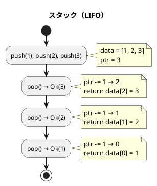
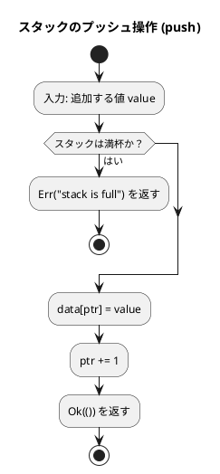
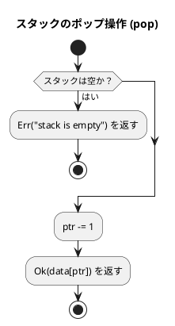
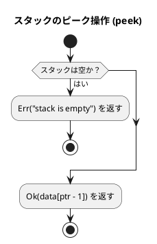
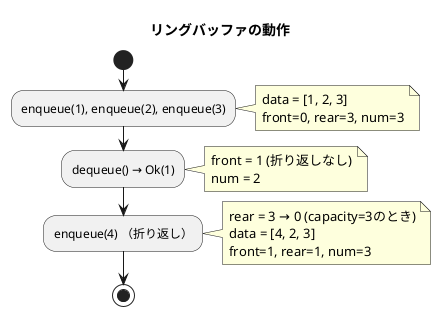
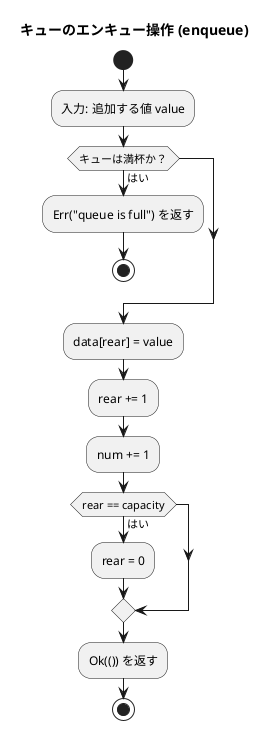
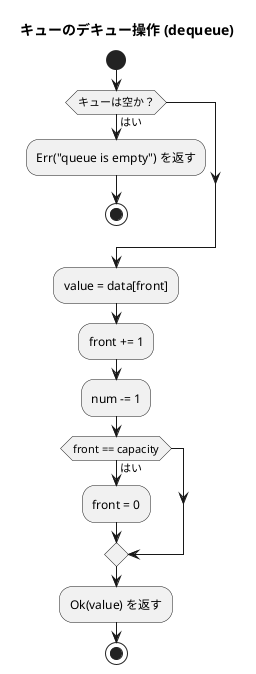
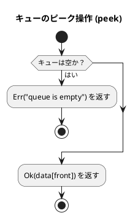

# 第 4 章 スタックとキュー

## はじめに

前章では探索アルゴリズムを学びました。この章では、データを特定の順序で格納・取り出すための基本的なデータ構造である「スタック」と「キュー」について TDD で実装します。

スタックとキューは、多くのアルゴリズムやプログラムの基礎となる重要なデータ構造です。これらの構造は、データの追加と削除の方法が異なり、それぞれ特定の問題に対して効率的な解決策を提供します。

Rust では `Result<T, E>` によるエラーハンドリングと `Option<T>` による NULL 安全な探索結果を活用し、Python の例外に相当する振る舞いを型安全に表現します。

### 目次

1. [スタック](#1-スタック)
2. [キュー](#2-キュー)
3. [スタックとキューの比較](#スタックとキューの比較)

---

## 1. スタック

スタックは **LIFO（Last In First Out）** — 後から入れたものを最初に取り出す — データ構造です。

皿を積み重ねるのに似ています。新しい皿は常に一番上に置かれ（プッシュ）、皿を取るときも一番上から取ります（ポップ）。

スタックの主な操作は以下の通りです：

- **プッシュ（Push）**: スタックの一番上にデータを追加する
- **ポップ（Pop）**: スタックの一番上からデータを取り出す
- **ピーク（Peek）**: スタックの一番上のデータを参照する（取り出さない）

スタックは、関数呼び出し、式の評価、構文解析、バックトラッキングなど、多くのアルゴリズムで使用されます。

### 構造体定義

```rust
pub struct Stack {
    capacity: usize,
    ptr: usize,
    data: Vec<i32>,
}
```

### Red — 失敗するテストを書く

```rust
#[test]
fn test_initial_state() {
    let stack = Stack::new(64);
    assert!(stack.is_empty());
    assert!(!stack.is_full());
    assert_eq!(stack.size(), 0);
}

#[test]
fn test_push_and_pop() {
    let mut stack = Stack::new(64);
    assert!(stack.push(1).is_ok());
    assert_eq!(stack.pop(), Ok(1));
}

#[test]
fn test_push_multiple_lifo() {
    let mut stack = Stack::new(64);
    stack.push(1).unwrap();
    stack.push(2).unwrap();
    stack.push(3).unwrap();
    assert_eq!(stack.pop(), Ok(3)); // LIFO
}
```

### Green — テストを通す実装

```rust
impl Stack {
    pub fn new(capacity: usize) -> Self {
        Stack {
            capacity,
            ptr: 0,
            data: vec![0; capacity],
        }
    }

    pub fn push(&mut self, value: i32) -> Result<(), &'static str> {
        if self.is_full() {
            return Err("stack is full");
        }
        self.data[self.ptr] = value;
        self.ptr += 1;
        Ok(())
    }

    pub fn pop(&mut self) -> Result<i32, &'static str> {
        if self.is_empty() {
            return Err("stack is empty");
        }
        self.ptr -= 1;
        Ok(self.data[self.ptr])
    }

    pub fn peek(&self) -> Result<i32, &'static str> {
        if self.is_empty() {
            return Err("stack is empty");
        }
        Ok(self.data[self.ptr - 1])
    }
}
```

### Refactor — find / count / clear

```rust
impl Stack {
    pub fn find(&self, value: i32) -> Option<usize> {
        for i in (0..self.ptr).rev() {
            if self.data[i] == value {
                return Some(i);
            }
        }
        None
    }

    pub fn count(&self, value: i32) -> usize {
        self.data[..self.ptr].iter().filter(|&&x| x == value).count()
    }

    pub fn clear(&mut self) {
        self.ptr = 0;
    }

    pub fn is_empty(&self) -> bool {
        self.ptr == 0
    }

    pub fn is_full(&self) -> bool {
        self.ptr >= self.capacity
    }

    pub fn size(&self) -> usize {
        self.ptr
    }
}
```

### 解説

Rust 版スタックの特徴：

1. **`Result<T, E>` によるエラーハンドリング**: Python の `raise Exception` に対して、Rust では `Result` 型を返す。呼び出し側は `unwrap()` で即座にパニックするか、`match` や `?` 演算子で安全に処理できる
2. **`Option<usize>` による探索結果**: `find` メソッドは Python の `-1` の代わりに `None` を返す。型レベルで「見つからない」ケースを表現できる
3. **スライスとイテレータ**: `count` メソッドでは `self.data[..self.ptr].iter().filter(...)` のように、Rust のイテレータチェーンを活用して簡潔に記述している

### アルゴリズムの考え方



**主な操作**:

| 操作 | メソッド | 計算量 | 説明 |
|------|---------|--------|------|
| プッシュ | `push(value)` | O(1) | 頂上に追加 |
| ポップ | `pop()` | O(1) | 頂上から取り出す |
| ピーク | `peek()` | O(1) | 頂上を参照（取り出さない） |
| 探索 | `find(value)` | O(n) | 値のインデックスを `Option` で返す |
| カウント | `count(value)` | O(n) | 値の出現回数 |

### フローチャート

#### スタックのプッシュ操作



#### スタックのポップ操作



#### スタックのピーク操作



---

## 2. キュー

キューは **FIFO（First In First Out）** — 最初に入れたものを最初に取り出す — データ構造です。

銀行の行列をイメージすると分かりやすいです。新しい人は列の最後尾に並び（エンキュー）、サービスを受けるのは列の先頭の人からです（デキュー）。

キューの主な操作は以下の通りです：

- **エンキュー（Enqueue）**: キューの末尾にデータを追加する
- **デキュー（Dequeue）**: キューの先頭からデータを取り出す
- **ピーク（Peek）**: キューの先頭のデータを参照する（取り出さない）

キューは、幅優先探索、プリンタのスプーリング、プロセススケジューリングなど、多くのアルゴリズムやシステムで使用されます。

### リングバッファ

固定長配列でキューを実現する際、素朴な実装では先頭要素を取り出すたびにすべての要素をシフトする必要があり O(n) のコストがかかります。

**リングバッファ**を使うと、`front`（先頭インデックス）と `rear`（末尾インデックス）を管理することで、エンキュー・デキューを O(1) で実現できます。



### 構造体定義

```rust
pub struct Queue {
    capacity: usize,
    num: usize,
    front: usize,
    rear: usize,
    data: Vec<i32>,
}
```

### Red — 失敗するテストを書く

```rust
#[test]
fn test_enqueue_multiple_fifo() {
    let mut queue = Queue::new(64);
    queue.enqueue(1).unwrap();
    queue.enqueue(2).unwrap();
    queue.enqueue(3).unwrap();
    assert_eq!(queue.dequeue(), Ok(1)); // FIFO
}

#[test]
fn test_ring_buffer_wrap_around() {
    let mut queue = Queue::new(3);
    queue.enqueue(1).unwrap();
    queue.enqueue(2).unwrap();
    queue.enqueue(3).unwrap();
    queue.dequeue().unwrap(); // 1 を取り出す
    queue.enqueue(4).unwrap(); // 空き位置（先頭）に追加
    assert_eq!(queue.dequeue(), Ok(2));
    assert_eq!(queue.dequeue(), Ok(3));
    assert_eq!(queue.dequeue(), Ok(4));
}
```

### Green — テストを通す実装

```rust
impl Queue {
    pub fn new(capacity: usize) -> Self {
        Queue {
            capacity,
            num: 0,
            front: 0,
            rear: 0,
            data: vec![0; capacity],
        }
    }

    pub fn enqueue(&mut self, value: i32) -> Result<(), &'static str> {
        if self.is_full() {
            return Err("queue is full");
        }
        self.data[self.rear] = value;
        self.rear += 1;
        self.num += 1;
        if self.rear == self.capacity {
            self.rear = 0; // リングバッファの折り返し
        }
        Ok(())
    }

    pub fn dequeue(&mut self) -> Result<i32, &'static str> {
        if self.is_empty() {
            return Err("queue is empty");
        }
        let value = self.data[self.front];
        self.front += 1;
        self.num -= 1;
        if self.front == self.capacity {
            self.front = 0; // リングバッファの折り返し
        }
        Ok(value)
    }

    pub fn peek(&self) -> Result<i32, &'static str> {
        if self.is_empty() {
            return Err("queue is empty");
        }
        Ok(self.data[self.front])
    }
}
```

### Refactor — find / count / clear

```rust
impl Queue {
    pub fn find(&self, value: i32) -> Option<usize> {
        for i in 0..self.num {
            let idx = (i + self.front) % self.capacity;
            if self.data[idx] == value {
                return Some(i); // 論理インデックスを返す
            }
        }
        None
    }

    pub fn count(&self, value: i32) -> usize {
        let mut c = 0;
        for i in 0..self.num {
            let idx = (i + self.front) % self.capacity;
            if self.data[idx] == value {
                c += 1;
            }
        }
        c
    }

    pub fn clear(&mut self) {
        self.front = 0;
        self.rear = 0;
        self.num = 0;
    }

    pub fn is_empty(&self) -> bool {
        self.num == 0
    }

    pub fn is_full(&self) -> bool {
        self.num >= self.capacity
    }

    pub fn size(&self) -> usize {
        self.num
    }
}
```

### 解説

Rust 版キューの特徴：

1. **リングバッファ**: `(index + 1) % capacity` でインデックスを折り返す。Python 版と同じアルゴリズムだが、Rust では `usize` 型のため負数になる心配がない
2. **`Result<T, E>` によるオーバーフロー/アンダーフロー処理**: Python の `raise Full` / `raise Empty` に対して、`Err("queue is full")` / `Err("queue is empty")` を返す
3. **論理インデックス**: `find` メソッドは物理インデックスではなく、先頭からの論理的な位置を `Option<usize>` で返す

### フローチャート

#### キューのエンキュー操作



#### キューのデキュー操作



#### キューのピーク操作



---

## テスト実行結果

```bash
$ cargo test -p chapter04

running 31 tests
test tests::queue_tests::test_clear ... ok
test tests::queue_tests::test_count ... ok
test tests::queue_tests::test_dequeue_underflow ... ok
test tests::queue_tests::test_enqueue_and_dequeue ... ok
test tests::queue_tests::test_enqueue_multiple_fifo ... ok
test tests::queue_tests::test_enqueue_overflow ... ok
test tests::queue_tests::test_find_empty ... ok
test tests::queue_tests::test_find_existing ... ok
test tests::queue_tests::test_find_not_existing ... ok
test tests::queue_tests::test_find_with_wrap_around ... ok
test tests::queue_tests::test_initial_state ... ok
test tests::queue_tests::test_is_full ... ok
test tests::queue_tests::test_peek ... ok
test tests::queue_tests::test_peek_empty ... ok
test tests::queue_tests::test_ring_buffer_full_cycle ... ok
test tests::queue_tests::test_ring_buffer_wrap_around ... ok
test tests::queue_tests::test_size_tracking ... ok
test tests::stack_tests::test_clear ... ok
test tests::stack_tests::test_count ... ok
test tests::stack_tests::test_find_empty ... ok
test tests::stack_tests::test_find_existing ... ok
test tests::stack_tests::test_find_not_existing ... ok
test tests::stack_tests::test_initial_state ... ok
test tests::stack_tests::test_is_full ... ok
test tests::stack_tests::test_peek ... ok
test tests::stack_tests::test_peek_empty ... ok
test tests::stack_tests::test_pop_underflow ... ok
test tests::stack_tests::test_push_and_pop ... ok
test tests::stack_tests::test_push_multiple_lifo ... ok
test tests::stack_tests::test_push_overflow ... ok
test tests::stack_tests::test_size_tracking ... ok

test result: ok. 31 passed; 0 failed; 0 ignored; 0 measured; 0 filtered out
```

31 テスト全パスです。

---

## スタックとキューの比較

| 項目 | スタック | キュー |
|------|---------|--------|
| 取り出し順序 | LIFO（後入れ先出し） | FIFO（先入れ先出し） |
| 追加操作 | `push()` | `enqueue()` |
| 取り出し操作 | `pop()` | `dequeue()` |
| 主な用途 | 関数呼び出し、DFS | タスクキュー、BFS |
| 計算量（追加/取り出し） | O(1) | O(1) |
| エラーハンドリング | `Result<T, &str>` | `Result<T, &str>` |
| 探索結果 | `Option<usize>` | `Option<usize>` |

### Python 版との対応

| 機能 | Python | Rust |
|------|--------|------|
| オーバーフロー | `raise FixedStack.Full` | `Err("stack is full")` |
| アンダーフロー | `raise FixedStack.Empty` | `Err("stack is empty")` |
| 探索（見つからない） | `-1` を返す | `None` を返す |
| 要素数 | `len(stack)` | `stack.size()` |
| リングバッファ折り返し | `if rear == capacity: rear = 0` | 同じ（`usize` で安全） |

## まとめ

この章では、2 つの基本的なデータ構造、スタックとキューについて Rust で TDD 実装しました：

1. **スタック**: 後入れ先出し（LIFO）の原則に従うデータ構造。`Vec<i32>` と `ptr`（スタックポインタ）で管理し、`Result` 型でオーバーフロー・アンダーフローを安全にハンドリングする

2. **キュー**: 先入れ先出し（FIFO）の原則に従うデータ構造。リングバッファで実装し、`front` / `rear` / `num` の 3 つのフィールドですべての操作を O(1) で実現する

Rust の型システムにより、Python 版では実行時例外として現れるエラーを、コンパイル時の型チェックで捕捉可能な `Result<T, E>` / `Option<T>` として表現しています。

次の章では、再帰アルゴリズムについて学んでいきましょう。

## 参考文献

- 『新・明解 Rust で学ぶアルゴリズムとデータ構造』 — 柴田望洋
- 『テスト駆動開発』 — Kent Beck
