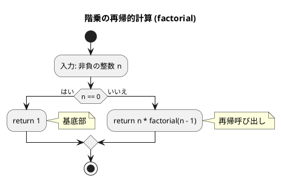
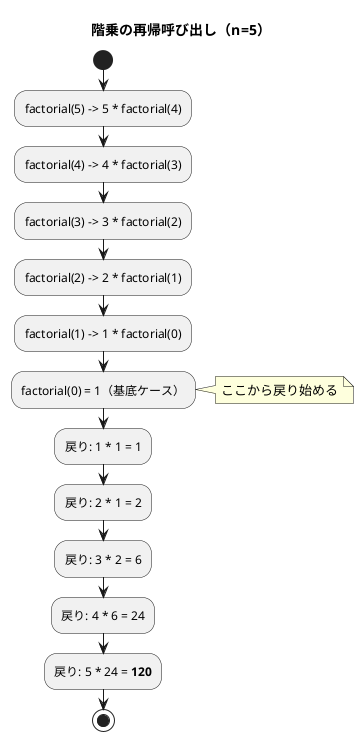
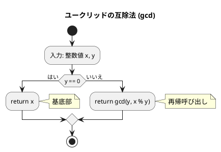
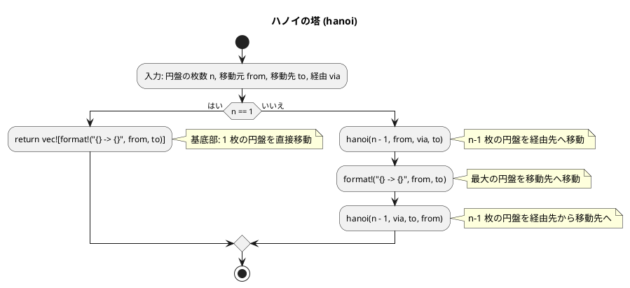
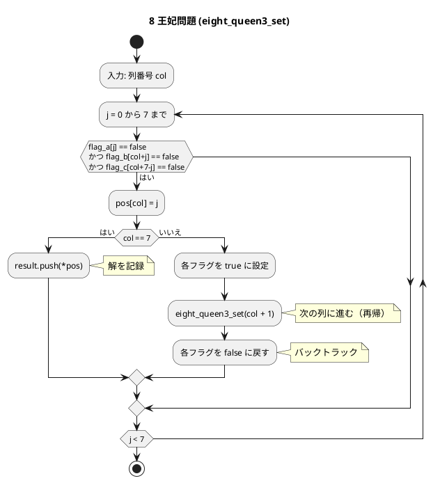

# 第 5 章 再帰アルゴリズム

## はじめに

前章ではスタックとキューというデータ構造を学びました。この章では「**再帰（Recursion）**」というアルゴリズム設計手法を TDD で実装します。

再帰とは、**ある関数が自分自身を呼び出す**ことで問題を解く手法です。大きな問題を同じ構造の小さな問題に分解し、最終的に自明な基底ケースに到達したら戻り始めます。

再帰アルゴリズムは、一般的に以下の 2 つの部分から構成されます：

1. **基底部（base case）**: 再帰呼び出しを終了する条件
2. **再帰部（recursive case）**: 問題を小さくして自分自身を呼び出す部分

Rust では再帰関数を自然に実装できます。型システムにより引数と戻り値の型が明確になるため、再帰の構造を把握しやすいのが特徴です。

### 目次

1. [階乗](#1-階乗)
2. [最大公約数（ユークリッドの互除法）](#2-最大公約数ユークリッドの互除法)
3. [再帰的な和](#3-再帰的な和)
4. [ハノイの塔](#4-ハノイの塔)
5. [迷路探索（バックトラッキング）](#5-迷路探索バックトラッキング)
6. [8 王妃問題](#6-8-王妃問題)

---

## 1. 階乗

`n! = n x (n-1) x ... x 1` を再帰で実装します。

### Red -- 失敗するテストを書く

```rust
#[test]
fn test_factorial_0() {
    assert_eq!(factorial(0), 1);
}

#[test]
fn test_factorial_5() {
    assert_eq!(factorial(5), 120);
}

#[test]
fn test_factorial_10() {
    assert_eq!(factorial(10), 3628800);
}
```

### Green -- テストを通す実装

```rust
pub fn factorial(n: u64) -> u64 {
    if n == 0 {
        return 1;
    }
    n * factorial(n - 1)
}
```

### アルゴリズムの考え方

#### フローチャート

以下は、階乗を再帰的に計算するアルゴリズムのフローチャートです：



#### 再帰呼び出しの展開



**計算量**: O(n)（n 回の再帰呼び出し）

---

## 2. 最大公約数（ユークリッドの互除法）

`gcd(a, b) = gcd(b, a % b)` という関係を再帰で実装します。

### Red -- 失敗するテストを書く

```rust
#[test]
fn test_gcd_basic() {
    assert_eq!(gcd(22, 8), 2);
}

#[test]
fn test_gcd_coprime() {
    assert_eq!(gcd(7, 11), 1);
}

#[test]
fn test_gcd_same() {
    assert_eq!(gcd(15, 15), 15);
}
```

### Green -- テストを通す実装

```rust
pub fn gcd(x: u64, y: u64) -> u64 {
    if y == 0 {
        return x;
    }
    gcd(y, x % y)
}
```

### アルゴリズムの考え方

#### フローチャート



例えば、gcd(22, 8) を計算する場合：
1. y = 8 が 0 でないので、gcd(8, 22 % 8) = gcd(8, 6) を計算
2. y = 6 が 0 でないので、gcd(6, 8 % 6) = gcd(6, 2) を計算
3. y = 2 が 0 でないので、gcd(2, 6 % 2) = gcd(2, 0) を計算
4. y = 0 なので、x = 2 を返す

**計算量**: O(log min(x, y))

---

## 3. 再帰的な和

1 から n までの和を再帰的に計算します。

### Red -- 失敗するテストを書く

```rust
#[test]
fn test_recur_1() {
    assert_eq!(recur(1), 1);
}

#[test]
fn test_recur_5() {
    assert_eq!(recur(5), 15); // 1+2+3+4+5
}

#[test]
fn test_recur_10() {
    assert_eq!(recur(10), 55);
}
```

### Green -- テストを通す実装

```rust
pub fn recur(n: u64) -> u64 {
    if n == 0 {
        return 0;
    }
    n + recur(n - 1)
}
```

---

## 4. ハノイの塔

n 枚の円盤を A から C へ B を経由して移動する問題です。

```
ルール:
1. 一度に 1 枚しか移動できない
2. 大きい円盤を小さい円盤の上に置けない
```

### Red -- 失敗するテストを書く

```rust
#[test]
fn test_hanoi_1() {
    let moves = hanoi(1, 'A', 'C', 'B');
    assert_eq!(moves, vec!["A -> C"]);
}

#[test]
fn test_hanoi_2() {
    let moves = hanoi(2, 'A', 'C', 'B');
    assert_eq!(moves, vec!["A -> B", "A -> C", "B -> C"]);
}

#[test]
fn test_hanoi_move_count() {
    for n in 1..=5 {
        let moves = hanoi(n, 'A', 'C', 'B');
        assert_eq!(moves.len(), (1 << n) - 1); // 2^n - 1
    }
}
```

### Green -- テストを通す実装

```rust
pub fn hanoi(n: u32, from: char, to: char, via: char) -> Vec<String> {
    if n == 0 {
        return vec![];
    }
    if n == 1 {
        return vec![format!("{} -> {}", from, to)];
    }
    let mut moves = Vec::new();
    moves.extend(hanoi(n - 1, from, via, to));   // n-1 枚を via へ
    moves.push(format!("{} -> {}", from, to));    // 最大の円盤を to へ
    moves.extend(hanoi(n - 1, via, to, from));    // n-1 枚を to へ
    moves
}
```

### アルゴリズムの考え方

#### フローチャート



Rust では移動手順を `Vec<String>` で収集して返します。Python 版がタプルのリストを返すのに対し、Rust 版は `"A -> C"` のような文字列のベクタで表現しています。

**計算量**: O(2^n)（移動回数 2^n - 1 回）

---

## 5. 迷路探索（バックトラッキング）

再帰的バックトラッキングで迷路を解きます。行き止まりに達したら戻り、別の経路を試みます。

### Red -- 失敗するテストを書く

```rust
#[test]
fn test_maze_solvable() {
    let maze = vec![
        vec![1, 1, 1, 1, 1],
        vec![1, 0, 0, 0, 1],
        vec![1, 0, 1, 0, 1],
        vec![1, 0, 0, 0, 1],
        vec![1, 1, 1, 1, 1],
    ];
    let result = maze_solve(&maze, (1, 1), (3, 3));
    assert!(result.is_some());
    let path = result.unwrap();
    assert_eq!(*path.first().unwrap(), (1, 1));
    assert_eq!(*path.last().unwrap(), (3, 3));
}

#[test]
fn test_maze_unsolvable() {
    let maze = vec![
        vec![1, 1, 1, 1, 1],
        vec![1, 0, 1, 0, 1],
        vec![1, 1, 1, 1, 1],
        vec![1, 0, 0, 0, 1],
        vec![1, 1, 1, 1, 1],
    ];
    let result = maze_solve(&maze, (1, 1), (3, 1));
    assert!(result.is_none());
}
```

### Green -- テストを通す実装

```rust
pub fn maze_solve(
    maze: &Vec<Vec<u8>>,
    start: (usize, usize),
    goal: (usize, usize),
) -> Option<Vec<(usize, usize)>> {
    let rows = maze.len();
    let cols = maze[0].len();
    let mut visited = vec![vec![false; cols]; rows];
    let mut path = Vec::new();
    if maze_solve_rec(maze, start, goal, &mut visited, &mut path) {
        Some(path)
    } else {
        None
    }
}

fn maze_solve_rec(
    maze: &Vec<Vec<u8>>,
    pos: (usize, usize),
    goal: (usize, usize),
    visited: &mut Vec<Vec<bool>>,
    path: &mut Vec<(usize, usize)>,
) -> bool {
    let (row, col) = pos;
    if pos == goal {
        path.push(pos);
        return true;
    }

    let rows = maze.len();
    let cols = maze[0].len();
    visited[row][col] = true;
    path.push(pos);

    let directions: [(isize, isize); 4] = [(-1, 0), (1, 0), (0, -1), (0, 1)];
    for (dr, dc) in &directions {
        let nr = row as isize + dr;
        let nc = col as isize + dc;
        if nr >= 0 && nr < rows as isize && nc >= 0 && nc < cols as isize {
            let nr = nr as usize;
            let nc = nc as usize;
            if maze[nr][nc] == 0 && !visited[nr][nc] {
                if maze_solve_rec(maze, (nr, nc), goal, visited, path) {
                    return true;
                }
            }
        }
    }

    path.pop(); // バックトラック
    false
}
```

Rust では `Option<Vec<(usize, usize)>>` で解の有無を表現します。Python 版が `True`/`False` を返すのに対し、Rust 版は経路そのものを `Option` で返すことで、解の存在確認と経路取得を一度に行えます。

---

## 6. 8 王妃問題

8x8 のチェス盤上に 8 個の王妃を互いに攻撃できないように配置する問題です。王妃は、同じ行、同じ列、または同じ対角線上にある他の王妃を攻撃できます。

3 段階の最適化で実装します。

### 基本版（制約なし）

各列に王妃を 0-7 行のいずれかに配置する全組み合わせを列挙します。

#### Red -- 失敗するテストを書く

```rust
#[test]
fn test_eight_queen_count() {
    let result = eight_queen();
    assert_eq!(result.len(), 16_777_216); // 8^8
}
```

#### Green -- テストを通す実装

```rust
pub fn eight_queen() -> Vec<[usize; 8]> {
    let mut result = Vec::new();
    let mut pos = [0usize; 8];
    eight_queen_set(&mut pos, 0, &mut result);
    result
}

fn eight_queen_set(pos: &mut [usize; 8], col: usize, result: &mut Vec<[usize; 8]>) {
    for j in 0..8 {
        pos[col] = j;
        if col == 7 {
            result.push(*pos);
        } else {
            eight_queen_set(pos, col + 1, result);
        }
    }
}
```

### 最適化版 1（行の重複排除）

各行に 1 個だけ王妃を配置する制約を追加します。

#### Red -- 失敗するテストを書く

```rust
#[test]
fn test_eight_queen2_count() {
    let result = eight_queen2();
    assert_eq!(result.len(), 40_320); // 8!
}

#[test]
fn test_eight_queen2_no_row_dup() {
    let result = eight_queen2();
    for row in &result {
        let mut seen = [false; 8];
        for &val in row {
            assert!(!seen[val]);
            seen[val] = true;
        }
    }
}
```

#### Green -- テストを通す実装

```rust
pub fn eight_queen2() -> Vec<[usize; 8]> {
    let mut result = Vec::new();
    let mut pos = [0usize; 8];
    let mut flag_row = [false; 8];
    eight_queen2_set(&mut pos, 0, &mut flag_row, &mut result);
    result
}

fn eight_queen2_set(
    pos: &mut [usize; 8],
    col: usize,
    flag_row: &mut [bool; 8],
    result: &mut Vec<[usize; 8]>,
) {
    for j in 0..8 {
        if !flag_row[j] {
            pos[col] = j;
            if col == 7 {
                result.push(*pos);
            } else {
                flag_row[j] = true;
                eight_queen2_set(pos, col + 1, flag_row, result);
                flag_row[j] = false;
            }
        }
    }
}
```

### 最適化版 2（行・対角線の重複排除）

行、列、対角線すべての制約を適用した完全な 8 王妃問題の解を求めます。

#### Red -- 失敗するテストを書く

```rust
#[test]
fn test_eight_queen3_count() {
    let result = eight_queen3();
    assert_eq!(result.len(), 92); // 8 王妃問題の解は 92 通り
}
```

#### Green -- テストを通す実装

```rust
pub fn eight_queen3() -> Vec<[usize; 8]> {
    let mut result = Vec::new();
    let mut pos = [0usize; 8];
    let mut flag_a = [false; 8];  // 行フラグ
    let mut flag_b = [false; 15]; // 右上がり対角線フラグ
    let mut flag_c = [false; 15]; // 右下がり対角線フラグ
    eight_queen3_set(&mut pos, 0, &mut flag_a, &mut flag_b, &mut flag_c, &mut result);
    result
}

fn eight_queen3_set(
    pos: &mut [usize; 8],
    col: usize,
    flag_a: &mut [bool; 8],
    flag_b: &mut [bool; 15],
    flag_c: &mut [bool; 15],
    result: &mut Vec<[usize; 8]>,
) {
    for j in 0..8 {
        if !flag_a[j] && !flag_b[col + j] && !flag_c[col + 7 - j] {
            pos[col] = j;
            if col == 7 {
                result.push(*pos);
            } else {
                flag_a[j] = true;
                flag_b[col + j] = true;
                flag_c[col + 7 - j] = true;
                eight_queen3_set(pos, col + 1, flag_a, flag_b, flag_c, result);
                flag_a[j] = false;
                flag_b[col + j] = false;
                flag_c[col + 7 - j] = false;
            }
        }
    }
}
```

#### フローチャート



Rust では固定長配列 `[usize; 8]` で盤面を表現します。Python 版のリストと異なり、コピーが `*pos` で簡潔に行えるのが Rust の特徴です。

| 方法 | 試行数 | 制約 |
|------|--------|------|
| eight_queen | 16,777,216 | なし（8^8） |
| eight_queen2 | 40,320 | 同じ行に置かない（8!） |
| eight_queen3 | 92 | 行・対角線も制約 |

---

## テスト実行結果

```bash
$ cargo test --manifest-path apps/rust/Cargo.toml -p chapter05

running 23 tests
test tests::test_factorial_0 ... ok
test tests::test_factorial_1 ... ok
test tests::test_factorial_5 ... ok
test tests::test_factorial_10 ... ok
test tests::test_gcd_basic ... ok
test tests::test_gcd_one_multiple ... ok
test tests::test_gcd_coprime ... ok
test tests::test_gcd_same ... ok
test tests::test_recur_1 ... ok
test tests::test_recur_5 ... ok
test tests::test_recur_10 ... ok
test tests::test_hanoi_1 ... ok
test tests::test_hanoi_2 ... ok
test tests::test_hanoi_3_count ... ok
test tests::test_hanoi_move_count ... ok
test tests::test_maze_solvable ... ok
test tests::test_maze_unsolvable ... ok
test tests::test_eight_queen_count ... ok
test tests::test_eight_queen_column_count ... ok
test tests::test_eight_queen2_count ... ok
test tests::test_eight_queen2_no_row_dup ... ok
test tests::test_eight_queen3_count ... ok
test tests::test_eight_queen3_no_row_dup ... ok

test result: ok. 23 passed; 0 failed; 0 ignored; 0 measured; 0 filtered out

   Doc-tests chapter05
test result: ok. 4 passed; 0 failed; 0 ignored; 0 measured; 0 filtered out
```

全 27 テスト（23 ユニットテスト + 4 doc テスト）パス。

---

## 再帰アルゴリズムの比較

| アルゴリズム | 計算量 | 特徴 |
|-------------|--------|------|
| 階乗 | O(n) | 単純な線形再帰 |
| GCD（ユークリッド） | O(log min(x,y)) | 対数的収束 |
| 再帰的な和 | O(n) | 単純な線形再帰 |
| ハノイの塔 | O(2^n) | 指数的成長 |
| 迷路探索 | O(行数 x 列数) | バックトラッキング |
| 8 王妃問題 | O(n!) | バックトラッキングによる枝刈り |

## まとめ

この章では、再帰アルゴリズムについて学びました：

1. **再帰の基本**: 階乗やユークリッドの互除法などの基本的な再帰アルゴリズム
2. **再帰的な和**: 単純な線形再帰の例
3. **ハノイの塔**: 再帰の古典的な応用例
4. **迷路探索**: バックトラッキングによる経路探索
5. **8 王妃問題**: バックトラッキングと再帰を組み合わせた複雑な問題

Rust での実装のポイント：
- 再帰関数は自然に実装でき、型シグネチャが再帰構造の理解を助ける
- `Vec<String>` でハノイの塔の移動手順を収集
- `Option<Vec<(usize, usize)>>` で迷路の解の有無と経路を同時に表現
- 固定長配列 `[usize; 8]` で 8 王妃問題の盤面を効率的に表現
- 可変参照 `&mut` を活用したバックトラッキングの状態管理

次の章では、ソートアルゴリズムについて学んでいきましょう。

## 参考文献

- 『新・明解 Rust で学ぶアルゴリズムとデータ構造』 -- 柴田望洋
- 『テスト駆動開発』 -- Kent Beck
