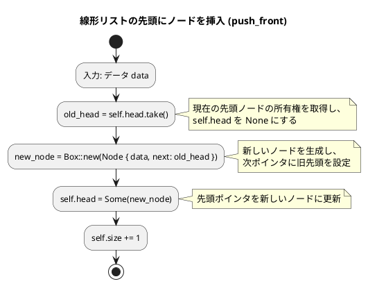
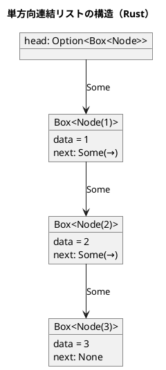

# 第 8 章 リスト（連結リスト）

## はじめに

前章までで、配列や探索アルゴリズム、スタック、キュー、再帰、ソートアルゴリズム、文字列処理などを学んできました。この章では、データ構造の基本である「**リスト（連結リスト）**」を TDD で実装します。

配列と異なり、連結リストはメモリ上に不連続に配置されたノードをポインタで繋ぎます。要素の挿入・削除が O(1) ですが、ランダムアクセスは O(n) です。

Rust では所有権システムにより、連結リストの実装が他言語とは大きく異なります。`Box<T>` によるヒープ割り当て、`Option<T>` による null 安全、`Rc<RefCell<T>>` による共有可変参照など、Rust 固有の概念を活用します。

### 目次

1. [リストとは](#リストとは)
2. [Python との比較](#python-との比較)
3. [単方向連結リスト](#1-単方向連結リストlinkedlist)
4. [双方向連結リスト](#2-双方向連結リストdoublylinkedlist)
5. [配列カーソル版リスト](#3-配列カーソル版リストarraylinkedlist)
6. [まとめ](#まとめ)

---

## リストとは

リストとは、データを順序付けて格納するデータ構造です。配列と似ていますが、リストは要素の追加や削除が容易であるという特徴があります。

リストには様々な種類があります：

- **線形リスト**：最も基本的なリスト構造で、各要素が一方向に連結されています。
- **連結リスト**：各要素（ノード）が次の要素へのポインタを持つリスト構造です。
- **循環リスト**：最後の要素が最初の要素を指す連結リストです。
- **双方向リスト**：各要素が前後の要素へのポインタを持つリスト構造です。

それでは、これらのリスト構造を順に実装していきましょう。

---

## Python との比較

Rust で連結リストを実装するとき、Python とは異なるアプローチが必要です。以下に主要な違いをまとめます。

| 概念 | Python | Rust |
|------|--------|------|
| ノードの「次」への参照 | `next: Node \| None` | `Option<Box<Node<T>>>` |
| null 表現 | `None` | `Option::None` |
| ノードの所有権 | GC が管理 | `Box<T>` が単一所有権を管理 |
| 双方向参照 | `prev`/`next` に直接代入 | `Rc<RefCell<T>>` で参照カウント + 内部可変性 |
| 配列カーソル版の null | `-1`（定数 `Null`） | `usize::MAX`（定数 `NULL`） |
| メモリ解放 | GC が自動回収 | `Drop` トレイトで自動解放 |
| ジェネリクス | `Any` 型ヒント | `<T: PartialEq + Clone>` トレイト境界 |

### Rust の所有権モデルと連結リスト

連結リストは「所有権」の観点で 3 つのパターンに分かれます。

1. **単方向リスト** — 親ノードが子ノードを `Box<T>` で所有する。所有権の木構造になるため、Rust の所有権モデルと自然に適合します。
2. **双方向リスト** — 前後のノードが互いに参照し合うため、単一所有権では表現できません。`Rc<RefCell<T>>`（参照カウント + 内部可変性）を使います。
3. **配列カーソル版** — ノードを `Vec` に格納し、インデックスで参照します。所有権の問題が発生しないため、最も素直に実装できます。

---

## 1. 単方向連結リスト（LinkedList）

各ノードが次のノードへの参照を持ちます。Rust では `Box<T>` でヒープ上にノードを確保し、`Option<Box<Node<T>>>` で「次がある/ない」を表現します。

### 型定義

```rust
type Link<T> = Option<Box<Node<T>>>;

#[derive(Debug)]
struct Node<T> {
    data: T,
    next: Link<T>,
}

/// 線形リスト（単方向連結リスト）
#[derive(Debug)]
pub struct LinkedList<T> {
    head: Link<T>,
    size: usize,
}
```

`Link<T>` は `Option<Box<Node<T>>>` の型エイリアスです。`Box<T>` はヒープ上に値を配置するスマートポインタで、ノードのサイズがコンパイル時に不定な再帰的データ構造を表現するために必要です。

### Red — 失敗するテストを書く

```rust
#[test]
fn test_push_back() {
    let mut lst = LinkedList::new();
    lst.push_back(1);
    lst.push_back(2);
    assert_eq!(lst.len(), 2);
    assert_eq!(lst.to_vec(), vec![1, 2]);
}

#[test]
fn test_search_found() {
    let mut lst = LinkedList::new();
    lst.push_back(10);
    lst.push_back(20);
    lst.push_back(30);
    assert!(lst.search(&20));
}
```

### Green — テストを通す実装

```rust
impl<T: PartialEq + Clone + std::fmt::Debug> LinkedList<T> {
    /// 空のリストを生成する
    pub fn new() -> Self {
        LinkedList {
            head: None,
            size: 0,
        }
    }

    /// リストが空か判定する
    pub fn is_empty(&self) -> bool {
        self.head.is_none()
    }

    /// 要素数を返す
    pub fn len(&self) -> usize {
        self.size
    }

    /// 先頭にノードを挿入する
    pub fn push_front(&mut self, data: T) {
        let new_node = Box::new(Node {
            data,
            next: self.head.take(),
        });
        self.head = Some(new_node);
        self.size += 1;
    }

    /// 末尾にノードを挿入する
    pub fn push_back(&mut self, data: T) {
        let new_node = Box::new(Node {
            data,
            next: None,
        });
        if self.head.is_none() {
            self.head = Some(new_node);
        } else {
            let mut ptr = self.head.as_mut().unwrap();
            while ptr.next.is_some() {
                ptr = ptr.next.as_mut().unwrap();
            }
            ptr.next = Some(new_node);
        }
        self.size += 1;
    }

    /// 指定した値を探索する
    pub fn search(&self, data: &T) -> bool {
        let mut ptr = &self.head;
        while let Some(node) = ptr {
            if &node.data == data {
                return true;
            }
            ptr = &node.next;
        }
        false
    }

    /// テスト用: リストの要素を Vec に変換する
    pub fn to_vec(&self) -> Vec<T> {
        let mut result = Vec::new();
        let mut ptr = &self.head;
        while let Some(node) = ptr {
            result.push(node.data.clone());
            ptr = &node.next;
        }
        result
    }
}
```

### Refactor — 削除操作を追加する

テストが通った状態で、`pop_front`、`pop_back`、`remove`、`clear` を追加します。全コードは `apps/rust/chapter08/src/lib.rs` を参照してください。

- **`pop_front`** — `self.head.take()` で所有権を取り出し、`node.next` を新しい先頭に設定します。
- **`pop_back`** — 末尾の 1 つ前まで辿り、`ptr.next.take()` で末尾ノードを切り離します。
- **`remove`** — 先頭ノードは `pop_front` で処理し、2 番目以降は `node.next.take()` で対象を外します。
- **`clear`** — `pop_front` を繰り返し呼び出し、逐次的にドロップすることでスタックオーバーフローを防ぎます。

### Rust 固有のポイント：`self.head.take()`

`push_front` で使われている `self.head.take()` は、Rust の所有権を理解するうえで重要なイディオムです。

```rust
pub fn push_front(&mut self, data: T) {
    let new_node = Box::new(Node {
        data,
        next: self.head.take(),  // head の所有権を移動し、head を None にする
    });
    self.head = Some(new_node);
    self.size += 1;
}
```

`Option::take()` は `Option` の中身を取り出し、元の `Option` を `None` にします。これにより、`self.head` の所有権を新しいノードに移動しつつ、借用チェッカーの制約を満たします。Python では単に `self.head = Node(data, self.head)` と書けますが、Rust では所有権の移動を明示する必要があります。

### フローチャート

#### 先頭にノードを挿入（push_front）



アルゴリズムの流れ：
1. データ data を入力として受け取ります
2. `self.head.take()` で現在の先頭ノードの所有権を取得し、`self.head` を `None` にします
3. 新しいノードを `Box::new` でヒープ上に生成し、`next` に旧先頭ノードを設定します
4. `self.head` を新しいノードに更新します
5. ノード数 `self.size` を 1 増やします

この操作は O(1) です。

#### 末尾にノードを挿入（push_back）

リストが空なら先頭に設定し、そうでなければ末尾まで走査して追加します。`as_mut().unwrap()` で可変参照を取得しながらリストを辿ります。この操作は O(n) です。

#### 先頭ノードを削除（pop_front）

`self.head.take()` で所有権を取り出し、`node.next` を新しい先頭に設定します。取り出された古いノードはスコープを抜けた時点で自動的に解放されます。この操作は O(1) です。

### 解説

単方向連結リストは、各ノードが次のノードへのポインタを持つデータ構造です。この実装では、以下の特徴があります：

1. **型エイリアス `Link<T>`**：`Option<Box<Node<T>>>` を簡潔に表現します。
2. **`Box<T>` によるヒープ割り当て**：再帰的なデータ構造をコンパイル時にサイズ確定させるために必要です。
3. **`Option<T>` による null 安全**：`None` / `Some` でノードの存在を型安全に表現します。
4. **所有権の移動**：`take()` を使って所有権を安全に移動させます。

### アルゴリズムの考え方



**主な操作の計算量**:

| 操作 | 先頭 | 末尾 | 中間 |
|------|------|------|------|
| 挿入 | O(1) | O(n) | O(n) |
| 削除 | O(1) | O(n) | O(n) |
| 探索 | O(n) | O(n) | O(n) |

---

## 2. 双方向連結リスト（DoublyLinkedList）

各ノードが前後両方のノードへの参照を持ちます。番兵ノード（ダミー）を使い、先頭・末尾の特殊処理を不要にします。循環リストとしても機能し、最後のノードが番兵ノードを経由して先頭ノードに繋がります。

### なぜ `Rc<RefCell<T>>` が必要か

双方向リストでは、ノード A の `next` がノード B を指し、同時にノード B の `prev` がノード A を指します。つまり **2 つの場所から同じノードを参照する** 必要があります。

- `Box<T>` は単一所有権なので、2 箇所から同時に所有できません
- `Rc<T>`（Reference Counted）で複数箇所からの共有所有を実現します
- `RefCell<T>` で実行時借用チェックによる内部可変性を提供します

```
Rc<T>       → 複数箇所からの共有所有（参照カウント）
RefCell<T>  → 実行時に借用ルールをチェック（内部可変性）
Rc<RefCell<T>> → 複数箇所から共有しつつ、中身を変更できる
```

### 型定義

```rust
use std::cell::RefCell;
use std::rc::Rc;

type DLink<T> = Option<Rc<RefCell<DNode<T>>>>;

#[derive(Debug)]
struct DNode<T> {
    data: T,
    prev: DLink<T>,
    next: DLink<T>,
}

/// 循環・双方向連結リスト（番兵ノード使用）
pub struct DoublyLinkedList<T> {
    /// 番兵ノード: sentinel.next が先頭、sentinel.prev が末尾
    sentinel: Rc<RefCell<DNode<T>>>,
    size: usize,
}
```

### 番兵ノードの構造

```
         ┌──────────────────────────────────────┐
         ↓                                      │
[sentinel] ⇔ [Node(1)] ⇔ [Node(2)] ⇔ [Node(3)]
  ↑                                            │
  └────────────────────────────────────────────┘
```

番兵ノードの `next` が先頭、`prev` が末尾を指します。リストが空のとき、番兵の `next` と `prev` は自分自身を指します。

### Red — 失敗するテストを書く

```rust
#[test]
fn test_push_back() {
    let mut lst: DoublyLinkedList<i32> = DoublyLinkedList::new();
    lst.push_back(1);
    lst.push_back(2);
    assert_eq!(lst.len(), 2);
    assert_eq!(lst.to_vec(), vec![1, 2]);
}

#[test]
fn test_remove() {
    let mut lst: DoublyLinkedList<i32> = DoublyLinkedList::new();
    lst.push_back(1);
    lst.push_back(2);
    lst.push_back(3);
    assert!(lst.remove(&2));
    assert!(!lst.search(&2));
    assert_eq!(lst.len(), 2);
    assert_eq!(lst.to_vec(), vec![1, 3]);
}
```

### Green — テストを通す実装

```rust
impl<T: PartialEq + Clone + std::fmt::Debug + Default> DoublyLinkedList<T> {
    /// 空のリストを生成する（番兵ノードを配置）
    pub fn new() -> Self {
        let sentinel = Rc::new(RefCell::new(DNode {
            data: T::default(),
            prev: None,
            next: None,
        }));
        // 番兵の prev, next を自分自身に向ける（循環）
        sentinel.borrow_mut().prev = Some(Rc::clone(&sentinel));
        sentinel.borrow_mut().next = Some(Rc::clone(&sentinel));
        DoublyLinkedList { sentinel, size: 0 }
    }

    /// リストが空か判定する
    pub fn is_empty(&self) -> bool {
        self.size == 0
    }

    /// 要素数を返す
    pub fn len(&self) -> usize {
        self.size
    }

    /// 先頭にノードを挿入する
    pub fn push_front(&mut self, data: T) {
        let new_node = Rc::new(RefCell::new(DNode {
            data,
            prev: Some(Rc::clone(&self.sentinel)),
            next: None,
        }));
        // old_first = sentinel.next
        let old_first = self.sentinel.borrow().next.as_ref().unwrap().clone();
        new_node.borrow_mut().next = Some(Rc::clone(&old_first));
        old_first.borrow_mut().prev = Some(Rc::clone(&new_node));
        self.sentinel.borrow_mut().next = Some(new_node);
        self.size += 1;
    }

    /// 末尾にノードを挿入する
    pub fn push_back(&mut self, data: T) {
        let new_node = Rc::new(RefCell::new(DNode {
            data,
            prev: None,
            next: Some(Rc::clone(&self.sentinel)),
        }));
        // old_last = sentinel.prev
        let old_last = self.sentinel.borrow().prev.as_ref().unwrap().clone();
        new_node.borrow_mut().prev = Some(Rc::clone(&old_last));
        old_last.borrow_mut().next = Some(Rc::clone(&new_node));
        self.sentinel.borrow_mut().prev = Some(new_node);
        self.size += 1;
    }

    // search, remove, clear, to_vec の全コードは
    // apps/rust/chapter08/src/lib.rs を参照
}
```

### Rust 固有のポイント：`Rc::clone` と `Rc::ptr_eq`

双方向リストの走査で使われる 2 つの重要な操作を解説します。

**`Rc::clone(&node)`** — 参照カウントを 1 増やすだけで、データのディープコピーは行いません。Python で複数の変数が同じオブジェクトを参照するのと同じ意味です。

**`Rc::ptr_eq(&a, &b)`** — 2 つの `Rc` が同じメモリアドレスを指しているかを比較します。番兵ノードに到達したかどうかの判定に使います。Python の `is` 演算子に相当します。

```rust
// 番兵ノードに到達したら走査終了
if Rc::ptr_eq(&current, &self.sentinel) {
    return false;
}
```

### 解説

循環・双方向連結リストは、各ノードが前後のノードへのポインタを持ち、最後のノードが番兵ノードを経由して最初のノードを指すリスト構造です。この実装では、以下の特徴があります：

1. **`Rc<RefCell<DNode<T>>>`**：複数箇所からの共有所有と内部可変性を両立します。
2. **番兵ノード（sentinel）**：先頭と末尾の特殊処理を不要にし、コードを簡潔にします。
3. **要素の追加**：先頭または末尾に O(1) で要素を追加できます。
4. **要素の削除**：ノードへの参照があれば O(1) で要素を削除できます。
5. **`Default` トレイト境界**：番兵ノードのダミーデータに `T::default()` を使うために必要です。

---

## 3. 配列カーソル版リスト（ArrayLinkedList）

ポインタの代わりに配列インデックスを使います。`Vec<ArrayNode>` に全ノードを格納し、`next` フィールドにインデックス値を持たせます。

Rust の所有権システムの制約を受けないため、最も素直に実装できる方式です。

### 型定義

```rust
const NULL: usize = usize::MAX;

/// 配列カーソル版リストのノード
#[derive(Debug, Clone)]
struct ArrayNode {
    data: Option<i32>,
    next: usize,  // 次のインデックス（NULL = 末尾）
    dnext: usize, // フリーリストの next
}

/// 線形リストクラス（配列カーソル版）
pub struct ArrayLinkedList {
    n: Vec<ArrayNode>,
    head: usize,
    current: usize,
    max: usize,     // 使用済み最大インデックス（未使用時は NULL）
    deleted: usize,  // フリーリストの先頭
    capacity: usize,
    size: usize,
}
```

### Red — 失敗するテストを書く

```rust
#[test]
fn test_initial_empty() {
    let lst = ArrayLinkedList::new(100);
    assert_eq!(lst.len(), 0);
}

#[test]
fn test_add_first() {
    let mut lst = ArrayLinkedList::new(100);
    lst.add_first(1);
    assert_eq!(lst.len(), 1);
    lst.add_first(2);
    assert_eq!(lst.len(), 2);
}
```

### Green — テストを通す実装

```rust
impl ArrayLinkedList {
    /// 指定容量で空のリストを生成する
    pub fn new(capacity: usize) -> Self {
        ArrayLinkedList {
            n: vec![ArrayNode::new(); capacity],
            head: NULL,
            current: NULL,
            max: NULL,
            deleted: NULL,
            capacity,
            size: 0,
        }
    }

    /// 要素数を返す
    pub fn len(&self) -> usize {
        self.size
    }

    /// 次に挿入するレコードの添字を求める
    fn get_insert_index(&mut self) -> usize {
        if self.deleted == NULL {
            let next_max = if self.max == NULL { 0 } else { self.max + 1 };
            if next_max < self.capacity {
                self.max = next_max;
                self.max
            } else {
                NULL // 満杯
            }
        } else {
            let rec = self.deleted;
            self.deleted = self.n[rec].dnext;
            rec
        }
    }

    /// 先頭にノードを挿入する
    pub fn add_first(&mut self, data: i32) {
        let ptr = self.head;
        let rec = self.get_insert_index();
        if rec != NULL {
            self.head = rec;
            self.current = rec;
            self.n[rec] = ArrayNode::with_data(data, ptr);
            self.size += 1;
        }
    }

    // add_last, search, remove_first, get_data, head_index の全コードは
    // apps/rust/chapter08/src/lib.rs を参照
}
```

### フリーリスト（削除済みスロットの再利用）

配列カーソル版の重要な仕組みが「フリーリスト」です。削除されたスロットを `dnext` でチェーンし、次の挿入時に再利用します。

```
配列: [Node(3), Node(削除済), Node(1), ...]
         ↓          ↓            ↓
head→ idx:0 → idx:2 → NULL
deleted→ idx:1 → NULL（フリーリスト）
```

```rust
fn get_insert_index(&mut self) -> usize {
    if self.deleted == NULL {
        // フリーリストが空 → 新しいスロットを使う
        let next_max = if self.max == NULL { 0 } else { self.max + 1 };
        if next_max < self.capacity {
            self.max = next_max;
            self.max
        } else {
            NULL // 満杯
        }
    } else {
        // フリーリストから再利用
        let rec = self.deleted;
        self.deleted = self.n[rec].dnext;
        rec
    }
}
```

### Python との対応

| Python | Rust |
|--------|------|
| `Null = -1` | `const NULL: usize = usize::MAX` |
| `_ArrayNode.data` | `ArrayNode.data: Option<i32>` |
| `_ArrayNode.next`（int） | `ArrayNode.next: usize` |
| `list * capacity` | `vec![ArrayNode::new(); capacity]` |

### 解説

配列カーソル版リストは、ポインタの代わりに配列インデックスを使って連結リストを実装する方法です。この実装では、以下の特徴があります：

1. **`Vec<ArrayNode>`**：全ノードを連続メモリに格納するため、キャッシュ効率が高いです。
2. **`usize::MAX` を null 値として使用**：Python の `-1` に相当します。
3. **フリーリスト**：削除されたレコードを `dnext` でチェーンし、次の挿入時に再利用します。
4. **固定容量**：`capacity` を超える挿入は無視されます。

---

## テスト実行結果

```bash
$ cd apps/rust && cargo test --lib chapter08 -- --nocapture

running 30 tests
...
test result: ok. 30 passed; 0 failed; 0 ignored
```

---

## 配列 vs 連結リスト

| 項目 | 配列 | 連結リスト |
|------|------|-----------|
| ランダムアクセス | O(1) | O(n) |
| 先頭への挿入 | O(n) | O(1) |
| 末尾への挿入 | O(1) | O(1)※単方向は O(n) |
| 途中への挿入 | O(n) | O(1)（ポインタ取得後） |
| メモリ使用 | 連続領域 | 不連続、ポインタ分余分 |

## まとめ

この章では、3 種類のリスト構造を Rust で実装しました。

### 全構造の比較

| 実装 | 所有権モデル | 挿入/削除 | 探索 | 特徴 |
|------|-------------|----------|------|------|
| 単方向リスト | `Box<T>` 単一所有権 | O(1)先頭、O(n)末尾 | O(n) | シンプル、所有権と自然に適合 |
| 双方向リスト | `Rc<RefCell<T>>` 共有所有 | O(1) | O(n) | 番兵で境界処理不要、実行時借用チェック |
| 配列カーソル版 | `Vec<T>` 値所有 | O(1)先頭 | O(n) | キャッシュ効率が高い、所有権問題なし |

### Rust の所有権と連結リスト

Rust で連結リストを実装する際に使う主要なスマートポインタをまとめます。

| スマートポインタ | 用途 | 特徴 |
|-----------------|------|------|
| `Box<T>` | 単方向リスト | 単一所有権、コンパイル時チェック |
| `Rc<T>` | 複数箇所からの共有参照 | 参照カウント、イミュータブル |
| `RefCell<T>` | 実行時の可変借用 | 内部可変性、実行時チェック |
| `Rc<RefCell<T>>` | 双方向リスト | 共有所有 + 内部可変性 |

Python では GC が全てのメモリ管理を行うため、連結リストの実装はデータ構造そのものに集中できます。Rust では所有権・借用の制約があるため、「データ構造をどう所有するか」という設計判断が加わります。しかし、この制約のおかげで、メモリリークやダングリングポインタが**コンパイル時に**防止されます。

次の章では、木構造について学びます。

## 参考文献

- 『新・明解 Rust で学ぶアルゴリズムとデータ構造』 — 柴田望洋
- 『テスト駆動開発』 — Kent Beck
