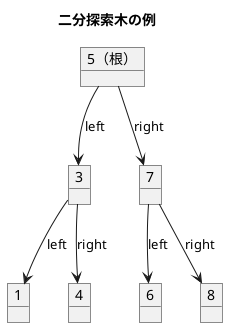
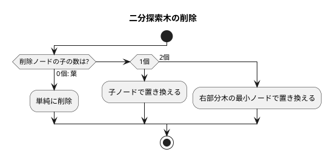

# 第 9 章 木構造

## はじめに

前章ではリストを学びました。この章では、データ構造の中でも特に重要な「**木構造**」、特に**二分探索木（BST: Binary Search Tree）**と**最小ヒープ（MinHeap）**を TDD で実装します。

木構造はノードが親子関係で繋がった非線形データ構造です。二分探索木は左の子 < 親 < 右の子という性質を持ち、効率的な探索・挿入・削除を実現します。

Rust では `Box<T>` による単一所有と `Option<T>` による NULL 安全性を活かして、メモリ安全な木構造を実装できます。最小ヒープは `Vec<T>` を使った配列ベースの実装で、所有権の問題が発生しません。

### 目次

1. [木構造とは](#木構造とは)
2. [二分探索木の性質](#二分探索木の性質)
3. [二分探索木の実装](#二分探索木の実装)
4. [ノードの削除](#ノードの削除)
5. [木の走査](#木の走査)
6. [最小ヒープ](#最小ヒープ)

---

## 木構造とは

木構造とは、データを階層的に表現するデータ構造です。木構造は、以下の要素から構成されます：

- **ノード**：データを格納する要素
- **エッジ**：ノード間の関係を表す線
- **ルート**：木の最上位に位置するノード
- **親ノード**：あるノードの上位に位置するノード
- **子ノード**：あるノードの下位に位置するノード
- **葉ノード**：子ノードを持たないノード

木構造は、以下のような特徴を持ちます：

1. 一つのルートノードから始まる
2. 各ノードは 0 個以上の子ノードを持つ
3. 循環構造を持たない（サイクルがない）

### 順序木の探索

順序木を探索する方法には、主に以下の 3 つがあります：

1. **前順（preorder）探索**：ノード自身 → 左部分木 → 右部分木の順に探索
2. **中順（inorder）探索**：左部分木 → ノード自身 → 右部分木の順に探索
3. **後順（postorder）探索**：左部分木 → 右部分木 → ノード自身の順に探索

---

## 二分探索木の性質



**性質**:
- 左部分木のすべてのキー < ルートのキー
- 右部分木のすべてのキー > ルートのキー
- 中順探索（left → root → right）は昇順になる

### Rust での所有権設計

| データ構造 | 所有権戦略 | 理由 |
|-----------|-----------|------|
| BST | `Box<TreeNode<T>>` + `Option` | 単一所有、再帰的ドロップ |
| MinHeap | `Vec<T>` | 配列ベース、所有権問題なし |

```rust
type TreeLink<T> = Option<Box<TreeNode<T>>>;

struct TreeNode<T> {
    data: T,
    left: TreeLink<T>,
    right: TreeLink<T>,
}

pub struct BinarySearchTree<T> {
    root: TreeLink<T>,
    len: usize,
}
```

`TreeLink<T>` は `Option<Box<TreeNode<T>>>` の型エイリアスです。`Option` が NULL を表現し、`Box` がヒープ上のノードへの単一所有ポインタを提供します。

---

## 二分探索木の実装

### Red -- 失敗するテストを書く

```rust
#[test]
fn test_initial_empty() {
    let bst: BinarySearchTree<i32> = BinarySearchTree::new();
    assert!(bst.is_empty());
    assert_eq!(bst.len(), 0);
}

#[test]
fn test_insert_and_search() {
    let mut bst = BinarySearchTree::new();
    bst.insert(5);
    assert!(bst.search(&5));
    assert!(!bst.is_empty());
}

#[test]
fn test_search_not_found() {
    let bst: BinarySearchTree<i32> = BinarySearchTree::new();
    assert!(!bst.search(&99));
}

#[test]
fn test_insert_multiple() {
    let mut bst = BinarySearchTree::new();
    for v in [5, 3, 7, 1, 4, 6, 8] {
        bst.insert(v);
    }
    for v in [5, 3, 7, 1, 4, 6, 8] {
        assert!(bst.search(&v));
    }
    assert_eq!(bst.len(), 7);
}

#[test]
fn test_insert_duplicate() {
    let mut bst = BinarySearchTree::new();
    bst.insert(5);
    bst.insert(5);
    assert_eq!(bst.len(), 1);
}
```

### Green -- テストを通す実装

```rust
impl<T: Ord + Clone + std::fmt::Debug> BinarySearchTree<T> {
    pub fn new() -> Self {
        BinarySearchTree { root: None, len: 0 }
    }

    pub fn is_empty(&self) -> bool {
        self.root.is_none()
    }

    pub fn len(&self) -> usize {
        self.len
    }

    pub fn insert(&mut self, data: T) {
        if Self::insert_recursive(&mut self.root, data) {
            self.len += 1;
        }
    }

    fn insert_recursive(link: &mut TreeLink<T>, data: T) -> bool {
        match link {
            None => {
                *link = Some(Box::new(TreeNode {
                    data,
                    left: None,
                    right: None,
                }));
                true
            }
            Some(node) => {
                if data == node.data {
                    false // 重複は無視
                } else if data < node.data {
                    Self::insert_recursive(&mut node.left, data)
                } else {
                    Self::insert_recursive(&mut node.right, data)
                }
            }
        }
    }

    pub fn search(&self, data: &T) -> bool {
        let mut current = &self.root;
        while let Some(node) = current {
            if *data == node.data {
                return true;
            } else if *data < node.data {
                current = &node.left;
            } else {
                current = &node.right;
            }
        }
        false
    }
}
```

`insert` は再帰で実装し、`&mut TreeLink<T>` を受け取ることで、Rust の所有権システムの中で自然にノードを挿入できます。`search` は非再帰ループで実装し、参照のみを使うため借用チェッカーとの衝突がありません。

---

## ノードの削除

削除は 3 つのケースに分かれます：



### Red -- 失敗するテストを書く

```rust
#[test]
fn test_delete_leaf() {
    let mut bst = BinarySearchTree::new();
    for v in [5, 3, 7] {
        bst.insert(v);
    }
    assert!(bst.remove(&3));
    assert!(!bst.search(&3));
    assert!(bst.search(&5));
    assert!(bst.search(&7));
}

#[test]
fn test_delete_node_with_two_children() {
    let mut bst = BinarySearchTree::new();
    for v in [5, 3, 7, 1, 4] {
        bst.insert(v);
    }
    assert!(bst.remove(&3));
    assert!(!bst.search(&3));
    for v in [1, 4, 5, 7] {
        assert!(bst.search(&v));
    }
}

#[test]
fn test_delete_root() {
    let mut bst = BinarySearchTree::new();
    for v in [5, 3, 7] {
        bst.insert(v);
    }
    assert!(bst.remove(&5));
    assert!(!bst.search(&5));
    assert_eq!(bst.inorder(), vec![3, 7]);
}
```

### Green -- テストを通す実装

```rust
pub fn remove(&mut self, data: &T) -> bool {
    if Self::remove_recursive(&mut self.root, data) {
        self.len -= 1;
        true
    } else {
        false
    }
}

fn remove_recursive(link: &mut TreeLink<T>, data: &T) -> bool {
    if link.is_none() {
        return false;
    }

    let node_data = link.as_ref().unwrap().data.clone();

    if *data < node_data {
        Self::remove_recursive(&mut link.as_mut().unwrap().left, data)
    } else if *data > node_data {
        Self::remove_recursive(&mut link.as_mut().unwrap().right, data)
    } else {
        // 見つかった: 削除処理
        let node = link.as_mut().unwrap();
        if node.left.is_none() {
            *link = link.take().unwrap().right;
        } else if node.right.is_none() {
            *link = link.take().unwrap().left;
        } else {
            // 子が 2 つ: 右部分木の最小値（中順後継）で置き換え
            let successor_data = Self::find_min(&node.right).unwrap().clone();
            link.as_mut().unwrap().data = successor_data.clone();
            Self::remove_recursive(&mut link.as_mut().unwrap().right, &successor_data);
        }
        true
    }
}
```

削除で注目すべきは `link.take()` です。これは `Option` から値を取り出して `None` に置き換える操作で、Rust の所有権ルールに従いながらノードの付け替えを安全に行えます。

---

## 木の走査

| 走査方法 | 順序 | 用途 |
|---------|------|------|
| 前順（preorder） | 根 → 左 → 右 | ツリーのコピー |
| 中順（inorder） | 左 → 根 → 右 | ソート済みリスト取得 |
| 後順（postorder） | 左 → 右 → 根 | ツリーの削除 |

### Red -- 失敗するテストを書く

```rust
#[test]
fn test_inorder_traversal() {
    let mut bst = BinarySearchTree::new();
    for v in [5, 3, 7, 1, 4, 6, 8] {
        bst.insert(v);
    }
    assert_eq!(bst.inorder(), vec![1, 3, 4, 5, 6, 7, 8]);
}

#[test]
fn test_preorder_traversal() {
    let mut bst = BinarySearchTree::new();
    for v in [5, 3, 7] {
        bst.insert(v);
    }
    assert_eq!(bst.preorder(), vec![5, 3, 7]);
}

#[test]
fn test_postorder_traversal() {
    let mut bst = BinarySearchTree::new();
    for v in [5, 3, 7] {
        bst.insert(v);
    }
    assert_eq!(bst.postorder(), vec![3, 7, 5]);
}
```

### Green -- テストを通す実装

```rust
pub fn inorder(&self) -> Vec<T> {
    let mut result = Vec::new();
    Self::inorder_recursive(&self.root, &mut result);
    result
}

fn inorder_recursive(link: &TreeLink<T>, result: &mut Vec<T>) {
    if let Some(node) = link {
        Self::inorder_recursive(&node.left, result);
        result.push(node.data.clone());
        Self::inorder_recursive(&node.right, result);
    }
}

pub fn preorder(&self) -> Vec<T> {
    let mut result = Vec::new();
    Self::preorder_recursive(&self.root, &mut result);
    result
}

fn preorder_recursive(link: &TreeLink<T>, result: &mut Vec<T>) {
    if let Some(node) = link {
        result.push(node.data.clone());
        Self::preorder_recursive(&node.left, result);
        Self::preorder_recursive(&node.right, result);
    }
}

pub fn postorder(&self) -> Vec<T> {
    let mut result = Vec::new();
    Self::postorder_recursive(&self.root, &mut result);
    result
}

fn postorder_recursive(link: &TreeLink<T>, result: &mut Vec<T>) {
    if let Some(node) = link {
        Self::postorder_recursive(&node.left, result);
        Self::postorder_recursive(&node.right, result);
        result.push(node.data.clone());
    }
}
```

走査は `if let Some(node) = link` パターンで `None` チェックと分岐を同時に行えます。`clone()` が必要なのは、ノード内のデータの所有権を走査結果の `Vec<T>` に移すためです。

### 最小キー・最大キーの取得

```rust
pub fn min(&self) -> Option<&T> {
    Self::find_min(&self.root)
}

fn find_min(link: &TreeLink<T>) -> Option<&T> {
    match link {
        None => None,
        Some(node) => {
            if node.left.is_none() {
                Some(&node.data)
            } else {
                Self::find_min(&node.left)
            }
        }
    }
}

pub fn max(&self) -> Option<&T> {
    let mut current = &self.root;
    let mut result = None;
    while let Some(node) = current {
        result = Some(&node.data);
        current = &node.right;
    }
    result
}
```

Python 版では空の木で例外を発生させますが、Rust 版では `Option<&T>` を返します。これは Rust の慣例に従った設計で、`None` がエラーを表現します。

---

## 最小ヒープ

ヒープは、完全二分木の一種で、以下の性質を持ちます：

1. 各ノードの値は、その子ノードの値以下である（最小ヒープ）
2. 木は可能な限り左から右へ、上から下へ詰めて構築される

完全二分木の性質を利用すると、配列のインデックスで親子関係を表現できます：

- インデックス `i` の左子: `2i + 1`
- インデックス `i` の右子: `2i + 2`
- インデックス `i` の親: `(i - 1) / 2`

### Red -- 失敗するテストを書く

```rust
#[test]
fn test_heap_push_and_pop() {
    let mut heap = MinHeap::new();
    heap.push(5);
    heap.push(3);
    heap.push(7);
    heap.push(1);
    assert_eq!(heap.pop(), Some(1));
    assert_eq!(heap.pop(), Some(3));
    assert_eq!(heap.pop(), Some(5));
    assert_eq!(heap.pop(), Some(7));
    assert_eq!(heap.pop(), None);
}

#[test]
fn test_heap_push_and_peek() {
    let mut heap = MinHeap::new();
    heap.push(5);
    assert_eq!(heap.peek(), Some(&5));
    heap.push(3);
    assert_eq!(heap.peek(), Some(&3));
}
```

### Green -- テストを通す実装

```rust
pub struct MinHeap<T> {
    data: Vec<T>,
}

impl<T: Ord + Clone> MinHeap<T> {
    pub fn new() -> Self {
        MinHeap { data: Vec::new() }
    }

    pub fn push(&mut self, item: T) {
        self.data.push(item);
        self.sift_up(self.data.len() - 1);
    }

    pub fn pop(&mut self) -> Option<T> {
        if self.data.is_empty() {
            return None;
        }
        let last = self.data.len() - 1;
        self.data.swap(0, last);
        let result = self.data.pop();
        if !self.data.is_empty() {
            self.sift_down(0);
        }
        result
    }

    pub fn peek(&self) -> Option<&T> {
        self.data.first()
    }

    pub fn len(&self) -> usize {
        self.data.len()
    }

    pub fn is_empty(&self) -> bool {
        self.data.is_empty()
    }

    fn sift_up(&mut self, mut idx: usize) {
        while idx > 0 {
            let parent = (idx - 1) / 2;
            if self.data[parent] <= self.data[idx] {
                break;
            }
            self.data.swap(parent, idx);
            idx = parent;
        }
    }

    fn sift_down(&mut self, mut idx: usize) {
        let len = self.data.len();
        loop {
            let left = 2 * idx + 1;
            let right = 2 * idx + 2;
            let mut smallest = idx;
            if left < len && self.data[left] < self.data[smallest] {
                smallest = left;
            }
            if right < len && self.data[right] < self.data[smallest] {
                smallest = right;
            }
            if smallest == idx {
                break;
            }
            self.data.swap(idx, smallest);
            idx = smallest;
        }
    }
}
```

`Vec<T>` を内部バッファとして使うため、`Box` や `Option` のような所有権の複雑さがありません。`swap` メソッドにより、要素の入れ替えも安全に行えます。

---

## テスト実行結果

```bash
$ cargo test -p chapter09

running 32 tests
test tests::bst_tests::test_contains ... ok
test tests::bst_tests::test_delete_leaf ... ok
test tests::bst_tests::test_delete_node_with_deep_successor ... ok
test tests::bst_tests::test_delete_node_with_one_child ... ok
test tests::bst_tests::test_delete_node_with_two_children ... ok
test tests::bst_tests::test_delete_not_found ... ok
test tests::bst_tests::test_delete_right_child_of_parent ... ok
test tests::bst_tests::test_delete_right_child_only ... ok
test tests::bst_tests::test_delete_root ... ok
test tests::bst_tests::test_delete_single_root ... ok
test tests::bst_tests::test_inorder_traversal ... ok
test tests::bst_tests::test_initial_empty ... ok
test tests::bst_tests::test_insert_and_search ... ok
test tests::bst_tests::test_insert_duplicate ... ok
test tests::bst_tests::test_insert_multiple ... ok
test tests::bst_tests::test_len_after_operations ... ok
test tests::bst_tests::test_max ... ok
test tests::bst_tests::test_max_empty ... ok
test tests::bst_tests::test_min ... ok
test tests::bst_tests::test_min_empty ... ok
test tests::bst_tests::test_postorder_traversal ... ok
test tests::bst_tests::test_preorder_traversal ... ok
test tests::bst_tests::test_search_not_found ... ok
test tests::heap_tests::test_heap_duplicates ... ok
test tests::heap_tests::test_heap_len ... ok
test tests::heap_tests::test_heap_new_is_empty ... ok
test tests::heap_tests::test_heap_pop_empty ... ok
test tests::heap_tests::test_heap_push_and_peek ... ok
test tests::heap_tests::test_heap_push_and_pop ... ok
test tests::heap_tests::test_heap_reverse_sorted_input ... ok
test tests::heap_tests::test_heap_single_element ... ok
test tests::heap_tests::test_heap_sorted_input ... ok

test result: ok. 32 passed; 0 failed; 0 ignored; 0 measured; 0 filtered out
```

---

## 計算量まとめ

| データ構造 | 操作 | 計算量 | Rust の特徴 |
|-----------|------|--------|------------|
| BST 探索 | `search` | O(h) | 非再帰ループ、参照のみ |
| BST 挿入 | `insert` | O(h) | 再帰、`&mut TreeLink<T>` |
| BST 走査 | `inorder` 等 | O(n) | 再帰 + `Vec<T>` |
| BST 削除 | `remove` | O(h) | `take()` で安全な付け替え |
| MinHeap push | `push` | O(log n) | `Vec::push` + sift_up |
| MinHeap pop | `pop` | O(log n) | `Vec::swap` + sift_down |

（h: 木の高さ、平均 O(log n)、最悪 O(n)）

バランス木（AVL 木、赤黒木）を使うと最悪でも O(log n) を保証できます。

---

## まとめ

この章では、木構造について学びました：

1. **二分探索木**: `Box<TreeNode<T>>` + `Option` で所有権を明確にした再帰的データ構造。`take()` による安全なノード付け替えが Rust ならではのポイントです。
2. **木の走査**: 前順・中順・後順の 3 種類を再帰で実装。`if let Some(node)` パターンが Rust らしい書き方です。
3. **最小ヒープ**: `Vec<T>` による配列ベース実装。所有権の複雑さがなく、`swap` で安全に要素を入れ替えます。

## 参考文献

- 『新・明解 Rust で学ぶアルゴリズムとデータ構造』 -- 柴田望洋
- 『テスト駆動開発』 -- Kent Beck
