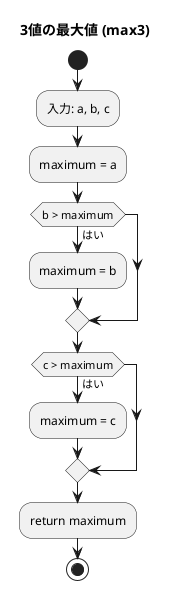
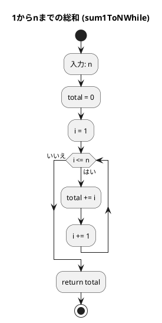
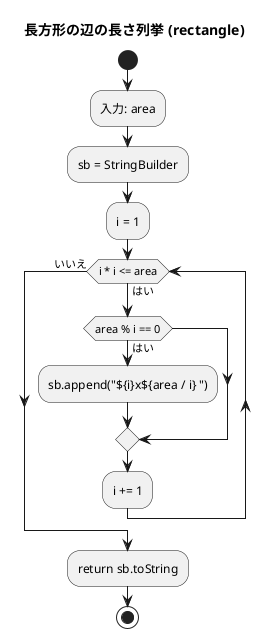

# 第 1 章 基本的なアルゴリズム

## はじめに

プログラミングを学ぶ上で、アルゴリズムの理解は非常に重要です。アルゴリズムとは、問題を解決するための手順や方法のことです。この章では、Scala を使って基本的なアルゴリズムを学びながら、テスト駆動開発（TDD）の手法を用いて実装していきます。

テスト駆動開発とは、コードを書く前にまずテストを書き、そのテストが通るようにコードを実装していく開発手法です。Red-Green-Refactor というサイクルを繰り返しながら、確実に動作するコードを段階的に作り上げます。

### 目次

1. [アルゴリズムとは](#1-アルゴリズムとは)
2. [3 値の最大値](#2-3-値の最大値)
3. [中央値](#3-中央値)
4. [条件判定](#4-条件判定)
5. [繰り返し処理](#5-繰り返し処理)
6. [記号の交互表示](#6-記号の交互表示)
7. [長方形の辺の長さ列挙](#7-長方形の辺の長さ列挙)
8. [多重ループ](#8-多重ループ)

## 準備

### 環境構築

```bash
# Nix 環境に入る（Scala + sbt が利用可能になる）
nix develop .#scala

# プロジェクトディレクトリへ移動
cd apps/scala

# テスト実行
sbt test
```

### プロジェクト構成

```
apps/scala/
├── build.sbt
├── project/build.properties
└── src/
    ├── main/scala/algorithm/
    │   └── BasicAlgorithms.scala
    └── test/scala/algorithm/
        └── BasicAlgorithmsTest.scala
```

---

## 1. アルゴリズムとは

アルゴリズムとは、問題を解決するための明確な手順のことです。良いアルゴリズムは以下の特徴を持ちます：

- 入力と出力が明確である
- 各ステップが明確である
- 有限のステップで終了する
- 効率的である

Scala では `object`（シングルトン）に `def` でアルゴリズムを定義します。

---

## 2. 3 値の最大値

3 つの整数値の中から最大値を求めるアルゴリズムを TDD で実装します。

### Red — 失敗するテストを書く

```scala
// BasicAlgorithmsTest.scala
test("max3: 各パターンで最大値を返す"):
  val cases = Seq(
    (3, 2, 1, 3), (3, 2, 2, 3), (3, 1, 2, 3),
    (2, 1, 3, 3), (1, 2, 3, 3),
  )
  for (a, b, c, expected) <- cases do
    BasicAlgorithms.max3(a, b, c) shouldBe expected
```

### Green — テストを通す実装

```scala
// BasicAlgorithms.scala
object BasicAlgorithms:
  def max3(a: Int, b: Int, c: Int): Int =
    var maximum = a
    if b > maximum then maximum = b
    if c > maximum then maximum = c
    maximum
```

### フローチャート



**計算量**: O(1)（固定回数の比較）

---

## 3. 中央値

3 つの整数値の中央値（中間値）を求めます。

### Red — 失敗するテストを書く

```scala
test("med3: 各パターンで中央値を返す"):
  val cases = Seq(
    (3, 2, 1, 2), (1, 2, 3, 2), (3, 3, 3, 3),
  )
  for (a, b, c, expected) <- cases do
    BasicAlgorithms.med3(a, b, c) shouldBe expected
```

### Green — テストを通す実装

```scala
def med3(a: Int, b: Int, c: Int): Int =
  if a >= b then
    if b >= c then b
    else if a <= c then a
    else c
  else if a > c then a
  else if b > c then c
  else b
```

Scala の `if/else` は式（値を返す）なので、`return` を省略できます。

**計算量**: O(1)

---

## 4. 条件判定

整数の符号（正・負・ゼロ）を判定します。

### Red — 失敗するテストを書く

```scala
test("judgeSign: 正の値"):
  BasicAlgorithms.judgeSign(17) shouldBe "その値は正です。"

test("judgeSign: 負の値"):
  BasicAlgorithms.judgeSign(-5) shouldBe "その値は負です。"

test("judgeSign: ゼロ"):
  BasicAlgorithms.judgeSign(0) shouldBe "その値は0です。"
```

### Green — テストを通す実装

```scala
def judgeSign(n: Int): String =
  if n > 0 then "その値は正です。"
  else if n < 0 then "その値は負です。"
  else "その値は0です。"
```

**計算量**: O(1)

---

## 5. 繰り返し処理

1 から n までの総和を 2 つの方法で実装し比較します。

### Red — 失敗するテストを書く

```scala
test("sum1ToNWhile: while 文で総和"):
  BasicAlgorithms.sum1ToNWhile(5) shouldBe 15

test("sum1ToNFor: for 式で総和"):
  BasicAlgorithms.sum1ToNFor(5) shouldBe 15
```

### Green — テストを通す実装（第1版：while 文）

```scala
def sum1ToNWhile(n: Int): Int =
  var total = 0
  var i = 1
  while i <= n do
    total += i
    i += 1
  total
```

### Green — テストを通す実装（第2版：for 式）

```scala
def sum1ToNFor(n: Int): Int =
  (1 to n).sum
```

### フローチャート



### 比較

| 方法 | コード | 特徴 |
|------|--------|------|
| while 文 | 変数を明示的に管理 | 手続き的スタイル |
| for 式 + sum | `(1 to n).sum` | Scala コレクション API |

`(1 to n)` は `Range` を返し、`.sum` で総和を計算します。Scala のコレクション API を使うと簡潔に記述できます。

**計算量**: 両方とも O(n)

---

## 6. 記号の交互表示

`+` と `-` を n 個交互に表示する処理を 2 つの方法で実装します。

### Red — 失敗するテストを書く

```scala
test("alternative1: 剰余判定方式で 12 文字"):
  BasicAlgorithms.alternative1(12) shouldBe "+-+-+-+-+-+-"

test("alternative: 奇数文字"):
  BasicAlgorithms.alternative1(5) shouldBe "+-+-+"
  BasicAlgorithms.alternative2(5) shouldBe "+-+-+"
```

### Green — テストを通す実装（第1版：剰余判定）

```scala
def alternative1(n: Int): String =
  (0 until n).map(i => if i % 2 != 0 then '-' else '+').mkString
```

### Green — テストを通す実装（第2版：パターン繰り返し）

```scala
def alternative2(n: Int): String =
  "+-" * (n / 2) + (if n % 2 != 0 then "+" else "")
```

### 比較

| 方法 | アプローチ | 特徴 |
|------|-----------|------|
| 第1版（alternative1） | インデックスの偶奇で判定 | 汎用的 |
| 第2版（alternative2） | 文字列を繰り返して構築 | Scala の文字列 `*` 演算子 |

Scala では文字列に `*` 演算子（`"+" * n`）を使って繰り返しができます。

**計算量**: O(n)

---

## 7. 長方形の辺の長さ列挙

面積が指定された整数の長方形のすべての辺の長さの組み合わせを列挙します。

### Red — 失敗するテストを書く

```scala
test("rectangle: 面積 32 の長方形"):
  BasicAlgorithms.rectangle(32) shouldBe "1x32 2x16 4x8 "
```

### Green — テストを通す実装

```scala
def rectangle(area: Int): String =
  val sb = StringBuilder()
  var i = 1
  while i * i <= area do
    if area % i == 0 then
      sb.append(s"${i}x${area / i} ")
    i += 1
  sb.toString
```

### フローチャート



`i * i <= area` という条件は、`i > √area` の時点でループを終了する最適化です。

**計算量**: O(√n)

---

## 8. 多重ループ

### 九九の表

```scala
// Red
test("multiplicationTable: 九九の表"):
  val expected =
    "---------------------------\n" +
    "  1  2  3  4  5  6  7  8  9\n" +
    // ...
    "---------------------------"
  BasicAlgorithms.multiplicationTable() shouldBe expected
```

```scala
// Green
def multiplicationTable(): String =
  val sb = StringBuilder()
  sb.append("-" * 27).append("\n")
  for i <- 1 to 9 do
    for j <- 1 to 9 do
      sb.append(f"${i * j}%3d")
    sb.append("\n")
  sb.append("-" * 27)
  sb.toString
```

Scala の `f"${expr}%3d"` は printf スタイルの文字列補間で、3 桁右詰めにフォーマットします。

### 直角三角形

```scala
// Red
test("triangleLb: 直角三角形"):
  BasicAlgorithms.triangleLb(5) shouldBe "*\n**\n***\n****\n*****\n"
```

```scala
// Green
def triangleLb(n: Int): String =
  (1 to n).map(i => "*" * i).mkString("\n") + "\n"
```

`(1 to n).map(i => "*" * i)` は各行の `*` の数を生成し、`mkString("\n")` で改行で結合します。

**計算量**: O(n²)

---

## テスト実行結果

```
$ cd apps/scala && sbt test

[info] BasicAlgorithmsTest:
[info] - max3: 各パターンで最大値を返す
[info] - med3: 各パターンで中央値を返す
[info] - judgeSign: 正の値
[info] - judgeSign: 負の値
[info] - judgeSign: ゼロ
[info] - sum1ToNWhile: while 文で総和
[info] - sum1ToNFor: for 式で総和
[info] - alternative1: 剰余判定方式で 12 文字
[info] - alternative2: パターン繰り返し方式で 12 文字
[info] - alternative: 奇数文字
[info] - rectangle: 面積 32 の長方形
[info] - multiplicationTable: 九九の表
[info] - triangleLb: 直角三角形
[info] Tests: succeeded 13, failed 0
```

## まとめ

| アルゴリズム | 計算量 | 特徴 |
|-------------|--------|------|
| max3 | O(1) | 固定回数の比較 |
| med3 | O(1) | 多岐分岐（if/else 式） |
| judgeSign | O(1) | 3 択の条件判定 |
| sum1ToNWhile | O(n) | while ループ |
| sum1ToNFor | O(n) | `(1 to n).sum`（コレクション API） |
| alternative | O(n) | 文字列操作（`*` 演算子） |
| rectangle | O(√n) | 短辺の探索（ループ最適化） |
| multiplicationTable | O(n²) | 二重ループ |
| triangleLb | O(n²) | コレクション API で多重ループを抽象化 |

Python 版と比較した Scala の特徴：
- `if/else` は式（値を返す）なので `return` を省略できる
- `(1 to n)` で Range を生成し、コレクション API（`.sum`, `.map`, `.mkString`）で処理
- 文字列補間: `s"${expr}"` と `f"${expr}%3d"`（フォーマット付き）
- 文字列繰り返し: `"*" * n`
- `StringBuilder` を使った可変な文字列構築

## 参考文献

- 『新・明解アルゴリズムとデータ構造』 — 柴田望洋
- 『テスト駆動開発』 — Kent Beck
