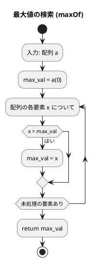
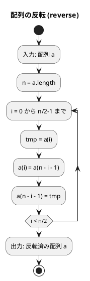
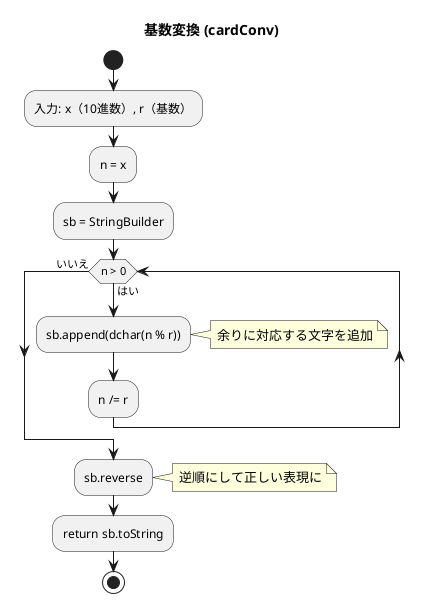

# 第 2 章 配列

## はじめに

前章では基本的なアルゴリズムを学びました。この章では、データを格納する最も基本的なデータ構造である「配列」を使ったアルゴリズムを Scala の TDD で実装します。

Scala では `Array[T]` が Java の配列に相当し、`.max`、`.sum` 等のコレクションメソッドが使えます。

### 目次

1. [配列とは](#配列とは)
2. [最大値の検索](#1-最大値の検索)
3. [配列の反転](#2-配列の反転)
4. [基数変換](#3-基数変換)
5. [素数列挙（3 バージョン）](#4-素数列挙3-バージョン)

---

## 配列とは

配列は同じ型の要素を連続したメモリ領域に格納するデータ構造です。インデックスで O(1) アクセスが可能です。

| 操作 | 計算量 | 説明 |
|------|--------|------|
| アクセス | O(1) | インデックスで直接参照 |
| 探索 | O(n) | 線形探索が必要 |
| 挿入（末尾） | O(1) | 末尾に追加 |
| 挿入（中間） | O(n) | 後続要素をシフト |
| 削除 | O(n) | 後続要素をシフト |

Scala の配列の基本操作：

```scala
val a = Array(3, 1, 4, 1, 5, 9, 2, 6)  // 配列の作成
val n = a.length   // 長さ: 8
a(0)               // 先頭要素: 3（インデックスアクセス）
a(n - 1)           // 末尾要素: 6
a.max              // 最大値: 9
a.min              // 最小値: 1
a.sum              // 合計: 31
a.sorted           // ソートされた新しい配列
a.reverse          // 逆順の新しい配列
```

---

## 1. 最大値の検索

配列の中から最大値を見つけるアルゴリズムです。

### Red — 失敗するテストを書く

```scala
// ArraysTest.scala
test("maxOf: 配列の最大値"):
  Arrays.maxOf(Array(3, 1, 4, 1, 5, 9, 2, 6)) shouldBe 9
```

### Green — テストを通す実装

```scala
// Arrays.scala
def maxOf(a: Array[Int]): Int = a.max
```

Scala では `Array.max` でコレクション全体の最大値を O(n) で取得できます。

### フローチャート



**計算量**: O(n)

---

## 2. 配列の反転

配列の要素の並びを逆順にします（in-place）。

### Red — 失敗するテストを書く

```scala
test("reverse: 配列を反転する"):
  val a = Array(1, 2, 3, 4, 5)
  Arrays.reverse(a)
  a shouldBe Array(5, 4, 3, 2, 1)

test("reverse: 偶数長の配列"):
  val a = Array(1, 2, 3, 4)
  Arrays.reverse(a)
  a shouldBe Array(4, 3, 2, 1)
```

### Green — テストを通す実装

```scala
def reverse(a: Array[Int]): Unit =
  val n = a.length
  for i <- 0 until n / 2 do
    val tmp = a(i)
    a(i) = a(n - i - 1)
    a(n - i - 1) = tmp
```

### フローチャート



インデックス 0 と n-1 のペアを順に交換します。n/2 回の交換で完了します。

**計算量**: O(n)

---

## 3. 基数変換

整数値を任意の基数（2進数、8進数、16進数など）に変換します。

### Red — 失敗するテストを書く

```scala
test("cardConv: 10進数を2進数に変換"):
  Arrays.cardConv(29, 2) shouldBe "11101"

test("cardConv: 10進数を16進数に変換"):
  Arrays.cardConv(255, 16) shouldBe "FF"

test("cardConv: 10進数を8進数に変換"):
  Arrays.cardConv(100, 8) shouldBe "144"
```

### Green — テストを通す実装

```scala
def cardConv(x: Int, r: Int): String =
  val dchar = "0123456789ABCDEFGHIJKLMNOPQRSTUVWXYZ"
  var n = x
  val sb = StringBuilder()
  while n > 0 do
    sb.append(dchar(n % r))
    n /= r
  sb.reverse.toString
```

### フローチャート



例：29 を 2 進数に変換
1. 29 % 2 = 1 → '1', 29 / 2 = 14
2. 14 % 2 = 0 → '0', 14 / 2 = 7
3. 7 % 2 = 1 → '1', 7 / 2 = 3
4. 3 % 2 = 1 → '1', 3 / 2 = 1
5. 1 % 2 = 1 → '1', 1 / 2 = 0
6. 結果: "10111" → 逆順 → "11101" ✓

`StringBuilder.reverse` で逆順にして正しい表現を得ます。

**計算量**: O(log_r(x))

---

## 4. 素数列挙（3 バージョン）

1000 以下の素数を列挙するアルゴリズムを、効率を改善しながら 3 バージョン実装します。

除算の回数で効率を比較します。

### 第1版：全数試し割り

### Red — 失敗するテストを書く

```scala
test("prime1: 素数列挙（第1版）の除算回数"):
  Arrays.prime1(1000) shouldBe 78022
```

### Green — テストを通す実装

```scala
def prime1(x: Int): Int =
  var counter = 0
  for n <- 2 to x do
    var i = 2
    var running = true
    while i < n && running do
      counter += 1
      if n % i == 0 then running = false
      i += 1
  counter
```

2 から x まで全ての n について、2 から n-1 まで割り切れるか試します。

---

### 第2版：既知の素数のみで割る

### Red — 失敗するテストを書く

```scala
test("prime2: 素数列挙（第2版）の除算回数"):
  Arrays.prime2(1000) shouldBe 14622
```

### Green — テストを通す実装

```scala
def prime2(x: Int): Int =
  var counter = 0
  val prime = new Array[Int](500)
  var ptr = 0
  prime(ptr) = 2; ptr += 1
  var n = 3
  while n <= x do
    var i = 1
    var found = false
    var running = true
    while i < ptr && running do
      counter += 1
      if n % prime(i) == 0 then
        found = true; running = false
      i += 1
    if !found then
      prime(ptr) = n; ptr += 1
    n += 2
  counter
```

**改善点**：
- 2 の倍数（偶数）を除外（n を 2 ずつ増やす）
- 既に見つかった素数のみで割る（合成数で割らない）

---

### 第3版：√n までの素数で割る

### Red — 失敗するテストを書く

```scala
test("prime3: 素数列挙（第3版）の除算回数"):
  Arrays.prime3(1000) shouldBe 3774

test("prime 各版の効率比較: prime3 が最も少ない除算回数"):
  Arrays.prime3(1000) < Arrays.prime2(1000) shouldBe true
  Arrays.prime2(1000) < Arrays.prime1(1000) shouldBe true
```

### Green — テストを通す実装

```scala
def prime3(x: Int): Int =
  var counter = 0
  val prime = new Array[Int](500)
  var ptr = 0
  prime(ptr) = 2; ptr += 1
  prime(ptr) = 3; ptr += 1
  var n = 5
  while n <= 1000 do
    var isPrime = true
    var i = 1
    var innerRunning = true
    while innerRunning && prime(i) * prime(i) <= n do
      counter += 2
      if n % prime(i) == 0 then
        isPrime = false; innerRunning = false
      else i += 1
    if isPrime then
      prime(ptr) = n; ptr += 1
      counter += 1
    n += 2
  counter
```

**改善点**：
- `prime(i) * prime(i) <= n` の条件で√n より大きい素数での試し割りを省略

---

### 効率比較

| バージョン | アルゴリズム | 除算回数（1000以下） |
|-----------|------------|------------------|
| 第1版 | 全数試し割り | 78,022 |
| 第2版 | 既知素数のみで割る | 14,622 |
| 第3版 | √n までの素数で割る | 3,774 |

第3版は第1版の約 21 分の 1 の計算量です。

---

## テスト実行結果

```
$ cd apps/scala && sbt test

[info] ArraysTest:
[info] - maxOf: 配列の最大値
[info] - reverse: 配列を反転する
[info] - reverse: 偶数長の配列
[info] - cardConv: 10進数を2進数に変換
[info] - cardConv: 10進数を16進数に変換
[info] - cardConv: 10進数を8進数に変換
[info] - prime1: 素数列挙（第1版）の除算回数
[info] - prime2: 素数列挙（第2版）の除算回数
[info] - prime3: 素数列挙（第3版）の除算回数
[info] - prime 各版の効率比較: prime3 が最も少ない除算回数
[info] Tests: succeeded 10, failed 0
```

---

## まとめ

| アルゴリズム | 計算量 | Scala の特徴 |
|-------------|--------|-------------|
| maxOf | O(n) | `.max` で簡潔 |
| reverse | O(n) | in-place（対称交換） |
| cardConv | O(log_r(x)) | `StringBuilder.reverse` |
| prime1 | O(n²) | 全数試し割り（78,022 回） |
| prime2 | O(n √n) | 既知素数のみ（14,622 回） |
| prime3 | O(n √n) | √n 最適化（3,774 回） |

Python 版と比較した Scala の特徴：
- `Array[T]` に `.max`, `.sum`, `.sorted` 等のコレクションメソッドが使える
- `StringBuilder` でミュータブルな文字列構築
- Scala には Python のスライス記法はないが、`.slice(from, to)` メソッドが使える
- Scala の配列は Java の配列に相当し、固定長・可変要素

## 参考文献

- 『新・明解アルゴリズムとデータ構造』 — 柴田望洋
- 『テスト駆動開発』 — Kent Beck
