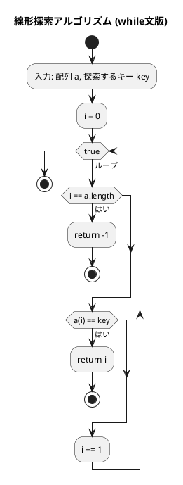
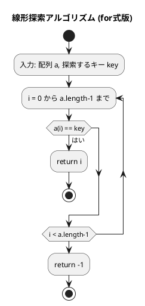
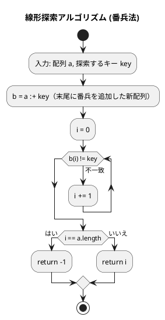
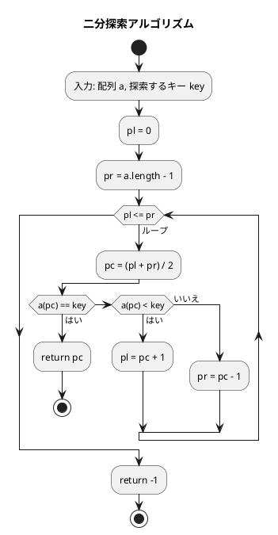

# 第 3 章 探索アルゴリズム

## はじめに

前章では配列とデータ構造について学びました。この章では、データの中から特定の値を見つけ出す「探索アルゴリズム」について TDD で実装します。Scala の `Option[T]` を活用して NULL 安全な検索結果を表現します。

主に以下の 3 つの方法を TDD で実装します：

1. 線形探索（シーケンシャルサーチ）
2. 二分探索（バイナリサーチ）
3. ハッシュ法

---

## 探索アルゴリズムとは

探索アルゴリズムとは、データの集合から特定の条件を満たす要素を見つけ出すための手順です。探索の対象となるデータは「キー」と呼ばれ、探索の結果は通常、キーが見つかった位置（インデックス）または見つからなかったことを示す特別な値（多くの場合は -1）となります。

探索アルゴリズムの性能は、主に以下の要素によって評価されます：

- 時間効率（計算量）：探索にかかる時間
- 空間効率：使用するメモリ量
- 前提条件：データが整列されている必要があるかなど

| 探索法 | 平均計算量 | 最悪計算量 | 前提条件 |
|--------|-----------|-----------|---------|
| 線形探索 | O(n) | O(n) | なし |
| 二分探索 | O(log n) | O(log n) | ソート済み |
| ハッシュ法 | O(1) | O(n) | ハッシュ関数 |

---

## 1. 線形探索

配列の先頭から順に各要素を調べ、目的のキーと一致する要素を探します。

### Red — 失敗するテストを書く

```scala
// src/test/scala/algorithm/SearchAlgorithmsTest.scala
class SearchAlgorithmsTest extends AnyFunSuite with Matchers:

  val arr = Array(1, 3, 5, 7, 9, 11, 13, 15)

  test("linearSearchWhile: キーが見つかる"):
    SearchAlgorithms.linearSearchWhile(arr, 7) shouldBe 3

  test("linearSearchWhile: キーが見つからない"):
    SearchAlgorithms.linearSearchWhile(arr, 6) shouldBe -1

  test("linearSearchFor: キーが見つかる"):
    SearchAlgorithms.linearSearchFor(arr, 5) shouldBe 2

  test("linearSearchFor: キーが見つからない"):
    SearchAlgorithms.linearSearchFor(arr, 2) shouldBe -1
```

### Green — テストを通す実装

```scala
// src/main/scala/algorithm/SearchAlgorithms.scala
object SearchAlgorithms:

  /** 線形探索（while 文） */
  def linearSearchWhile(a: Array[Int], key: Int): Int =
    var i = 0
    while true do
      if i == a.length then return -1
      if a(i) == key then return i
      i += 1
    -1

  /** 線形探索（for 式） */
  def linearSearchFor(a: Array[Int], key: Int): Int =
    for i <- a.indices do
      if a(i) == key then return i
    -1
```

### アルゴリズムの考え方

線形探索は、配列が整列されているかどうかに関わらず使用できる汎用的なアルゴリズムです。

計算量：

- 最良の場合：O(1)（最初の要素がキーと一致する場合）
- 最悪の場合：O(n)（キーが見つからないか、最後の要素である場合）
- 平均の場合：O(n/2) = O(n)

#### while 文による線形探索のフローチャート



アルゴリズムの流れ：

1. 配列 `a` と探索するキー `key` を入力として受け取ります
2. 変数 `i` を 0 で初期化します（現在の検索位置）
3. 無限ループ内で以下の処理を繰り返します：
   - `i` が `a.length` に達した場合、-1 を返して終了します（探索失敗）
   - `a(i)` が `key` と一致する場合、`i` を返して終了します（探索成功）
   - `i` を 1 増やします（次の要素へ）

#### for 式による線形探索のフローチャート



**計算量**: 最悪 O(n)、平均 O(n/2)

### 番兵法

末尾にキーを追加（番兵）することで、ループ内の終了判定を省略します。

```scala
// Red
test("linearSearchSentinel: キーが見つかる"):
  SearchAlgorithms.linearSearchSentinel(arr, 9) shouldBe 4

test("linearSearchSentinel: キーが見つからない"):
  SearchAlgorithms.linearSearchSentinel(arr, 4) shouldBe -1

// Green
def linearSearchSentinel(a: Array[Int], key: Int): Int =
  val b = a :+ key  // 末尾に番兵を追加
  var i = 0
  while b(i) != key do i += 1
  if i == a.length then -1 else i
```

Scala では `:+` 演算子で配列末尾に要素を追加した新しい配列を作成できます。

### 番兵法の解説



番兵法の利点：ループ内での終了判定（`i == a.length`）を省略できるため、わずかながら効率が向上します。番兵に到達した場合でも `b(i) == key` の条件は真になるため、ループから抜けることができます。

---

## 2. 二分探索

**前提**: 配列が整列されていること。

中央の要素とキーを比較し、探索範囲を半分に絞り込むことを繰り返します。

### Red — 失敗するテストを書く

```scala
test("binarySearch: キーが見つかる"):
  SearchAlgorithms.binarySearch(arr, 11) shouldBe 5

test("binarySearch: キーが見つからない"):
  SearchAlgorithms.binarySearch(arr, 10) shouldBe -1

test("binarySearch: 先頭要素"):
  SearchAlgorithms.binarySearch(arr, 1) shouldBe 0

test("binarySearch: 末尾要素"):
  SearchAlgorithms.binarySearch(arr, 15) shouldBe 7
```

### Green — テストを通す実装

```scala
def binarySearch(a: Array[Int], key: Int): Int =
  var pl = 0
  var pr = a.length - 1
  while pl <= pr do
    val pc = (pl + pr) / 2
    if a(pc) == key then return pc
    else if a(pc) < key then pl = pc + 1
    else pr = pc - 1
  -1
```

### アルゴリズムの考え方



**計算量**: O(log n)

### 解説

二分探索は、線形探索よりも効率的ですが、配列が整列されていることが前提条件となります。

二分探索の計算量：

- 最良の場合：O(1)（最初の中央要素がキーと一致する場合）
- 最悪の場合：O(log n)
- 平均の場合：O(log n)

例えば、1,000,000 要素の配列では、線形探索は最悪の場合 1,000,000 回の比較が必要ですが、二分探索では約 20 回（log₂ 1,000,000 ≈ 20）の比較で済みます。

| 要素数 | 線形探索（最悪） | 二分探索（最悪） |
|--------|--------------|--------------|
| 100 | 100 回 | 7 回 |
| 1,000 | 1,000 回 | 10 回 |
| 1,000,000 | 1,000,000 回 | 20 回 |

---

## 3. ハッシュ法

キーからハッシュ関数でアドレスを求め、直接要素にアクセスします。理想的な場合 O(1) で探索できます。

衝突（異なるキーが同じハッシュ値を生成する）の解決方法として、「チェイン法」と「オープンアドレス法」を実装します。

### チェイン法

同じハッシュ値を持つ要素を連結リストで管理します。

#### Red — 失敗するテストを書く

```scala
test("ChainedHash: 追加と検索"):
  val h = SearchAlgorithms.ChainedHash(13)
  h.add(1, "one") shouldBe true
  h.add(14, "fourteen") shouldBe true  // 1%13=1, 14%13=1 → 衝突
  h.search(1) shouldBe Some("one")
  h.search(14) shouldBe Some("fourteen")
  h.search(999) shouldBe None

test("ChainedHash: 重複追加は失敗"):
  val h = SearchAlgorithms.ChainedHash(13)
  h.add(1, "one") shouldBe true
  h.add(1, "one-dup") shouldBe false

test("ChainedHash: 削除"):
  val h = SearchAlgorithms.ChainedHash(13)
  h.add(1, "one")
  h.remove(1) shouldBe true
  h.search(1) shouldBe None
  h.remove(1) shouldBe false
```

#### Green — テストを通す実装

```scala
class ChainedHash(capacity: Int):
  private case class Node(key: Int, value: String, var next: Node | Null = null)
  private val table = new Array[Node | Null](capacity)

  private def hashValue(key: Int): Int = key % capacity

  def search(key: Int): Option[String] =
    var p = table(hashValue(key))
    while p != null do
      if p.key == key then return Some(p.value)
      p = p.next
    None

  def add(key: Int, value: String): Boolean =
    val h = hashValue(key)
    var p = table(h)
    while p != null do
      if p.key == key then return false  // 重複は追加しない
      p = p.next
    table(h) = Node(key, value, table(h))
    true

  def remove(key: Int): Boolean =
    val h = hashValue(key)
    var p = table(h)
    var pp: Node | Null = null
    while p != null do
      if p.key == key then
        if pp == null then table(h) = p.next  // 先頭ノードを削除
        else pp.next = p.next                  // 後続ノードを削除
        return true
      pp = p
      p = p.next
    false
```

`Node | Null` は Scala 3 の Union Type による null 安全な参照です。

### オープンアドレス法

衝突時に空きスロットを探して要素を格納します。

#### Red — 失敗するテストを書く

```scala
test("OpenHash: 追加と検索"):
  val h = SearchAlgorithms.OpenHash(13)
  h.add(1, "one") shouldBe true
  h.search(1) shouldBe Some("one")
  h.search(999) shouldBe None

test("OpenHash: 重複追加は失敗"):
  val h = SearchAlgorithms.OpenHash(13)
  h.add(1, "one") shouldBe true
  h.add(1, "one-dup") shouldBe false

test("OpenHash: 削除"):
  val h = SearchAlgorithms.OpenHash(13)
  h.add(1, "one")
  h.remove(1) shouldBe true
  h.search(1) shouldBe None
  h.remove(1) shouldBe false
```

#### Green — テストを通す実装

```scala
class OpenHash(capacity: Int):
  private enum Status { case Occupied, Empty, Deleted }
  private case class Bucket(var key: Int = 0, var value: String = "",
                            var stat: Status = Status.Empty)

  private val table = Array.fill(capacity)(Bucket())

  private def hashValue(key: Int): Int = key % capacity

  def search(key: Int): Option[String] =
    var h = hashValue(key)
    for _ <- 0 until capacity do
      val p = table(h)
      if p.stat == Status.Empty then return None
      if p.stat == Status.Occupied && p.key == key then return Some(p.value)
      h = (h + 1) % capacity
    None

  def add(key: Int, value: String): Boolean =
    if search(key).isDefined then return false
    var h = hashValue(key)
    for _ <- 0 until capacity do
      val p = table(h)
      if p.stat == Status.Empty || p.stat == Status.Deleted then
        table(h) = Bucket(key, value, Status.Occupied)
        return true
      h = (h + 1) % capacity
    false

  def remove(key: Int): Boolean =
    var h = hashValue(key)
    for _ <- 0 until capacity do
      val p = table(h)
      if p.stat == Status.Empty then return false
      if p.stat == Status.Occupied && p.key == key then
        table(h) = Bucket(stat = Status.Deleted)
        return true
      h = (h + 1) % capacity
    false
```

`enum` は Scala 3 の sealed trait + case object の簡略記法です。バケットの状態は `Occupied`/`Empty`/`Deleted` の 3 種類で管理します。`Deleted` は削除済みを示し、探索をここで止めないためのマーカーです。

---

## テスト実行結果

```
Tests: succeeded 16, failed 0
```

---

## 探索アルゴリズムの比較

| アルゴリズム | 事前条件 | 計算量 | 適用場面 |
|-------------|---------|--------|---------|
| 線形探索 | なし | O(n) | 小規模・未整列データ |
| 二分探索 | 整列済み | O(log n) | 大規模・整列データ |
| ハッシュ法 | なし | O(1)平均 | 高速な挿入・削除・探索 |

| 探索法 | 平均計算量 | Scala の実装ポイント |
|--------|-----------|---------------------|
| 線形探索 | O(n) | `for` 内包表記 + `return` |
| 二分探索 | O(log n) | 配列がソート済みであること |
| チェイン法 | O(1) | Union Type `Node \| Null` |
| オープンアドレス法 | O(1) | `enum` でステータス管理 |

## まとめ

この章では、3 つの主要な探索アルゴリズムについて学びました：

1. **線形探索**：最も単純な探索方法で、配列の先頭から順に探索します。整列されていない配列でも使用できますが、効率は良くありません。番兵法を使うことでわずかに効率化できます。Scala では `for i <- a.indices` で簡潔に書けます。

2. **二分探索**：整列された配列に対して使用できる効率的な探索方法で、探索範囲を半分ずつ絞り込みます。O(log n) の計算量で高速な探索が可能です。

3. **ハッシュ法**：キーから直接アドレスを求める方法で、理想的な状況では定数時間 O(1) で探索できます。Scala 3 の Union Type `Node | Null` でノードを型安全に扱い、`enum` でバケット状態を管理します。

次の章では、スタックとキューについて学んでいきましょう。

## 参考文献

- 『新・明解アルゴリズムとデータ構造』 — 柴田望洋
- 『テスト駆動開発』 — Kent Beck
