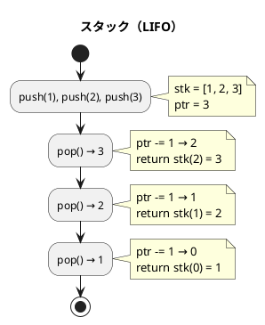
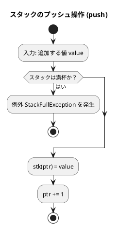
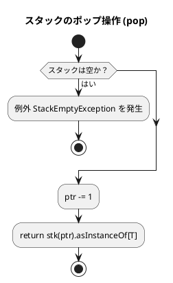
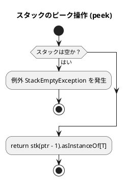
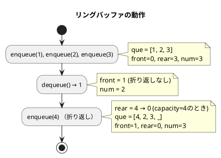
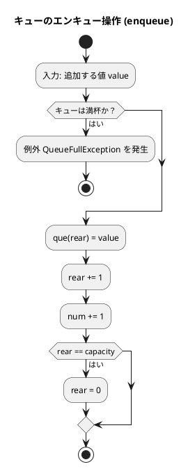
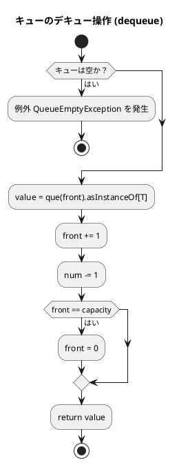
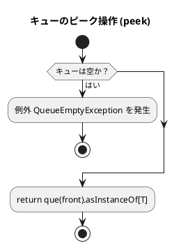

# 第 4 章 スタックとキュー

## はじめに

前章では探索アルゴリズムを学びました。この章では、データを特定の順序で格納・取り出すための基本的なデータ構造である「スタック」と「キュー」について TDD で実装します。型パラメータ `[T]` でジェネリクスを表現します。

スタックとキューは、多くのアルゴリズムやプログラムの基礎となる重要なデータ構造です。これらの構造は、データの追加と削除の方法が異なり、それぞれ特定の問題に対して効率的な解決策を提供します。

### 目次

1. [スタック](#1-固定長スタック)
2. [キュー](#2-固定長キューリングバッファ)
3. [スタックとキューの比較](#まとめ)

---

## スタックとキューとは

| 構造 | 特性 | 主な操作 | 計算量 |
|------|------|---------|--------|
| スタック | LIFO（後入れ先出し） | push/pop/peek | O(1) |
| キュー | FIFO（先入れ先出し） | enqueue/dequeue/peek | O(1) |

---

## 1. 固定長スタック

スタックは **LIFO（Last In First Out）** — 後から入れたものを最初に取り出す — データ構造です。

皿を積み重ねるのに似ています。新しい皿は常に一番上に置かれ（プッシュ）、皿を取るときも一番上から取ります（ポップ）。

スタックの主な操作は以下の通りです：

- **プッシュ（Push）**: スタックの一番上にデータを追加する
- **ポップ（Pop）**: スタックの一番上からデータを取り出す
- **ピーク（Peek）**: スタックの一番上のデータを参照する（取り出さない）

スタックは、関数呼び出し、式の評価、構文解析、バックトラッキングなど、多くのアルゴリズムで使用されます。

### Red — 失敗するテストを書く

```scala
// src/test/scala/algorithm/StacksAndQueuesTest.scala
class StacksAndQueuesTest extends AnyFunSuite with Matchers:

  test("FixedStack: 初期状態は空"):
    val s = FixedStack[Int](10)
    s.isEmpty shouldBe true
    s.size shouldBe 0

  test("FixedStack: push/pop"):
    val s = FixedStack[Int](10)
    s.push(1); s.push(2); s.push(3)
    s.pop() shouldBe 3  // LIFO
    s.pop() shouldBe 2
    s.pop() shouldBe 1

  test("FixedStack: peek はスタックを変えない"):
    val s = FixedStack[Int](10)
    s.push(42)
    s.peek() shouldBe 42
    s.size shouldBe 1
```

### Green — テストを通す実装

```scala
// src/main/scala/algorithm/StacksAndQueues.scala
class StackEmptyException extends RuntimeException("スタックは空です")
class StackFullException  extends RuntimeException("スタックは満杯です")

class FixedStack[T](capacity: Int):
  private val stk = new Array[Any](capacity)
  private var ptr = 0

  def isEmpty: Boolean = ptr <= 0
  def isFull:  Boolean = ptr >= capacity
  def size:    Int     = ptr

  def push(value: T): Unit =
    if isFull then throw StackFullException()
    stk(ptr) = value
    ptr += 1

  def pop(): T =
    if isEmpty then throw StackEmptyException()
    ptr -= 1
    stk(ptr).asInstanceOf[T]

  def peek(): T =
    if isEmpty then throw StackEmptyException()
    stk(ptr - 1).asInstanceOf[T]
```

`asInstanceOf[T]` は型キャストです。`Array[Any]` を使う理由は、Scala の型消去（type erasure）のためです。

### Refactor — 例外処理・find・dump の追加

```scala
// Red: 例外、find、count、dump のテスト
test("FixedStack: 空からの pop は例外"):
  val s = FixedStack[Int](5)
  assertThrows[StackEmptyException](s.pop())

test("FixedStack: 満杯への push は例外"):
  val s = FixedStack[Int](3)
  s.push(1); s.push(2); s.push(3)
  assertThrows[StackFullException](s.push(4))

test("FixedStack: find/contains/count"):
  val s = FixedStack[Int](10)
  s.push(1); s.push(2); s.push(1)
  s.contains(1) shouldBe true
  s.contains(9) shouldBe false
  s.count(1) shouldBe 2

test("FixedStack: clear"):
  val s = FixedStack[Int](10)
  s.push(1); s.push(2)
  s.clear()
  s.isEmpty shouldBe true

test("FixedStack: dump"):
  val s = FixedStack[Int](10)
  s.push(1); s.push(2); s.push(3)
  s.dump() shouldBe Array(1, 2, 3)

// Green: 拡張実装
class FixedStack[T](capacity: Int):
  // ... push/pop/peek は上記と同じ ...

  def find(value: T): Int =
    (ptr - 1 to 0 by -1).find(i => stk(i) == value).getOrElse(-1)

  def contains(value: T): Boolean = find(value) != -1

  def count(value: T): Int =
    (0 until ptr).count(i => stk(i) == value)

  def clear(): Unit = ptr = 0

  def dump(): Array[Any] = stk.take(ptr)
```

### Scala 標準ライブラリを使った実装

Python の `collections.deque` に相当する実装として、Scala では `scala.collection.mutable.ArrayDeque` を使うことができます：

```scala
import scala.collection.mutable

class Stack[T](maxLen: Int = 256):
  private val stk = mutable.ArrayDeque.empty[T]

  def isEmpty: Boolean = stk.isEmpty
  def isFull:  Boolean = stk.size >= maxLen
  def size:    Int     = stk.size

  def push(value: T): Unit = stk.addOne(value)
  def pop(): T             = stk.removeLast()
  def peek(): T            = stk.last

  def clear(): Unit           = stk.clear()
  def contains(value: T): Boolean = stk.contains(value)
  def count(value: T): Int    = stk.count(_ == value)
  def dump(): Seq[T]          = stk.toSeq
```

固定長スタックとの比較：

- **固定長スタック（`FixedStack`）**：シンプルで学習目的に最適。容量超過時に例外
- **`ArrayDeque` を使った実装**：Scala 標準ライブラリを活用、コードが簡潔

### アルゴリズムの考え方



**主な操作**:

| 操作 | メソッド | 計算量 | 説明 |
|------|---------|--------|------|
| プッシュ | `push(value)` | O(1) | 頂上に追加 |
| ポップ | `pop()` | O(1) | 頂上から取り出す |
| ピーク | `peek()` | O(1) | 頂上を参照（取り出さない） |
| 検索 | `find(value)` | O(n) | 値のインデックスを返す |
| カウント | `count(value)` | O(n) | 値の出現回数 |

### フローチャート

#### スタックのプッシュ操作



アルゴリズムの流れ：

1. 追加する値 `value` を入力として受け取ります
2. スタックが満杯かどうかをチェックします（`ptr >= capacity`）
3. 満杯の場合、例外 `StackFullException` を発生させて終了します
4. スタック配列の現在のポインタ位置に `value` を格納します
5. ポインタを 1 増やします

#### スタックのポップ操作



#### スタックのピーク操作



スタックの基本操作は非常にシンプルで効率的です。すべての操作が O(1) の時間複雑度で実行できます。

---

## 2. 固定長キュー（リングバッファ）

キューは **FIFO（First In First Out）** — 最初に入れたものを最初に取り出す — データ構造です。

銀行の行列をイメージすると分かりやすいです。新しい人は列の最後尾に並び（エンキュー）、サービスを受けるのは列の先頭の人からです（デキュー）。

キューの主な操作は以下の通りです：

- **エンキュー（Enqueue）**: キューの末尾にデータを追加する
- **デキュー（Dequeue）**: キューの先頭からデータを取り出す
- **ピーク（Peek）**: キューの先頭のデータを参照する（取り出さない）

キューは、幅優先探索、プリンタのスプーリング、プロセススケジューリングなど、多くのアルゴリズムやシステムで使用されます。

### 単純な配列によるキューの問題点

単純な配列を使ってキューを実装する場合、デキュー操作を行うたびに残りの要素をシフトする必要があり、効率が悪くなります（O(n) の時間複雑度）。そのため、実用的なキューの実装には、リングバッファを使用することが一般的です。

### リングバッファ

固定長配列でキューを実現する際、`front`（先頭インデックス）と `rear`（末尾インデックス）を管理することで、エンキュー・デキューを O(1) で実現できます。



### Red — 失敗するテストを書く

```scala
test("FixedQueue: 初期状態は空"):
  val q = FixedQueue[Int](10)
  q.isEmpty shouldBe true
  q.size shouldBe 0

test("FixedQueue: enqueue/dequeue（FIFO）"):
  val q = FixedQueue[Int](10)
  q.enqueue(1); q.enqueue(2); q.enqueue(3)
  q.dequeue() shouldBe 1  // FIFO
  q.dequeue() shouldBe 2
  q.dequeue() shouldBe 3

test("FixedQueue: リングバッファの動作確認"):
  val q = FixedQueue[Int](3)
  q.enqueue(1); q.enqueue(2); q.dequeue()
  q.enqueue(3); q.enqueue(4)
  q.dequeue() shouldBe 2
  q.dequeue() shouldBe 3
  q.dequeue() shouldBe 4
```

### Green — テストを通す実装

```scala
class QueueEmptyException extends RuntimeException("キューは空です")
class QueueFullException  extends RuntimeException("キューは満杯です")

class FixedQueue[T](capacity: Int):
  private val que   = new Array[Any](capacity)
  private var front = 0
  private var rear  = 0
  private var num   = 0

  def isEmpty: Boolean = num <= 0
  def isFull:  Boolean = num >= capacity
  def size:    Int     = num

  def enqueue(value: T): Unit =
    if isFull then throw QueueFullException()
    que(rear) = value
    rear += 1
    num  += 1
    if rear == capacity then rear = 0  // リングバッファの折り返し

  def dequeue(): T =
    if isEmpty then throw QueueEmptyException()
    val value = que(front).asInstanceOf[T]
    front += 1
    num   -= 1
    if front == capacity then front = 0  // リングバッファの折り返し
    value

  def peek(): T =
    if isEmpty then throw QueueEmptyException()
    que(front).asInstanceOf[T]
```

リングバッファは `% capacity` でインデックスを循環させます。

### Refactor — find・count・clear の追加

```scala
// Red
test("FixedQueue: 空からの dequeue は例外"):
  val q = FixedQueue[Int](5)
  assertThrows[QueueEmptyException](q.dequeue())

test("FixedQueue: 満杯への enqueue は例外"):
  val q = FixedQueue[Int](3)
  q.enqueue(1); q.enqueue(2); q.enqueue(3)
  assertThrows[QueueFullException](q.enqueue(4))

test("FixedQueue: find/contains/count"):
  val q = FixedQueue[Int](10)
  q.enqueue(1); q.enqueue(2); q.enqueue(1)
  q.contains(1) shouldBe true
  q.contains(9) shouldBe false
  q.count(1) shouldBe 2

test("FixedQueue: clear"):
  val q = FixedQueue[Int](10)
  q.enqueue(1); q.enqueue(2)
  q.clear()
  q.isEmpty shouldBe true

// Green
def find(value: T): Int =
  (0 until num).find(i => que((i + front) % capacity) == value).getOrElse(-1)

def contains(value: T): Boolean = find(value) != -1

def count(value: T): Int =
  (0 until num).count(i => que((i + front) % capacity) == value)

def clear(): Unit =
  front = 0; rear = 0; num = 0
```

### 解説

キューの実装には、主に以下の 2 つの方法があります：

1. **単純な配列を使った実装**：
   - 長所：シンプルで理解しやすい
   - 短所：デキュー操作が非効率（O(n) の時間複雑度）

2. **リングバッファを使った実装**：
   - 長所：すべての操作が効率的（O(1) の時間複雑度）
   - 短所：実装がやや複雑

### フローチャート

#### キューのエンキュー操作



アルゴリズムの流れ：

1. 追加する値 `value` を入力として受け取ります
2. キューが満杯かどうかをチェックします
3. キュー配列の `rear` 位置（末尾）に `value` を格納します
4. `rear` を 1 増やし、`num` を 1 増やします
5. `rear` が `capacity` に達した場合、`rear` を 0 にリセットします（リングバッファの折り返し）

#### キューのデキュー操作



アルゴリズムの流れ：

1. キューが空かどうかをチェックします
2. キュー配列の `front` 位置（先頭）の値を取得します
3. `front` を 1 増やし、`num` を 1 減らします
4. `front` が `capacity` に達した場合、`front` を 0 にリセットします
5. 取り出した値を返します

#### キューのピーク操作



リングバッファを使ったキューの実装は、すべての操作が O(1) の時間複雑度で実行できるため、効率的です。

---

## テスト実行結果

```
Tests: succeeded 17, failed 0
```

---

## まとめ

| 操作 | スタック | キュー |
|------|---------|-------|
| push/enqueue | O(1) | O(1) |
| pop/dequeue | O(1) | O(1) |
| peek | O(1) | O(1) |
| find | O(n) | O(n) |

| 項目 | スタック | キュー |
|------|---------|--------|
| 取り出し順序 | LIFO（後入れ先出し） | FIFO（先入れ先出し） |
| 追加操作 | `push()` | `enqueue()` |
| 取り出し操作 | `pop()` | `dequeue()` |
| 主な用途 | 関数呼び出し、DFS | タスクキュー、BFS |
| Scala の実装 | `Array[Any]` + 型キャスト | リングバッファ（front/rear） |

この章では、2 つの基本的なデータ構造を学びました：

1. **スタック**：後入れ先出し（LIFO）の原則に従うデータ構造。型パラメータ `[T]` でジェネリクスを表現し、`asInstanceOf[T]` で型キャストします。

2. **キュー**：先入れ先出し（FIFO）の原則に従うデータ構造。リングバッファにより全操作を O(1) で実現します。

次の章では、再帰アルゴリズムについて学んでいきましょう。

## 参考文献

- 『新・明解アルゴリズムとデータ構造』 — 柴田望洋
- 『テスト駆動開発』 — Kent Beck
