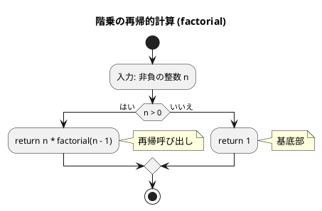
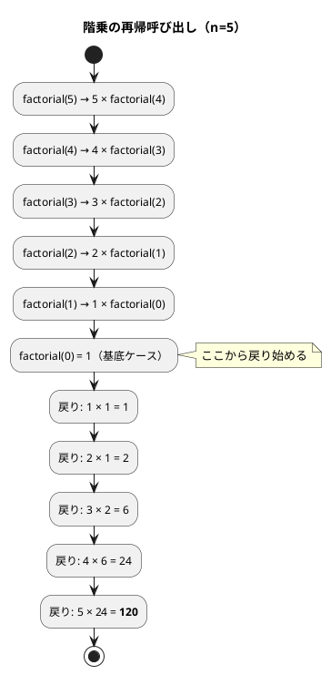
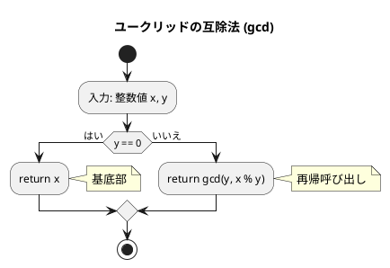
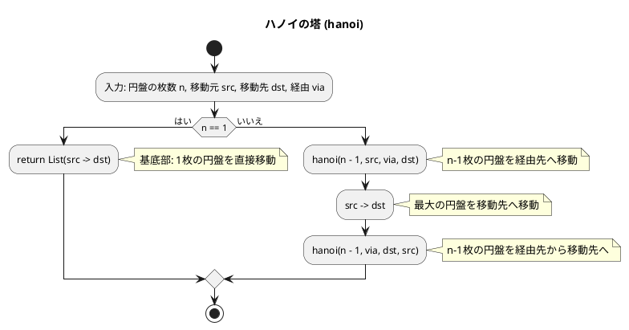
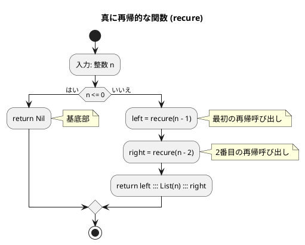

# 第 5 章 再帰アルゴリズム

## はじめに

前章ではスタックとキューというデータ構造を学びました。この章では「**再帰（Recursion）**」というアルゴリズム設計手法を Scala の TDD で実装します。

再帰とは、**ある関数が自分自身を呼び出す**ことで問題を解く手法です。大きな問題を同じ構造の小さな問題に分解し、最終的に自明な基底ケースに到達したら戻り始めます。

再帰アルゴリズムは、一般的に以下の 2 つの部分から構成されます：

1. **基底部（base case）**: 再帰呼び出しを終了する条件
2. **再帰部（recursive case）**: 問題を小さくして自分自身を呼び出す部分

### 目次

1. [階乗](#1-階乗)
2. [最大公約数（ユークリッドの互除法）](#2-最大公約数ユークリッドの互除法)
3. [ハノイの塔](#3-ハノイの塔)
4. [再帰アルゴリズムの解析](#4-再帰アルゴリズムの解析)
5. [8 王妃問題](#5-8-王妃問題)
6. [迷路探索（バックトラッキング）](#6-迷路探索バックトラッキング)

---

## 1. 階乗

`n! = n × (n-1) × ... × 1` を再帰で実装します。

### Red — 失敗するテストを書く

```scala
// RecursionTest.scala
test("factorial: 基本ケース"):
  Recursion.factorial(0) shouldBe 1
  Recursion.factorial(1) shouldBe 1

test("factorial: 通常ケース"):
  Recursion.factorial(5) shouldBe 120
```

### Green — テストを通す実装

```scala
// Recursion.scala
def factorial(n: Int): Int =
  if n <= 0 then 1 else n * factorial(n - 1)
```

### フローチャート



#### 再帰呼び出しの展開（n=5 の場合）



**計算量**: O(n)（n 回の再帰呼び出し）

---

## 2. 最大公約数（ユークリッドの互除法）

`gcd(a, b) = gcd(b, a % b)` という関係を再帰で実装します。

### Red — 失敗するテストを書く

```scala
test("gcd: 最大公約数"):
  Recursion.gcd(12, 8) shouldBe 4

test("gcd: 一方がゼロ"):
  Recursion.gcd(7, 0) shouldBe 7
```

### Green — テストを通す実装

```scala
def gcd(x: Int, y: Int): Int =
  if y == 0 then x else gcd(y, x % y)
```

### フローチャート



`gcd(22, 8)` の計算例：
1. y = 8 ≠ 0 なので、`gcd(8, 22 % 8) = gcd(8, 6)` を計算
2. y = 6 ≠ 0 なので、`gcd(6, 8 % 6) = gcd(6, 2)` を計算
3. y = 2 ≠ 0 なので、`gcd(2, 6 % 2) = gcd(2, 0)` を計算
4. y = 0 なので、x = 2 を返す

よって、`gcd(22, 8) = 2` となります。

**計算量**: O(log min(x, y))

---

## 3. ハノイの塔

n 枚の円盤を A から C へ B を経由して移動する問題です。

```
ルール:
1. 一度に 1 枚しか移動できない
2. 大きい円盤を小さい円盤の上に置けない
```

### Red — 失敗するテストを書く

```scala
test("hanoi: n=1 のハノイの塔"):
  Recursion.hanoi(1, "A", "C", "B") shouldBe List("A->C")

test("hanoi: n=3 のハノイの塔"):
  val moves = Recursion.hanoi(3, "A", "C", "B")
  moves.length shouldBe 7  // 2^3 - 1 = 7 手
```

### Green — テストを通す実装

```scala
def hanoi(n: Int, src: String, dst: String, via: String): List[String] =
  if n == 1 then List(s"$src->$dst")
  else hanoi(n - 1, src, via, dst) ++ List(s"$src->$dst") ++ hanoi(n - 1, via, dst, src)
```

### フローチャート



n=3 の移動手順（`hanoi(3, "A", "C", "B")`）：
1. 上の 2 枚を A から B に移動（`hanoi(2, "A", "B", "C")`）
2. 3 枚目（最大）の円盤を A から C に移動
3. 上の 2 枚を B から C に移動（`hanoi(2, "B", "C", "A")`）

Scala のリスト結合 `++` を使い、移動手順をリストとして返します。n=3 のとき 7 手で解けます。

**計算量**: O(2^n)（移動回数 2^n - 1 回）

---

## 4. 再帰アルゴリズムの解析

### 真に再帰的な関数

「真に再帰的な関数」とは、1 つの呼び出しの中で**複数回**の再帰呼び出しを行う関数のことです。

### Red — 失敗するテストを書く

```scala
test("recure: 真に再帰的な関数"):
  Recursion.recure(4) shouldBe List(1, 2, 3, 1, 4, 1, 2)

test("recure: n=0 は空リスト"):
  Recursion.recure(0) shouldBe Nil
```

### Green — テストを通す実装

```scala
def recure(n: Int): List[Int] =
  if n <= 0 then Nil
  else recure(n - 1) ::: List(n) ::: recure(n - 2)
```

### フローチャート



`recure(4)` の呼び出しの展開：

```
recure(4)
= recure(3) ::: [4] ::: recure(2)

recure(3) = recure(2) ::: [3] ::: recure(1)
recure(2) = recure(1) ::: [2] ::: recure(0)
recure(1) = recure(0) ::: [1] ::: recure(-1) = [] ::: [1] ::: [] = [1]
recure(0) = []

よって:
recure(2) = [1] ::: [2] ::: [] = [1, 2]
recure(3) = [1, 2] ::: [3] ::: [1] = [1, 2, 3, 1]
recure(4) = [1, 2, 3, 1] ::: [4] ::: [1, 2] = [1, 2, 3, 1, 4, 1, 2]
```

### 末尾再帰最適化（Scala の `@tailrec`）

Scala では `@tailrec` アノテーションで末尾再帰をループに変換できます。`factorial` は末尾再帰でないため、アキュムレータパターンを使います：

```scala
import scala.annotation.tailrec

def factorialTailRec(n: Int): Int =
  @tailrec
  def loop(n: Int, acc: Int): Int =
    if n <= 0 then acc else loop(n - 1, n * acc)
  loop(n, 1)
```

`gcd` はすでに末尾再帰なので、そのまま `@tailrec` を適用できます：

```scala
@tailrec
def gcd(x: Int, y: Int): Int =
  if y == 0 then x else gcd(y, x % y)
```

---

## 5. 8 王妃問題

8×8 のチェス盤上に 8 個の王妃を互いに攻撃できないように配置する問題です。王妃は同じ行、列、対角線上にある他の王妃を攻撃できます。

バックトラッキングと再帰を使って解く典型的な問題で、完全解は 92 通りです。

### 段階的な実装

#### 第1版：制約なし（全組み合わせ 8^8 通り）

```scala
class EightQueen:
  private var count = 0
  private val pos = new Array[Int](8)
  def set(i: Int): Unit =
    for j <- 0 until 8 do
      pos(i) = j
      if i == 7 then count += 1
      else set(i + 1)
  def getCount: Int = count  // 8^8 = 16,777,216
```

#### 第2版：行制約あり（8! = 40,320 通り）

```scala
class EightQueen2:
  private val flag = new Array[Boolean](8)  // 各行に王妃があるか
  def set(i: Int): Unit =
    for j <- 0 until 8 do
      if !flag(j) then
        pos(i) = j
        if i == 7 then result += pos.clone()
        else flag(j) = true; set(i + 1); flag(j) = false
```

#### 第3版：行・対角線制約あり（完全解 92 通り）

```scala
class EightQueen3:
  private val flagA = new Array[Boolean](8)   // 行
  private val flagB = new Array[Boolean](15)  // 右斜め
  private val flagC = new Array[Boolean](15)  // 左斜め
  def set(i: Int): Unit =
    for j <- 0 until 8 do
      if !flagA(j) && !flagB(i + j) && !flagC(i - j + 7) then
        pos(i) = j
        if i == 7 then result += pos.clone()
        else
          flagA(j) = true; flagB(i + j) = true; flagC(i - j + 7) = true
          set(i + 1)
          flagA(j) = false; flagB(i + j) = false; flagC(i - j + 7) = false
```

### テスト

```scala
test("EightQueen: 全組み合わせ数 = 8^8"):
  val q = Recursion.EightQueen()
  q.set(0)
  q.getCount shouldBe math.pow(8, 8).toInt

test("EightQueen3: 完全解は 92 通り"):
  val q = Recursion.EightQueen3()
  q.set(0)
  q.getResult.length shouldBe 92
```

枝刈り（制約の追加）によって探索空間が大幅に削減されます：
- 第1版: 16,777,216 通り
- 第2版: 40,320 通り（8!）
- 第3版: 92 通り（完全解）

---

## 6. 迷路探索（バックトラッキング）

Scala のローカル関数（`def` のネスト）で再帰を実装します。

### Red — 失敗するテストを書く

```scala
test("mazeSolve: 解ける迷路"):
  val maze = Array(
    Array(0, 0, 1),
    Array(1, 0, 1),
    Array(1, 0, 0)
  )
  Recursion.mazeSolve(maze, 0, 0, 2, 2) shouldBe true
```

### Green — テストを通す実装

```scala
def mazeSolve(maze: Array[Array[Int]], row: Int, col: Int,
              goalRow: Int, goalCol: Int): Boolean =
  val visited = Array.ofDim[Boolean](maze.length, maze(0).length)
  def solve(r: Int, c: Int): Boolean =
    if r == goalRow && c == goalCol then true
    else
      visited(r)(c) = true
      val dirs = Array((-1, 0), (1, 0), (0, -1), (0, 1))
      dirs.exists: (dr, dc) =>
        val nr = r + dr; val nc = c + dc
        nr >= 0 && nr < maze.length && nc >= 0 && nc < maze(0).length &&
        maze(nr)(nc) == 0 && !visited(nr)(nc) && solve(nr, nc)
  solve(row, col)
```

Scala の `dirs.exists` と条件のショートサーキット評価を活用して、バックトラッキングを簡潔に実装します。

---

## テスト実行結果

```
$ cd apps/scala && sbt test

[info] RecursionTest:
[info] - factorial: 基本ケース
[info] - factorial: 通常ケース
[info] - gcd: 最大公約数
[info] - gcd: 一方がゼロ
[info] - recursiveSum: 1 から n の和
[info] - recursiveSum: n=0
[info] - recure: 真に再帰的な関数
[info] - recure: n=0 は空リスト
[info] - hanoi: n=1 のハノイの塔
[info] - hanoi: n=3 のハノイの塔
[info] - mazeSolve: 解ける迷路
[info] - mazeSolve: 解けない迷路
[info] - EightQueen: 全組み合わせ数 = 8^8
[info] - EightQueen2: 行制約あり
[info] - EightQueen3: 完全解は 92 通り
[info] Tests: succeeded 15, failed 0
```

## まとめ

| アルゴリズム | 計算量 | 特徴 |
|-------------|--------|------|
| factorial | O(n) | 末尾再帰最適化可（`@tailrec`） |
| gcd | O(log n) | 末尾再帰（`@tailrec` 適用可） |
| hanoi | O(2^n) | n=3 で 7 手 |
| recure | O(2^n) | 真に再帰的（2 箇所で再帰呼び出し） |
| 迷路探索 | O(4^n) | バックトラッキング |
| 8 王妃問題 | O(n!) | 枝刈りで 92 通りに削減 |

Python 版と比較した Scala の特徴：
- `@tailrec` による末尾再帰の静的チェックと最適化
- リスト結合 `:::` と `++` による不変リストの操作
- ローカル関数（`def` のネスト）で再帰を閉じた形で実装
- `dirs.exists` による簡潔なバックトラッキング

## 参考文献

- 『新・明解アルゴリズムとデータ構造』 — 柴田望洋
- 『テスト駆動開発』 — Kent Beck
