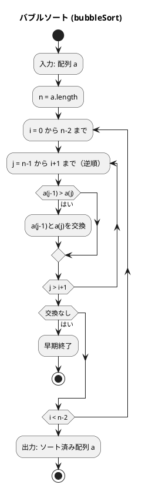
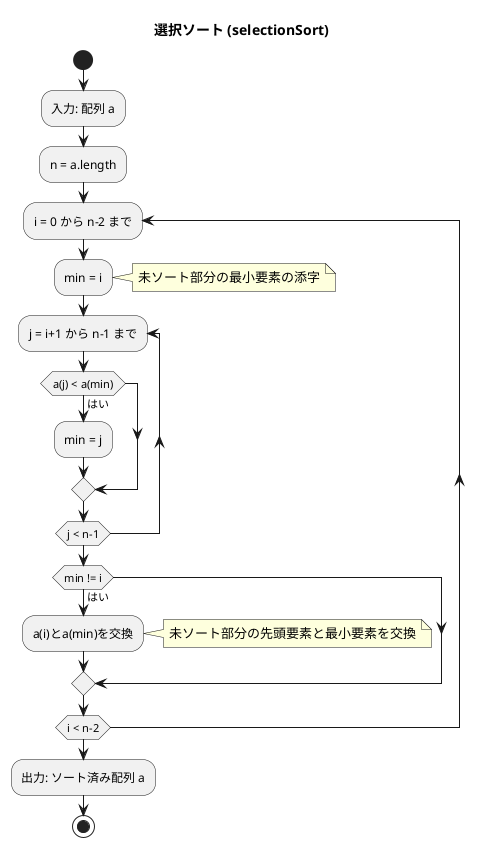
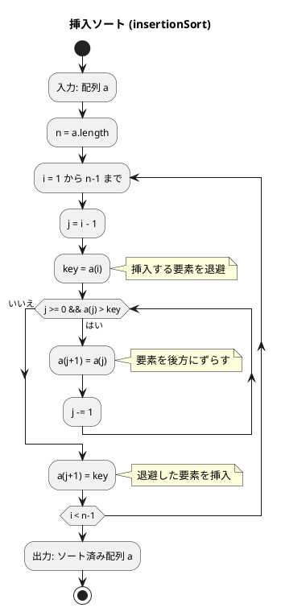
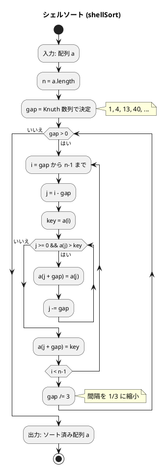
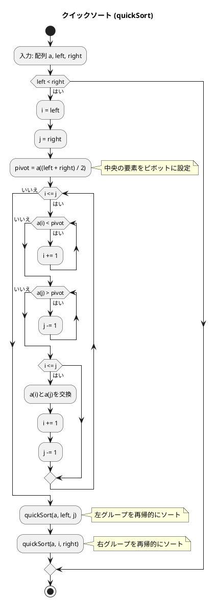
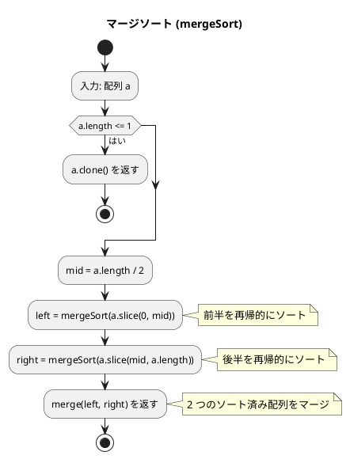
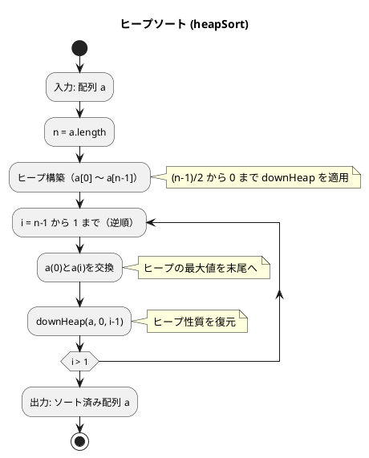
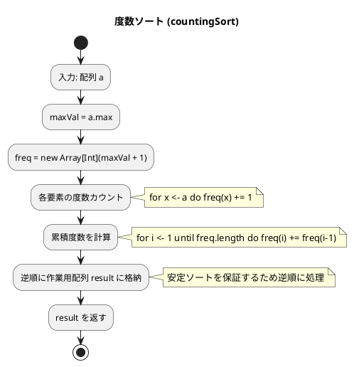

# 第 6 章 ソートアルゴリズム

## はじめに

前章では再帰アルゴリズムを学びました。この章では、データを特定の順序に並べ替える「ソートアルゴリズム」を Scala の TDD で実装します。

ソートは、コンピュータサイエンスにおける最も基本的かつ重要な操作の一つです。データが整列されていると、検索や他の操作が効率的に行えるようになります。様々なソートアルゴリズムが存在し、それぞれに長所と短所があります。

### 目次

1. [ソートとは](#ソートとは)
2. [バブルソート](#1-バブルソート)
3. [選択ソート](#2-選択ソート)
4. [挿入ソート](#3-挿入ソート)
5. [シェルソート](#4-シェルソート)
6. [クイックソート](#5-クイックソート)
7. [マージソート](#6-マージソート)
8. [ヒープソート](#7-ヒープソート)
9. [度数ソート](#8-度数ソート)

---

## ソートとは

ソートとは、データを特定の順序（通常は昇順または降順）に並べ替える操作です。ソートアルゴリズムは、以下のような特性によって評価されます：

- **時間計算量**: アルゴリズムの実行に必要な時間
- **空間計算量**: アルゴリズムが使用するメモリ量
- **安定性**: 同じ値を持つ要素の相対的な順序が保存されるか
- **適応性**: 既にある程度ソートされているデータに対する効率性

| アルゴリズム | 最良 | 平均 | 最悪 | 安定 | in-place |
|-------------|------|------|------|------|----------|
| バブルソート | O(n) | O(n²) | O(n²) | ✓ | ✓ |
| 選択ソート | O(n²) | O(n²) | O(n²) | ✗ | ✓ |
| 挿入ソート | O(n) | O(n²) | O(n²) | ✓ | ✓ |
| シェルソート | O(n) | O(n^1.5) | O(n²) | ✗ | ✓ |
| クイックソート | O(n log n) | O(n log n) | O(n²) | ✗ | ✓ |
| マージソート | O(n log n) | O(n log n) | O(n log n) | ✓ | ✗ |
| ヒープソート | O(n log n) | O(n log n) | O(n log n) | ✗ | ✓ |
| 度数ソート | O(n+k) | O(n+k) | O(n+k) | ✓ | ✗ |

それでは、具体的なソートアルゴリズムを見ていきましょう。

---

## 1. バブルソート

隣接する要素を比較・交換し、最大値を末尾へ「浮き上がらせる」アルゴリズムです。

### Red — 失敗するテストを書く

```scala
// SortAlgorithmsTest.scala
test("bubbleSort"):
  val a = Array(6, 4, 3, 7, 1, 9, 8)
  SortAlgorithms.bubbleSort(a)
  a shouldBe Array(1, 3, 4, 6, 7, 8, 9)

test("ソート: 重複あり"):
  val a = Array(3, 1, 4, 1, 5, 9, 2, 6, 5)
  SortAlgorithms.bubbleSort(a)
  a shouldBe Array(1, 1, 2, 3, 4, 5, 5, 6, 9)
```

### Green — テストを通す実装

```scala
// SortAlgorithms.scala
def bubbleSort(a: Array[Int]): Unit =
  val n = a.length
  var i = 0
  while i < n - 1 do
    var swapped = false
    var j = n - 1
    while j > i do
      if a(j - 1) > a(j) then
        val tmp = a(j - 1); a(j - 1) = a(j); a(j) = tmp
        swapped = true
      j -= 1
    if !swapped then i = n  // 交換なし → 整列完了（早期終了）
    i += 1
```

### フローチャート



各パスが終わるごとに、最大の要素が配列の末尾に移動します。そのため、i 回目のパスでは、配列の末尾の i 個の要素は既にソート済みとなります。

### バブルソートの最適化（参考）

**走査範囲の限定（参考実装）**

各走査で、最後に交換が行われた位置より先は既にソート済みのため、次の走査でその位置まで見ればよいです：

```scala
// 参考：走査範囲を限定したバブルソート
def bubbleSortOpt(a: Array[Int]): Unit =
  var k = 0
  while k < a.length - 1 do
    var last = a.length - 1
    var j = a.length - 1
    while j > k do
      if a(j - 1) > a(j) then
        val tmp = a(j - 1); a(j - 1) = a(j); a(j) = tmp
        last = j
      j -= 1
    k = last
```

**シェーカーソート（参考実装）**

双方向バブルソートとも呼ばれ、走査を上向きと下向きに交互に行います：

```scala
// 参考：シェーカーソート（双方向バブルソート）
def shakerSort(a: Array[Int]): Unit =
  var left = 0; var right = a.length - 1; var last = right
  while left < right do
    var j = right
    while j > left do
      if a(j - 1) > a(j) then
        val tmp = a(j - 1); a(j - 1) = a(j); a(j) = tmp
        last = j
      j -= 1
    left = last
    j = left
    while j < right do
      if a(j) > a(j + 1) then
        val tmp = a(j); a(j) = a(j + 1); a(j + 1) = tmp
        last = j
      j += 1
    right = last
```

### 解説

**計算量**: 最悪 O(n²)、最良 O(n)（整列済みの場合、最適化版）

バブルソートは単純で理解しやすいですが、大きなデータセットに対しては非効率です。`swapped` フラグによる早期終了で、整列済みの場合は O(n) で完了します。

---

## 2. 選択ソート

未整列部分の最小値を探し、先頭と交換するアルゴリズムです。

### Red — 失敗するテストを書く

```scala
test("selectionSort"):
  val a = Array(6, 4, 3, 7, 1, 9, 8)
  SortAlgorithms.selectionSort(a)
  a shouldBe Array(1, 3, 4, 6, 7, 8, 9)
```

### Green — テストを通す実装

```scala
def selectionSort(a: Array[Int]): Unit =
  val n = a.length
  for i <- 0 until n - 1 do
    var minIdx = i
    for j <- i + 1 until n do
      if a(j) < a(minIdx) then minIdx = j
    if minIdx != i then
      val tmp = a(i); a(i) = a(minIdx); a(minIdx) = tmp
```

### フローチャート



アルゴリズムの流れ：
1. 0 から n-2 の各インデックス i について処理を繰り返します
2. i+1 から n-1 の範囲で最小要素のインデックス min を探します
3. min が i と異なる場合、a(i) と a(min) を交換します

### 解説

**計算量**: 常に O(n²)（整列済みでも改善されない）

選択ソートは交換回数が少ないという利点があります。各パスで最大でも 1 回の交換しか行われません。しかし、大きなデータセットに対しては非効率です。

---

## 3. 挿入ソート

未整列部分の先頭要素を、整列済み部分の適切な位置に挿入するアルゴリズムです。トランプのカードを手に持って並べ替える操作に似ています。

### Red — 失敗するテストを書く

```scala
test("insertionSort"):
  val a = Array(6, 4, 3, 7, 1, 9, 8)
  SortAlgorithms.insertionSort(a)
  a shouldBe Array(1, 3, 4, 6, 7, 8, 9)
```

### Green — テストを通す実装

```scala
def insertionSort(a: Array[Int]): Unit =
  val n = a.length
  for i <- 1 until n do
    val key = a(i)
    var j = i - 1
    while j >= 0 && a(j) > key do
      a(j + 1) = a(j)
      j -= 1
    a(j + 1) = key
```

### フローチャート



アルゴリズムの流れ：
1. 1 から n-1 の各インデックス i について処理を繰り返します
2. a(i) を key として退避します
3. key より大きい要素を 1 つ後ろにずらします
4. 適切な位置に key を挿入します

### 解説

**計算量**: 最悪 O(n²)、最良 O(n)（整列済みの場合）

挿入ソートは、小さなデータセットや、ほぼソート済みのデータに対して効率的です。安定なソートアルゴリズムであり、オンラインアルゴリズム（データが逐次的に到着する場合）としても使用できます。

---

## 4. シェルソート

挿入ソートの改良版です。間隔（gap）を縮小しながら複数回の挿入ソートを行います。離れた要素同士を先に比較・交換することで、大きな値を素早く後方に移動させます。

### Red — 失敗するテストを書く

```scala
test("shellSort"):
  val a = Array(6, 4, 3, 7, 1, 9, 8)
  SortAlgorithms.shellSort(a)
  a shouldBe Array(1, 3, 4, 6, 7, 8, 9)
```

### Green — テストを通す実装

Knuth 数列（1, 4, 13, 40, ...）を gap として使用します：

```scala
def shellSort(a: Array[Int]): Unit =
  val n = a.length
  var gap = 1
  while gap * 3 + 1 < n do gap = gap * 3 + 1
  while gap > 0 do
    for i <- gap until n do
      val key = a(i)
      var j = i - gap
      while j >= 0 && a(j) > key do
        a(j + gap) = a(j)
        j -= gap
      a(j + gap) = key
    gap /= 3
```

### フローチャート



最初は大きな gap で要素を比較し、徐々に gap を小さくしていきます。最終的に gap が 1 になると通常の挿入ソートと同じ処理になりますが、その時点で配列はほぼソートされています。

### 解説

**計算量**: O(n^(3/2)) ～ O(n log² n)（gap 数列に依存）

シェルソートの性能は間隔の選び方に依存します。Knuth 数列（1, 4, 13, 40, ...）は実用的に優れた性能を発揮します。

---

## 5. クイックソート

ピボットを基準に配列を 2 分割し、再帰的にソートします。「分割統治法」に基づく効率的なソートアルゴリズムで、実用的に最も高速なアルゴリズムの一つです。

### 分割手順

クイックソートの核心は、配列をピボットを中心に分割する手順です：

```scala
// ピボットを中央の要素として分割
val pivot = a((left + right) / 2)
var i = left; var j = right
while i <= j do
  while a(i) < pivot do i += 1
  while a(j) > pivot do j -= 1
  if i <= j then
    val tmp = a(i); a(i) = a(j); a(j) = tmp
    i += 1; j -= 1
```

### Red — 失敗するテストを書く

```scala
test("quickSort"):
  val a = Array(6, 4, 3, 7, 1, 9, 8)
  SortAlgorithms.quickSort(a)
  a shouldBe Array(1, 3, 4, 6, 7, 8, 9)
```

### Green — テストを通す実装

```scala
def quickSort(a: Array[Int], left: Int, right: Int): Unit =
  if left < right then
    val pivot = a((left + right) / 2)
    var i = left; var j = right
    while i <= j do
      while a(i) < pivot do i += 1
      while a(j) > pivot do j -= 1
      if i <= j then
        val tmp = a(i); a(i) = a(j); a(j) = tmp
        i += 1; j -= 1
    quickSort(a, left, j)
    quickSort(a, i, right)

def quickSort(a: Array[Int]): Unit =
  if a.length > 1 then quickSort(a, 0, a.length - 1)
```

### フローチャート



### 解説

**計算量**: 平均 O(n log n)、最悪 O(n²)

クイックソートは平均的には非常に効率的ですが、最悪の場合（既にソート済みの配列や、すべての要素が同じ値の配列）では効率が悪くなることがあります。不安定なソートアルゴリズムです。中央ピボット選択により、最悪ケースの頻度を低減できます。

---

## 6. マージソート

配列を半分に分割し、再帰的にソートして結合します。「分割統治法」に基づく安定なソートアルゴリズムです。

### ソート済み配列のマージ

マージソートの核心は、2 つのソート済み配列をマージする手順です：

```scala
private def merge(left: Array[Int], right: Array[Int]): Array[Int] =
  val result = new Array[Int](left.length + right.length)
  var i = 0; var j = 0; var k = 0
  while i < left.length && j < right.length do
    if left(i) <= right(j) then { result(k) = left(i); i += 1 }
    else { result(k) = right(j); j += 1 }
    k += 1
  while i < left.length do  { result(k) = left(i);  i += 1; k += 1 }
  while j < right.length do { result(k) = right(j); j += 1; k += 1 }
  result
```

### Red — 失敗するテストを書く

```scala
test("mergeSort"):
  SortAlgorithms.mergeSort(Array(5, 8, 4, 2, 6, 1, 3, 9, 7)) shouldBe
    Array(1, 2, 3, 4, 5, 6, 7, 8, 9)
```

### Green — テストを通す実装

```scala
def mergeSort(a: Array[Int]): Array[Int] =
  if a.length <= 1 then a.clone()
  else
    val mid   = a.length / 2
    val left  = mergeSort(a.slice(0, mid))
    val right = mergeSort(a.slice(mid, a.length))
    merge(left, right)
```

### フローチャート



### 解説

**計算量**: 常に O(n log n)

マージソートは、どのような入力に対しても安定した性能を発揮する安定なソートアルゴリズムです。しかし、追加のメモリ空間（作業用配列）が必要という欠点があります。

---

## 7. ヒープソート

ヒープデータ構造を利用したソートアルゴリズムです。ヒープは、親ノードが子ノードよりも大きい（最大ヒープ）という性質を持つ二分木です。

### ヒープの性質

ヒープを配列で表現した場合：
- 親ノードのインデックス: `(i - 1) / 2`
- 左の子のインデックス: `2 * i + 1`
- 右の子のインデックス: `2 * i + 2`

### Red — 失敗するテストを書く

```scala
test("heapSort"):
  val a = Array(6, 4, 3, 7, 1, 9, 8)
  SortAlgorithms.heapSort(a)
  a shouldBe Array(1, 3, 4, 6, 7, 8, 9)
```

### Green — テストを通す実装

```scala
def heapSort(a: Array[Int]): Unit =
  val n = a.length
  if n <= 1 then return
  // ヒープを構築（下から上へ）
  for i <- (n - 1) / 2 to 0 by -1 do downHeap(a, i, n - 1)
  // ヒープから順番に最大値を取り出す
  for i <- n - 1 to 1 by -1 do
    val tmp = a(0); a(0) = a(i); a(i) = tmp  // 最大値を末尾へ
    downHeap(a, 0, i - 1)

private def downHeap(a: Array[Int], left: Int, right: Int): Unit =
  val temp = a(left)
  var parent = left
  var running = true
  while running && parent < (right + 1) / 2 do
    val cl = parent * 2 + 1         // 左の子
    val cr = cl + 1                 // 右の子
    val child = if cr <= right && a(cr) > a(cl) then cr else cl  // 大きい方
    if temp >= a(child) then running = false
    else
      a(parent) = a(child)
      parent = child
  a(parent) = temp
```

### フローチャート



### 解説

**計算量**: 常に O(n log n)

ヒープソートは、どのような入力に対しても安定した性能を発揮し、追加のメモリ空間を必要としません（in-place）。しかし、不安定なソートアルゴリズムであり、キャッシュ効率が悪いという欠点もあります。

---

## 8. 度数ソート

度数ソート（カウンティングソート）は、要素の値の範囲が限られている場合に効率的なソートアルゴリズムです。各値の出現回数をカウントし、それに基づいてソートを行います。

### Red — 失敗するテストを書く

```scala
test("countingSort"):
  SortAlgorithms.countingSort(Array(22, 5, 11, 32, 120, 68, 70)) shouldBe
    Array(5, 11, 22, 32, 68, 70, 120)
```

### Green — テストを通す実装

```scala
def countingSort(a: Array[Int]): Array[Int] =
  if a.isEmpty then return Array.empty
  val maxVal = a.max
  val freq = new Array[Int](maxVal + 1)
  for x <- a do freq(x) += 1                      // 度数カウント
  for i <- 1 until freq.length do freq(i) += freq(i - 1)  // 累積度数
  val result = new Array[Int](a.length)
  for i <- a.length - 1 to 0 by -1 do            // 逆順で安定性を保つ
    freq(a(i)) -= 1
    result(freq(a(i))) = a(i)
  result
```

### フローチャート



アルゴリズムの流れ：
1. 各要素の出現回数を `freq` 配列にカウントします
2. `freq` を累積度数に変換します（`freq(i)` が「値 i 以下の要素数」になります）
3. 逆順に元の配列を走査し、`result` の適切な位置に格納します

### 解説

**計算量**: O(n + k)（n は要素数、k は値の範囲）

度数ソートは、値の範囲が小さい場合に非常に効率的です。比較を行わないため、比較ベースのソートの理論的下限 O(n log n) を超えることができます。値の範囲が大きい場合はメモリ使用量が増大するという欠点があります。

---

## テスト実行結果

```
$ cd apps/scala && sbt test

[info] SortAlgorithmsTest:
[info] - bubbleSort
[info] - selectionSort
[info] - insertionSort
[info] - shellSort
[info] - quickSort
[info] - mergeSort
[info] - heapSort
[info] - countingSort
[info] - ソート: 空配列
[info] - ソート: 要素が 1 つ
[info] - ソート: 重複あり
[info] Tests: succeeded 11, failed 0
```

---

## ソートアルゴリズムの比較

| アルゴリズム | 最良 | 平均 | 最悪 | 安定 | 備考 |
|-------------|------|------|------|------|------|
| バブルソート | O(n) | O(n²) | O(n²) | ✓ | 整列済み検出あり |
| 選択ソート | O(n²) | O(n²) | O(n²) | ✗ | 交換回数が少ない |
| 挿入ソート | O(n) | O(n²) | O(n²) | ✓ | 小規模データに有効 |
| シェルソート | O(n) | O(n^1.5) | O(n²) | ✗ | 挿入ソートの改良 |
| クイックソート | O(n log n) | O(n log n) | O(n²) | ✗ | 実用的に最速 |
| マージソート | O(n log n) | O(n log n) | O(n log n) | ✓ | 追加メモリが必要 |
| ヒープソート | O(n log n) | O(n log n) | O(n log n) | ✗ | 追加メモリ不要 |
| 度数ソート | O(n + k) | O(n + k) | O(n + k) | ✓ | 値の範囲が限定的な場合に有効 |

## まとめ

この章では、8 種類のソートアルゴリズムを Scala の TDD で実装しました：

1. **バブルソート** — 隣接する要素を比較・交換する単純なアルゴリズム。`swapped` フラグで早期終了
2. **選択ソート** — 未ソート部分から最小要素を選択するアルゴリズム。交換回数が少ない
3. **挿入ソート** — ソート済み部分に要素を挿入するアルゴリズム。ほぼ整列済みのデータに効率的
4. **シェルソート** — 挿入ソートを改良した Knuth 数列による gap 縮小ソート
5. **クイックソート** — 分割統治法に基づく高速なアルゴリズム。中央ピボット選択で最悪ケースを回避
6. **マージソート** — 分割統治法に基づく安定なアルゴリズム。常に O(n log n)
7. **ヒープソート** — ヒープデータ構造を利用するアルゴリズム。追加メモリ不要で常に O(n log n)
8. **度数ソート** — 比較不要の非比較型ソート。値の範囲が限定的な場合に O(n + k) で最速

Scala では `Array[Int]` を直接操作する in-place ソートと、新しい配列を返すソートの 2 種類を実装しました。ジェネリクス化（`Array[T: Ordering]`）も可能ですが、アルゴリズムの本質を明確にするため `Int` 版で実装しています。

次の章では、文字列処理について学んでいきましょう。

## 参考文献

- 『新・明解アルゴリズムとデータ構造』 — 柴田望洋
- 『テスト駆動開発』 — Kent Beck
