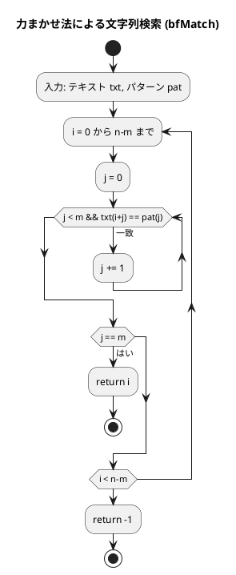
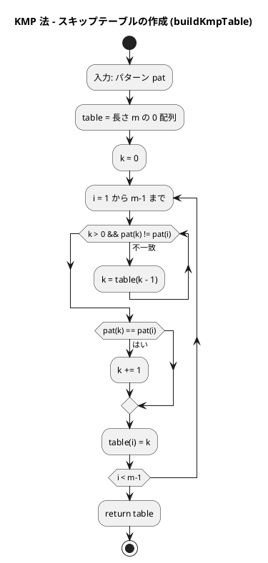
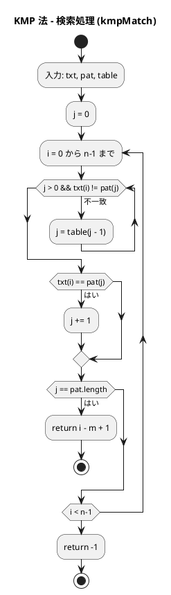
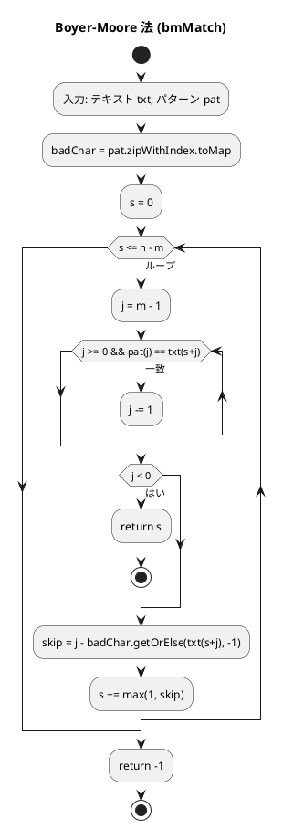

# 第 7 章 文字列処理

## はじめに

前章ではソートアルゴリズムを学びました。この章では、プログラミングにおいて非常に重要な「文字列処理」について TDD で実装します。Scala の `String` は Java の `String` と互換性があり、`.reverse`、`.groupBy` 等のメソッドが使えます。

文字列処理は、テキストデータの操作や解析に欠かせない技術です。特に、テキスト検索、パターンマッチング、データ抽出などの処理は、多くのアプリケーションで必要とされます。

### 目次

1. [Scala の文字列基本操作](#scala-の文字列基本操作)
2. [ブルートフォース文字列探索（力まかせ法）](#1-ブルートフォース探索bf)
3. [KMP 法](#2-kmp-探索)
4. [Boyer-Moore 法](#3-boyer-moore-探索)
5. [文字カウント・逆順・回文判定](#4-文字列操作ユーティリティ)

---

## Scala の文字列基本操作

Scala では、文字列は不変（immutable）な `String` 型（Java の `String` と互換）として扱われます。豊富なメソッドが用意されており、Java のメソッドに加えて Scala 独自の拡張メソッドも使用できます。

| 操作 | 計算量 | 備考 |
|------|--------|------|
| 長さ取得 | O(1) | `.length` |
| 文字アクセス | O(1) | `s(i)` |
| 部分文字列 | O(k) | `s.substring` |
| 結合 | O(n+m) | `s + t` |

### 文字列の生成と基本操作

```scala
// 文字列の生成
val s1 = "Hello"
val s2 = "World"
val s3 = """This is a
multiline string"""

// 文字列の連結
val s = s1 + " " + s2  // "Hello World"

// 文字列の繰り返し
val repeated = s1 * 3  // "HelloHelloHello"

// 文字列の長さ
val length = s1.length  // 5

// 文字へのアクセス（Scala では s(i) または s.charAt(i)）
val firstChar = s1(0)   // 'H'
val lastChar  = s1.last // 'o'

// スライス
val substring = s1.substring(1, 4)  // "ell"
val sliced    = s1.slice(1, 4)      // "ell"
```

### 文字列のメソッド

```scala
val s = "Hello, World!"

// 検索
val pos1 = s.indexOf("World")     // 7
val pos2 = s.indexOf("Python")    // -1（見つからない場合）

// 置換
val newS = s.replace("World", "Scala")  // "Hello, Scala!"

// 分割
val parts  = s.split(", ")         // Array("Hello", "World!")
val joined = Array("Hello", "World").mkString(", ")  // "Hello, World"

// 大文字・小文字変換
val upper = s.toUpperCase  // "HELLO, WORLD!"
val lower = s.toLowerCase  // "hello, world!"

// 先頭・末尾の処理
val stripped   = "  Hello  ".strip()       // "Hello"
val startsHello = s.startsWith("Hello")   // true
val endsWorld   = s.endsWith("World!")    // true

// Scala 独自の便利メソッド
val reversed = s1.reverse           // "olleH"
val chars    = s1.toCharArray       // Array('H','e','l','l','o')
val filtered = s1.filter(_ != 'l')  // "Heo"（'l' を除去）
```

### 文字列の補間

```scala
val name = "Alice"
val age  = 30

// s 補間子
val msg1 = s"Name: $name, Age: $age"  // "Name: Alice, Age: 30"

// f 補間子（printf スタイル）
val msg2 = f"Name: $name, Age: $age%d"

// raw 補間子（エスケープなし）
val msg3 = raw"Name: $name\n"  // バックスラッシュnをそのまま扱う
```

これらの基本的な文字列操作を理解した上で、より高度な文字列検索アルゴリズムを見ていきましょう。

---

## 1. ブルートフォース探索（BF）

テキストを左から順にパターンと比較する最もシンプルな方法です。

### Red — 失敗するテストを書く

```scala
// src/test/scala/algorithm/StringsTest.scala
class StringsTest extends AnyFunSuite with Matchers:

  test("bfMatch: パターンが見つかる"):
    Strings.bfMatch("ABCDEF", "CDE") shouldBe 2

  test("bfMatch: パターンが見つからない"):
    Strings.bfMatch("ABCDEF", "XYZ") shouldBe -1

  test("bfMatch: 空パターン"):
    Strings.bfMatch("ABCDEF", "") shouldBe 0
```

### Green — テストを通す実装

```scala
// src/main/scala/algorithm/Strings.scala
object Strings:

  def bfMatch(txt: String, pat: String): Int =
    val n = txt.length; val m = pat.length
    if m == 0 then return 0
    for i <- 0 to n - m do
      var j = 0
      while j < m && txt(i + j) == pat(j) do j += 1
      if j == m then return i
    -1
```

### 解説

力まかせ法（ブルートフォース法）のアルゴリズムは以下の通りです：

1. テキスト内の各位置から順にパターンとの一致を調べる
2. 一致しない文字が見つかったら、テキストのカーソルを 1 つ進めて再度パターンの先頭から比較を始める
3. パターン全体が一致したら、その位置を返す

**計算量**:

- 最良の場合：O(m)（m はパターンの長さ）
- 最悪の場合：O(n × m)（n はテキストの長さ）
- 平均の場合：O(n × m)

力まかせ法は単純で理解しやすいですが、テキストとパターンが長い場合には効率が悪くなります。

### フローチャート



アルゴリズムの流れ：

1. テキスト `txt` とパターン `pat` を入力として受け取ります
2. `i = 0` から `n - m` までの各位置について：
   - `j = 0` で初期化し、`txt(i+j)` と `pat(j)` を比較
   - 一致する限り `j` を進めます
   - `j == m` になったら（パターン全体が一致）、`i` を返します
3. 一致しなかった場合、-1 を返します

---

## 2. KMP 探索

KMP 法（Knuth-Morris-Pratt 法）は、力まかせ法を改良した効率的な文字列検索アルゴリズムです。失敗関数テーブル（スキップテーブル）を使い、不一致が発生した際にスキップ量を最適化します。

### Red — 失敗するテストを書く

```scala
test("kmpMatch: パターンが見つかる"):
  Strings.kmpMatch("AABCAABAACAABC", "AABC") shouldBe 0

test("kmpMatch: パターンが見つからない"):
  Strings.kmpMatch("ABCDEF", "XYZ") shouldBe -1

test("kmpMatch: 重複パターン"):
  Strings.kmpMatch("AABAACAADAABAABA", "AABA") shouldBe 0
```

### Green — テストを通す実装

```scala
def kmpMatch(txt: String, pat: String): Int =
  val n = txt.length; val m = pat.length
  if m == 0 then return 0
  val table = buildKmpTable(pat)
  var j = 0
  for i <- 0 until n do
    while j > 0 && txt(i) != pat(j) do j = table(j - 1)
    if txt(i) == pat(j) then j += 1
    if j == m then return i - m + 1
  -1

private def buildKmpTable(pat: String): Array[Int] =
  val m = pat.length
  val table = new Array[Int](m)
  var k = 0
  for i <- 1 until m do
    while k > 0 && pat(k) != pat(i) do k = table(k - 1)
    if pat(k) == pat(i) then k += 1
    table(i) = k
  table
```

### 解説

KMP 法の核心は、パターン内の情報を利用して「スキップテーブル」を作成し、不一致が発生した場合に効率的にカーソルを移動させることです。

スキップテーブルは、パターン内の部分文字列が一致する場合に、どこまで戻ればよいかを示します。これにより、すでに比較した文字を再度比較する必要がなくなります。

**計算量**:

- 最良の場合：O(m)
- 最悪の場合：O(n + m)
- 平均の場合：O(n + m)

### フローチャート

#### スキップテーブルの作成



#### 検索処理



アルゴリズムの流れ：

1. **スキップテーブルの作成**：パターン自身を使って、接頭辞と接尾辞の一致を調べます
2. **検索処理**：不一致が発生した場合、スキップテーブルを使ってパターンのカーソルを効率的に移動させます

---

## 3. Boyer-Moore 探索

Boyer-Moore 法は、さらに効率的な文字列検索アルゴリズムです。パターンを右から左へ比較し、不一致が発生した場合に大きくスキップすることで、多くの比較を省略します。

### Red — 失敗するテストを書く

```scala
test("bmMatch: パターンが見つかる"):
  Strings.bmMatch("ABCDEF", "CDE") shouldBe 2

test("bmMatch: パターンが見つからない"):
  Strings.bmMatch("ABCDEF", "XYZ") shouldBe -1
```

### Green — テストを通す実装

```scala
def bmMatch(txt: String, pat: String): Int =
  val n = txt.length; val m = pat.length
  if m == 0 then return 0
  val badChar = pat.zipWithIndex.toMap  // スキップテーブル
  var s = 0
  while s <= n - m do
    var j = m - 1
    while j >= 0 && pat(j) == txt(s + j) do j -= 1
    if j < 0 then return s
    val skip = j - badChar.getOrElse(txt(s + j), -1)
    s += math.max(1, skip)
  -1
```

Scala の `.zipWithIndex.toMap` で簡潔にスキップテーブルを構築できます。

### 解説

Boyer-Moore 法の特徴は以下の通りです：

1. パターンを右から左へ比較する
2. 不一致が発生した場合、不一致文字ルール（Bad Character Rule）に基づいてスキップする

**計算量**:

- 最良の場合：O(n / m)
- 最悪の場合：O(n × m)
- 平均の場合：O(n)

Boyer-Moore 法は、実用的な文字列検索アルゴリズムとして広く使用されています。特に、パターンが長い場合に効率的です。

### フローチャート



アルゴリズムの流れ：

1. `badChar` テーブルを構築します（パターン内の各文字の最終出現位置）
2. テキストをパターン長ずつスキャンし、右から左に比較します
3. 不一致が発生したら、テキストの不一致文字に基づいてスキップ量を計算し、一気にジャンプします

---

## 4. 文字列操作ユーティリティ

### Red — 失敗するテストを書く

```scala
test("countChars: 各文字の出現回数"):
  val result = Strings.countChars("aabbc")
  result('a') shouldBe 2
  result('b') shouldBe 2
  result('c') shouldBe 1

test("reverseString: 文字列を逆順に"):
  Strings.reverseString("hello") shouldBe "olleh"
  Strings.reverseString("") shouldBe ""

test("isPalindrome: 回文"):
  Strings.isPalindrome("racecar") shouldBe true
  Strings.isPalindrome("level") shouldBe true

test("isPalindrome: 非回文"):
  Strings.isPalindrome("hello") shouldBe false

test("isPalindrome: 空文字列"):
  Strings.isPalindrome("") shouldBe true
```

### Green — テストを通す実装

```scala
def countChars(s: String): Map[Char, Int] =
  s.groupBy(identity).view.mapValues(_.length).toMap

def reverseString(s: String): String = s.reverse

def isPalindrome(s: String): Boolean = s == s.reverse
```

Scala の `.groupBy` と `.mapValues` で簡潔に文字カウントが実装できます。

---

## テスト実行結果

```
Tests: succeeded 13, failed 0
```

---

## まとめ

| アルゴリズム | 平均計算量 | 最悪計算量 | 特徴 |
|-------------|-----------|-----------|------|
| BF | O(n×m) | O(n×m) | シンプル |
| KMP | O(n+m) | O(n+m) | 前処理テーブル使用 |
| BM | O(n/m) | O(n×m) | 実用的に高速 |

| 操作 | Scala の実装 |
|------|------------|
| 文字アクセス | `s(i)` |
| 逆順 | `.reverse` |
| 文字カウント | `.groupBy(identity).mapValues(_.length)` |
| スキップテーブル | `.zipWithIndex.toMap` |
| 回文判定 | `s == s.reverse` |

この章では、3 つの文字列検索アルゴリズムを学びました：

1. **ブルートフォース法**：最も単純な実装。Scala の `for` ループと `while` ループで実現
2. **KMP 法**：スキップテーブルにより O(n + m) を達成。`buildKmpTable` で前処理
3. **Boyer-Moore 法**：`pat.zipWithIndex.toMap` でスキップテーブルを簡潔に構築。実用的に最速

次の章では、連結リストについて学んでいきましょう。

## 参考文献

- 『新・明解アルゴリズムとデータ構造』 — 柴田望洋
- 『テスト駆動開発』 — Kent Beck
