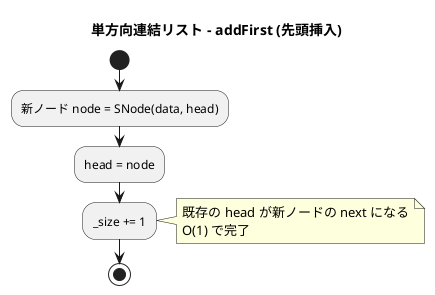
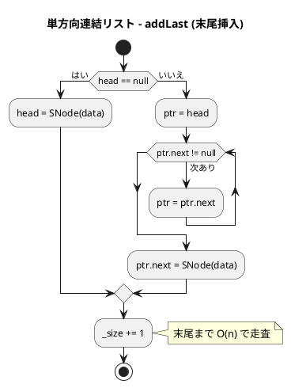
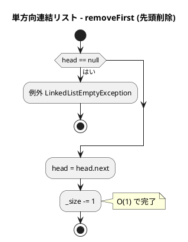
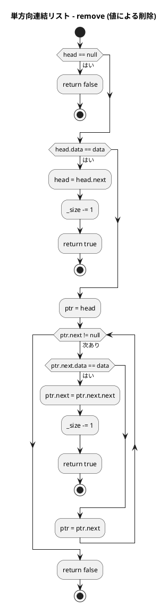
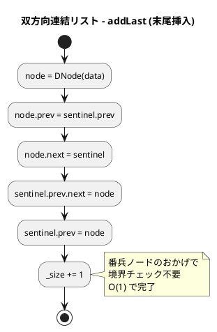

# 第 8 章 リスト

## はじめに

前章では文字列処理を学びました。この章では 3 種類の連結リストを Scala で実装します。Scala の `sealed trait` + `case class` または可変クラスを活用し、Union Type `SNode[T] | Null` で null を型安全に扱います。

### 目次

1. [連結リストとは](#連結リストとは)
2. [単方向連結リスト](#1-単方向連結リスト)
3. [双方向連結リスト](#2-双方向連結リスト番兵ノード使用)
4. [配列による連結リスト（カーソル版）](#3-配列による連結リストカーソル版)

---

## 連結リストとは

連結リストとは、各要素（ノード）がデータと次の要素への参照を持つデータ構造です。配列とは異なり、メモリ上での連続性が不要なため、先頭・途中への挿入・削除が効率的に行えます。

| 操作 | 配列 | 連結リスト |
|------|------|-----------|
| ランダムアクセス | O(1) | O(n) |
| 先頭への挿入 | O(n) | O(1) |
| 末尾への挿入 | O(1) | O(n)（単方向）/ O(1)（双方向） |
| 途中への挿入 | O(n) | O(1)（位置が既知の場合） |
| 削除 | O(n) | O(1)（位置が既知の場合） |

連結リストの種類：

- **単方向連結リスト**：各ノードが次ノードへの参照のみを持つ
- **双方向連結リスト**：各ノードが前後両方のノードへの参照を持つ
- **配列カーソル版**：ポインタの代わりに配列インデックスを使用

---

## 1. 単方向連結リスト

### Red — 失敗するテストを書く

```scala
// src/test/scala/algorithm/LinkedListsTest.scala
class LinkedListsTest extends AnyFunSuite with Matchers:

  test("SinglyLinkedList: 初期状態は空"):
    val list = SinglyLinkedList[Int]()
    list.isEmpty shouldBe true
    list.size shouldBe 0

  test("SinglyLinkedList: addLast"):
    val list = SinglyLinkedList[Int]()
    list.addLast(1); list.addLast(2); list.addLast(3)
    list.toList shouldBe List(1, 2, 3)

  test("SinglyLinkedList: addFirst"):
    val list = SinglyLinkedList[Int]()
    list.addFirst(3); list.addFirst(2); list.addFirst(1)
    list.toList shouldBe List(1, 2, 3)
```

### Green — テストを通す実装

```scala
// src/main/scala/algorithm/LinkedLists.scala
private class SNode[T](val data: T, var next: SNode[T] | Null = null)

class SinglyLinkedList[T]:
  private var head: SNode[T] | Null = null
  private var _size = 0

  def size: Int        = _size
  def isEmpty: Boolean = head == null

  def addFirst(data: T): Unit =
    head = SNode(data, head)
    _size += 1

  def addLast(data: T): Unit =
    if head == null then head = SNode(data)
    else
      var ptr = head
      while ptr.next != null do ptr = ptr.next
      ptr.next = SNode(data)
    _size += 1
```

`SNode[T] | Null` は Scala 3 の Union Type で null を型安全に扱います。

### Refactor — removeFirst・removeLast・remove・contains の追加

```scala
// Red
test("SinglyLinkedList: removeFirst"):
  val list = SinglyLinkedList[Int]()
  list.addLast(1); list.addLast(2); list.addLast(3)
  list.removeFirst()
  list.toList shouldBe List(2, 3)

test("SinglyLinkedList: removeLast"):
  val list = SinglyLinkedList[Int]()
  list.addLast(1); list.addLast(2); list.addLast(3)
  list.removeLast()
  list.toList shouldBe List(1, 2)

test("SinglyLinkedList: remove"):
  val list = SinglyLinkedList[Int]()
  list.addLast(1); list.addLast(2); list.addLast(3)
  list.remove(2) shouldBe true
  list.toList shouldBe List(1, 3)
  list.remove(9) shouldBe false

test("SinglyLinkedList: contains"):
  val list = SinglyLinkedList[Int]()
  list.addLast(1); list.addLast(2)
  list.contains(1) shouldBe true
  list.contains(9) shouldBe false

test("SinglyLinkedList: 空からの removeFirst は例外"):
  val list = SinglyLinkedList[Int]()
  assertThrows[LinkedListEmptyException](list.removeFirst())

// Green
class LinkedListEmptyException extends RuntimeException("リストは空です")

def removeFirst(): Unit =
  if head == null then throw LinkedListEmptyException()
  head = head.next
  _size -= 1

def removeLast(): Unit =
  if head == null then throw LinkedListEmptyException()
  if head.next == null then head = null
  else
    var ptr = head
    while ptr.next != null && ptr.next.next != null do ptr = ptr.next
    ptr.next = null
  _size -= 1

def remove(data: T): Boolean =
  if head == null then return false
  if head.data == data then
    head = head.next; _size -= 1; return true
  var ptr = head
  while ptr.next != null do
    if ptr.next.data == data then
      ptr.next = ptr.next.next; _size -= 1; return true
    ptr = ptr.next
  false

def contains(data: T): Boolean =
  var ptr = head
  while ptr != null do
    if ptr.data == data then return true
    ptr = ptr.next
  false

def toList: List[T] =
  val buf = scala.collection.mutable.ArrayBuffer[T]()
  var ptr = head
  while ptr != null do
    buf += ptr.data
    ptr = ptr.next
  buf.toList
```

### アルゴリズムの考え方









**計算量**:

| 操作 | 計算量 | 説明 |
|------|--------|------|
| `addFirst` | O(1) | 先頭に挿入 |
| `addLast` | O(n) | 末尾まで走査が必要 |
| `removeFirst` | O(1) | 先頭を削除 |
| `removeLast` | O(n) | 末尾まで走査が必要 |
| `remove(data)` | O(n) | 値を検索しながら削除 |

---

## 2. 双方向連結リスト（番兵ノード使用）

### Red — 失敗するテストを書く

```scala
test("DoublyLinkedList: 初期状態は空"):
  val list = DoublyLinkedList[Int]()
  list.isEmpty shouldBe true
  list.size shouldBe 0

test("DoublyLinkedList: addFirst"):
  val list = DoublyLinkedList[Int]()
  list.addFirst(3); list.addFirst(2); list.addFirst(1)
  list.toList shouldBe List(1, 2, 3)

test("DoublyLinkedList: addLast"):
  val list = DoublyLinkedList[Int]()
  list.addLast(1); list.addLast(2); list.addLast(3)
  list.toList shouldBe List(1, 2, 3)

test("DoublyLinkedList: removeFirst"):
  val list = DoublyLinkedList[Int]()
  list.addLast(1); list.addLast(2); list.addLast(3)
  list.removeFirst()
  list.toList shouldBe List(2, 3)

test("DoublyLinkedList: removeLast"):
  val list = DoublyLinkedList[Int]()
  list.addLast(1); list.addLast(2); list.addLast(3)
  list.removeLast()
  list.toList shouldBe List(1, 2)

test("DoublyLinkedList: remove"):
  val list = DoublyLinkedList[Int]()
  list.addLast(1); list.addLast(2); list.addLast(3)
  list.remove(2) shouldBe true
  list.toList shouldBe List(1, 3)

test("DoublyLinkedList: 空からの removeFirst は例外"):
  val list = DoublyLinkedList[Int]()
  assertThrows[LinkedListEmptyException](list.removeFirst())
```

### Green — テストを通す実装

```scala
private class DNode[T](
  val data: T,
  var prev: DNode[T] | Null = null,
  var next: DNode[T] | Null = null
)

class DoublyLinkedList[T]:
  private val sentinel: DNode[T] = DNode(null.asInstanceOf[T])
  sentinel.prev = sentinel
  sentinel.next = sentinel
  private var _size = 0

  def size: Int        = _size
  def isEmpty: Boolean = sentinel.next == sentinel

  def addFirst(data: T): Unit =
    val node = DNode(data)
    node.prev = sentinel
    node.next = sentinel.next
    sentinel.next.prev = node
    sentinel.next = node
    _size += 1

  def addLast(data: T): Unit =
    val node = DNode(data)
    node.prev = sentinel.prev
    node.next = sentinel
    sentinel.prev.next = node
    sentinel.prev = node
    _size += 1

  def removeFirst(): Unit =
    if isEmpty then throw LinkedListEmptyException()
    val node = sentinel.next
    sentinel.next = node.next
    node.next.prev = sentinel
    _size -= 1

  def removeLast(): Unit =
    if isEmpty then throw LinkedListEmptyException()
    val node = sentinel.prev
    sentinel.prev = node.prev
    node.prev.next = sentinel
    _size -= 1

  def remove(data: T): Boolean =
    var ptr = sentinel.next
    while ptr != sentinel do
      if ptr.data == data then
        ptr.prev.next = ptr.next
        ptr.next.prev = ptr.prev
        _size -= 1
        return true
      ptr = ptr.next
    false

  def toList: List[T] =
    val buf = scala.collection.mutable.ArrayBuffer[T]()
    var ptr = sentinel.next
    while ptr != sentinel do
      buf += ptr.data
      ptr = ptr.next
    buf.toList
```

番兵ノードにより境界処理が不要になります。先頭・末尾の挿入・削除がすべて O(1) で実現できます。

### アルゴリズムの考え方



双方向リストの利点：

- **O(1) で末尾挿入・削除**：`sentinel.prev` で常に末尾ノードを参照できる
- **境界処理不要**：番兵ノードにより、空のリストでも同じコードが動作する
- **双方向走査**：`prev`/`next` で前後どちらにも移動できる

---

## 3. 配列による連結リスト（カーソル版）

ポインタの代わりに配列インデックスを使います。削除済みスロットを再利用します。

### Red — 失敗するテストを書く

```scala
test("ArrayLinkedList: addFirst"):
  val list = ArrayLinkedList(10)
  list.addFirst(3); list.addFirst(2); list.addFirst(1)
  list.toList shouldBe List(1, 2, 3)

test("ArrayLinkedList: addLast"):
  val list = ArrayLinkedList(10)
  list.addLast(1); list.addLast(2); list.addLast(3)
  list.toList shouldBe List(1, 2, 3)

test("ArrayLinkedList: remove"):
  val list = ArrayLinkedList(10)
  list.addLast(1); list.addLast(2); list.addLast(3)
  list.remove(2) shouldBe true
  list.toList shouldBe List(1, 3)
  list.remove(9) shouldBe false

test("ArrayLinkedList: 削除スロットの再利用"):
  val list = ArrayLinkedList(5)
  list.addLast(1); list.addLast(2); list.addLast(3)
  list.remove(2)
  list.addLast(4)
  list.toList shouldBe List(1, 3, 4)
```

### Green — テストを通す実装

```scala
class ArrayLinkedList(capacity: Int):
  private val Null  = -1
  private val data  = new Array[Int](capacity)
  private val next  = Array.fill(capacity)(Null)
  private val dnext = Array.fill(capacity)(Null)  // 削除リスト
  private var head    = Null
  private var maxUsed = Null
  private var deleted = Null

  private def getIndex(): Int =
    if deleted != Null then
      val idx = deleted
      deleted = dnext(deleted)
      idx
    else
      maxUsed += 1
      maxUsed

  def addFirst(value: Int): Unit =
    val idx = getIndex()
    data(idx) = value
    next(idx) = head
    head = idx

  def addLast(value: Int): Unit =
    val idx = getIndex()
    data(idx) = value
    next(idx) = Null
    if head == Null then head = idx
    else
      var ptr = head
      while next(ptr) != Null do ptr = next(ptr)
      next(ptr) = idx

  def remove(value: Int): Boolean =
    if head == Null then return false
    if data(head) == value then
      val old = head
      head = next(head)
      dnext(old) = deleted; deleted = old
      return true
    var ptr = head
    while next(ptr) != Null do
      if data(next(ptr)) == value then
        val old = next(ptr)
        next(ptr) = next(old)
        dnext(old) = deleted; deleted = old
        return true
      ptr = next(ptr)
    false

  def toList: List[Int] =
    val buf = scala.collection.mutable.ArrayBuffer[Int]()
    var ptr = head
    while ptr != Null do
      buf += data(ptr)
      ptr = next(ptr)
    buf.toList
```

ポインタの代わりに配列インデックスを使います。削除済みスロットを `dnext` チェーンで管理し、`getIndex()` で再利用します。

---

## テスト実行結果

```
Tests: succeeded 20, failed 0
```

---

## まとめ

| データ構造 | 挿入（先頭） | 挿入（末尾） | 削除 | Scala の実装手法 |
|-----------|------------|------------|------|-----------------|
| 単方向リスト | O(1) | O(n) | O(n) | Union Type `SNode[T] \| Null` |
| 双方向リスト | O(1) | O(1) | O(1) | 番兵ノード + 双方向参照 |
| 配列カーソル版 | O(1) | O(n) | O(1) | 整数インデックスで Next を管理 |

この章では、3 種類の連結リストを学びました：

1. **単方向連結リスト**：先頭操作が O(1)。Scala 3 の Union Type `SNode[T] | Null` で null を型安全に扱います。先頭から順方向にのみ走査可能です。

2. **双方向連結リスト**：番兵ノードにより、先頭・末尾の挿入・削除がすべて O(1) で実現。`sentinel.next`/`sentinel.prev` で先頭・末尾に即座にアクセスできます。境界処理が不要なため、コードがシンプルになります。

3. **配列カーソル版**：ポインタの代わりに整数インデックスを使うことで、ポインタのないシステムでも連結リストを実現できます。削除済みスロットを `dnext` チェーンで管理し、`getIndex()` で効率的に再利用します。

次の章では、木構造について学んでいきましょう。

## 参考文献

- 『新・明解アルゴリズムとデータ構造』 — 柴田望洋
- 『テスト駆動開発』 — Kent Beck
